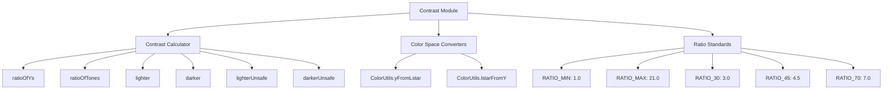
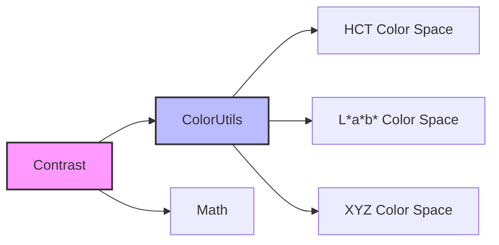
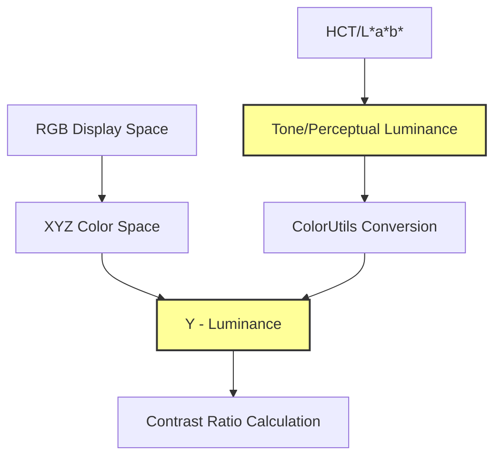
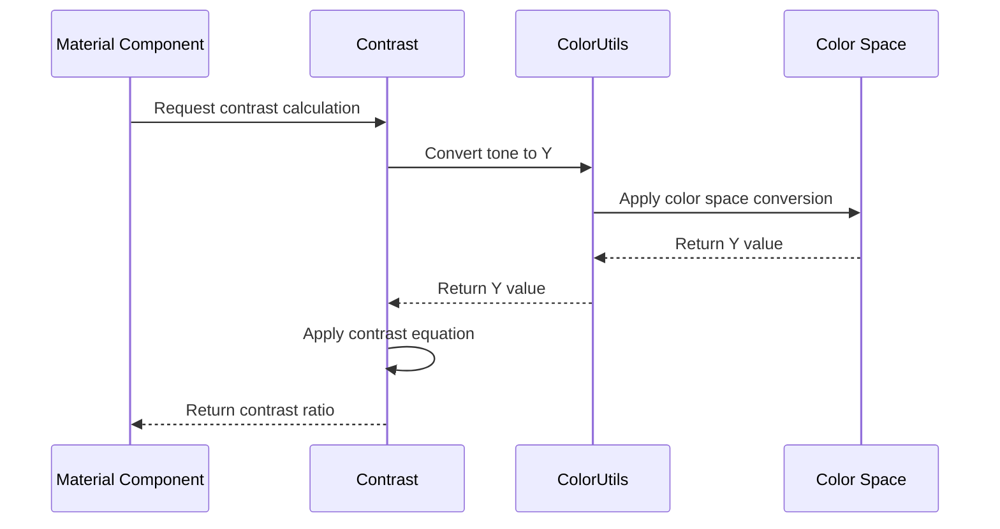
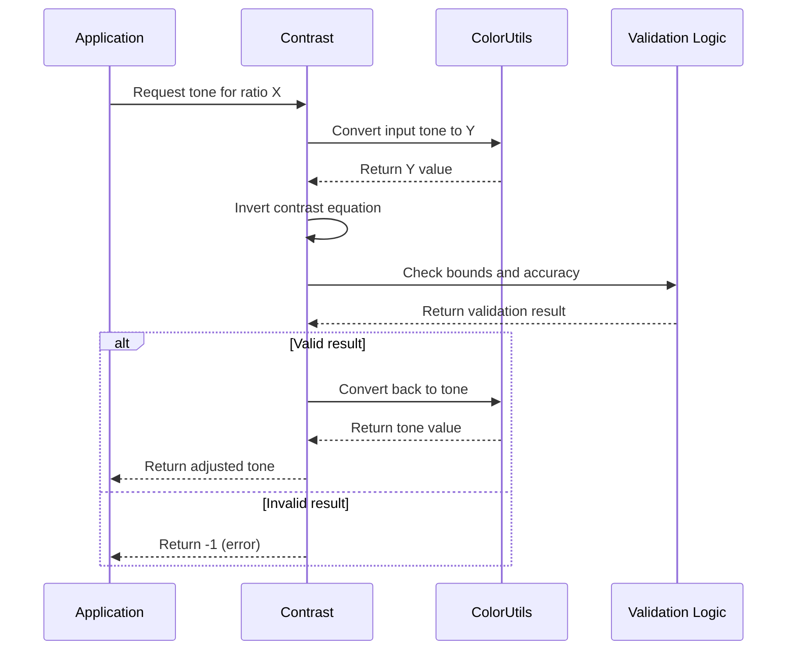
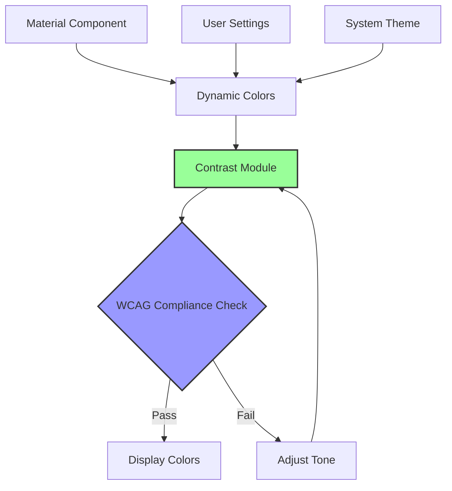

# Contrast Module Documentation

## Introduction

The contrast module is a critical component of the Material Design color system that provides color science utilities for calculating and managing contrast ratios between colors. This module ensures accessibility compliance and visual legibility across Material Design components by providing mathematically accurate contrast calculations based on perceptually uniform color spaces.

## Module Overview

The contrast module is located within the `color-utilities` submodule and provides essential functionality for:
- Calculating contrast ratios between colors
- Determining lighter/darker tones that meet specific contrast requirements
- Ensuring WCAG (Web Content Accessibility Guidelines) compliance
- Supporting color accessibility in dynamic theming systems

## Core Architecture

### Component Structure



### Key Dependencies



## Core Components

### Contrast Class

The `Contrast` class is the primary utility class that provides static methods for contrast calculations. It is marked with `@RestrictTo(LIBRARY_GROUP)` indicating it's intended for internal library use.

#### Key Constants

- **RATIO_MIN**: 1.0 - Minimum contrast ratio (identical colors)
- **RATIO_MAX**: 21.0 - Maximum contrast ratio (black vs white)
- **RATIO_30**: 3.0 - WCAG AA large text requirement
- **RATIO_45**: 4.5 - WCAG AA normal text requirement  
- **RATIO_70**: 7.0 - WCAG AAA requirement
- **CONTRAST_RATIO_EPSILON**: 0.04 - Tolerance for contrast ratio accuracy
- **LUMINANCE_GAMUT_MAP_TOLERANCE**: 0.4 - Tolerance for gamut mapping

#### Core Methods

##### Ratio Calculations

```java
// Calculate contrast ratio from XYZ Y values
public static double ratioOfYs(double y1, double y2)

// Calculate contrast ratio from perceptual tone values
public static double ratioOfTones(double t1, double t2)
```

##### Tone Adjustment Methods

```java
// Find lighter tone that meets contrast ratio (safe)
public static double lighter(double tone, double ratio)

// Find darker tone that meets contrast ratio (safe)
public static double darker(double tone, double ratio)

// Unsafe versions that return boundary values
public static double lighterUnsafe(double tone, double ratio)
public static double darkerUnsafe(double tone, double ratio)
```

## Color Science Foundation

### Perceptual Color Spaces

The contrast module operates on perceptually uniform color spaces that accurately represent human vision:



### Contrast Ratio Equation

The module uses the industry-standard WCAG contrast ratio equation:

```
contrast_ratio = (lighter_Y + 5.0) / (darker_Y + 5.0)
```

Where Y represents the luminance component in the XYZ color space.

## Data Flow Architecture

### Contrast Calculation Process



### Tone Adjustment Process



## Integration with Material Design System

### Accessibility Compliance

The contrast module ensures Material Design components meet accessibility standards:



### Related Modules

The contrast module works closely with other color system modules:

- **[color-harmonization](color-harmonization.md)**: Ensures harmonized colors meet contrast requirements
- **[dynamic-colors](dynamic-colors.md)**: Applies contrast calculations to system-derived color schemes
- **[color-utilities](color-utilities.md)**: Provides the color space conversion utilities
- **[core-material-colors](core-material-colors.md)**: Applies contrast standards to the core color palette

## Usage Patterns

### Basic Contrast Calculation

```java
// Calculate contrast between two tones
double tone1 = 50.0; // Mid-tone
double tone2 = 80.0; // Light tone
double ratio = Contrast.ratioOfTones(tone1, tone2);
// Result: ~4.5:1 ratio
```

### Finding Accessible Colors

```java
// Find lighter color that meets WCAG AA (4.5:1)
double baseTone = 30.0; // Dark tone
double targetRatio = Contrast.RATIO_45;
double lighterTone = Contrast.lighter(baseTone, targetRatio);

// Find darker color that meets WCAG AA
double lightTone = 80.0; // Light tone  
double darkerTone = Contrast.darker(lightTone, targetRatio);
```

### Accessibility Validation

```java
// Check if colors meet accessibility requirements
public boolean meetsAccessibility(double tone1, double tone2) {
    double ratio = Contrast.ratioOfTones(tone1, tone2);
    return ratio >= Contrast.RATIO_45; // WCAG AA standard
}
```

## Error Handling and Edge Cases

### Safe vs Unsafe Methods

The module provides both safe and unsafe methods for tone adjustment:

- **Safe methods** (`lighter`, `darker`): Return -1 if the requested contrast cannot be achieved
- **Unsafe methods** (`lighterUnsafe`, `darkerUnsafe`): Return boundary values (0 or 100) when contrast cannot be achieved

### Validation Logic

The module includes comprehensive validation:

1. **Tone bounds**: Ensures tones are within 0-100 range
2. **Luminance bounds**: Validates Y values are within displayable range
3. **Contrast accuracy**: Verifies the achieved contrast meets the requested ratio within epsilon tolerance
4. **Gamut mapping tolerance**: Accounts for color space conversion inaccuracies

## Performance Considerations

### Computational Efficiency

- All calculations use closed-form mathematical equations
- No iterative algorithms or approximations
- Constant-time complexity O(1) for all operations
- Suitable for real-time UI applications

### Memory Usage

- Static utility class with no instance creation
- No caching mechanisms (stateless design)
- Minimal memory footprint

## Testing and Quality Assurance

### Test Coverage

The module should be tested for:
- Boundary conditions (RATIO_MIN, RATIO_MAX)
- WCAG standard compliance verification
- Color space conversion accuracy
- Edge cases with extreme tone values
- Gamut mapping tolerance validation

### Quality Metrics

- Mathematical accuracy within CONTRAST_RATIO_EPSILON
- WCAG compliance verification
- Performance benchmarks for real-time usage
- Cross-platform color consistency

## Future Enhancements

### Potential Improvements

1. **Extended color space support**: Additional perceptual color spaces
2. **Advanced gamut mapping**: More sophisticated out-of-gamut handling
3. **Performance optimizations**: Potential caching for repeated calculations
4. **Additional accessibility standards**: Support for other contrast standards beyond WCAG

### API Evolution

The module is designed with stability in mind:
- Constants are final and well-documented
- Method signatures are stable and predictable
- Error handling is consistent across the API
- Backward compatibility is maintained

## Conclusion

The contrast module is a foundational component of the Material Design color system that ensures accessibility and visual legibility through mathematically precise contrast calculations. By operating in perceptually uniform color spaces and providing both safe and unsafe calculation methods, it enables developers to create accessible color schemes that meet WCAG standards while maintaining the aesthetic integrity of Material Design.

The module's integration with the broader color system, including harmonization and dynamic color capabilities, makes it an essential tool for creating inclusive and visually coherent Android applications.