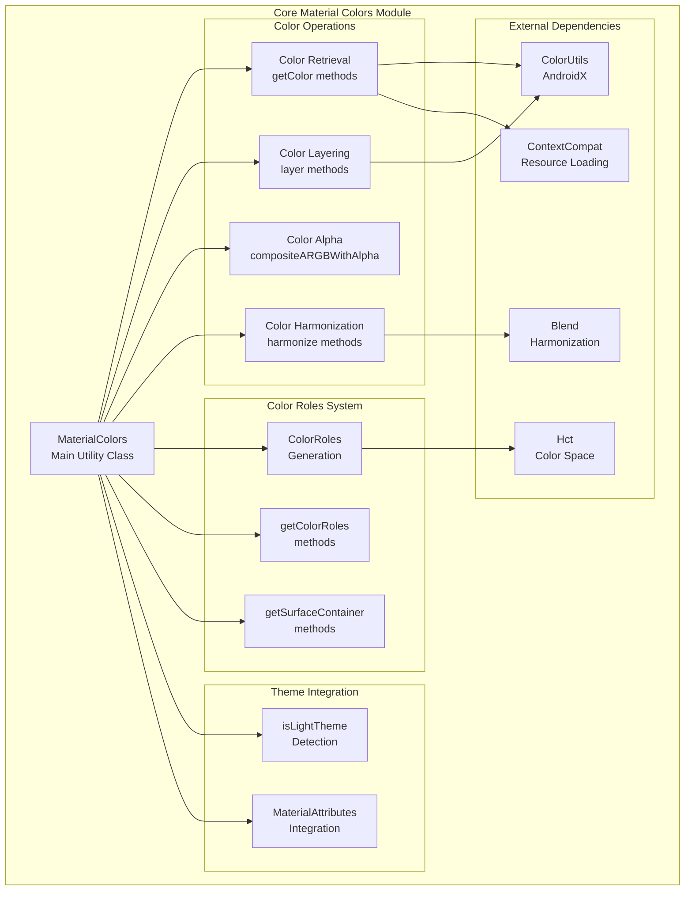
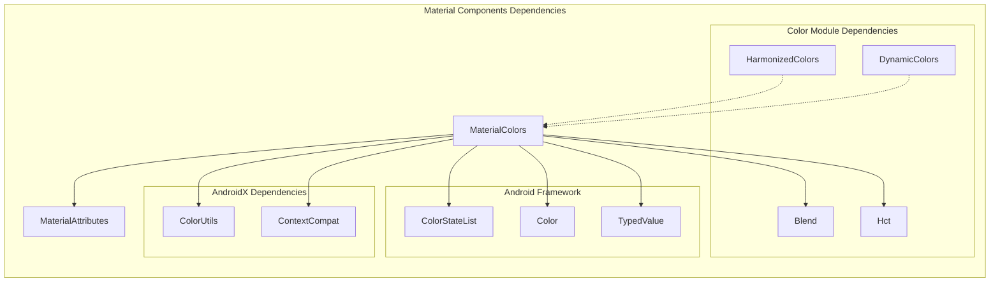
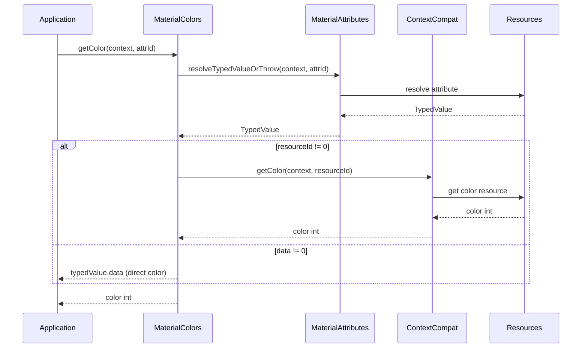
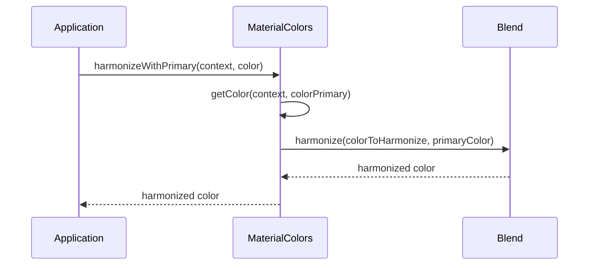
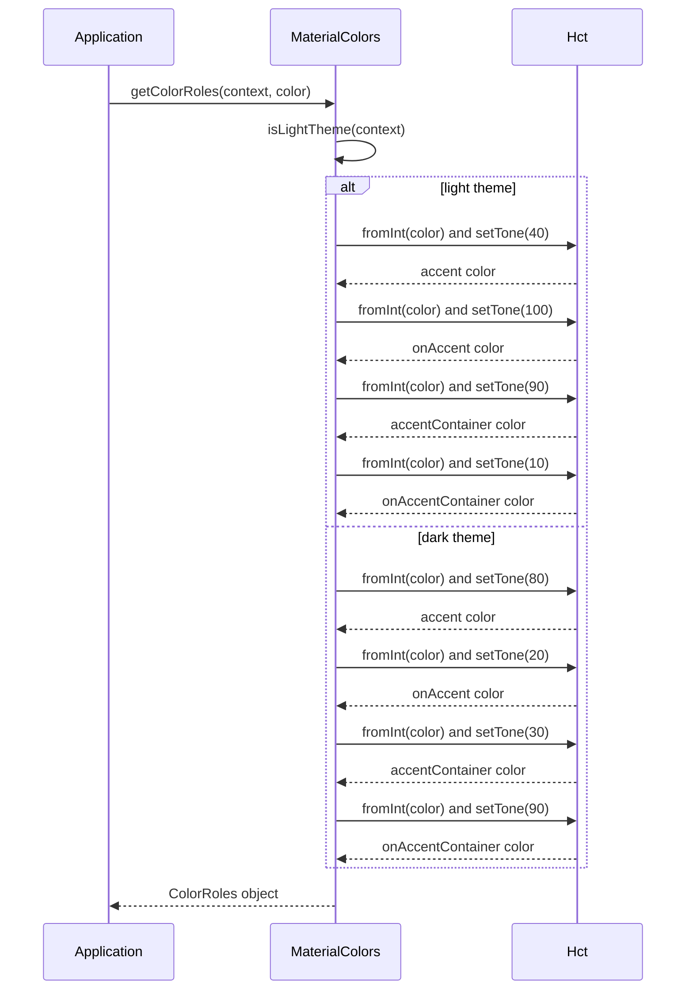

# Core Material Colors Module

## Introduction

The core-material-colors module provides the foundational color utilities and management system for the Material Design Components library. It serves as the central hub for color operations, offering utilities for color retrieval, manipulation, harmonization, and role-based color generation according to Material Design 3 specifications.

## Overview

This module implements the core color system that powers Material Design's dynamic theming capabilities. It provides essential utilities for working with theme colors, color harmonization, alpha blending, and the generation of color roles that form the basis of Material Design's color system.

## Architecture

### Core Architecture



### Component Dependencies



## Core Components

### MaterialColors Class

The `MaterialColors` class is the main utility class that provides static methods for color operations. It serves as the primary API for all color-related operations in the Material Design system.

#### Key Responsibilities:
- **Color Retrieval**: Extract colors from theme attributes
- **Color Manipulation**: Layer colors, apply alpha, composite colors
- **Color Harmonization**: Harmonize colors with primary theme colors
- **Color Role Generation**: Generate Material Design 3 color roles
- **Theme Detection**: Determine light/dark theme status

#### Constants:
- **Alpha Values**: Predefined alpha constants for different UI states
  - `ALPHA_FULL` (1.00F): Fully opaque
  - `ALPHA_MEDIUM` (0.54F): Medium opacity for active elements
  - `ALPHA_DISABLED` (0.38F): Disabled state opacity
  - `ALPHA_LOW` (0.32F): Low opacity for subtle elements
  - `ALPHA_DISABLED_LOW` (0.12F): Very low opacity for disabled backgrounds

## Data Flow

### Color Retrieval Flow



### Color Harmonization Flow



### Color Roles Generation Flow



## API Reference

### Color Retrieval Methods

#### `getColor(View, int)`
Retrieves a color from a theme attribute using a view's context.

#### `getColor(Context, int, String)`
Retrieves a color from a theme attribute with custom error message component.

#### `getColor(View, int, int)`
Retrieves a color with a default value fallback.

#### `getColor(Context, int, int)`
Retrieves a color with a default value fallback.

#### `getColorOrNull(Context, int)`
Retrieves a color or returns null if not found.

### Color State List Methods

#### `getColorStateList(Context, int, ColorStateList)`
Retrieves a ColorStateList with default value fallback.

#### `getColorStateListOrNull(Context, int)`
Retrieves a ColorStateList or returns null if not found.

### Color Manipulation Methods

#### `layer(View, int, int)`
Layers two theme colors with full opacity.

#### `layer(View, int, int, float)`
Layers two theme colors with custom overlay alpha.

#### `layer(int, int, float)`
Layers two color integers with custom alpha.

#### `layer(int, int)`
Layers two color integers.

#### `compositeARGBWithAlpha(int, int)`
Applies additional alpha to a color.

#### `isColorLight(int)`
Determines if a color is light based on luminance.

### Color Harmonization Methods

#### `harmonizeWithPrimary(Context, int)`
Harmonizes a color with the theme's primary color.

#### `harmonize(int, int)`
Harmonizes two colors together.

### Color Roles Methods

#### `getColorRoles(Context, int)`
Generates color roles from a seed color based on theme.

#### `getColorRoles(int, boolean)`
Generates color roles with explicit light/dark theme flag.

#### `getSurfaceContainerFromSeed(Context, int)`
Generates surface container color role (internal use).

#### `getSurfaceContainerHighFromSeed(Context, int)`
Generates surface container high color role (internal use).

## Integration with Other Modules

### Color Harmonization Module
The [color-harmonization](color-harmonization.md) module builds upon `MaterialColors.harmonize()` to provide higher-level harmonization APIs for entire applications.

### Dynamic Colors Module
The [dynamic-colors](dynamic-colors.md) module uses `MaterialColors` for retrieving theme colors and generating dynamic color schemes based on user wallpapers.

### Contrast Control Module
The [contrast-control](contrast-control.md) module leverages `MaterialColors` for color retrieval when calculating contrast ratios and ensuring accessibility compliance.

### Theme Module
The [theme](theme.md) module integrates with `MaterialColors` for theme color resolution and application-wide color management.

## Usage Examples

### Basic Color Retrieval
```java
// Get primary color from theme
int primaryColor = MaterialColors.getColor(context, R.attr.colorPrimary);

// Get color with fallback
int accentColor = MaterialColors.getColor(context, R.attr.colorAccent, Color.BLUE);
```

### Color Layering
```java
// Layer colors with transparency
int layeredColor = MaterialColors.layer(
    backgroundColor, 
    overlayColor, 
    0.5f // 50% opacity
);
```

### Color Harmonization
```java
// Harmonize a color with theme primary
int harmonizedColor = MaterialColors.harmonizeWithPrimary(context, myColor);
```

### Color Roles Generation
```java
// Generate color roles for a seed color
ColorRoles roles = MaterialColors.getColorRoles(context, seedColor);
int accent = roles.getAccent();
int onAccent = roles.getOnAccent();
int accentContainer = roles.getAccentContainer();
int onAccentContainer = roles.getOnAccentContainer();
```

## Best Practices

### Performance Considerations
- Cache color values that are used frequently
- Use `getColorOrNull()` when the attribute might not exist to avoid exceptions
- Prefer theme attributes over hardcoded colors for consistency

### Accessibility
- Use `isColorLight()` to ensure proper contrast ratios
- Consider color harmonization for maintaining visual consistency
- Test color combinations for accessibility compliance

### Theme Consistency
- Always retrieve colors through theme attributes
- Use the provided alpha constants for consistent UI states
- Leverage color roles for Material Design 3 compliance

## Technical Details

### Color Space Support
The module uses the HCT (Hue, Chroma, Tone) color space for color role generation, providing perceptually uniform color manipulation.

### Thread Safety
All methods in `MaterialColors` are thread-safe as they operate on immutable data and don't maintain state.

### Error Handling
- Throws `IllegalArgumentException` when required theme attributes are not found
- Provides null-safe alternatives with `OrNull` suffix methods
- Includes comprehensive parameter validation

## Future Considerations

The module is designed to support future Material Design evolution with:
- Extensible color role system
- Pluggable color harmonization algorithms
- Support for additional color spaces
- Enhanced accessibility features

This documentation provides a comprehensive guide to understanding and implementing the core-material-colors module within the Material Design Components ecosystem.