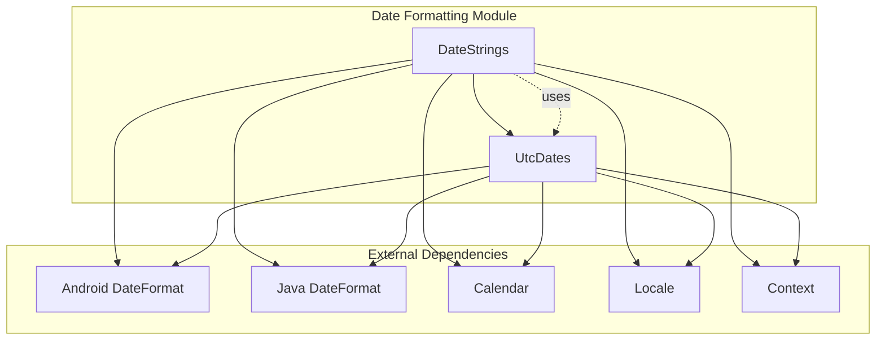
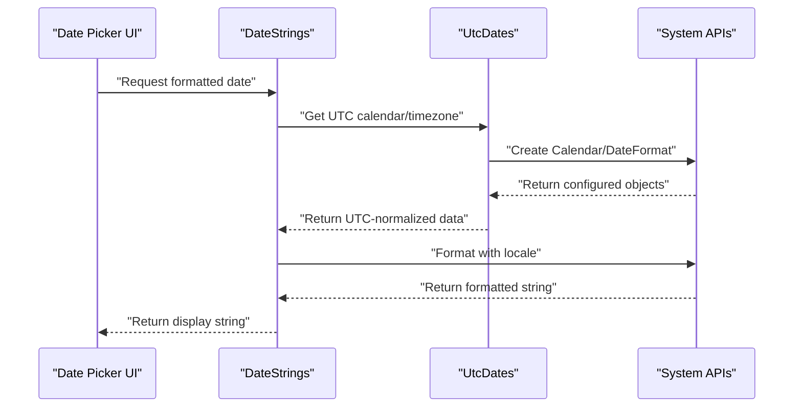
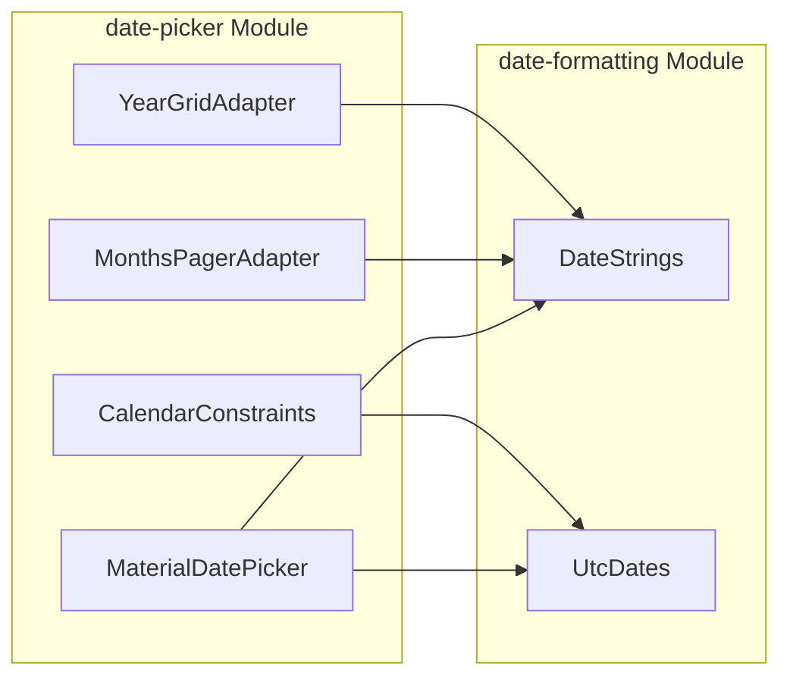

# Date Formatting Module

## Introduction

The date-formatting module provides essential utilities for formatting and manipulating date strings within the Material Design Components library. It serves as a foundational component for the date-picker module, handling locale-aware date formatting, timezone management, and accessibility features for date-related UI components.

## Module Overview

The date-formatting module consists of two primary utility classes that work together to provide comprehensive date formatting capabilities:

- **DateStrings**: High-level date formatting utilities for user-facing date strings
- **UtcDates**: Low-level timezone and calendar management utilities

## Core Components

### DateStrings Class

`lib.java.com.google.android.material.datepicker.DateStrings.DateStrings`

A utility class that provides methods for formatting date strings specifically designed for use in Material Date Picker components. It handles locale-specific formatting, date range formatting, and accessibility descriptions.

**Key Responsibilities:**
- Format dates for different display contexts (year-month, month-day, full dates)
- Handle date range formatting with intelligent year display
- Generate accessibility content descriptions for dates
- Support custom date formats while maintaining Material Design guidelines

**Key Methods:**
- `getYearMonth()`: Formats dates as "November 2023"
- `getYearMonthDay()`: Formats complete dates with locale-specific ordering
- `getMonthDay()`: Formats as "Nov 17" for current year dates
- `getDateRangeString()`: Intelligently formats date ranges
- `getDayContentDescription()`: Provides accessibility descriptions

### UtcDates Class

`lib.java.com.google.android.material.datepicker.UtcDates.UtcDates`

A comprehensive utility class for managing dates, calendars, and timezones. It provides the foundational infrastructure for consistent date handling across the date-picker module.

**Key Responsibilities:**
- Manage UTC timezone conversions and calendar operations
- Provide locale-specific date formatters
- Handle timezone normalization for date parsing and formatting
- Support both legacy (pre-API 24) and modern (API 24+) date formatting
- Generate text input hints for date entry fields

**Key Methods:**
- `getTodayCalendar()`: Returns calendar representing start of current day in UTC
- `getUtcCalendar()`: Creates empty UTC calendar instances
- `canonicalYearMonthDay()`: Normalizes timestamps to day granularity
- Various format getters for different date display patterns

## Architecture

### Component Relationships



### Data Flow Architecture



## Key Features

### 1. Locale-Aware Formatting

The module automatically adapts to different locales and API levels:
- Uses Android ICU DateFormat for API 24+ for better locale support
- Falls back to Java DateFormat for older API levels
- Handles locale-specific date ordering (MM/dd vs dd/MM)

### 2. Intelligent Year Display

Automatically determines when to show/hide the year based on context:
- Omits year for dates within the current year
- Shows year for dates in different years
- Handles date ranges intelligently

### 3. Accessibility Support

Provides comprehensive accessibility features:
- Content descriptions for screen readers
- Today date identification
- Start/end of range indicators
- Year navigation descriptions

### 4. Timezone Consistency

All date operations use UTC timezone to ensure consistency:
- Prevents timezone-related display issues
- Ensures consistent date representation across devices
- Handles daylight saving time transitions correctly

## Integration with Date Picker Module

The date-formatting module is a core dependency of the broader date-picker module:



## Usage Patterns

### Basic Date Formatting

```java
// Format a date for display
long timestamp = System.currentTimeMillis();
String formattedDate = DateStrings.getYearMonthDay(timestamp);
```

### Date Range Formatting

```java
// Format a date range intelligently
Long startDate = /* start timestamp */;
Long endDate = /* end timestamp */;
Pair<String, String> range = DateStrings.getDateRangeString(startDate, endDate);
```

### Accessibility Descriptions

```java
// Get accessibility description for a date
Context context = /* activity context */;
String description = DateStrings.getDayContentDescription(
    context, timestamp, isToday, isStartOfRange, isEndOfRange);
```

## API Level Compatibility

The module handles different Android API levels gracefully:

| Feature | API 24+ | Pre-API 24 |
|---------|---------|------------|
| Date Formatting | Android ICU DateFormat | Java DateFormat |
| Locale Support | Full ICU support | Limited locale support |
| Timezone Handling | ICU TimeZone | Java TimeZone |

## Error Handling

The module includes robust error handling:
- Null-safe operations for optional parameters
- Graceful fallback for unsupported locales
- Validation of date ranges and formats
- Safe handling of timezone conversions

## Performance Considerations

- **Caching**: Format objects are created on-demand but could be cached for frequently used patterns
- **Memory**: Calendar objects are reused where possible to reduce garbage collection
- **Thread Safety**: All methods are thread-safe as they create new instances

## Testing Considerations

When testing components that use the date-formatting module:
- Test with different locales to ensure proper formatting
- Verify behavior across different API levels
- Test with various timezone settings
- Validate accessibility descriptions
- Test edge cases like leap years and DST transitions

## Related Documentation

- [Material Date Picker](material-date-picker.md) - Uses date-formatting for all date display
- [Calendar Constraints](calendar-constraints.md) - Works with UtcDates for date validation
- [Material Theming](theme.md) - Date formatting respects Material Design guidelines