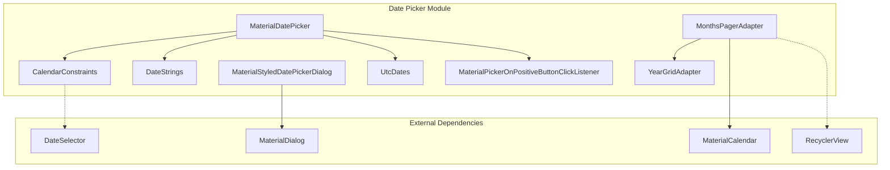

# Date Picker Module Documentation

## Overview

The Material Design Date Picker module provides a comprehensive set of components for selecting dates and date ranges in Android applications. Built on top of the Material Design Components library, it offers both calendar and text input modes with extensive customization options, accessibility support, and internationalization capabilities.

## Purpose and Core Functionality

The date-picker module enables users to:
- Select single dates or date ranges through intuitive calendar interfaces
- Input dates via text fields with validation
- Navigate through months and years efficiently
- Customize date constraints and validation rules
- Experience consistent Material Design styling across different Android versions

## Architecture Overview



## Core Components

### 1. MaterialDatePicker
The main dialog component that orchestrates the entire date picking experience. It manages both calendar and text input modes, handles user interactions, and provides callbacks for date selection events.

**Key Features:**
- Dual input modes (calendar and text)
- Fullscreen and dialog display options
- Extensive customization through Builder pattern
- Accessibility support with content descriptions
- Edge-to-edge display support

**Detailed Documentation:** [material-date-picker.md](material-date-picker.md)

### 2. CalendarConstraints
Defines the valid date range and constraints for the date picker. It controls which dates are selectable and provides validation logic.

**Key Features:**
- Start and end date boundaries
- Custom date validation through DateValidator interface
- First day of week configuration
- Default month positioning
- Parcelable support for configuration changes

**Detailed Documentation:** [calendar-constraints.md](calendar-constraints.md)

### 3. Date Formatting Utilities
Provides comprehensive date formatting and UTC handling capabilities:

- **DateStrings**: Locale-aware date formatting with multiple display formats
- **UtcDates**: Centralized UTC date operations and timezone handling

**Key Features:**
- Locale-aware date formatting
- Multiple display formats (year-month, month-day, etc.)
- Accessibility content descriptions
- UTC timezone normalization
- Pattern-based date formatting

**Detailed Documentation:** [date-formatting.md](date-formatting.md)

### 4. Calendar Adapters
RecyclerView-based adapters for efficient calendar display:

- **MonthsPagerAdapter**: Manages month views with efficient memory usage
- **YearGridAdapter**: Handles year selection grid with proper styling

**Key Features:**
- Efficient memory usage through view recycling
- Smooth scrolling performance
- Accessibility support
- Material Design styling integration

**Detailed Documentation:** [calendar-adapters.md](calendar-adapters.md)

## Input Modes

### Calendar Mode (INPUT_MODE_CALENDAR)
- Visual calendar grid navigation
- Month and year selection
- Swipe gestures for month navigation
- Visual feedback for selected dates

### Text Input Mode (INPUT_MODE_TEXT)
- Keyboard-based date input
- Real-time validation
- Format hints based on locale
- Error messaging for invalid dates

## Theming and Customization

The date picker supports extensive theming through Material Design attributes:

```xml
<!-- Key theme attributes -->
<item name="materialCalendarStyle">@style/Widget.MaterialComponents.MaterialCalendar</item>
<item name="colorSurface">@color/surface_color</item>
<item name="materialCalendarFullscreenTheme">@style/ThemeOverlay.MaterialComponents.MaterialCalendar.Fullscreen</item>
```

## Accessibility Features

- Full screen reader support with content descriptions
- Keyboard navigation support
- High contrast mode compatibility
- Touch target sizing according to Material Design guidelines
- Semantic heading structure for calendar navigation

## Internationalization

The module provides comprehensive i18n support:
- Locale-specific date formatting
- RTL layout support
- Localized strings for UI elements
- Culture-specific calendar preferences (first day of week)

## Integration with Other Modules

The date picker module integrates with several other Material Design components:

- **[Dialog Module](dialog.md)**: Base dialog functionality and styling
- **[Theme Module](theme.md)**: Material Design theming and styling
- **[Shape Module](shape.md)**: Material shape theming for rounded corners
- **[Resources Module](resources.md)**: Material resource handling and attributes

## Usage Examples

### Basic Date Picker
```java
MaterialDatePicker<Long> datePicker = MaterialDatePicker.Builder.datePicker()
    .setTitleText("Select Date")
    .setSelection(MaterialDatePicker.todayInUtcMilliseconds())
    .build();
```

### Date Range Picker
```java
MaterialDatePicker<Pair<Long, Long>> dateRangePicker = 
    MaterialDatePicker.Builder.dateRangePicker()
        .setTitleText("Select Date Range")
        .build();
```

### Custom Constraints
```java
CalendarConstraints constraints = new CalendarConstraints.Builder()
    .setStart(startMonth)
    .setEnd(endMonth)
    .setValidator(new DateValidatorPointForward.from(minDate))
    .build();
```

## Performance Considerations

- RecyclerView-based month paging for memory efficiency
- ViewHolder pattern for optimal view recycling
- Lazy loading of calendar data
- Efficient date range calculations

## Error Handling

The module provides robust error handling for:
- Invalid date selections
- Constraint violations
- Text input validation
- Configuration changes

## Testing Support

The module includes testing utilities and mock support:
- TimeSource interface for date mocking
- Test-friendly builders
- Accessibility testing support

This documentation provides a comprehensive overview of the date picker module's architecture and capabilities. For detailed implementation of specific sub-modules, refer to their individual documentation files.