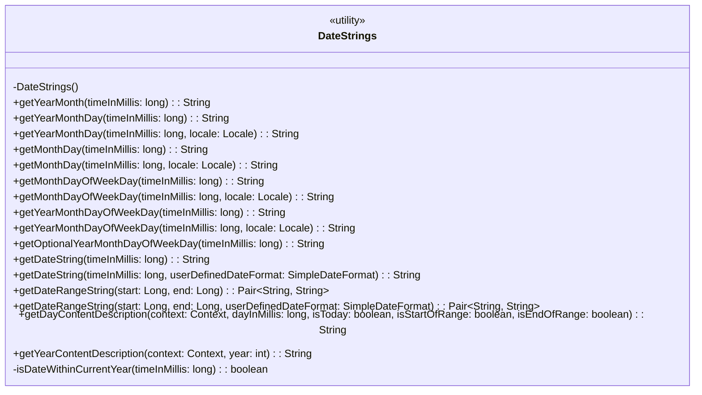
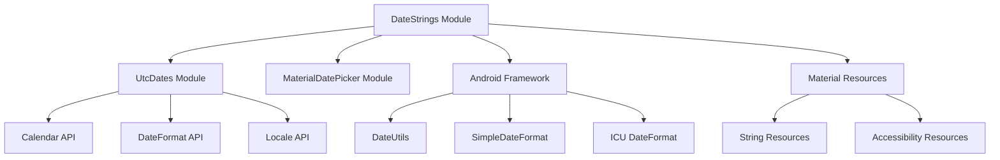
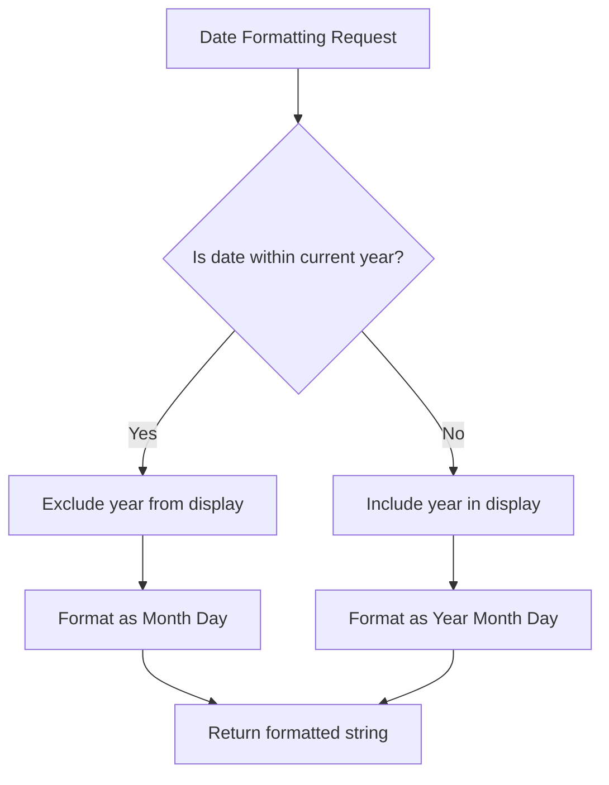
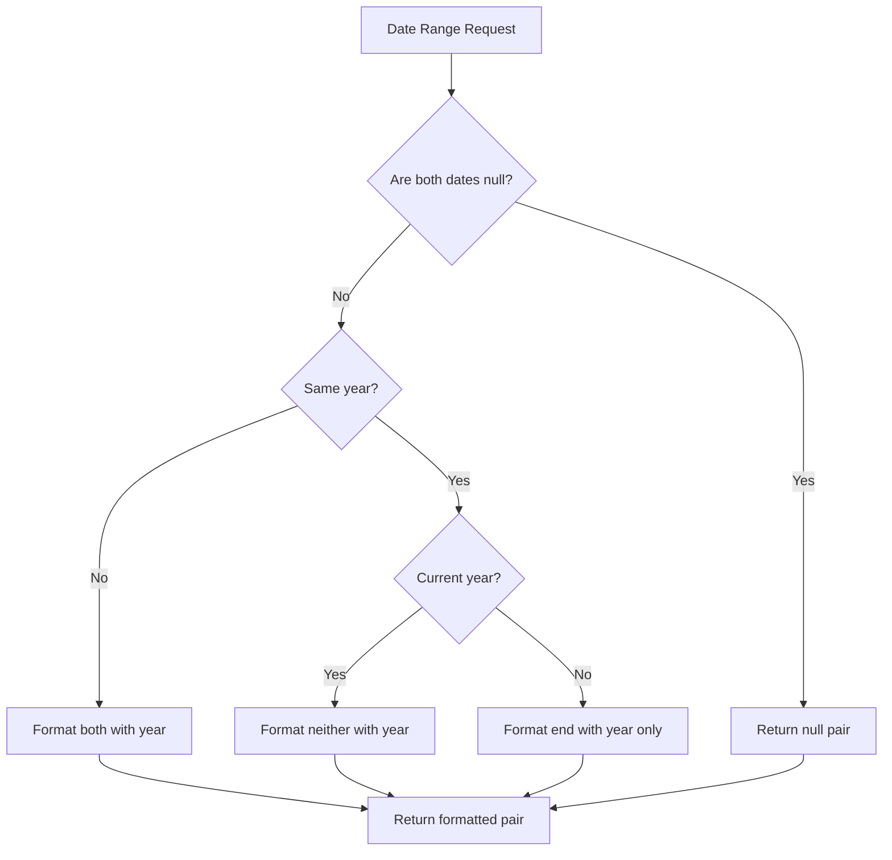
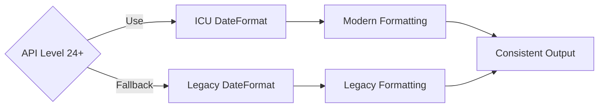

# Date Strings Module Documentation

## Introduction

The `date-strings` module is a utility component within the Material Design Components library that provides comprehensive date formatting functionality for the Material Date Picker. This module handles the localization, formatting, and accessibility aspects of date representation, ensuring consistent and user-friendly date display across different locales and Android API levels.

## Module Overview

The `date-strings` module serves as the central formatting engine for date-related strings in the Material Design date picker system. It provides a unified interface for converting timestamp values into human-readable date strings while handling localization, accessibility requirements, and intelligent formatting rules.

## Core Architecture

### Component Structure



### Module Dependencies



## Key Features

### 1. Multi-Level Date Formatting

The module provides various levels of date formatting granularity:

- **Year-Month**: `getYearMonth()` - Displays year and month only
- **Year-Month-Day**: `getYearMonthDay()` - Complete date representation
- **Month-Day**: `getMonthDay()` - Month and day without year
- **Month-Day-Weekday**: `getMonthDayOfWeekDay()` - Includes day of week
- **Year-Month-Day-Weekday**: `getYearMonthDayOfWeekDay()` - Full date with weekday

### 2. Intelligent Year Display

The module implements smart year display logic:



### 3. Date Range Formatting

Sophisticated logic for formatting date ranges with contextual year display:



### 4. Accessibility Support

Comprehensive accessibility features for screen readers:

- **Day Content Descriptions**: Context-aware descriptions including "today", "start of range", and "end of range" indicators
- **Year Content Descriptions**: Navigation hints for year selection
- **Localized String Resources**: Proper internationalization support

## API Level Compatibility

The module handles different Android API levels gracefully:



## Integration Points

### Material Date Picker Integration

The `date-strings` module is primarily used by the [Material Date Picker](material-datepicker-core.md) module for:

- Displaying selected dates in the picker interface
- Formatting date ranges for selection feedback
- Providing accessibility descriptions for date cells
- Localizing date representations

### UtcDates Dependency

The module relies on the [UtcDates](date-utilities.md) module for:

- Calendar instance management
- Timezone handling
- Date format caching and optimization
- Locale-specific format patterns

## Usage Patterns

### Basic Date Formatting

```java
// Format a timestamp to year-month-day
String formattedDate = DateStrings.getYearMonthDay(timestamp);

// Format with specific locale
String localizedDate = DateStrings.getYearMonthDay(timestamp, Locale.FRENCH);
```

### Range Formatting

```java
// Format a date range
Pair<String, String> range = DateStrings.getDateRangeString(startTime, endTime);

// Format with custom format
Pair<String, String> customRange = DateStrings.getDateRangeString(startTime, endTime, customFormat);
```

### Accessibility

```java
// Get accessible description for a day
String description = DateStrings.getDayContentDescription(
    context, dayTimestamp, isToday, isRangeStart, isRangeEnd
);
```

## Performance Considerations

### Caching Strategy

The module leverages the `UtcDates` utility for format caching, reducing object creation overhead for repeated formatting operations.

### Locale Handling

Locale-specific formats are cached and reused, minimizing the performance impact of locale-aware formatting.

### API Level Optimization

Modern Android APIs (24+) utilize ICU formatting for better performance and accuracy, while maintaining backward compatibility.

## Error Handling

The module implements defensive programming practices:

- **Null Safety**: Handles null date inputs gracefully
- **Range Validation**: Validates date range consistency
- **Locale Fallback**: Falls back to system default locale when specific locale is unavailable
- **Format Validation**: Validates user-provided date formats

## Testing Considerations

### Localization Testing

- Verify formatting across different locales
- Test RTL language support
- Validate calendar system compatibility

### Accessibility Testing

- Screen reader compatibility
- Content description accuracy
- Navigation hint effectiveness

### Edge Cases

- Leap year handling
- Timezone boundary conditions
- Millisecond precision edge cases
- Null and invalid input handling

## Future Enhancements

### Potential Improvements

1. **Extended Calendar Support**: Support for non-Gregorian calendar systems
2. **Relative Time Formatting**: "Today", "Yesterday", "Tomorrow" formatting
3. **Custom Pattern Support**: Enhanced user-defined format pattern support
4. **Performance Metrics**: Built-in performance monitoring for formatting operations

### Compatibility Notes

The module maintains backward compatibility with existing Material Design date picker implementations while providing a foundation for future enhancements in date formatting and localization capabilities.

## Related Documentation

- [Material Date Picker Core](material-datepicker-core.md) - Main date picker implementation
- [UtcDates Utility](date-utilities.md) - Date and timezone utilities
- [Calendar Constraints](calendar-constraints.md) - Date range validation
- [Material Resources](material-resources.md) - String and accessibility resources