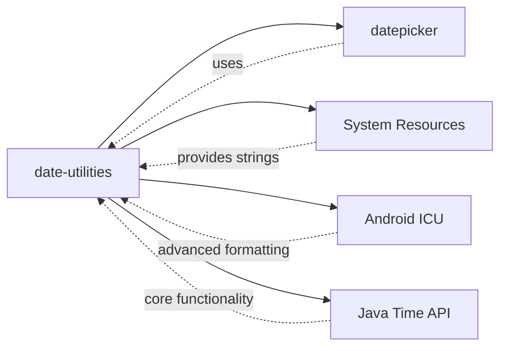
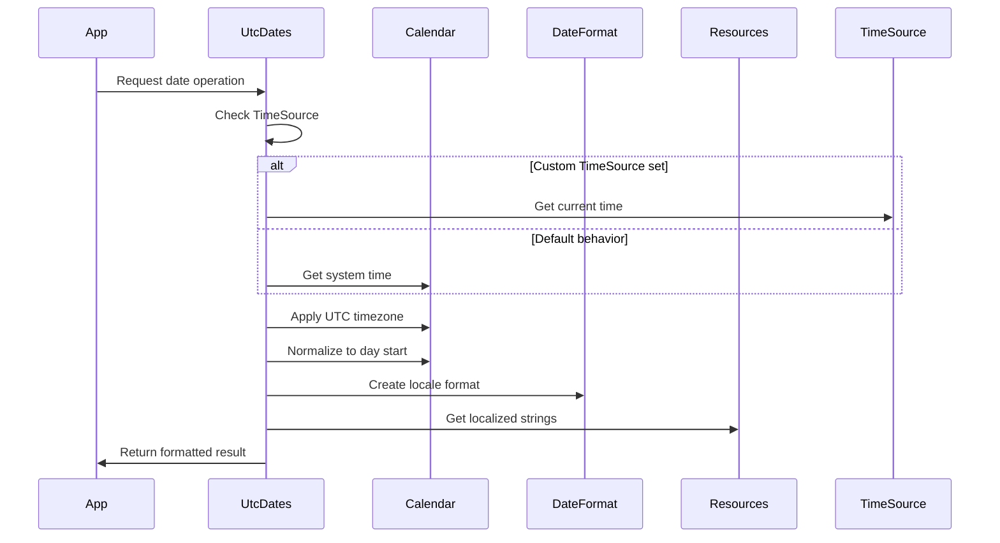
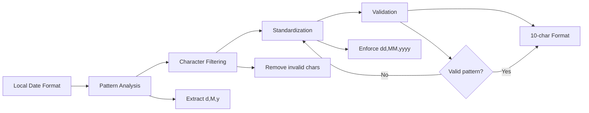
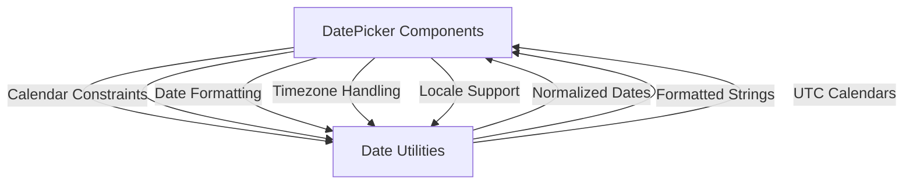
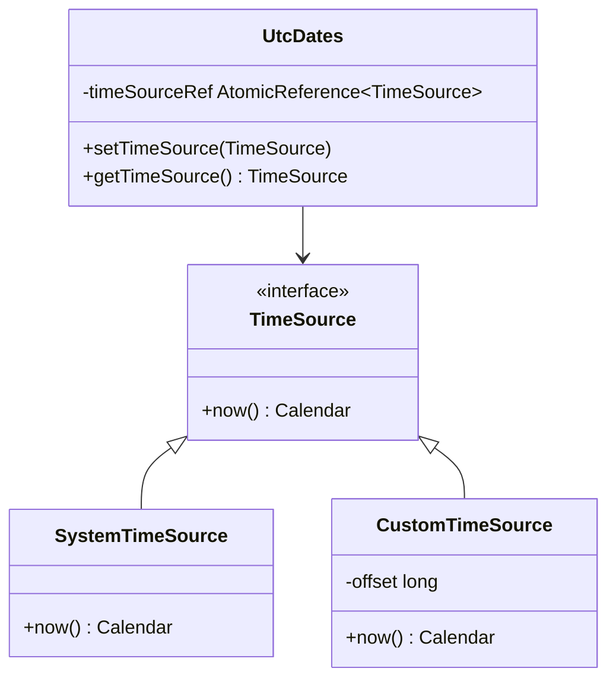
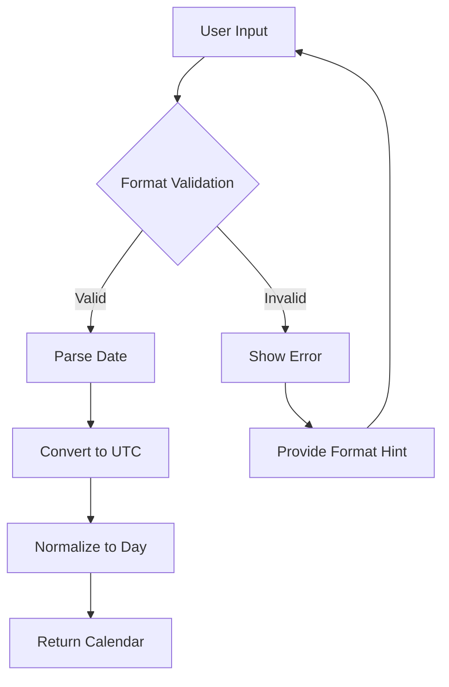

# Date Utilities Module Documentation

## Introduction

The date-utilities module provides essential date and time manipulation utilities for the Material Design Components library. It serves as the foundational utility layer for date-related operations, particularly supporting the [datepicker](datepicker.md) module with timezone handling, calendar operations, and date formatting capabilities.

## Module Overview

The date-utilities module is a utility-focused component that encapsulates complex date manipulation logic, providing a clean API for:
- UTC timezone management
- Calendar operations and normalization
- Date format standardization
- Locale-aware date formatting
- Accessibility support for date inputs

## Core Architecture

### Component Structure

```mermaid
graph TD
    A[UtcDates] --> B[TimeSource Management]
    A --> C[Calendar Operations]
    A --> D[Date Formatting]
    A --> E[Locale Handling]
    A --> F[Accessibility Support]
    
    B --> B1[AtomicReference<TimeSource>]
    B --> B2[System TimeSource]
    
    C --> C1[getTodayCalendar]
    C --> C2[getUtcCalendarOf]
    C --> C3[getDayCopy]
    C --> C4[canonicalYearMonthDay]
    
    D --> D1[getNormalizedFormat]
    D --> D2[getDefaultTextInputFormat]
    D --> D3[getDatePatternAsInputFormat]
    D --> D4[Android ICU Format Support]
    
    E --> E1[Locale-specific Patterns]
    E --> E2[Language-specific Formatting]
    E --> E3[Resource-based Hints]
    
    F --> F1[TtsSpan Integration]
    F --> F2[Verbatim Text Hints]
    F --> F3[Screen Reader Support]
```



### Key Dependencies



## Core Components

### UtcDates Class

The `UtcDates` class is the central utility class that provides static methods for all date-related operations. It's designed as a singleton utility class with a private constructor to prevent instantiation.

#### Key Features:
- **Thread-safe time source management** using AtomicReference
- **UTC timezone normalization** for consistent date handling
- **Locale-aware formatting** with fallback support
- **Accessibility-first design** with TtsSpan integration

## Data Flow Architecture

### Date Processing Pipeline



### Format Standardization Process



## Component Interactions

### Integration with DatePicker Module

The date-utilities module serves as the foundation for the [datepicker](datepicker.md) module, providing essential services:



### TimeSource Abstraction

The module implements a flexible time source pattern that allows for testing and custom time implementations:



## Key Functional Areas

### 1. Calendar Management

The module provides robust calendar operations with UTC normalization:

- **`getTodayCalendar()`**: Returns a UTC calendar representing the start of the current day
- **`getUtcCalendarOf(Calendar)`**: Converts any calendar to UTC timezone
- **`getDayCopy(Calendar)`**: Creates a UTC calendar with time information stripped
- **`canonicalYearMonthDay(long)`**: Normalizes millisecond timestamps to day granularity

### 2. Date Formatting System

Comprehensive formatting support with multiple abstraction levels:

- **Text Input Format**: User-friendly format for text input fields
- **Display Formats**: Various styles (medium, full, year-month, etc.)
- **Locale Integration**: Automatic format detection and adaptation
- **Pattern Standardization**: Consistent 10-character format enforcement

### 3. Accessibility Features

Built-in accessibility support for inclusive design:

- **TtsSpan Integration**: Ensures proper screen reader pronunciation
- **Verbatim Hints**: Prevents misinterpretation of date patterns
- **Localized Abbreviations**: Resource-based day/month/year abbreviations

### 4. Locale Handling

Advanced locale support with special case handling:

- **Korean Locale**: Special character deduplication logic
- **Format Pattern Cleanup**: Removes locale-specific artifacts
- **ICU Integration**: Android N+ advanced formatting capabilities

## Process Flows

### Date Input Processing



### Format Generation Process


## Error Handling and Edge Cases

### Timezone Management
- All operations normalize to UTC to prevent timezone-related inconsistencies
- System timezone changes don't affect processed dates
- Calendar instances are always created with explicit UTC timezone

### Locale Edge Cases
- Korean language special handling for duplicate characters
- Fallback to default locale when specific patterns aren't available
- Graceful degradation for older Android versions without ICU support

### Input Validation
- Pattern validation ensures only supported date formats
- Character filtering prevents injection of invalid format specifiers
- Length enforcement maintains consistent 10-character output

## Performance Considerations

### Optimization Strategies
- **AtomicReference** for thread-safe time source management
- **Calendar instance pooling** through static factory methods
- **Pattern caching** for frequently used date formats
- **Lazy initialization** of locale-specific resources

### Memory Management
- Static utility class design minimizes object creation
- Calendar instances are created on-demand
- Format objects are cloned rather than creating new instances
- Resource strings are loaded only when needed

## Testing and Maintainability

### Testability Features
- **TimeSource abstraction** enables deterministic testing
- **Static methods** allow easy unit testing
- **Clear input/output contracts** for all utility methods
- **Locale-independent core logic** with locale-specific extensions

### Maintenance Considerations
- Comprehensive JavaDoc documentation
- Clear method naming conventions
- Consistent error handling patterns
- Version-aware implementation (ICU vs. legacy formatting)

## Integration Guidelines

### Best Practices
1. Always use UTC calendars for internal date storage
2. Apply locale formatting only for user display
3. Use provided format patterns for consistency
4. Leverage accessibility features for inclusive design
5. Consider TimeSource abstraction for testing scenarios

### Common Usage Patterns
```java
// Get current date in UTC
Calendar today = UtcDates.getTodayCalendar();

// Format for user input
SimpleDateFormat inputFormat = UtcDates.getDefaultTextInputFormat();

// Normalize timestamp to day granularity
long dayTimestamp = UtcDates.canonicalYearMonthDay(timestamp);

// Get accessibility-friendly hint
SpannableString hint = UtcDates.getVerbatimTextInputHint(formatPattern);
```

## Future Considerations

### Potential Enhancements
- **Additional locale support** for emerging markets
- **Extended format patterns** for specialized use cases
- **Performance optimizations** for high-frequency operations
- **Enhanced accessibility features** for improved screen reader support

### Compatibility Notes
- Maintains backward compatibility with existing datepicker implementations
- Graceful handling of Android version differences (ICU availability)
- Consistent behavior across different device configurations and locales

---

*This documentation covers the core functionality of the date-utilities module. For related components, see [datepicker.md](datepicker.md) for the main date picker implementation and [material-datepicker-core.md](material-datepicker-core.md) for the core date picker functionality.*