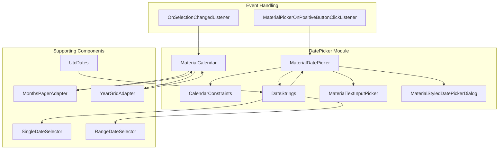

# Material Design DatePicker Module

## Overview

The Material Design DatePicker module provides a comprehensive set of components for implementing date selection functionality in Android applications. It follows Material Design principles and offers both calendar and text input modes for date selection, supporting single date, date range, and custom date selection patterns.

## Architecture



## Core Functionality

### Date Selection Modes
The module supports three primary date selection modes:
- **Single Date Selection**: Users can select a single date
- **Date Range Selection**: Users can select a start and end date
- **Custom Selection**: Developers can implement custom date selection logic

### Input Modes
- **Calendar Mode**: Visual calendar interface for date selection
- **Text Input Mode**: Text field input with date format validation

### Key Features
- Material Design compliance with theming support
- Accessibility features including screen reader support
- Internationalization with locale-specific date formatting
- Date validation and constraints
- Customizable date ranges and constraints
- Edge-to-edge display support
- Responsive design for different screen sizes

## Sub-modules

### 1. Calendar Constraints System
**File**: [calendar-constraints.md](calendar-constraints.md)

Manages date boundaries and validation rules for the date picker. Defines the valid date range, opening month, and custom validation logic.

**Key Components:**
- `CalendarConstraints.Builder`: Builder pattern for creating constraints
- `DateValidator`: Interface for custom date validation
- Date range validation and boundary management

### 2. Date Formatting and Strings
**File**: [date-strings.md](date-strings.md)

Handles locale-specific date formatting and string generation for display purposes.

**Key Components:**
- `DateStrings`: Utility class for formatting dates
- Locale-aware date formatting
- Accessibility-friendly date descriptions
- Custom date format support

### 3. Material Date Picker Core
**File**: [material-datepicker-core.md](material-datepicker-core.md)

The main date picker implementation providing the dialog interface and user interaction handling.

**Key Components:**
- `MaterialDatePicker`: Main dialog fragment
- `MaterialDatePicker.Builder`: Builder for configuration
- `MaterialPickerOnPositiveButtonClickListener`: Event listener interface
- `MaterialStyledDatePickerDialog`: Material-styled dialog implementation
- Event handling and listener management
- Theme and styling integration

### 4. Calendar Display System
**File**: [calendar-display.md](calendar-display.md)

Manages the visual calendar grid, month navigation, and year selection interface.

**Key Components:**
- `MonthsPagerAdapter.ViewHolder`: View holder for month pages
- `YearGridAdapter.ViewHolder`: View holder for year selection
- Month and year navigation
- Calendar grid rendering

### 5. Date Utilities
**File**: [date-utilities.md](date-utilities.md)

Provides utility functions for date manipulation, timezone handling, and format conversion.

**Key Components:**
- `UtcDates`: Date manipulation utilities
- Timezone handling (UTC)
- Date format conversion
- Locale-specific formatting

## Integration with Other Modules

The DatePicker module integrates with several other Material Design components:

- **[Text Fields](textfield.md)**: For text input mode date entry
- **[Buttons](button.md)**: For action buttons (OK, Cancel)
- **[Dialogs](dialog.md)**: Base dialog functionality
- **[Shape System](shape.md)**: For Material Design shapes and styling

## Usage Examples

### Basic Date Picker
```java
MaterialDatePicker<Long> datePicker = MaterialDatePicker.Builder.datePicker()
    .setTitleText("Select Date")
    .build();
```

### Date Range Picker
```java
MaterialDatePicker<Pair<Long, Long>> dateRangePicker = 
    MaterialDatePicker.Builder.dateRangePicker()
        .setTitleText("Select Date Range")
        .build();
```

### Custom Constraints
```java
CalendarConstraints constraints = new CalendarConstraints.Builder()
    .setStart(startMonth)
    .setEnd(endMonth)
    .setValidator(customValidator)
    .build();
```

## Theming and Customization

The module supports extensive theming through Material Design attributes:
- `materialCalendarStyle`: Overall calendar styling
- `colorSurface`: Background colors
- `materialCalendarTheme`: Theme overlay
- Custom date formatting patterns

## Accessibility

The DatePicker module includes comprehensive accessibility features:
- Screen reader support with descriptive labels
- Keyboard navigation support
- High contrast mode compatibility
- Touch target sizing according to Material Design guidelines
- Content descriptions for all interactive elements

## Performance Considerations

- RecyclerView-based implementation for efficient memory usage
- Lazy loading of calendar months
- Optimized date calculations and caching
- Minimal object allocation during scrolling

## Internationalization

Full internationalization support including:
- Locale-specific date formats
- RTL (Right-to-Left) layout support
- Localized month and day names
- Cultural calendar preferences