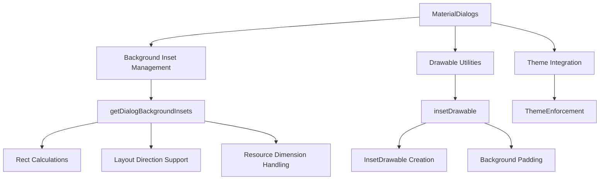
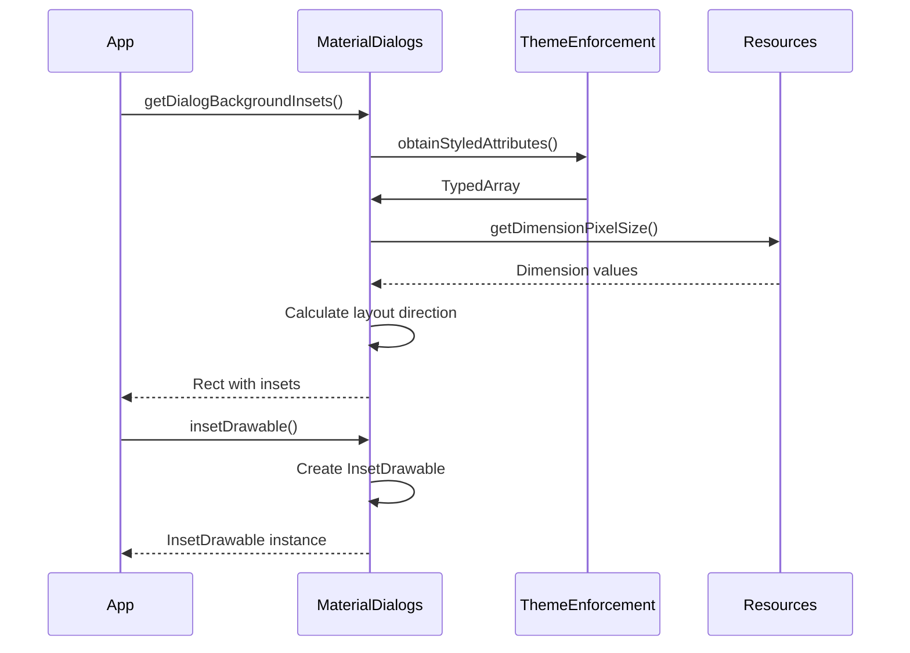
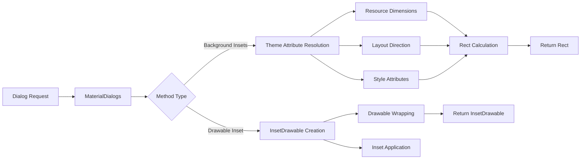

# Dialog Module Documentation

## Introduction

The Dialog module in the Material Design Components library provides utility functionality for creating and managing Material Design compliant dialog windows. This module serves as a foundational component that supports the Material Design dialog system with proper styling, theming, and layout utilities.

## Core Functionality

The Dialog module is built around the `MaterialDialogs` utility class, which provides essential methods for handling dialog background styling and layout. The module focuses on ensuring consistent visual presentation of dialogs across different Android applications while maintaining Material Design principles.

## Architecture

### Component Structure



### Key Components

#### MaterialDialogs Class
The central utility class that provides static methods for dialog management:

- **Purpose**: Library-internal utility for dialog styling and layout
- **Access**: Restricted to library group (`@RestrictTo(Scope.LIBRARY_GROUP)`)
- **Functionality**: Background inset calculations and drawable manipulation

### Method Architecture



## Core Features

### Background Inset Management

The module provides sophisticated background inset calculation that:
- Handles different screen densities and dimensions
- Supports both LTR and RTL layout directions
- Integrates with Material Design spacing guidelines
- Provides fallback to default dimension resources

### Drawable Utilities

Offers utility methods for:
- Creating inset drawables with precise padding
- Wrapping existing drawables with background insets
- Maintaining drawable properties while adding spacing

### Theme Integration

Seamlessly integrates with:
- Material Design theme attributes
- Custom style resources
- Theme enforcement mechanisms
- Resource loading systems

## Data Flow



## Dependencies

### Internal Dependencies
- **ThemeEnforcement**: For proper theme attribute resolution and validation
- **Material Resources**: Access to dimension resources and style attributes

### External Dependencies
- **Android Framework**: Core dialog and drawable APIs
- **Support Library**: Compatibility utilities for different Android versions

## Integration with Other Modules

The Dialog module serves as a utility foundation for other Material Design components:

- **[Theme Module](theme.md)**: Utilizes theme enforcement and attribute resolution
- **[Resources Module](resources.md)**: Leverages material resources and dimensions
- **[Internal Module](internal.md)**: Uses internal utilities for theme handling

## Usage Patterns

### Background Inset Calculation
```java
// Calculate background insets for Material dialogs
Rect insets = MaterialDialogs.getDialogBackgroundInsets(
    context, 
    R.attr.materialAlertDialogStyle, 
    R.style.MaterialAlertDialog_MaterialComponents
);
```

### Drawable Inset Creation
```java
// Create inset drawable with calculated padding
InsetDrawable insetDrawable = MaterialDialogs.insetDrawable(
    backgroundDrawable, 
    backgroundInsets
);
```

## Design Considerations

### Material Design Compliance
- Follows Material Design spacing guidelines
- Supports elevation and shadow effects
- Maintains consistent visual hierarchy

### Accessibility
- Proper layout direction support for internationalization
- Consistent spacing for better readability
- Theme-aware styling for different user preferences

### Performance
- Efficient resource lookup and caching
- Minimal object allocation in utility methods
- Optimized for frequent dialog creation scenarios

## Future Considerations

The module's architecture supports potential extensions such as:
- Additional dialog styling utilities
- Enhanced theme integration capabilities
- Support for new Material Design patterns
- Custom dialog background effects

## Summary

The Dialog module provides essential utility functionality for Material Design dialog implementation. Through its focused API surface and robust background management capabilities, it enables consistent and visually appealing dialog presentation across Android applications while maintaining the flexibility needed for diverse use cases.