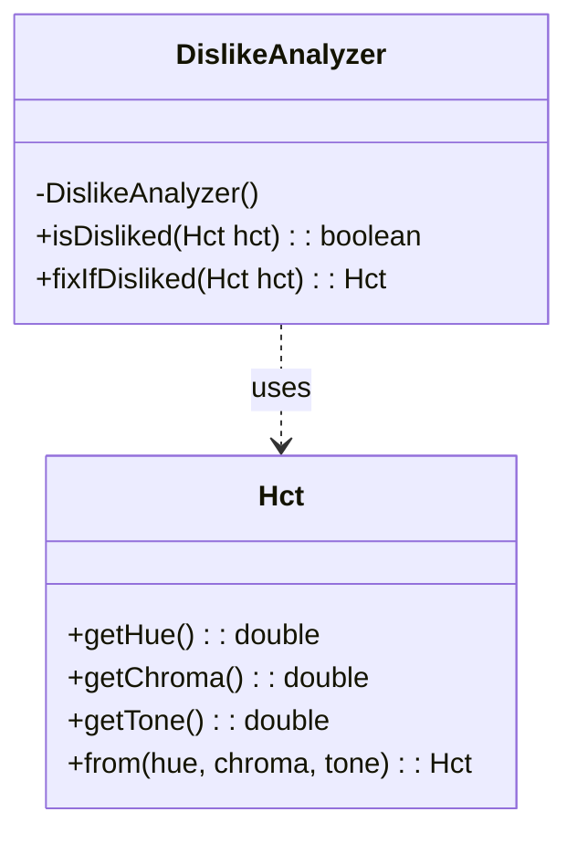
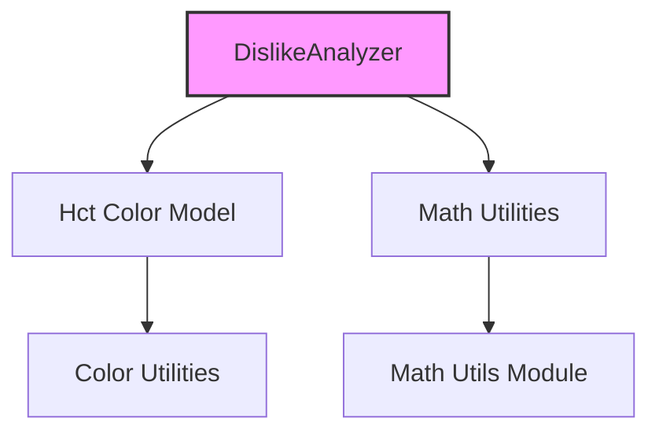
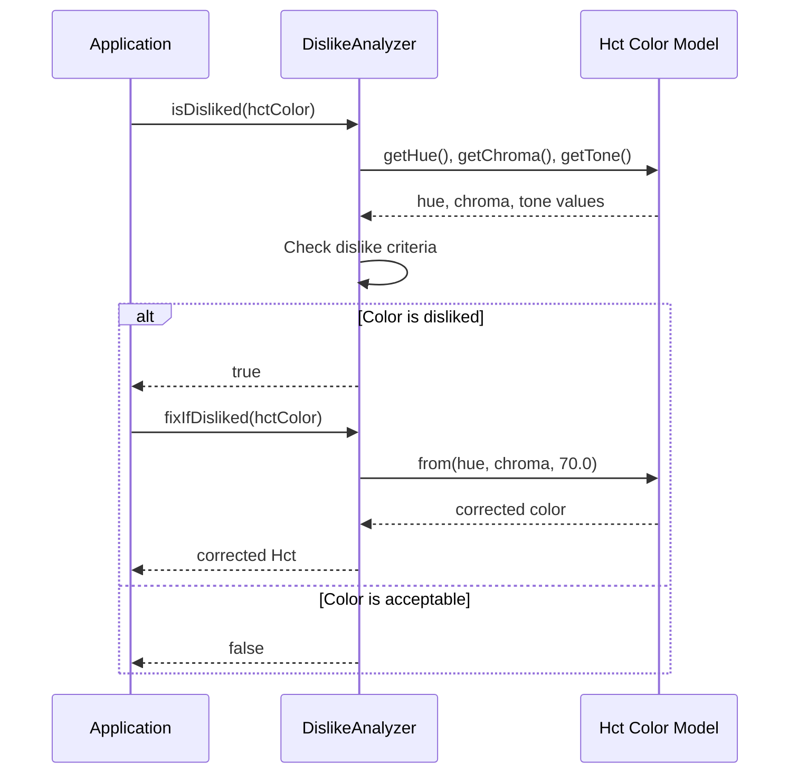
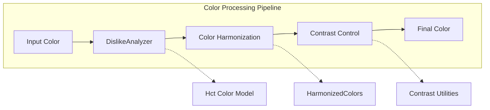

# Dislike Analyzer Module

## Introduction

The dislike-analyzer module is a specialized color utility component within the Material Design Components library that addresses universal color preferences in human perception. This module provides functionality to detect and correct colors that are universally disliked by users, particularly dark yellow-green hues that are associated with negative connotations such as biological waste and rotting food.

## Purpose and Core Functionality

The DislikeAnalyzer serves as a color science-based quality assurance tool that:

- **Detects universally disliked colors** based on established color psychology research
- **Automatically corrects problematic colors** by adjusting their tone to make them more acceptable
- **Ensures color harmony** in Material Design applications by preventing the use of colors that trigger negative user responses

The module is based on scientific research by Palmer and Schloss (2010) and Schloss and Palmer's Chapter 21 in Handbook of Color Psychology (2015), which identified specific color ranges that humans universally find unpleasant.

## Architecture and Component Structure

### Core Component

### Module Dependencies

## Component Details

### DislikeAnalyzer Class

The `DislikeAnalyzer` is a utility class that provides static methods for analyzing and correcting colors based on universal human color preferences.

#### Key Characteristics:
- **Final class** with private constructor to prevent instantiation
- **Library-restricted** access (`@RestrictTo(LIBRARY_GROUP)`)
- **Static utility methods** for color analysis and correction

#### Color Dislike Criteria

A color is considered "disliked" when it meets all three conditions:

1. **Hue Range**: 90° to 111° (yellow-green spectrum)
2. **Chroma Threshold**: Greater than 16.0 (sufficiently saturated)
3. **Tone Threshold**: Less than 65.0 (relatively dark)

#### Methods

##### `isDisliked(Hct hct)`
- **Purpose**: Determines if a given color falls within the universally disliked range
- **Parameters**: `Hct` color model instance
- **Returns**: `boolean` - `true` if the color is disliked, `false` otherwise
- **Logic**: Checks hue, chroma, and tone against established thresholds

##### `fixIfDisliked(Hct hct)`
- **Purpose**: Corrects a disliked color by adjusting its tone
- **Parameters**: `Hct` color model instance
- **Returns**: `Hct` - Either the original color (if not disliked) or a corrected version
- **Correction**: Increases tone to 70.0 to make the color more acceptable

## Data Flow

## Integration with Color System

The DislikeAnalyzer integrates with the broader Material Design color system:

## Usage Context

The DislikeAnalyzer is typically used in the following scenarios:

1. **Dynamic Color Generation**: When generating color schemes from user-selected images
2. **Theme Creation**: During the creation of Material Design themes
3. **Color Harmonization**: As a preprocessing step before applying color harmonization algorithms
4. **Accessibility Compliance**: Ensuring colors don't trigger negative user responses

## Relationship to Other Modules

### Direct Dependencies
- **[color-utilities](color-utilities.md)**: Uses the Hct color model for color representation and manipulation
- **[math-utils](math-utils.md)**: Leverages mathematical utilities for color calculations

### Related Modules
- **[color-harmonization](color-harmonization.md)**: Often used together to ensure generated color schemes are both harmonious and psychologically acceptable
- **[dynamic-colors](dynamic-colors.md)**: May use DislikeAnalyzer when extracting colors from images to ensure user-acceptable results
- **[contrast-control](contrast-control.md)**: Works in conjunction to ensure colors meet both psychological and accessibility standards

## Implementation Notes

### Performance Considerations
- **Static methods**: No object instantiation required, minimal memory overhead
- **Simple calculations**: Uses basic mathematical operations for fast execution
- **Early return**: Returns original color if no correction is needed

### Thread Safety
- **Thread-safe**: All methods are stateless and use only input parameters
- **No shared state**: No instance variables or shared resources

### Limitations
- **Subjective nature**: Based on general color psychology research, may not account for cultural differences
- **Fixed thresholds**: Uses predetermined hue, chroma, and tone values that may not suit all applications
- **Library-restricted**: Not intended for direct use by application developers

## Scientific Foundation

The DislikeAnalyzer is grounded in peer-reviewed color psychology research:

- **Palmer and Schloss (2010)**: Identified universal color preferences and their correlation to biological factors
- **Schloss and Palmer (2015)**: Comprehensive analysis of color preference mechanisms in human perception

These studies found that dark yellow-greens are consistently rated as unpleasant across diverse populations, likely due to evolutionary associations with decay and biological waste.

## Future Considerations

Potential enhancements to the DislikeAnalyzer could include:

- **Cultural adaptation**: Support for region-specific color preferences
- **Configurable thresholds**: Allow applications to customize dislike criteria
- **Extended color ranges**: Include other potentially problematic color combinations
- **Accessibility integration**: Consider color blindness and visual impairment factors