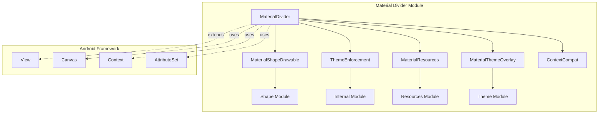
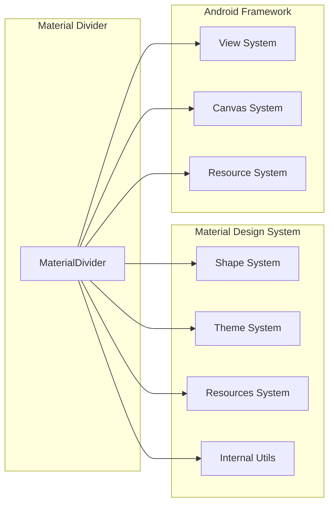
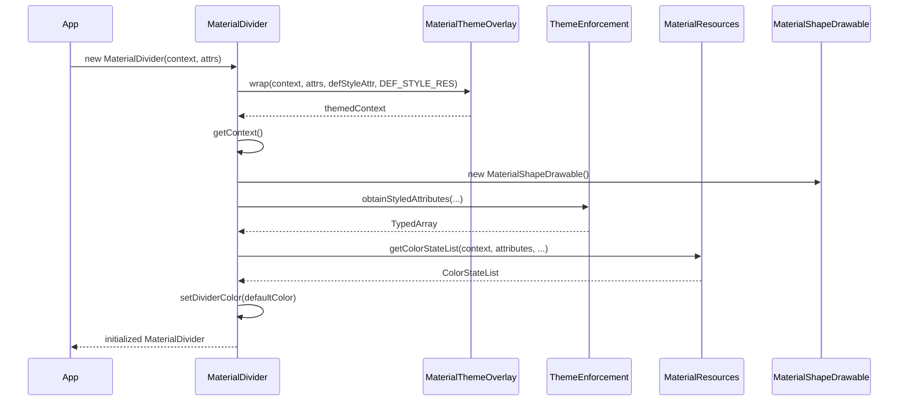
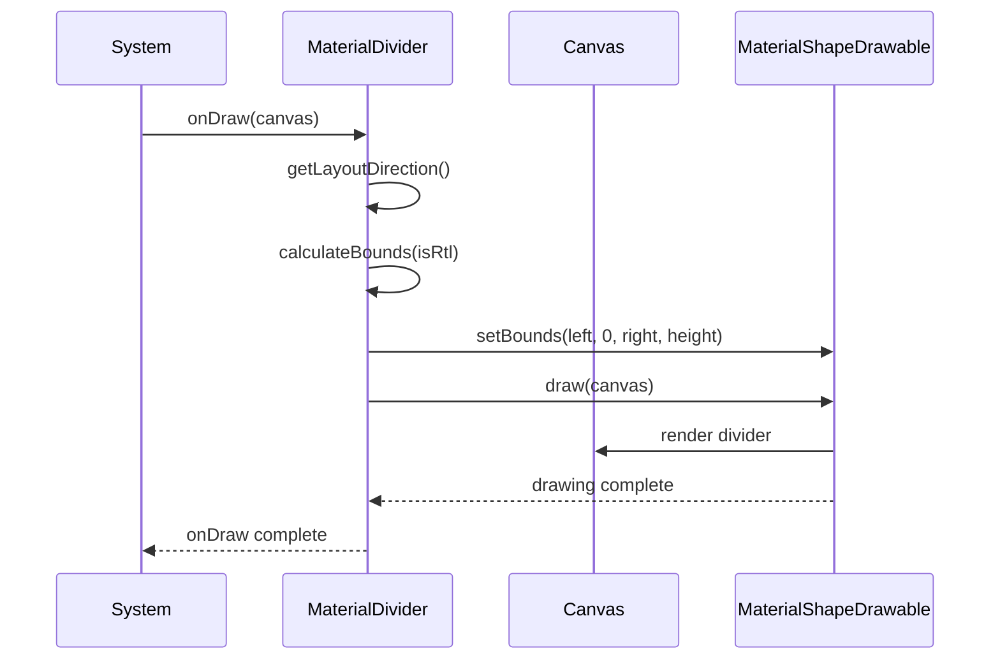
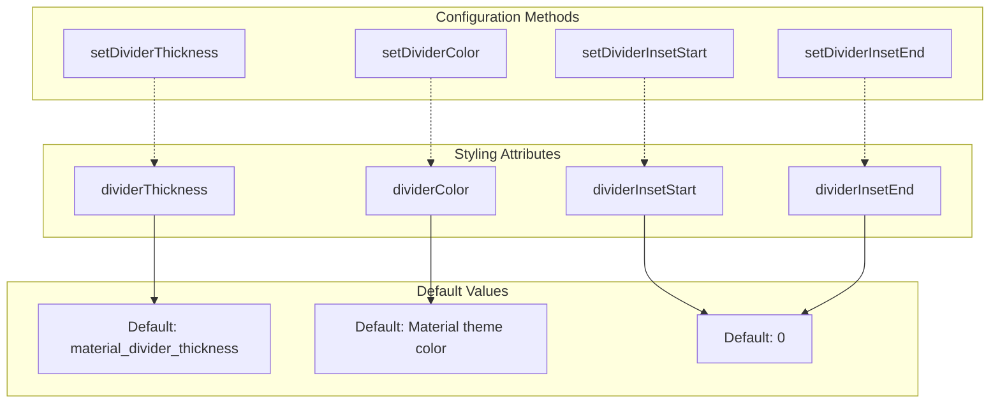
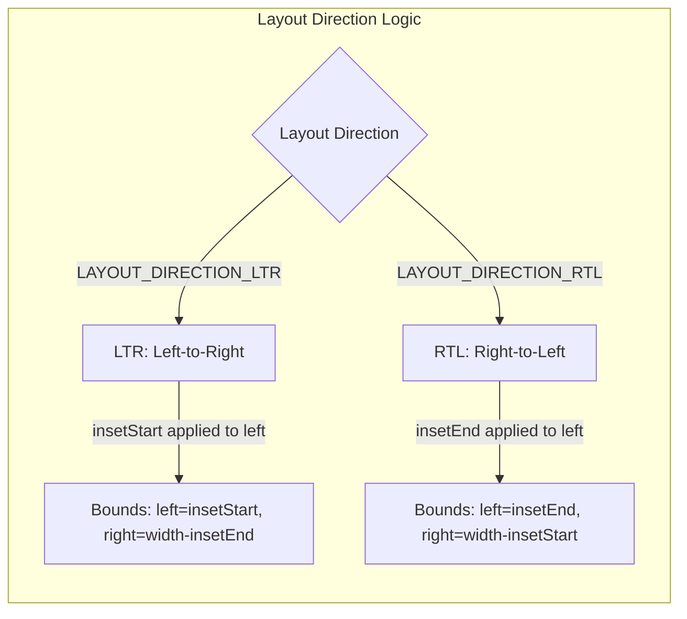
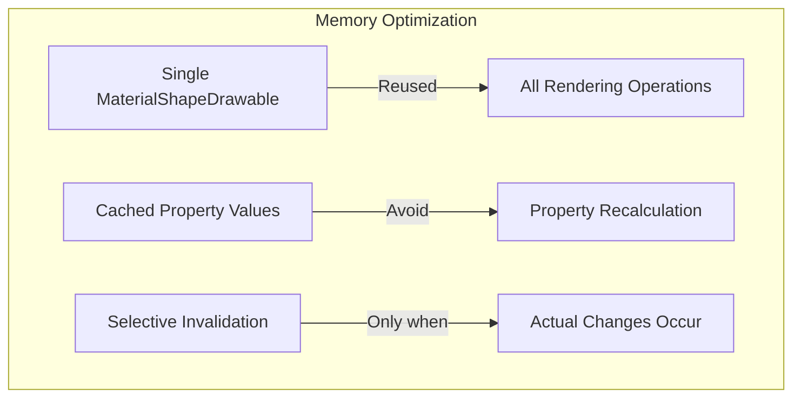
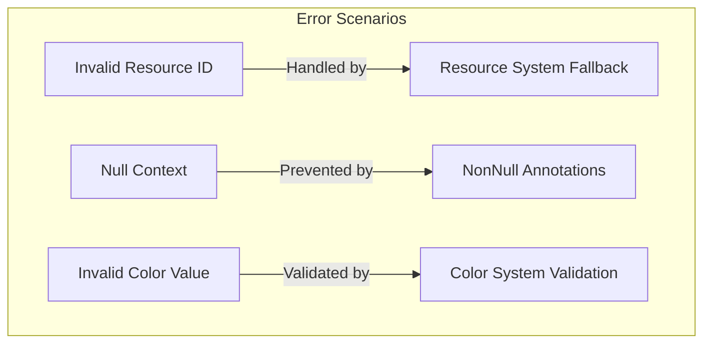

# Material Divider Module Documentation

## Introduction

The Material Divider module provides a Material Design-compliant divider component that creates visual separation between content sections. The `MaterialDivider` class extends Android's `View` class to deliver a customizable, theme-aware divider that automatically applies Material Design styling and theming without requiring explicit style flags in layout files.

## Core Architecture

### Primary Component

The module centers around the `MaterialDivider` class, which serves as a self-contained view component that renders a horizontal or vertical divider line with customizable properties including thickness, color, and inset spacing.

### Architecture Overview



## Component Dependencies

### Internal Dependencies

The Material Divider module integrates with several Material Design system components:

- **[Shape Module](shape.md)**: Utilizes `MaterialShapeDrawable` for rendering the divider with Material Design shape properties
- **[Theme Module](color.md)**: Leverages `MaterialThemeOverlay.wrap()` for automatic theme application
- **[Resources Module](color.md)**: Uses `MaterialResources.getColorStateList()` for color resource handling
- **[Internal Module](color.md)**: Depends on `ThemeEnforcement` for consistent theming enforcement

### External Dependencies



## Data Flow Architecture

### Initialization Flow



### Rendering Flow



## Component Properties

### Visual Properties

| Property | Type | Purpose | Default Source |
|----------|------|---------|----------------|
| `thickness` | `int` | Divider line thickness | `R.dimen.material_divider_thickness` |
| `color` | `@ColorInt int` | Divider color | Material theme color state list |
| `insetStart` | `int` | Left/start inset spacing | 0 |
| `insetEnd` | `int` | Right/end inset spacing | 0 |

### Styling Configuration



## Layout Behavior

### Measurement Strategy

The MaterialDivider implements intelligent measurement behavior:

1. **Height Handling**: When `layout_height="wrap_content"`, the divider automatically uses the configured thickness
2. **Width Handling**: The divider fills the available width based on parent constraints
3. **Inset Application**: Start and end insets are applied based on layout direction (RTL/LTR)

### RTL Support



## Integration Patterns

### Basic Usage

```xml
<com.google.android.material.divider.MaterialDivider
    android:layout_width="match_parent"
    android:layout_height="wrap_content"
    app:dividerThickness="1dp"
    app:dividerColor="?attr/colorOutlineVariant"
    app:dividerInsetStart="16dp"
    app:dividerInsetEnd="16dp" />
```

### Programmatic Configuration

```java
MaterialDivider divider = findViewById(R.id.divider);
divider.setDividerThickness(2);
divider.setDividerColor(ContextCompat.getColor(context, R.color.custom_divider));
divider.setDividerInsetStart(24);
```

## Theming Integration

### Automatic Theming

The MaterialDivider automatically applies Material Design theming through the `MaterialThemeOverlay.wrap()` mechanism, ensuring consistent visual appearance across the application without explicit theme configuration.

### Theme Attributes

The component respects the following theme attributes:

- `materialDividerStyle`: Default style resource
- `colorOutlineVariant`: Default color reference for dividers
- Material elevation and shape theming through `MaterialShapeDrawable`

## Performance Considerations

### Optimization Strategies

1. **Drawable Reuse**: Single `MaterialShapeDrawable` instance reused for all rendering operations
2. **Lazy Invalidation**: Only invalidates view when properties actually change
3. **Efficient Bounds Calculation**: Minimal calculations during `onDraw()` with cached inset values

### Memory Management



## Accessibility

### Visual Accessibility

- **Color Contrast**: Automatically applies Material Design color contrast ratios
- **Thickness Configuration**: Supports minimum touch target requirements through thickness customization
- **RTL Layout**: Full right-to-left layout support for international accessibility

### Semantic Structure

The MaterialDivider serves as a visual separator that enhances content organization and readability, supporting screen reader navigation by providing clear visual boundaries between content sections.

## Error Handling

### Robustness Features

1. **Null Safety**: All public methods include `@NonNull` and `@Nullable` annotations
2. **Resource Validation**: Graceful handling of invalid resource IDs
3. **Theme Fallback**: Automatic fallback to default Material theme when custom attributes are not provided

### Exception Handling



## Extension Points

### Customization Opportunities

1. **Subclassing**: Extend `MaterialDivider` for custom divider behavior
2. **Style Resources**: Define custom style resources for consistent theming
3. **Programmatic Styling**: Dynamic styling based on application state

### Future Enhancements

The modular architecture supports potential extensions such as:
- Gradient divider support
- Animated divider transitions
- Custom shape divider implementations
- Integration with Material motion system

## Related Documentation

- **[Shape Module](shape.md)**: Understanding `MaterialShapeDrawable` integration
- **[Color Module](color.md)**: Material Design color system and theming
- **[Theme Module](color.md)**: Material Design theme integration patterns
- **[Resources Module](color.md)**: Material resource handling utilities