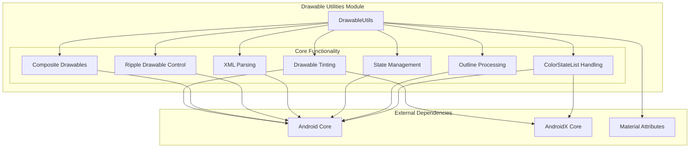
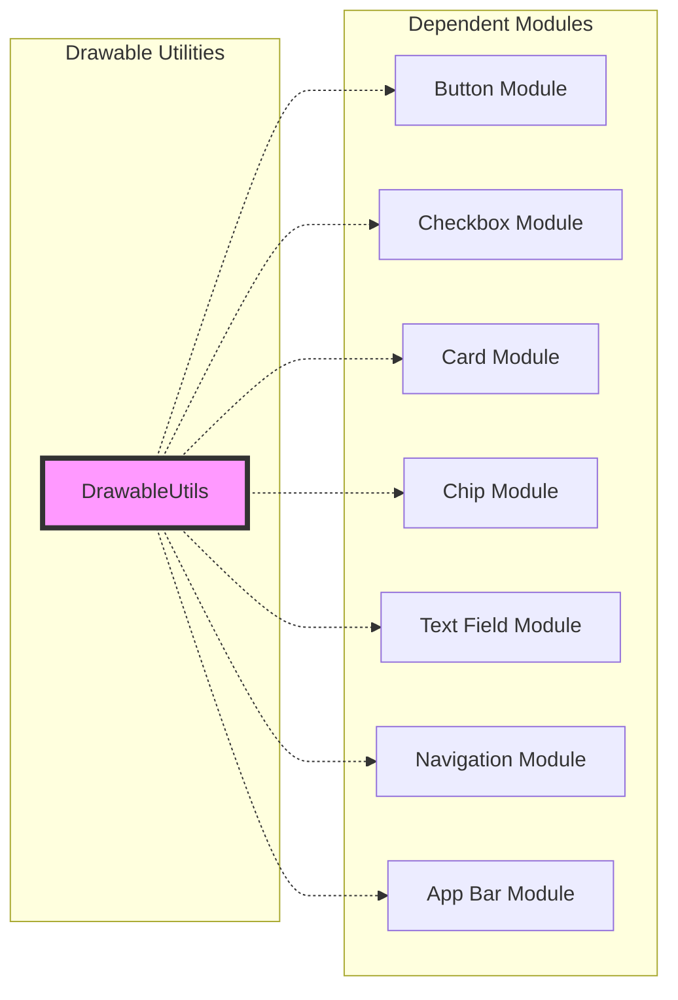
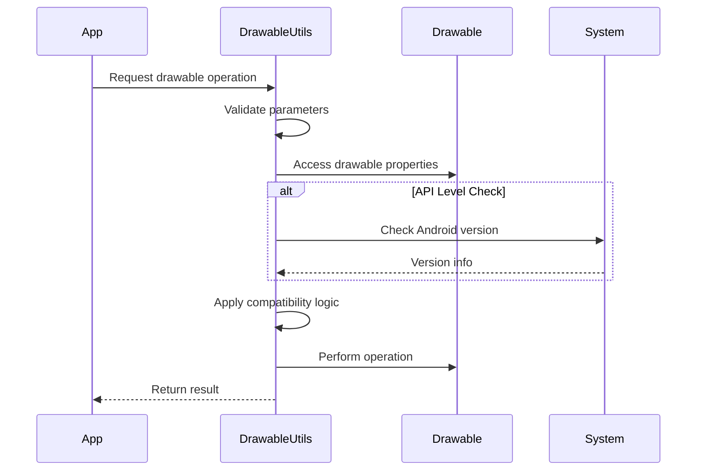
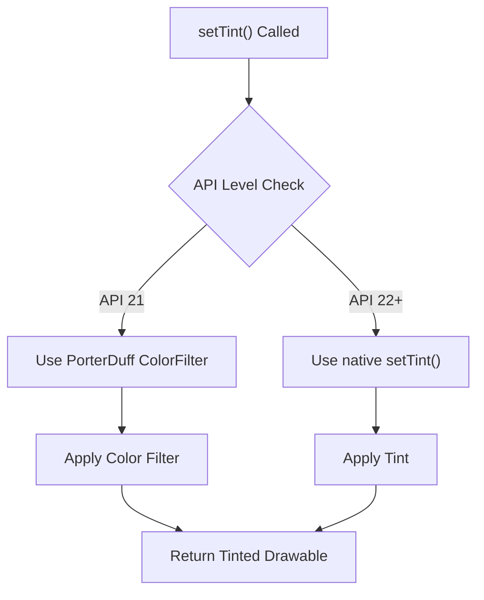
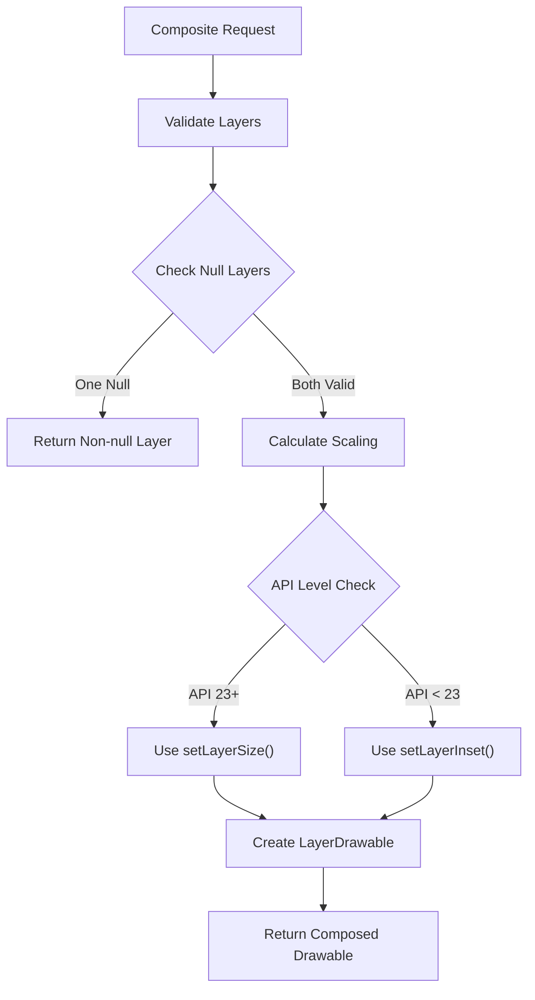
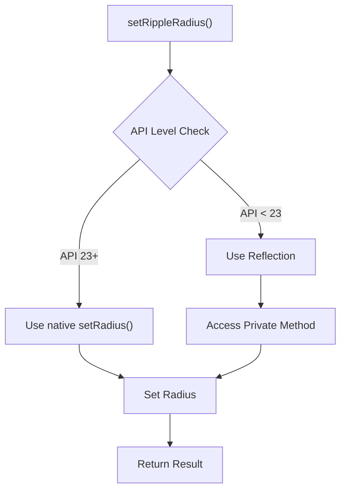

# Drawable Utilities Module

The drawable-utilities module provides essential utility functions and helper methods for working with Android Drawables in the Material Design Components library. This module serves as a foundational component that supports various drawable operations across the entire Material Design system.

## Overview

The drawable-utilities module is a core utility module that offers a comprehensive set of static methods for manipulating, composing, and managing Android Drawables. It provides cross-API compatibility, performance optimizations, and simplifies complex drawable operations that are commonly needed throughout the Material Design Components library.

## Core Components

### DrawableUtils

The primary utility class that provides static methods for drawable manipulation and management.

**Key Features:**
- Drawable tinting and color filtering
- Multi-layer drawable composition
- Ripple drawable radius control
- XML parsing for drawable resources
- State management for checkable drawables
- Outline creation from paths
- ColorStateList extraction

## Architecture



## Component Relationships



## Data Flow



## Key Functionality

### 1. Drawable Tinting

The module provides comprehensive tinting support with API-level compatibility:



### 2. Multi-layer Drawable Composition

Advanced composition system for creating layered drawables:



### 3. Ripple Drawable Control

Cross-API ripple drawable radius management:



## API Compatibility

The module implements extensive API compatibility handling:

| Function | API 21 | API 22-22 | API 23+ | API 29+ | API 30+ |
|----------|--------|-----------|---------|---------|---------|
| Tinting | PorterDuff | Native setTint | Native setTint | Native setTint | Native setTint |
| Ripple Radius | Reflection | Reflection | Native | Native | Native |
| Layer Sizing | Inset-based | Inset-based | Direct sizing | Direct sizing | Direct sizing |
| Outline Path | Convex only | Convex only | Convex/Concave | Full path | Full path |

## Usage Examples

### Basic Tinting
```java
// Apply tint to a drawable
DrawableUtils.setTint(drawable, Color.RED);

// Create tintable drawable with ColorStateList
Drawable tintedDrawable = DrawableUtils.createTintableDrawableIfNeeded(
    originalDrawable, colorStateList, PorterDuff.Mode.SRC_IN);
```

### Composite Drawables
```java
// Create a two-layer composite drawable
Drawable composite = DrawableUtils.compositeTwoLayeredDrawable(
    backgroundDrawable, iconDrawable);

// Create with custom sizing
Drawable scaledComposite = DrawableUtils.compositeTwoLayeredDrawable(
    backgroundDrawable, iconDrawable, 48, 48);
```

### State Management
```java
// Add checked state to drawable state
int[] checkedState = DrawableUtils.getCheckedState(originalState);

// Remove checked state from drawable state
int[] uncheckedState = DrawableUtils.getUncheckedState(originalState);
```

## Performance Considerations

- **Drawable Mutation**: The module automatically handles drawable mutation to prevent state conflicts
- **Caching**: No internal caching is implemented; relies on Android's drawable caching mechanisms
- **Memory Efficiency**: Composite operations create new LayerDrawable instances
- **Reflection Usage**: Minimal reflection usage, only for pre-API 23 ripple radius control

## Error Handling

The module implements comprehensive error handling:

- **XML Parsing**: Converts XML exceptions to Resource.NotFoundException with detailed messages
- **Reflection**: Wraps reflection exceptions in IllegalStateException
- **Null Safety**: Validates all drawable parameters before processing
- **API Compatibility**: Graceful degradation for unsupported API levels

## Integration with Other Modules

The drawable-utilities module serves as a foundation for multiple Material Design components:

- **[Button Module](button.md)**: Tinting and state management for Material buttons
- **[Checkbox Module](checkbox.md)**: State handling for checkable components
- **[Card Module](card.md)**: Background drawable composition
- **[Chip Module](chip.md)**: Complex drawable states and tinting
- **[Text Field Module](text-field.md)**: Icon drawable management
- **[Navigation Module](navigation.md)**: Navigation item drawable handling
- **[App Bar Module](appbar.md)**: Toolbar and collapsing layout drawables

## Testing Considerations

When testing components that use drawable-utilities:

1. **API Level Testing**: Test across different API levels (21, 22, 23, 29, 30+)
2. **State Management**: Verify drawable state transitions
3. **Memory Leaks**: Ensure proper drawable cleanup
4. **Performance**: Monitor composite operations with large drawables
5. **Edge Cases**: Test with null drawables, invalid XML, and extreme sizes

## Future Considerations

The module is designed to be extensible for future Android API changes:

- New outline APIs can be added to `setOutlineToPath()`
- Additional drawable types can be supported in composite operations
- Enhanced tinting capabilities can be integrated
- Performance optimizations can be added for specific use cases