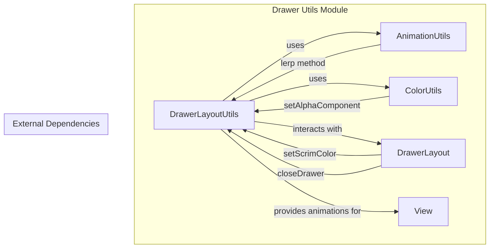
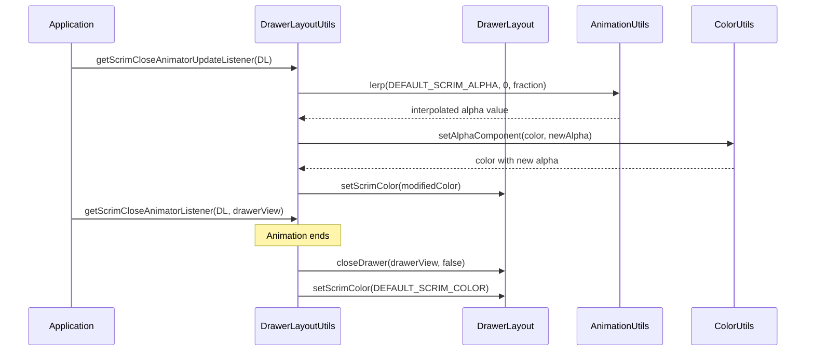
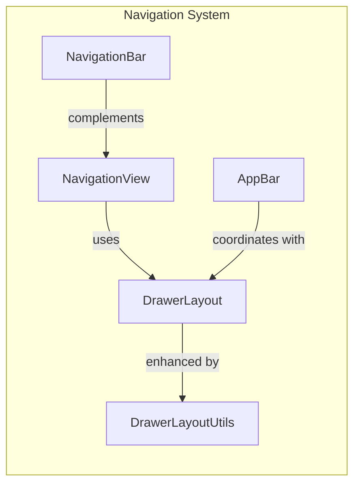

# Drawer Utils Module Documentation

## Introduction

The drawer-utils module provides utility functionality for managing drawer layouts within the Material Design Components library. This module contains helper methods and animations specifically designed to enhance the user experience of drawer-based navigation components, particularly focusing on scrim (overlay) color management and smooth drawer closing animations.

## Module Overview

The drawer-utils module is a specialized utility component that serves as a supporting module for the broader navigation system. It provides animation utilities and color management for `DrawerLayout` components, ensuring consistent visual behavior across Material Design applications.

## Core Components

### DrawerLayoutUtils

**Location**: `lib.java.com.google.android.material.navigation.DrawerLayoutUtils.DrawerLayoutUtils`

The `DrawerLayoutUtils` class is a utility class that provides static methods for managing drawer animations and visual effects. It is restricted to library group usage and cannot be accessed directly by application developers.

#### Key Features:
- **Scrim Color Management**: Handles the semi-transparent overlay (scrim) that appears when drawers are open
- **Animation Utilities**: Provides smooth fade-out animations for drawer closing
- **Color Alpha Blending**: Manages transparency transitions for visual consistency

#### Constants:
- `DEFAULT_SCRIM_COLOR`: Default scrim color (0x99000000 - semi-transparent black)
- `DEFAULT_SCRIM_ALPHA`: Default alpha value extracted from the scrim color

#### Methods:

##### `getScrimCloseAnimatorUpdateListener(DrawerLayout)`
Returns an `AnimatorUpdateListener` that gradually fades out the scrim color during drawer closing animation. The method uses linear interpolation to smoothly transition the alpha component from the default value to 0.

##### `getScrimCloseAnimatorListener(DrawerLayout, View)`
Returns an `AnimatorListener` that performs cleanup operations when the animation ends, including:
- Closing the drawer immediately (without animation)
- Resetting the scrim color to its default value

## Architecture

### Component Structure

### Data Flow

## Dependencies

### Internal Dependencies
- **animation module**: Uses `AnimationUtils` for interpolation calculations
- **color module**: Uses `ColorUtils` for color manipulation

### External Dependencies
- **AndroidX DrawerLayout**: Interacts with `androidx.drawerlayout.widget.DrawerLayout`
- **Android Animation Framework**: Uses `Animator`, `AnimatorListener`, and `AnimatorUpdateListener`
- **Android Graphics**: Uses `Color` class for color constants and operations

## Integration with Navigation System

The drawer-utils module is part of the navigation module family and works in conjunction with:

- **[Navigation View Core](navigation-view-core.md)**: Provides the main navigation drawer component
- **[Navigation Bar Core](navigation-bar-core.md)**: Handles bottom navigation integration
- **[AppBar](appbar.md)**: Manages app bar coordination with drawer behavior

## Usage Patterns

### Animation Integration
The drawer-utils module is designed to be used internally by Material Design Components when:
- A drawer needs to be closed with a smooth visual transition
- The scrim overlay needs to fade out gradually
- Visual consistency needs to be maintained across different drawer implementations

### Best Practices
- The utilities are automatically applied by the Material Design Components library
- Developers should not directly access these utilities in application code
- The module ensures consistent behavior across all Material Design drawer implementations

## Technical Implementation Details

### Thread Safety
- All methods are thread-safe as they operate on the main UI thread
- Animation listeners are executed on the main thread
- No shared mutable state exists between different drawer instances

### Performance Considerations
- Uses efficient color manipulation with `ColorUtils`
- Leverages hardware-accelerated animations when available
- Minimizes object allocation by reusing animation listeners

### Memory Management
- No static references to views or contexts
- Animation listeners are properly cleaned up after use
- Default colors are stored as primitive constants

## Future Considerations

The drawer-utils module is designed to be extensible for future enhancements such as:
- Custom scrim color support
- Additional animation curves and timing
- Integration with Material Design 3 motion guidelines
- Support for edge-to-edge drawer layouts

## Related Documentation

- [Navigation Module Overview](navigation.md)
- [Navigation View Core Components](navigation-view-core.md)
- [Navigation Bar Core Components](navigation-bar-core.md)
- [AppBar Module Documentation](appbar.md)