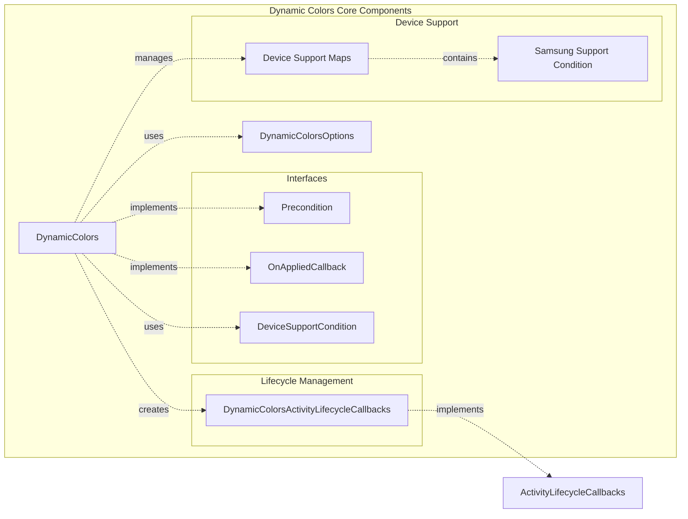
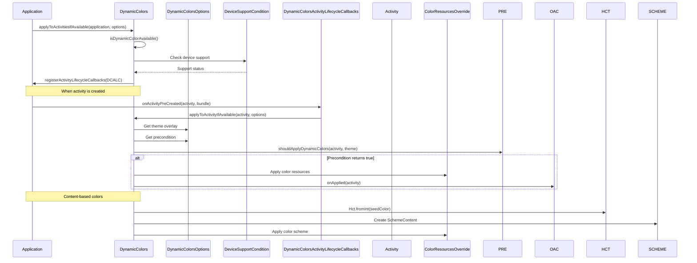
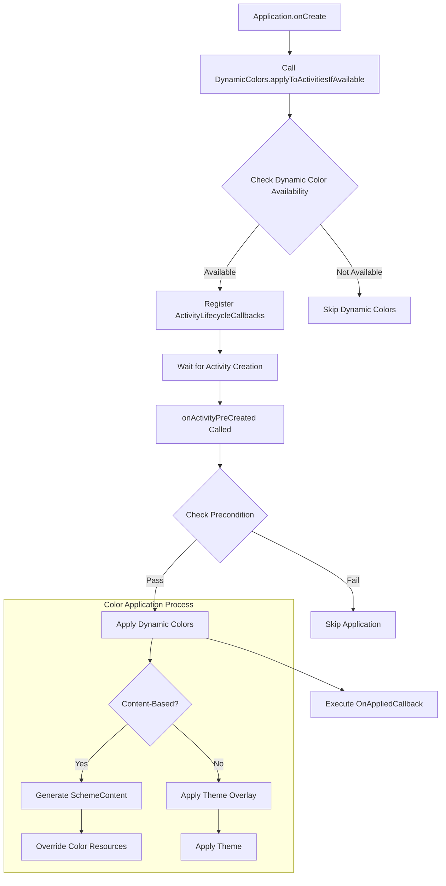
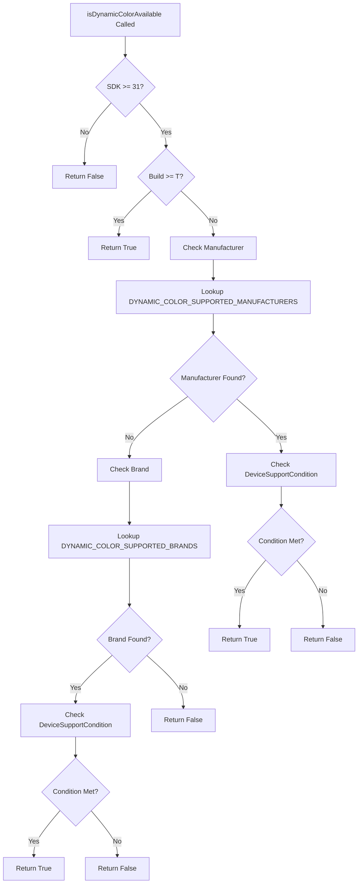

# Dynamic Colors Core Module

## Introduction

The dynamic-colors-core module is the central component of the Material Design 3 dynamic color system. It provides the core functionality for applying dynamic colors to Android applications, enabling automatic color scheme generation based on the user's wallpaper or system preferences. This module serves as the foundation for creating personalized, adaptive user interfaces that respond to the user's environment.

## Module Overview

The dynamic-colors-core module implements the primary `DynamicColors` class, which acts as the main entry point for applying dynamic color schemes across applications and individual activities. The module handles device compatibility checking, theme overlay application, and content-based color generation using the Material Color Utilities library.

## Core Architecture

### Primary Component

#### DynamicColors Class
The `DynamicColors` class is a utility class that provides static methods for applying dynamic colors to applications and activities. It serves as the main API for developers to integrate dynamic color functionality into their applications.

### Key Features

1. **Device Compatibility Management**: Automatically checks device manufacturer and OS version to determine dynamic color support
2. **Activity Lifecycle Integration**: Provides automatic application of dynamic colors through ActivityLifecycleCallbacks
3. **Theme Overlay System**: Applies dynamic color themes using Android's theme overlay mechanism
4. **Content-Based Color Generation**: Supports generating color schemes from specific seed colors
5. **Context Wrapping**: Enables dynamic color support for individual views and components

## Architecture Diagram

```mermaid
graph TB
    subgraph "Dynamic Colors Core Module"
        DC["DynamicColors"]
        
        subgraph "Device Support System"
            DSC["DeviceSupportCondition Interface"]
            DDSC["DEFAULT_DEVICE_SUPPORT_CONDITION"]
            SDSC["SAMSUNG_DEVICE_SUPPORT_CONDITION"]
            DSM["DYNAMIC_COLOR_SUPPORTED_MANUFACTURERS"]
            DSB["DYNAMIC_COLOR_SUPPORTED_BRANDS"]
        end
        
        subgraph "Application Integration"
            DCALC["DynamicColorsActivityLifecycleCallbacks"]
            ALC["ActivityLifecycleCallbacks"]
        end
        
        subgraph "Color Application System"
            PRE["Precondition Interface"]
            OAC["OnAppliedCallback Interface"]
            TUTIL["ThemeUtils"]
            CRO["ColorResourcesOverride"]
        end
        
        subgraph "Content-Based Colors"
            HCT["Hct"]
            SCHEME["SchemeContent"]
            MCH["MaterialColorUtilitiesHelper"]
        end
    end
    
    subgraph "External Dependencies"
        ACT["Activity"]
        APP["Application"]
        CTX["Context"]
        UIMM["UiModeManager"]
    end
    
    DC --> DSC
    DC --> DDSC
    DC --> SDSC
    DC --> DSM
    DC --> DSB
    DC --> DCALC
    DCALC --> ALC
    DC --> PRE
    DC --> OAC
    DC --> TUTIL
    DC --> CRO
    DC --> HCT
    DC --> SCHEME
    DC --> MCH
    
    DCALC --> ACT
    DC --> APP
    DC --> CTX
    DC --> UIMM
```



## Component Relationships



## Data Flow Architecture



## Process Flow

### Application-Level Dynamic Colors Application



### Device Compatibility Check Process



## Key Interfaces and Classes

### DynamicColors Class
The main utility class providing static methods for dynamic color application:

- **applyToActivitiesIfAvailable()**: Applies dynamic colors to all activities in an application
- **applyToActivityIfAvailable()**: Applies dynamic colors to a specific activity
- **wrapContextIfAvailable()**: Wraps contexts with dynamic color support
- **isDynamicColorAvailable()**: Checks if dynamic colors are supported on the current device

### Device Support System
Manages device compatibility through:

- **DeviceSupportCondition Interface**: Defines device support checking logic
- **Manufacturer Maps**: Predefined support conditions for various device manufacturers
- **Samsung-Specific Logic**: Special handling for Samsung devices with OneUI version checking

### Lifecycle Integration
Seamless integration with Android's activity lifecycle:

- **DynamicColorsActivityLifecycleCallbacks**: Automatically applies dynamic colors when activities are created
- **Precondition Interface**: Allows custom logic for determining when to apply dynamic colors
- **OnAppliedCallback Interface**: Provides hooks for post-application actions

## Integration with Other Modules

The dynamic-colors-core module serves as the foundation for the broader color system:

- **[dynamic-colors-options.md](dynamic-colors-options.md)**: Provides configuration options for dynamic color application
- **[harmonized-colors.md](harmonized-colors.md)**: Builds upon dynamic colors for color harmonization
- **[material-colors.md](material-colors.md)**: Integrates with the broader Material color system
- **[theme-utils.md](theme-utils.md)**: Utilizes theme utilities for applying color overlays

## Usage Examples

### Basic Application Integration
```java
public class MyApplication extends Application {
    @Override
    public void onCreate() {
        super.onCreate();
        DynamicColors.applyToActivitiesIfAvailable(this);
    }
}
```

### Activity-Specific Application
```java
@Override
protected void onCreate(Bundle savedInstanceState) {
    super.onCreate(savedInstanceState);
    DynamicColors.applyToActivityIfAvailable(this);
    setContentView(R.layout.activity_main);
}
```

### Context Wrapping for Individual Views
```java
Context dynamicColorContext = DynamicColors.wrapContextIfAvailable(originalContext);
View dynamicColorView = new MyView(dynamicColorContext);
```

## Device Compatibility

The module includes comprehensive device support checking:

- **Minimum SDK**: Android 12 (API 31) for basic dynamic color support
- **Manufacturer Support**: Predefined support for major manufacturers including Samsung, Google, OnePlus, Xiaomi, and others
- **Brand Support**: Additional support for specific device brands
- **Samsung OneUI**: Special version checking for Samsung devices (OneUI 4.0+)

## Performance Considerations

- **Lazy Initialization**: Device support conditions are evaluated only when needed
- **Caching**: Samsung device version information is cached to avoid repeated reflection calls
- **Early Exit**: Multiple early return points to avoid unnecessary processing
- **Resource Efficiency**: Minimal memory footprint with static utility design

## Security and Privacy

- **No Personal Data Collection**: The module only checks device properties for compatibility
- **Local Processing**: All color generation happens locally on the device
- **Permission-Free**: No special permissions required for dynamic color functionality
- **Safe Reflection**: Samsung version checking uses safe reflection practices with proper error handling

## Error Handling

The module implements robust error handling:

- **Graceful Degradation**: Falls back to default themes when dynamic colors aren't available
- **Exception Safety**: Catches and handles reflection exceptions for Samsung device detection
- **Null Safety**: Comprehensive null checking throughout the codebase
- **Resource Cleanup**: Proper management of TypedArray resources

This comprehensive approach ensures that the dynamic-colors-core module provides a reliable, efficient, and user-friendly foundation for implementing dynamic colors in Android applications while maintaining compatibility across a wide range of devices and Android versions.