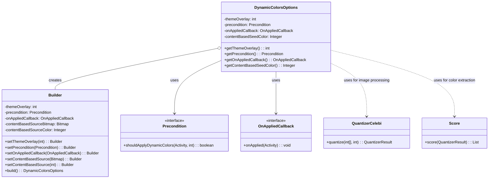
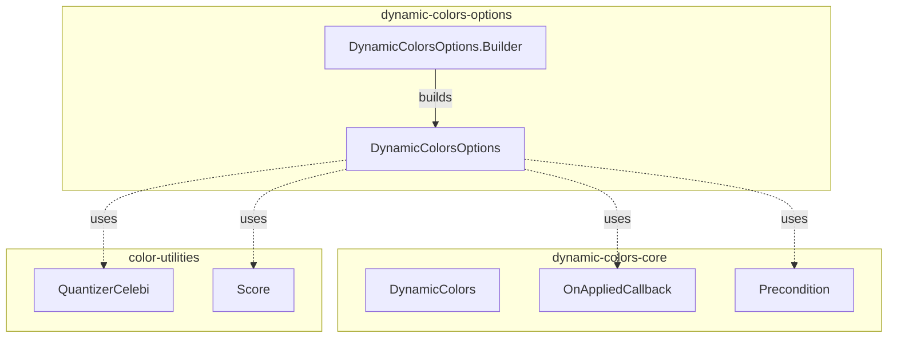
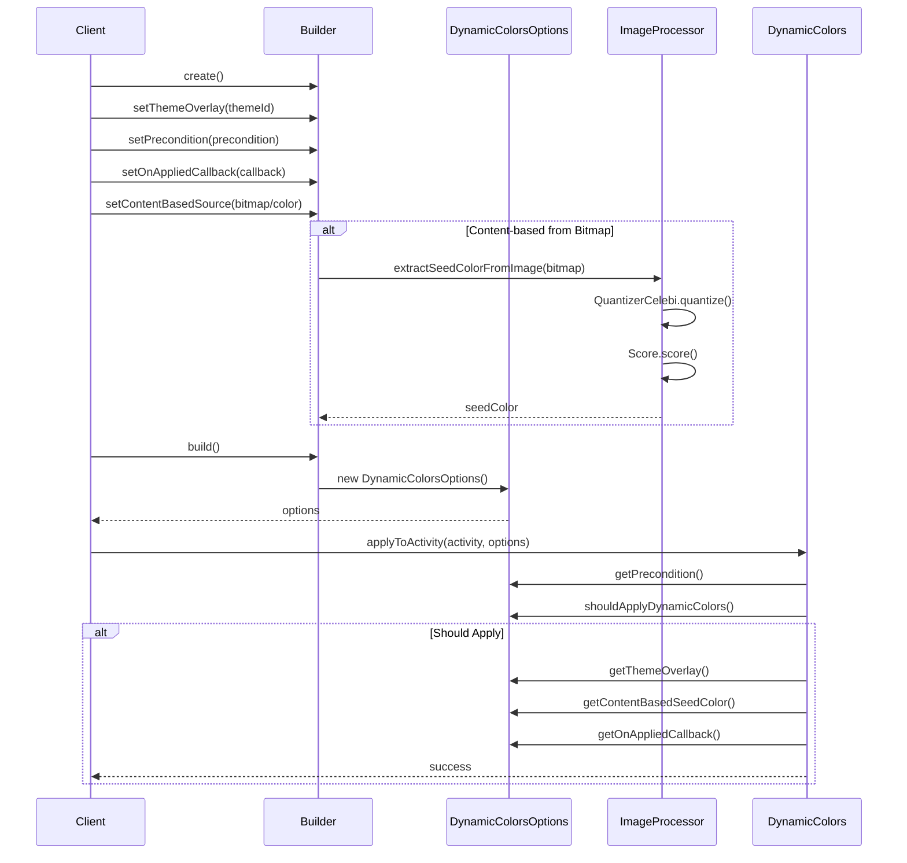

# Dynamic Colors Options Module

## Introduction

The `dynamic-colors-options` module provides a flexible configuration system for applying dynamic colors in Android Material Design applications. It serves as the primary interface for customizing how dynamic colors are applied to activities, offering fine-grained control over theme overlays, application preconditions, callbacks, and content-based color extraction.

## Overview

This module is part of the larger Material Design color system and specifically handles the configuration options for the [dynamic-colors-core](dynamic-colors-core.md) module. It enables developers to:

- Customize theme overlays for dynamic color application
- Define preconditions for when dynamic colors should be applied
- Set up callbacks for post-application processing
- Extract seed colors from images or use predefined colors for content-based dynamic theming

## Architecture

### Component Structure



### Module Dependencies



## Core Components

### DynamicColorsOptions

The main configuration class that encapsulates all options for applying dynamic colors. It provides immutable access to:

- **Theme Overlay**: Custom theme resource ID for dynamic color definitions
- **Precondition**: Logic to determine if dynamic colors should be applied
- **Callback**: Post-application callback for custom processing
- **Content-based Seed Color**: Extracted or predefined color for dynamic palette generation

### DynamicColorsOptions.Builder

A fluent builder pattern implementation that allows for easy configuration of dynamic color options. The builder provides methods to:

- Set custom theme overlays
- Define application preconditions
- Configure post-application callbacks
- Set content-based color sources (either Bitmap images or direct color values)

## Data Flow



## Key Features

### 1. Flexible Configuration

The module provides a comprehensive set of configuration options through the Builder pattern, allowing developers to customize every aspect of dynamic color application.

### 2. Content-Based Color Extraction

Supports extracting dominant colors from images using advanced quantization algorithms:
- Uses `QuantizerCelebi` for color quantization
- Applies `Score` algorithm to select the most representative color
- Handles both Bitmap sources and direct color values

### 3. Conditional Application

Provides a precondition system that allows dynamic colors to be applied based on custom logic, such as:
- Device capabilities
- User preferences
- Application state
- System settings

### 4. Callback System

Enables post-application processing through a callback mechanism, allowing for:
- Logging and analytics
- Additional customizations
- UI updates
- State management

## Usage Patterns

### Basic Usage

```java
DynamicColorsOptions options = new DynamicColorsOptions.Builder()
    .setThemeOverlay(R.style.ThemeOverlay_App_DynamicColors)
    .build();
```

### Advanced Usage with Content-Based Colors

```java
DynamicColorsOptions options = new DynamicColorsOptions.Builder()
    .setThemeOverlay(R.style.ThemeOverlay_App_DynamicColors)
    .setPrecondition((activity, theme) -> {
        // Custom logic to determine if dynamic colors should be applied
        return Build.VERSION.SDK_INT >= Build.VERSION_CODES.S;
    })
    .setOnAppliedCallback(activity -> {
        // Custom processing after colors are applied
        Log.d("Colors", "Dynamic colors applied to " + activity.getClass().getSimpleName());
    })
    .setContentBasedSource(bitmap) // or setContentBasedSource(colorInt)
    .build();
```

## Integration with System

The `dynamic-colors-options` module integrates with the broader Material Design color system:

- **Parent Module**: [dynamic-colors-core](dynamic-colors-core.md) - Uses these options when applying dynamic colors
- **Utility Dependencies**: Leverages color quantization and scoring utilities for image-based color extraction
- **Theme System**: Works with Android's theme overlay system for consistent color application

## Best Practices

1. **Theme Overlay Selection**: Choose appropriate theme overlays that define comprehensive color attributes
2. **Precondition Logic**: Keep precondition checks lightweight and deterministic
3. **Callback Usage**: Use callbacks for non-blocking operations only
4. **Image Processing**: For content-based colors, use appropriately sized images to balance quality and performance
5. **Memory Management**: Be mindful of Bitmap memory usage when extracting colors from large images

## Related Documentation

- [Dynamic Colors Core](dynamic-colors-core.md) - Core dynamic colors application logic
- [Color Harmonization](color.md) - Color harmonization utilities
- [Material Colors](color.md) - General Material Design color utilities
- [Theme Utilities](color.md) - Theme manipulation utilities