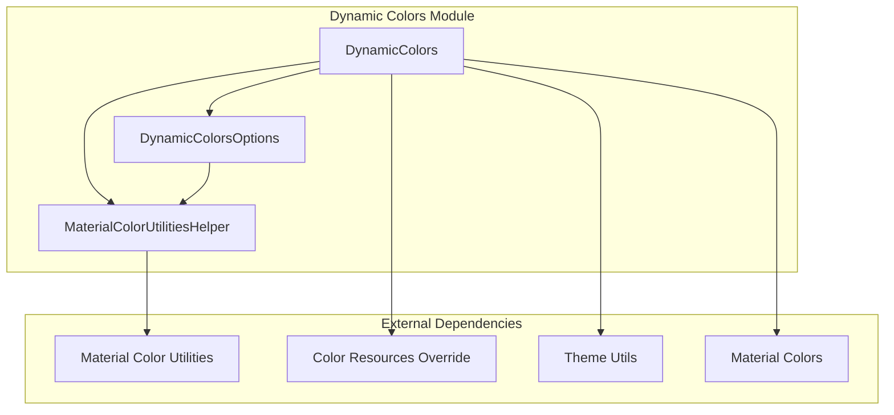
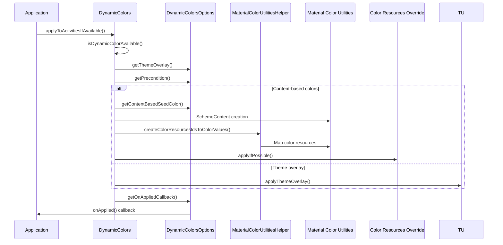

# Dynamic Colors Module

The dynamic-colors module provides the core functionality for applying Material Design 3 dynamic color theming to Android applications. This module enables applications to adapt their color schemes based on system wallpaper colors or custom content, creating personalized and cohesive visual experiences.

## Overview

The dynamic-colors module is part of the Material Design Components library and implements the Material You design language. It allows applications to dynamically generate color palettes that harmonize with user-selected wallpaper colors or custom content colors, ensuring visual consistency across the entire application while maintaining accessibility standards.

## Core Components

### DynamicColors
The main utility class that provides static methods for applying dynamic colors to activities and contexts. It handles device compatibility checks, theme overlay application, and content-based color extraction.

### DynamicColorsOptions
A configuration class that encapsulates all options for applying dynamic colors, including theme overlays, preconditions, callbacks, and content-based color sources.

### MaterialColorUtilitiesHelper
A helper class that bridges the Material Color Utilities library with the Android resource system, mapping dynamic color values to Android color resources.

## Architecture



## Key Features

### Device Compatibility
The module includes comprehensive device support checking that determines whether dynamic colors are available on the current device. It maintains mappings of supported manufacturers and brands, with special handling for Samsung devices that require OneUI version checking.

### Theme Overlay Application
Dynamic colors can be applied through theme overlays, which modify the application's color scheme without changing the underlying theme structure. The module supports both default theme overlays and custom theme configurations.

### Content-Based Dynamic Colors
Beyond system wallpaper-based colors, the module supports extracting color palettes from custom content such as images. This enables applications to create contextually appropriate color schemes based on displayed content.

### Activity Lifecycle Integration
The module provides seamless integration with the Android activity lifecycle through Application.ActivityLifecycleCallbacks, ensuring dynamic colors are applied consistently across all activities.

## Data Flow



## Component Interactions

### DynamicColors and DynamicColorsOptions
The DynamicColors class uses DynamicColorsOptions to configure how dynamic colors should be applied. The options class provides a builder pattern for setting theme overlays, preconditions, callbacks, and content-based color sources.

### MaterialColorUtilitiesHelper Integration
The helper class serves as a bridge between the Android resource system and the Material Color Utilities library. It maps Android color resource IDs to dynamic color values generated by the color utilities, enabling seamless integration of dynamic colors with existing Android theming systems.

### Color Resources Override
For content-based dynamic colors, the module uses the ColorResourcesOverride system to dynamically replace color resources at runtime, allowing for real-time color scheme updates without requiring activity recreation.

## Usage Patterns

### Basic Application-Wide Dynamic Colors
```java
// In Application.onCreate()
DynamicColors.applyToActivitiesIfAvailable(this);
```

### Custom Theme Overlay
```java
DynamicColorsOptions options = new DynamicColorsOptions.Builder()
    .setThemeOverlay(R.style.ThemeOverlay_App_DynamicColors)
    .build();
DynamicColors.applyToActivitiesIfAvailable(application, options);
```

### Content-Based Dynamic Colors
```java
DynamicColorsOptions options = new DynamicColorsOptions.Builder()
    .setContentBasedSource(bitmap)
    .build();
DynamicColors.applyToActivityIfAvailable(activity, options);
```

### Conditional Application
```java
DynamicColorsOptions options = new DynamicColorsOptions.Builder()
    .setPrecondition((activity, theme) -> {
        // Custom logic to determine if dynamic colors should be applied
        return shouldApplyDynamicColors();
    })
    .setOnAppliedCallback(activity -> {
        // Callback after dynamic colors are applied
        logDynamicColorsApplied();
    })
    .build();
```

## Device Support

The module includes comprehensive device support checking with manufacturer-specific conditions. Supported manufacturers include Google, Samsung, OnePlus, Xiaomi, and many others. Samsung devices require special handling with OneUI version checking to ensure compatibility.

## Accessibility Considerations

The dynamic-colors module ensures that all generated color schemes maintain proper contrast ratios and accessibility standards. It integrates with system contrast settings and automatically adjusts colors to meet accessibility requirements.

## Dependencies

- [Material Color Utilities](color-utilities.md) - Core color generation algorithms
- [Color Resources Override](resource-override.md) - Runtime color resource replacement
- [Theme Utils](resource-override.md) - Theme overlay application
- [Material Colors](core-material-colors.md) - Base color utilities and theme detection

## Related Modules

- [Color Harmonization](color-harmonization.md) - Color harmonization features
- [Contrast Control](contrast-control.md) - Contrast and accessibility features
- [Resource Override](resource-override.md) - Color resource management system