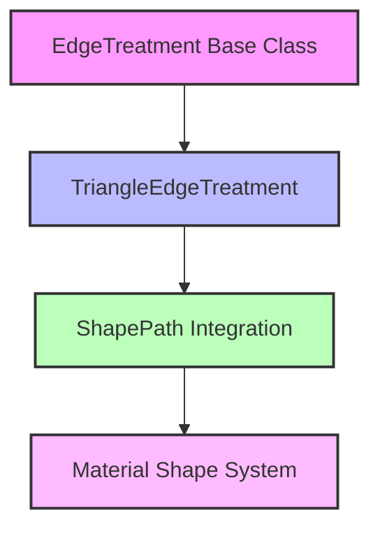
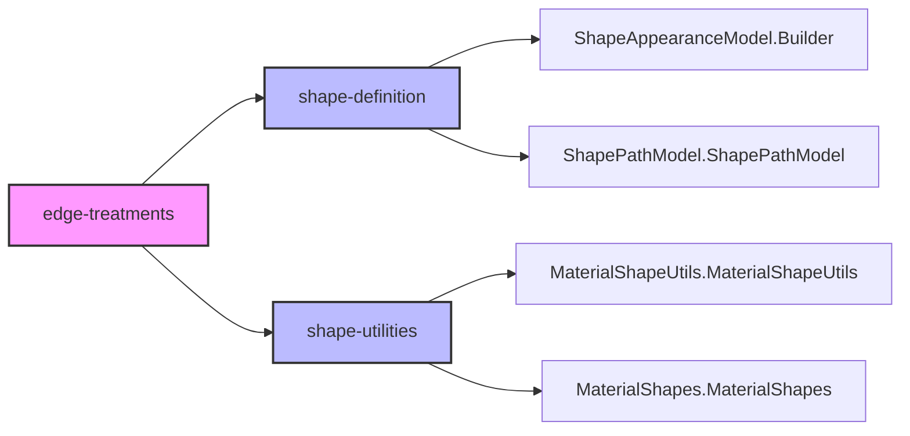
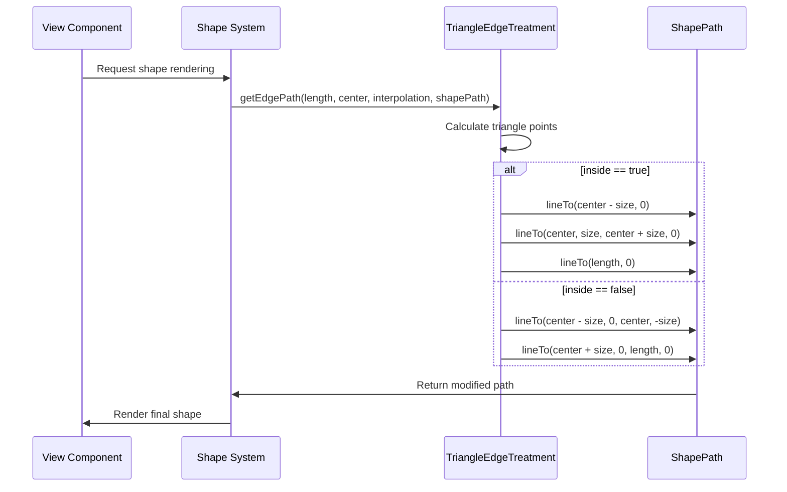

# Edge Treatments Module

The edge-treatments module provides specialized shape treatments for creating decorative edges on Material Design components. This module focuses on triangle-based edge treatments that can be applied to shapes to create visual effects like cutouts or extensions.

## Overview

The edge-treatments module is a specialized component within the Material Design shape system that handles the creation of triangular edge treatments. These treatments can be used to create decorative effects on the edges of Material components, such as creating triangular cutouts or extensions that add visual interest to otherwise straight edges.

## Core Components

### TriangleEdgeTreatment

The primary component of this module is `TriangleEdgeTreatment`, a specialized edge treatment that draws triangles at the midpoint of shape edges. This treatment supports both inward-facing (cutout) and outward-facing (extension) triangle configurations.

**Key Features:**
- Configurable triangle size
- Support for both inward and outward facing triangles
- Smooth interpolation support for animations
- Integration with the Material Design shape system

**Constructor Parameters:**
- `size`: The length in pixels that the triangle extends into or out of the shape
- `inside`: Boolean flag determining triangle direction (true = inward cutout, false = outward extension)

## Architecture

### Component Hierarchy



### Module Dependencies



## Data Flow

### Edge Path Generation Process



## Integration with Material Design System

### Relationship to Shape Module

The edge-treatments module is a specialized component within the broader [shape](shape.md) module. It extends the base `EdgeTreatment` class and integrates with the Material Design shape system through the `ShapePath` API.

### Usage Patterns

Edge treatments are typically used in conjunction with:
- [ShapeAppearanceModel.Builder](shape.md#shape-definition) for defining overall shape appearance
- [MaterialShapeUtils](shape.md#shape-utilities) for shape manipulation utilities
- Custom Material components that require decorative edge effects

## Implementation Details

### Triangle Calculation Logic

The `TriangleEdgeTreatment` calculates triangle points based on the edge midpoint and the specified size parameter. The triangle is always centered on the edge, with the apex pointing either inward or outward depending on the `inside` parameter.

**Inward Triangle (inside=true):**
- Creates a triangular cutout from the shape
- Triangle apex points toward the shape center
- Base of triangle lies on the original edge

**Outward Triangle (inside=false):**
- Creates a triangular extension from the shape
- Triangle apex points away from the shape
- Base of triangle lies on the original edge

### Interpolation Support

The treatment supports interpolation for smooth animations, allowing the triangle size to be animated by varying the interpolation parameter between 0.0 and 1.0.

## Best Practices

### When to Use TriangleEdgeTreatment

**Appropriate Use Cases:**
- Creating decorative cutouts in card edges
- Adding triangular extensions to component edges
- Implementing custom tooltip or pointer shapes
- Creating geometric design elements

**Avoid When:**
- Need map marker shapes (use [MarkerEdgeTreatment](shape.md) instead)
- Complex polygonal edges are required
- Performance-critical rendering paths

### Performance Considerations

- Triangle calculations are performed on each edge path generation
- Consider caching complex shape paths when possible
- Use appropriate size values to avoid overly complex paths

## Related Components

For more complex edge treatments and shape customization options, see:
- [shape-definition](shape.md#shape-definition) - Core shape definition components
- [shape-utilities](shape.md#shape-utilities) - Shape manipulation utilities
- [path-generation](shape.md#path-generation) - Advanced path generation tools
- [edge-treatments](shape.md) - Other edge treatment options

## Example Usage

```java
// Create an inward-facing triangle edge treatment
TriangleEdgeTreatment inwardTriangle = new TriangleEdgeTreatment(20f, true);

// Create an outward-facing triangle edge treatment
TriangleEdgeTreatment outwardTriangle = new TriangleEdgeTreatment(15f, false);

// Apply to a shape appearance model
ShapeAppearanceModel shapeModel = new ShapeAppearanceModel.Builder()
    .setTopEdge(outwardTriangle)
    .setBottomEdge(inwardTriangle)
    .build();
```