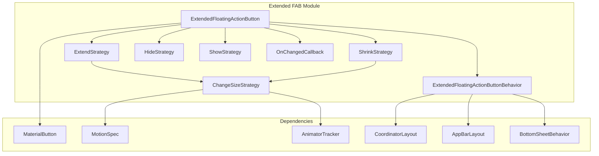
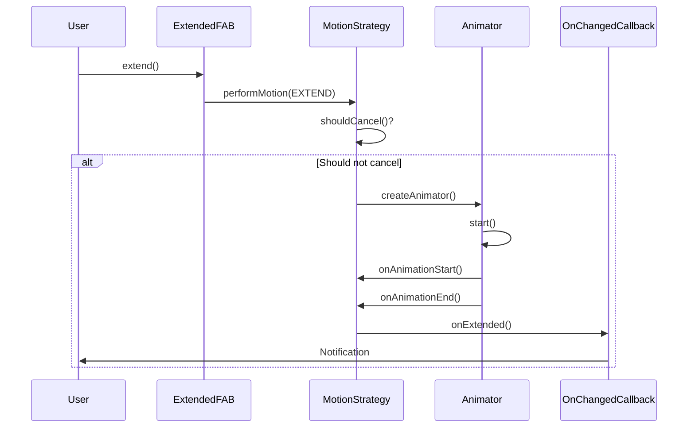
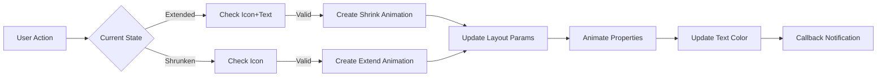
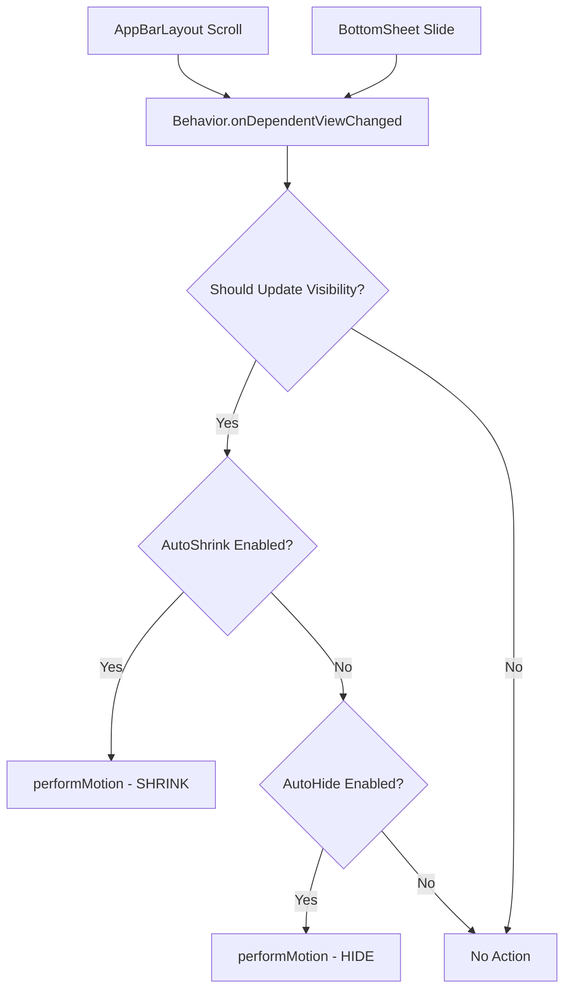
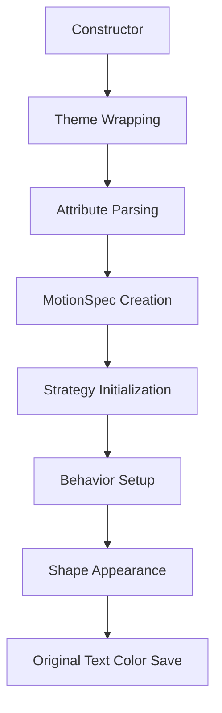
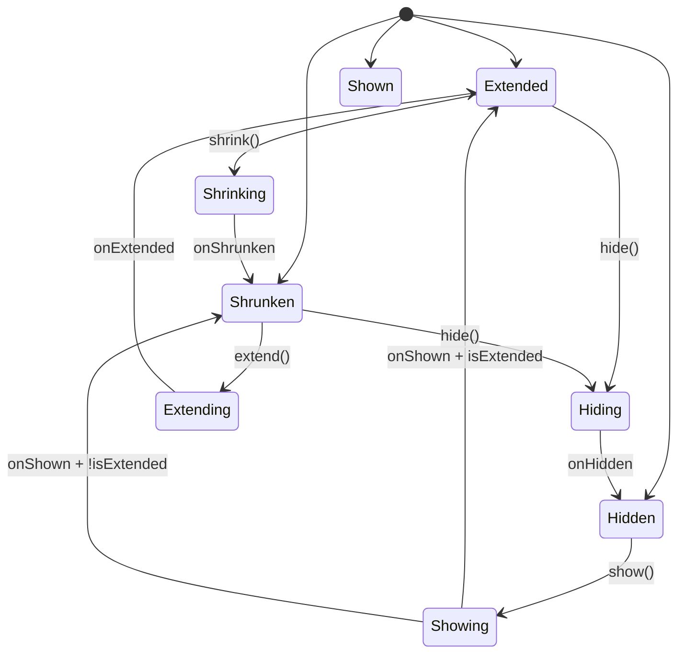

# Extended FAB Module Documentation

## Overview

The Extended FAB (Floating Action Button) module provides a Material Design component that extends the traditional FAB with text labels and enhanced functionality. This module implements the `ExtendedFloatingActionButton` class, which supports morphing animations, automatic behavior integration with other Material components, and flexible sizing strategies.

## Purpose and Core Functionality

The Extended FAB module serves as a key component in Material Design's promoted action pattern, offering:

- **Extended functionality**: Combines icon and text labels for enhanced user understanding
- **Morphing animations**: Smooth transitions between extended and collapsed states
- **Smart behavior**: Automatic show/hide/shrink based on scroll behavior and available space
- **Flexible sizing**: Multiple strategies for extending (wrap content, match parent, auto)
- **Accessibility support**: Proper accessibility announcements and keyboard navigation

## Architecture

### Component Structure



### Core Components

#### ExtendedFloatingActionButton
The main class that extends `MaterialButton` to provide FAB functionality with text labels. Key features:

- **State Management**: Tracks extended/shrunken state and animation states
- **Motion Strategies**: Encapsulates different animation behaviors (show, hide, extend, shrink)
- **Size Management**: Handles dynamic sizing based on content and parent constraints
- **Behavior Integration**: Works with CoordinatorLayout for automatic positioning

#### Motion Strategies

The module uses strategy pattern for different animation types:

- **ShowStrategy**: Handles FAB appearance animations
- **HideStrategy**: Manages FAB disappearance animations  
- **ChangeSizeStrategy**: Implements extend/shrink animations with size transitions
- **ExtendStrategy**: Specific logic for extending FAB to show text
- **ShrinkStrategy**: Logic for collapsing FAB to icon-only state

#### ExtendedFloatingActionButtonBehavior
A CoordinatorLayout.Behavior that provides automatic interaction with:

- **AppBarLayout**: Auto-hide/shrink when app bar scrolls
- **BottomSheetBehavior**: Adjust visibility based on bottom sheet position
- **Snackbar**: Dodge snackbars to prevent overlap

## Data Flow



## Component Interactions

### Extend/Shrink Flow


### Behavior Integration


## Key Features

### Size Strategies

The module supports three extend strategies:

1. **WRAP_CONTENT**: Extends to fit content width
2. **MATCH_PARENT**: Extends to fill parent container (respecting margins/padding)
3. **AUTO**: Intelligently chooses based on original layout parameters

### Animation System

- **MotionSpec Integration**: Uses Material Design motion specifications
- **Property Animation**: Animates width, height, padding, and text opacity
- **State Management**: Tracks animation states to prevent conflicts
- **Customizable Timing**: Supports custom animation durations and interpolators

### Accessibility

- **Role Announcement**: Properly announces as "Floating Action Button"
- **State Changes**: Notifies accessibility services of state changes
- **Keyboard Navigation**: Full keyboard support through MaterialButton inheritance

## Integration Patterns

### Basic Usage
```xml
<com.google.android.material.floatingactionbutton.ExtendedFloatingActionButton
    android:layout_width="wrap_content"
    android:layout_height="wrap_content"
    android:text="Compose"
    app:icon="@drawable/ic_edit"
    app:layout_anchor="@id/app_bar" />
```

### With CoordinatorLayout
```xml
<androidx.coordinatorlayout.widget.CoordinatorLayout>
    <com.google.android.material.appbar.AppBarLayout>
        <!-- App bar content -->
    </com.google.android.material.appbar.AppBarLayout>
    
    <com.google.android.material.floatingactionbutton.ExtendedFloatingActionButton
        app:layout_anchor="@id/app_bar"
        app:layout_anchorGravity="bottom|end"
        app:behavior_autoShrink="true" />
</androidx.coordinatorlayout.widget.CoordinatorLayout>
```

## Dependencies

The extended-fab module has dependencies on several other Material components:

- **[MaterialButton](button.md)**: Base class providing button functionality
- **[MotionSpec](common-utils.md)**: Animation specification system
- **[AppBarLayout](appbar.md)**: For scroll-aware behavior
- **[BottomSheetBehavior](bottom-sheet.md)**: For bottom sheet integration
- **[CoordinatorLayout](common-utils.md)**: For layout behavior system

## Process Flows

### Initialization Flow


### State Transition Management


## Performance Considerations

- **Animation Optimization**: Uses hardware acceleration for smooth animations
- **Layout Efficiency**: Minimizes layout passes during animations
- **Memory Management**: Properly tracks and cancels animations
- **State Caching**: Caches original dimensions and colors to avoid recomputation

## Extension Points

The module provides several extension points:

- **Custom Motion Strategies**: Implement `MotionStrategy` interface for custom animations
- **Behavior Subclassing**: Extend `ExtendedFloatingActionButtonBehavior` for custom interactions
- **Size Interface**: Implement `Size` interface for custom sizing logic
- **Callback System**: Use `OnChangedCallback` for custom state change handling

This comprehensive architecture makes the Extended FAB module a powerful and flexible component for Material Design applications, providing smooth animations, intelligent behavior, and excellent user experience.