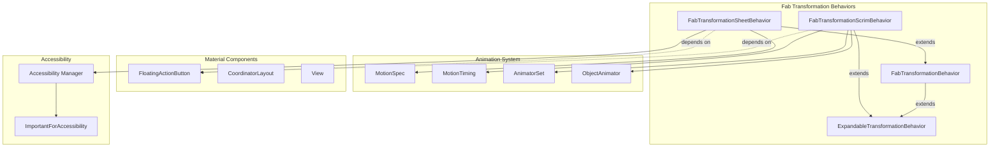
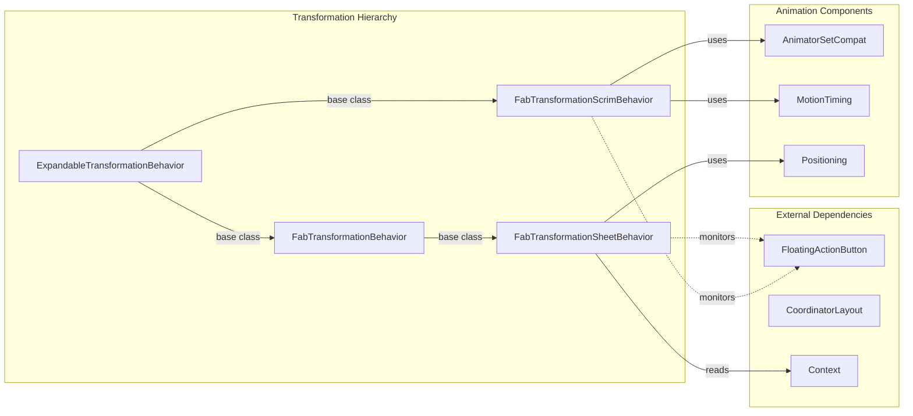
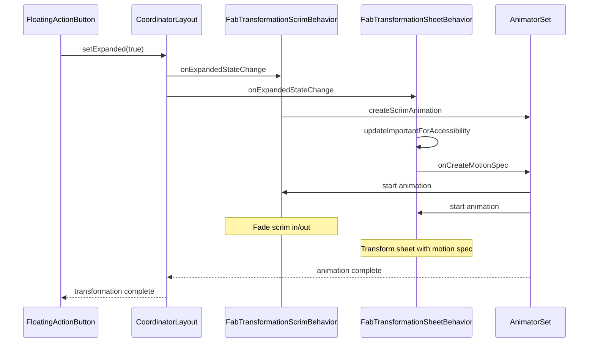
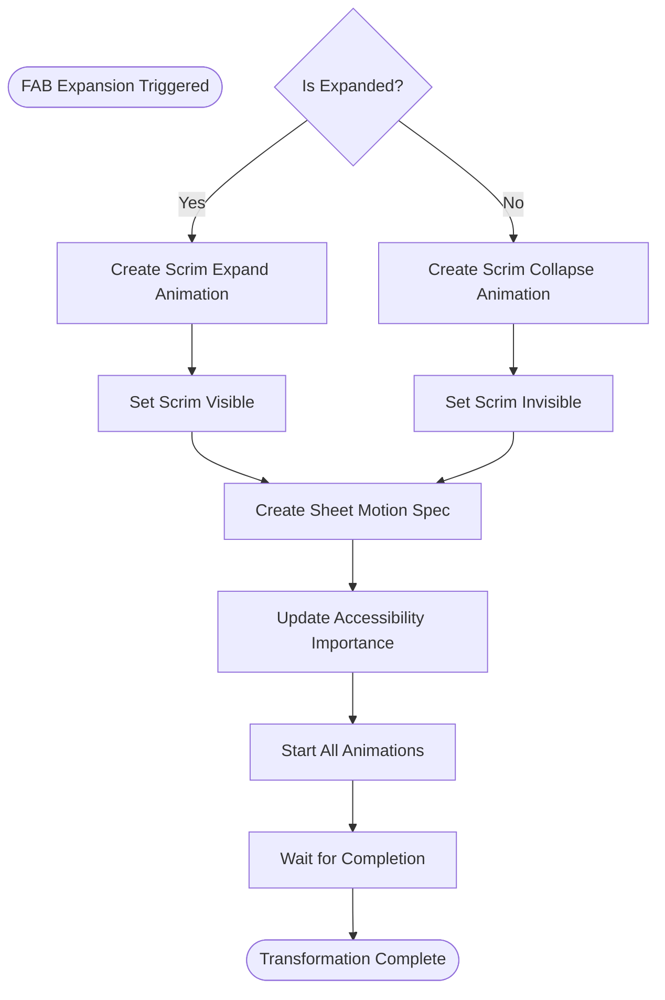

# Fab Transformation Behaviors Module

## Introduction

The `fab-transformation-behaviors` module provides specialized CoordinatorLayout behaviors for implementing Material Design floating action button (FAB) transformation animations. This module enables smooth transitions between FABs and expanded content containers like sheets or scrims, creating engaging user interface interactions that follow Material Design motion principles.

**Note**: This module is deprecated in favor of the newer [MaterialContainerTransform](transition.md#material-container-transform) transition system, which provides more flexible and powerful transformation capabilities.

## Core Components

### FabTransformationScrimBehavior

`FabTransformationScrimBehavior` implements a behavior for scrim views that appear as overlays when a FloatingActionButton is expanded. It manages the fade-in/fade-out animations of the scrim with precise timing control.

**Key Features:**
- Alpha-based fade animations with configurable timing
- Automatic visibility management during animations
- Touch event handling for scrim interaction
- Integration with FloatingActionButton expansion states

**Animation Timing:**
- Expand: 75ms delay, 150ms duration
- Collapse: 0ms delay, 150ms duration

### FabTransformationSheetBehavior

`FabTransformationSheetBehavior` extends the base transformation behavior to handle sheet-like containers that expand from FABs. It provides comprehensive accessibility management and positioning control for transformation sheets.

**Key Features:**
- Motion spec-based animations with predefined expand/collapse behaviors
- Automatic accessibility importance management for sibling views
- Center gravity positioning with offset support
- Integration with scrim behaviors for complete transformation experiences

## Architecture



## Component Relationships



## Data Flow



## Process Flow

### Transformation Animation Process



## Integration Patterns

### Basic Scrim Implementation

```xml
<androidx.coordinatorlayout.widget.CoordinatorLayout>
    <com.google.android.material.floatingactionbutton.FloatingActionButton
        android:id="@+id/fab"
        android:layout_width="wrap_content"
        android:layout_height="wrap_content"
        app:layout_anchor="@id/content" />
    
    <View
        android:layout_width="match_parent"
        android:layout_height="match_parent"
        android:background="#80000000"
        app:layout_behavior="com.google.android.material.transformation.FabTransformationScrimBehavior" />
</androidx.coordinatorlayout.widget.CoordinatorLayout>
```

### Sheet with Scrim Implementation

```xml
<androidx.coordinatorlayout.widget.CoordinatorLayout>
    <com.google.android.material.floatingactionbutton.FloatingActionButton
        android:id="@+id/fab"
        android:layout_width="wrap_content"
        android:layout_height="wrap_content" />
    
    <LinearLayout
        android:layout_width="match_parent"
        android:layout_height="wrap_content"
        android:background="?attr/colorSurface"
        android:elevation="8dp"
        app:layout_behavior="com.google.android.material.transformation.FabTransformationSheetBehavior">
        <!-- Sheet content -->
    </LinearLayout>
    
    <View
        android:layout_width="match_parent"
        android:layout_height="match_parent"
        android:background="#40000000"
        app:layout_behavior="com.google.android.material.transformation.FabTransformationScrimBehavior" />
</androidx.coordinatorlayout.widget.CoordinatorLayout>
```

## Key Dependencies

### Internal Dependencies
- **[ExpandableTransformationBehavior](transformation.md#expandable-transformation-behavior)**: Base class providing core transformation functionality
- **[FabTransformationBehavior](transformation.md#fab-transformation-behavior)**: Intermediate class for FAB-specific transformations
- **[MotionSpec](animation.md#motion-spec)**: Defines animation timing and properties
- **[MotionTiming](animation.md#motion-timing)**: Controls animation duration and delays
- **[AnimatorSetCompat](animation.md#animator-set-compat)**: Utility for managing animator sets

### External Dependencies
- **[FloatingActionButton](fab.md#floating-action-button)**: The trigger component for transformations
- **[CoordinatorLayout](appbar.md#coordinator-layout)**: The layout system that manages behaviors
- **Material Animation Resources**: Predefined animation specifications for consistent motion

## Accessibility Features

The `FabTransformationSheetBehavior` implements sophisticated accessibility management:

- **Automatic Focus Management**: Temporarily hides sibling views from accessibility services during transformation
- **State Preservation**: Stores and restores original accessibility importance values
- **Scrim Awareness**: Excludes scrim views from accessibility changes to maintain proper interaction patterns

## Migration Path

Since this module is deprecated, developers should migrate to the [MaterialContainerTransform](transition.md#material-container-transform) system:

1. **Replace Behaviors**: Remove CoordinatorLayout behaviors and implement transitions directly
2. **Update Animation Logic**: Use the new transition APIs for more control
3. **Maintain Accessibility**: Implement equivalent accessibility features in the new system
4. **Test Thoroughly**: Ensure transformation timing and interactions remain consistent

## Best Practices

### Performance Considerations
- Use hardware acceleration for smooth animations
- Minimize layout complexity in transformation targets
- Consider using `View.setLayerType()` for complex transformations

### Accessibility Guidelines
- Always provide meaningful content descriptions for transformed elements
- Ensure keyboard navigation works correctly during transformations
- Test with screen readers to verify proper focus management

### Design Consistency
- Follow Material Design motion guidelines for timing and easing
- Maintain visual continuity between FAB and expanded states
- Use appropriate elevation and shadow changes during transformation

## Related Documentation

- [Floating Action Button](fab.md) - Core FAB component documentation
- [Material Transitions](transition.md) - Modern transition system
- [Animation Utilities](animation.md) - Animation helper components
- [Transformation Containers](transformation-containers.md) - Container components for transformations