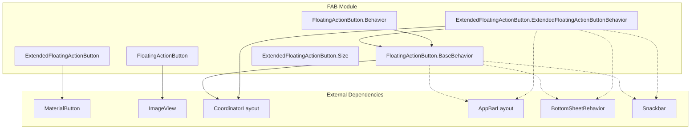

# FAB Module Documentation

## Overview

The FAB (Floating Action Button) module provides Material Design floating action button components for Android applications. This module implements the primary and extended floating action button patterns as defined in the Material Design specification, offering both visual appeal and functional behavior for promoted actions.

## Purpose

The FAB module serves as a cornerstone component for Material Design applications, providing:
- **Primary FAB**: A circular button that floats above the UI for the most important action
- **Extended FAB**: An elongated version that can display both icon and text
- **Behavior Integration**: Automatic positioning and animation coordination with other Material components
- **Accessibility Support**: Full accessibility features including proper role announcements

## Architecture



## Core Components

### 1. FloatingActionButton
The primary circular floating action button component that extends `ImageView` and provides the foundation for FAB functionality.

**Key Features:**
- Circular design with customizable size (mini/normal/auto)
- Icon-based representation with tint support
- Shadow and elevation effects
- Animation support for show/hide operations
- CoordinatorLayout behavior integration

**Core Responsibilities:**
- Visual rendering and styling
- Touch interaction handling
- Animation coordination
- State management
- Accessibility support

**Detailed Documentation:** [floating-action-button.md](floating-action-button.md)

### 2. ExtendedFloatingActionButton
An extended version of the FAB that can display both icon and text, providing more context for the action.

**Key Features:**
- Elongated design with text and icon support
- Extend/shrink animations
- Multiple sizing strategies (wrap content, match parent, auto)
- Text color management
- Enhanced behavior coordination

**Core Responsibilities:**
- Text and icon coordination
- Size transformation management
- Extended state handling
- Animation strategy implementation

**Detailed Documentation:** [extended-fab.md](extended-fab.md)

### 3. Behavior Components
Specialized CoordinatorLayout behaviors that handle FAB positioning and visibility based on other UI elements.

**FloatingActionButton.Behavior & BaseBehavior:**
- Automatic hiding when space is limited
- Snackbar avoidance
- AppBarLayout integration
- BottomSheetBehavior coordination

**ExtendedFloatingActionButton.ExtendedFloatingActionButtonBehavior:**
- Enhanced behavior with auto-shrink capability
- Priority-based show/hide vs extend/shrink decisions
- Advanced layout coordination

### 4. Size Interface
Defines the contract for size calculations in ExtendedFloatingActionButton transformations.

**Responsibilities:**
- Width and height calculations
- Padding management
- Layout parameter handling
- Size strategy implementation

## Key Features

### Animation System
Both FAB types support sophisticated animation systems:
- **Show/Hide Animations**: Smooth visibility transitions
- **Extend/Shrink Animations**: Size transformations for Extended FAB
- **Motion Specs**: Customizable animation specifications
- **Animation Callbacks**: Listener support for animation events

### Behavior Integration
The FAB module integrates seamlessly with other Material components:
- **AppBarLayout**: Automatic visibility based on scroll position
- **BottomSheetBehavior**: Coordination with bottom sheet states
- **Snackbar**: Automatic positioning to avoid obstruction
- **CoordinatorLayout**: Advanced layout and animation coordination

### Accessibility
Comprehensive accessibility support including:
- Proper role announcements
- Content descriptions
- Touch target sizing
- Keyboard navigation support

## Usage Patterns

### Basic FloatingActionButton
```xml
<com.google.android.material.floatingactionbutton.FloatingActionButton
    android:layout_width="wrap_content"
    android:layout_height="wrap_content"
    android:src="@drawable/ic_add"
    app:fabSize="normal" />
```

### ExtendedFloatingActionButton
```xml
<com.google.android.material.floatingactionbutton.ExtendedFloatingActionButton
    android:layout_width="wrap_content"
    android:layout_height="wrap_content"
    android:text="Create"
    android:src="@drawable/ic_add"
    app:iconGravity="textStart" />
```

## Integration with Other Modules

The FAB module has dependencies on several other Material Design modules:

- **[appbar](appbar.md)**: For scroll-based behavior coordination
- **[bottom-sheet](bottom-sheet.md)**: For bottom sheet interaction handling
- **[snackbar](snackbar.md)**: For automatic positioning
- **[animation](common-utils.md)**: For motion specifications and animations
- **[shape](shape.md)**: For customizable shape appearance
- **[theme](theme.md)**: For consistent theming support

## Design Considerations

### When to Use FAB
- Primary action in an activity
- Most important user action
- Action that needs to be prominently visible
- Contextual actions that appear based on user interaction

### Extended vs Regular FAB
- **Regular FAB**: Best for single, well-understood actions
- **Extended FAB**: Better when the action needs text explanation or when there are multiple related actions

### Behavior Guidelines
- FABs should auto-hide when content scrolls underneath
- Extended FABs should shrink to regular FABs when space is limited
- Both types should avoid obstructing important content like Snackbars

## Performance Considerations

- **Animation Performance**: Uses hardware acceleration for smooth animations
- **Memory Management**: Efficient state management and resource cleanup
- **Layout Performance**: Optimized layout calculations and minimal redraws
- **Touch Target**: Ensures minimum 48dp touch target size for accessibility

## Testing

The FAB module includes comprehensive testing support:
- **Unit Tests**: Core functionality and state management
- **Integration Tests**: Behavior coordination with other components
- **Accessibility Tests**: Screen reader and navigation support
- **Animation Tests**: Smooth and performant animations

## Future Enhancements

Potential areas for future development:
- Additional animation patterns
- Enhanced customization options
- Improved accessibility features
- Performance optimizations
- New behavior patterns