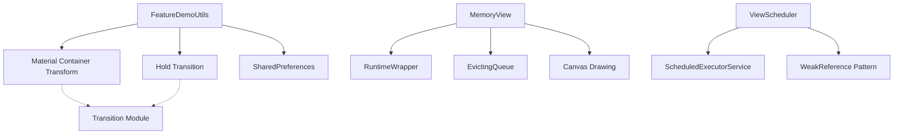
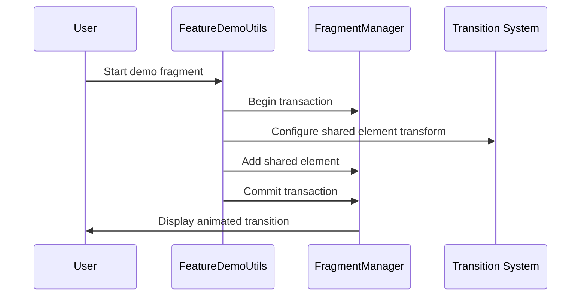
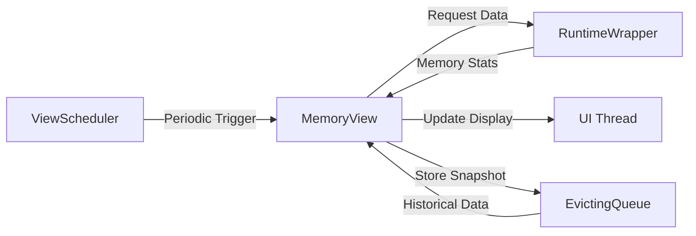

# Feature Module Documentation

## Introduction

The **Feature** module is a core component of the Material Design Catalog application that provides essential utilities and monitoring capabilities for demo functionality. This module serves as the foundation for managing feature demonstrations, memory monitoring, and view scheduling within the catalog application.

## Module Overview

The Feature module contains three primary components that work together to enhance the catalog application's demo experience:

1. **FeatureDemoUtils** - Fragment management and transition utilities
2. **MemoryView** - Real-time memory usage visualization
3. **ViewScheduler** - Periodic task scheduling for view updates

## Core Components

### FeatureDemoUtils

`FeatureDemoUtils` is a utility class that provides essential functionality for managing fragment transitions and navigation within the catalog application. It serves as the primary coordinator for demo presentation and user interaction flow.

#### Key Responsibilities:
- **Fragment Management**: Handles fragment transactions and navigation
- **Shared Element Transitions**: Manages Material Design container transforms with smooth animations
- **User Preferences**: Persists user preferences for default demo landing pages and specific demos
- **Transition Coordination**: Implements sophisticated transition patterns using Material Design motion principles

#### Architecture Integration:
The component integrates with the broader transition system through [Material Container Transforms](transition.md#container-transforms) and [Fade Through animations](transition.md#visibility-transitions), ensuring consistent motion design across the application.

### MemoryView

`MemoryView` is a specialized custom view that provides real-time memory usage monitoring with visual feedback. It extends `AppCompatTextView` to display both textual memory information and a graphical representation of memory consumption trends.

#### Key Features:
- **Real-time Monitoring**: Tracks application memory usage with configurable sampling
- **Visual Representation**: Draws memory usage charts using custom canvas drawing
- **Data Persistence**: Maintains a rolling window of memory snapshots for trend analysis
- **Adaptive Visualization**: Adjusts chart scaling based on memory usage patterns

#### Technical Implementation:
The component uses an `EvictingQueue` to maintain the last 5 memory snapshots, providing a balance between historical data and performance. The chart visualization amplifies differences to make memory trends more visible to developers.

### ViewScheduler

`ViewScheduler` provides periodic task execution capabilities with proper memory management. It uses a weak reference pattern to prevent memory leaks while ensuring reliable task execution.

#### Core Capabilities:
- **Periodic Execution**: Schedules tasks at fixed intervals using `ScheduledExecutorService`
- **Memory Safety**: Implements weak references to prevent context leaks
- **Lifecycle Management**: Provides proper task cancellation and cleanup
- **Thread Safety**: Uses single-threaded execution for predictable behavior

## Architecture and Design Patterns

### Dependency Management

The Feature module demonstrates several key architectural patterns:



### Data Flow Architecture



### Memory Monitoring Flow



## Integration with Material Design System

### Transition Integration

The Feature module seamlessly integrates with the Material Design transition system:

- **Container Transforms**: Uses `MaterialContainerTransform` for smooth fragment transitions
- **Fade Through**: Implements `Hold` transition to maintain visual continuity
- **Theme Integration**: Respects Material Design color schemes and theming

### Theming and Styling

Memory visualization adapts to the current theme by resolving `colorPrimary` from the active theme, ensuring visual consistency with the overall application design.

## Usage Patterns

### Fragment Navigation

```java
// Basic fragment navigation
FeatureDemoUtils.startFragment(activity, fragment, "demo_tag");

// With shared element transition
FeatureDemoUtils.startFragment(
    activity, 
    fragment, 
    "demo_tag",
    sharedElementView,
    "shared_element_name"
);
```

### Memory Monitoring

```java
// Setup memory monitoring
MemoryView memoryView = findViewById(R.id.memory_view);
ViewScheduler scheduler = new ViewScheduler();

// Start periodic monitoring
scheduler.start(() -> {
    memoryView.refreshMemStats(new MemoryView.RuntimeWrapper() {
        @Override
        public long maxMemory() {
            return Runtime.getRuntime().maxMemory();
        }
        
        @Override
        public long totalMemory() {
            return Runtime.getRuntime().totalMemory();
        }
        
        @Override
        public long freeMemory() {
            return Runtime.getRuntime().freeMemory();
        }
    });
}, 1000); // Update every second
```

## Performance Considerations

### Memory Management
- **Weak References**: Prevents memory leaks in scheduled tasks
- **Evicting Queue**: Limits memory snapshot history to prevent unbounded growth
- **Efficient Drawing**: Optimizes canvas drawing operations for real-time updates

### Thread Safety
- **Single Thread Executor**: Ensures predictable task execution
- **UI Thread Updates**: All UI updates are properly dispatched to the main thread
- **Cancellation Support**: Provides robust task cancellation mechanisms

## Testing and Mocking

The architecture supports comprehensive testing through:

- **RuntimeWrapper Interface**: Allows mocking of memory statistics for testing
- **Weak Reference Pattern**: Enables testing of memory leak scenarios
- **Configurable Scheduling**: Supports testing with different time intervals

## Related Modules

The Feature module interacts with several other catalog modules:

- **[Transition Module](transition.md)**: Provides animation and transition capabilities
- **[Theme Module](theme.md)**: Ensures consistent theming across components
- **[Application Module](application.md)**: Integrates with the overall application architecture

## Best Practices

### Fragment Management
- Always use `FeatureDemoUtils` for consistent fragment navigation
- Leverage shared element transitions for enhanced user experience
- Properly handle fragment lifecycle events

### Memory Monitoring
- Use appropriate sampling intervals to balance accuracy and performance
- Implement proper cleanup in activity/fragment lifecycle methods
- Consider memory monitoring impact on overall application performance

### Task Scheduling
- Always cancel scheduled tasks when views are destroyed
- Use appropriate polling intervals based on use case requirements
- Implement proper error handling for scheduled tasks

## Conclusion

The Feature module provides essential infrastructure for the Material Design Catalog application, offering robust fragment management, real-time memory monitoring, and reliable task scheduling. Its design emphasizes performance, memory safety, and seamless integration with the broader Material Design system, making it a foundational component for creating engaging and efficient demo experiences.