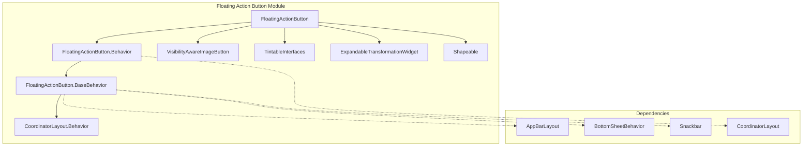
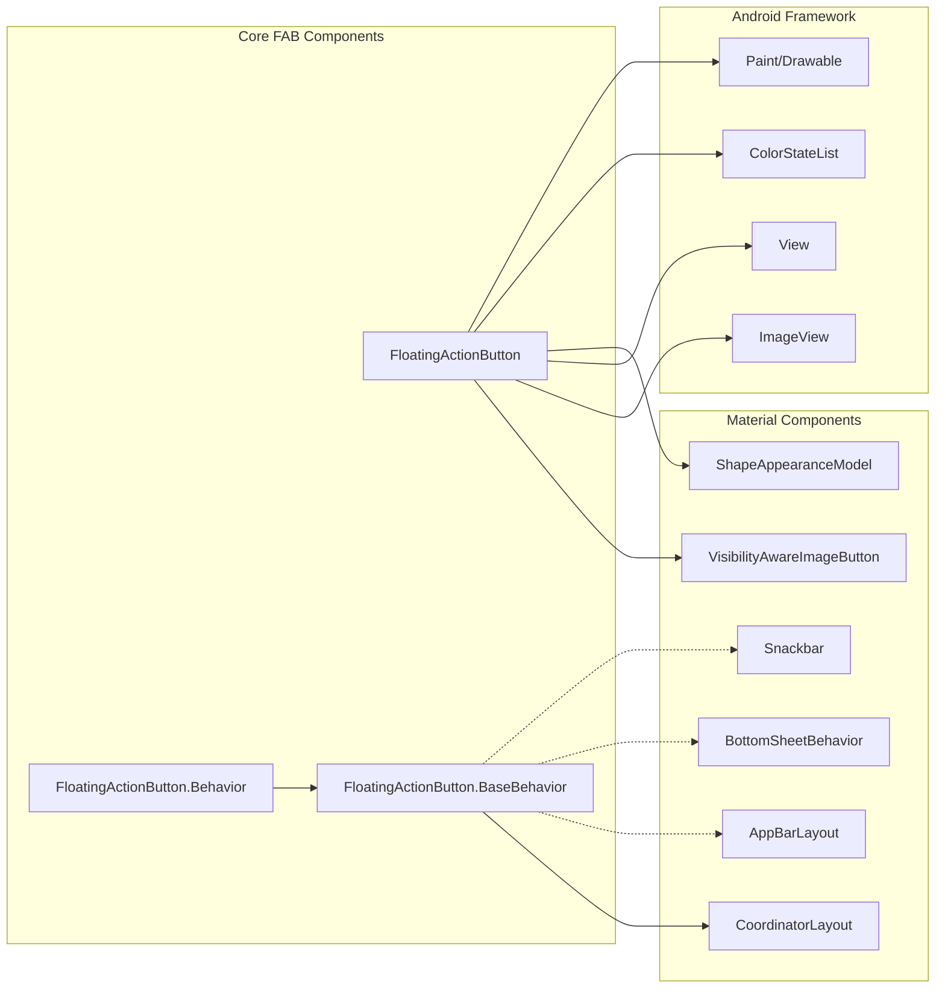
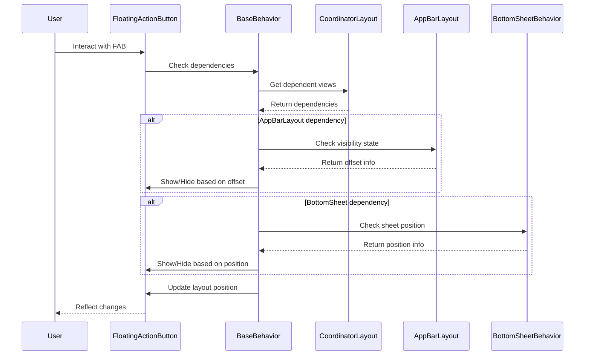
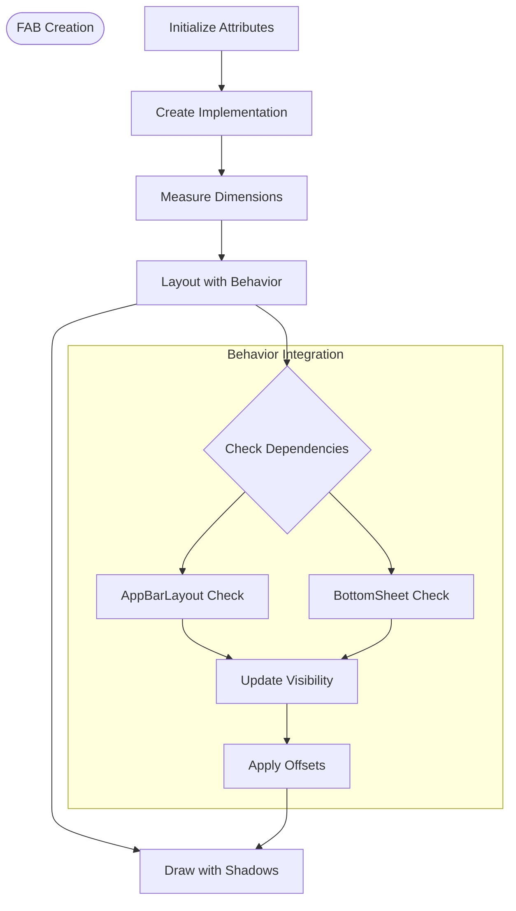

# Floating Action Button Module

The floating-action-button module provides Material Design floating action button components that offer primary actions in a distinctive circular button format. This module implements the core FloatingActionButton widget with sophisticated behavior integration for CoordinatorLayout environments.

## Overview

The FloatingActionButton (FAB) is a primary action component that floats above the UI, providing users with easy access to the most important action on a screen. The module includes the main FloatingActionButton class and specialized behaviors for integration with CoordinatorLayout, AppBarLayout, and BottomSheetBehavior.

## Core Components

### FloatingActionButton
The main widget class that extends VisibilityAwareImageButton and implements multiple interfaces for Material Design compliance:
- **TintableBackgroundView**: Supports background tinting
- **TintableImageSourceView**: Supports image tinting  
- **ExpandableTransformationWidget**: Supports expansion animations
- **Shapeable**: Supports custom shape appearance
- **CoordinatorLayout.AttachedBehavior**: Provides CoordinatorLayout integration

### Behavior Classes

#### FloatingActionButton.Behavior
A specialized CoordinatorLayout.Behavior designed for FloatingActionButton instances. This behavior:
- Automatically moves FABs to avoid covering Snackbar messages
- Integrates with AppBarLayout for auto-hide functionality
- Handles BottomSheetBehavior interactions
- Manages layout positioning and edge offsets

#### FloatingActionButton.BaseBehavior
The base behavior class that provides core functionality:
- Auto-hide logic based on available space
- AppBarLayout visibility coordination
- BottomSheet interaction handling
- Layout positioning with shadow padding consideration

## Architecture



## Component Relationships



## Data Flow



## Key Features

### Size Management
- **SIZE_NORMAL**: 56dp standard size
- **SIZE_MINI**: 40dp mini size  
- **SIZE_AUTO**: Automatically selects size based on screen dimensions
- **Custom sizing**: Support for arbitrary pixel dimensions

### Visual Customization
- Background tinting with ColorStateList support
- Image tinting capabilities
- Ripple color customization
- Border width configuration
- Shape appearance modeling
- Elevation and translation Z properties

### Behavior Integration
- Automatic hiding when space is insufficient
- Snackbar avoidance positioning
- AppBarLayout scroll coordination
- BottomSheet interaction handling
- CoordinatorLayout edge positioning

### Animation Support
- Show/hide motion specifications
- Transformation callbacks
- Scale and translation change notifications
- Animation listener management

## Process Flow



## Integration with Other Modules

### AppBar Integration
The FloatingActionButton behavior automatically coordinates with [appbar](appbar.md) components:
- Monitors AppBarLayout scroll offset
- Hides FAB when AppBarLayout is collapsed
- Shows FAB when AppBarLayout is expanded

### Bottom Sheet Integration  
Coordinates with [bottom-sheet](bottom-sheet.md) behavior:
- Monitors BottomSheet position
- Hides FAB when sheet overlaps
- Shows FAB when sheet is dismissed

### Snackbar Integration
Automatically positions to avoid [snackbar](snackbar.md) messages:
- Detects Snackbar display
- Applies appropriate offset
- Returns to original position after dismissal

### Shape System Integration
Utilizes [shape](shape.md) module for appearance:
- ShapeAppearanceModel for custom shapes
- Pill shape as default configuration
- Support for custom shape transformations

## Usage Patterns

### Basic Implementation
```xml
<androidx.coordinatorlayout.widget.CoordinatorLayout>
    <com.google.android.material.floatingactionbutton.FloatingActionButton
        android:layout_width="wrap_content"
        android:layout_height="wrap_content"
        android:src="@drawable/ic_add"
        app:layout_anchor="@id/appBarLayout"
        app:layout_anchorGravity="bottom|end" />
</androidx.coordinatorlayout.widget.CoordinatorLayout>
```

### With Auto-Hide Behavior
```xml
<com.google.android.material.floatingactionbutton.FloatingActionButton
    app:layout_behavior="com.google.android.material.floatingactionbutton.FloatingActionButton$Behavior"
    app:behavior_autoHide="true" />
```

## Technical Implementation Details

### Shadow Management
The FAB implements sophisticated shadow handling:
- Pre-Lollipop shadow padding for compatibility
- Shadow padding calculation and offset
- Edge positioning with shadow consideration
- Touch target adjustment for accessibility

### Touch Target Compliance
- Minimum touch target size enforcement
- Automatic expansion when needed
- Configurable via `ensureMinTouchTargetSize` attribute
- Touch area calculation including shadow bounds

### State Management
- Expandable widget state preservation
- Visibility state handling
- Animation state coordination
- SavedState implementation for configuration changes

## Performance Considerations

### Optimization Strategies
- Lazy initialization of implementation objects
- Efficient dependency checking in behaviors
- Minimal layout passes through careful measurement
- Shadow padding reuse and caching

### Memory Management
- Drawable resource cleanup
- Animation listener management
- State object recycling
- Touch area rect reuse

## Accessibility

### Accessibility Features
- Custom accessibility class name
- Touch target size compliance
- Content description support
- State change announcements
- Keyboard navigation support

### Compliance Standards
- Minimum 48dp touch target size
- Proper content labeling
- Focus management
- Screen reader compatibility

## Related Documentation

- [AppBar Layout](appbar.md) - For scroll coordination behavior
- [Bottom Sheet](bottom-sheet.md) - For sheet interaction patterns  
- [Snackbar](snackbar.md) - For message display coordination
- [Shape System](shape.md) - For custom appearance modeling
- [CoordinatorLayout](coordinatorlayout.md) - For layout behavior framework

## API Reference

For detailed API documentation, refer to the official Material Design Components documentation for FloatingActionButton and related behavior classes.