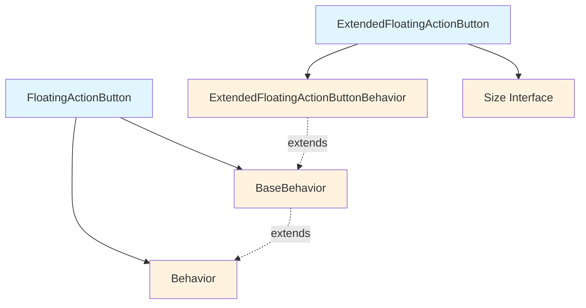
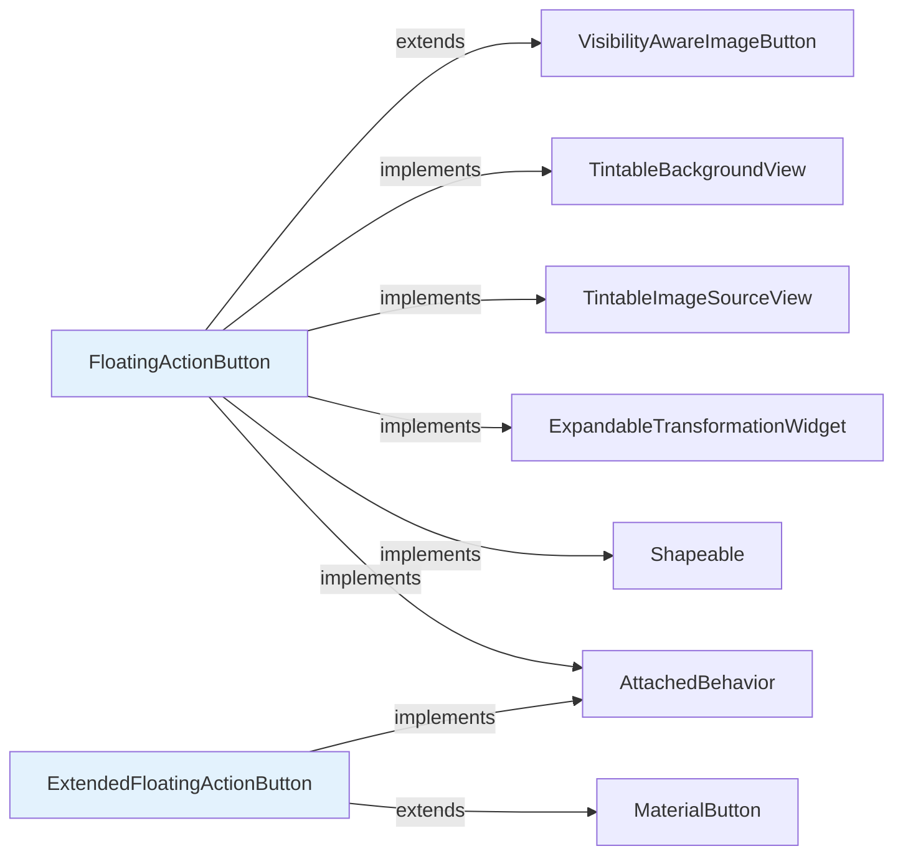
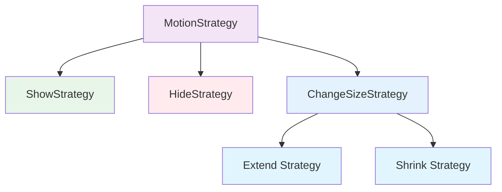
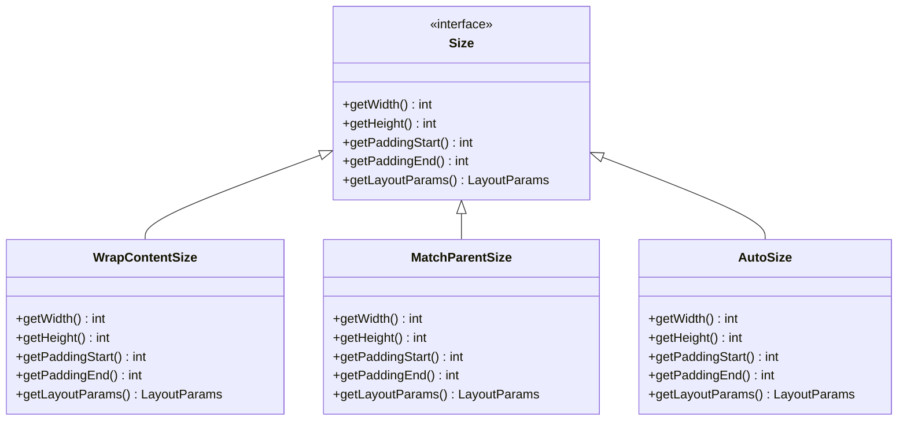
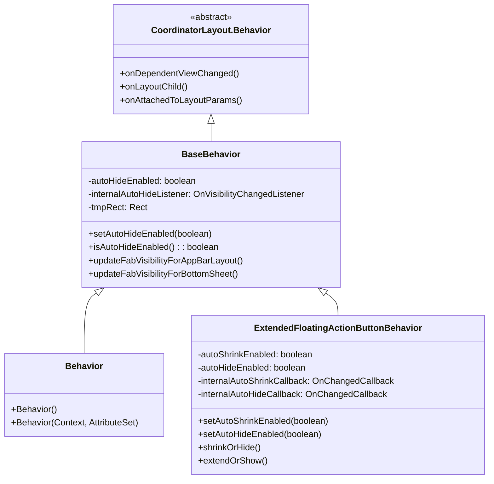
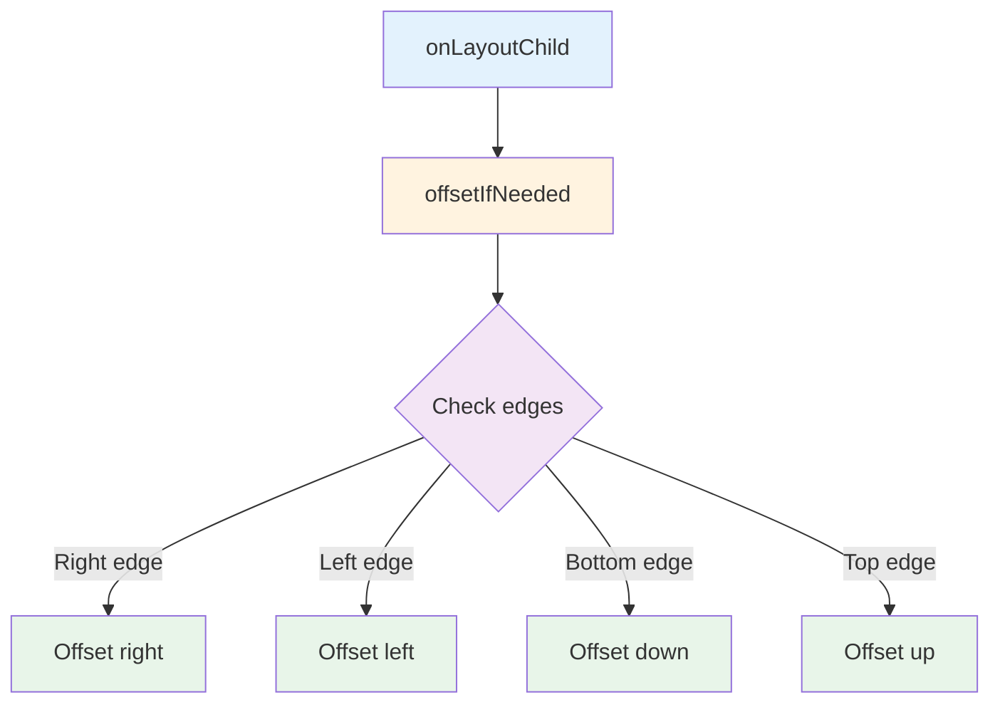
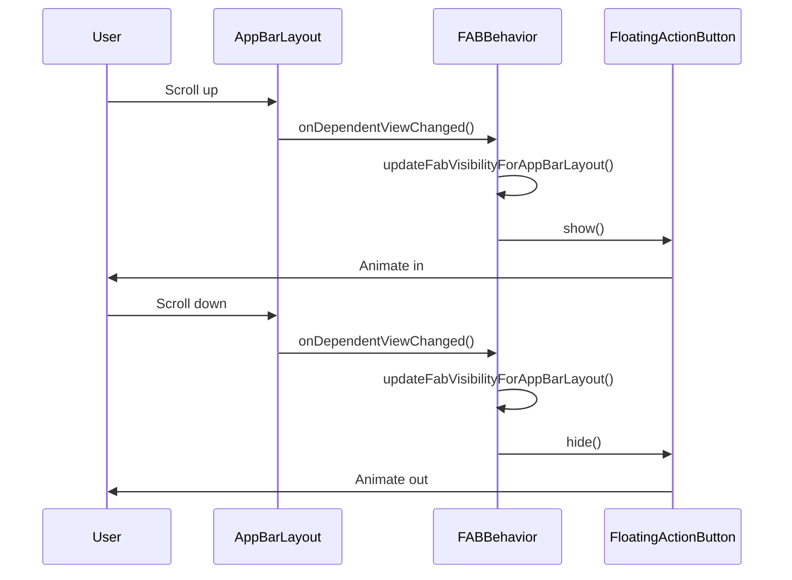
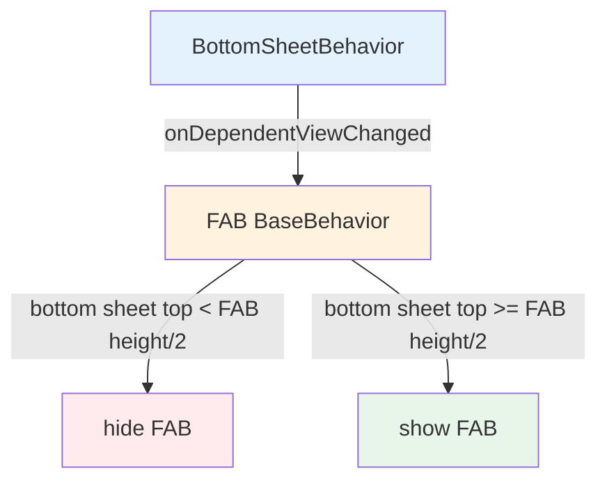

# FloatingActionButton Module Documentation

## Overview

The FloatingActionButton (FAB) module is a core component of the Material Design Components library for Android, providing floating action buttons that represent the primary action on a screen. The module implements both standard circular FABs and ExtendedFloatingActionButtons that can display both icons and text.

## Purpose

Floating action buttons are used for special types of promoted actions that are distinguished by their circular or extended shape floating above the UI. They have special motion behaviors related to morphing, launching, and transferring anchor points, making them a key element in Material Design's action hierarchy.

## Architecture

The module is structured around two main components that work together to provide a complete FAB implementation:

### Core Components



### Component Relationships



## Key Features

### FloatingActionButton
- **Circular Design**: Standard circular floating action button
- **Size Variants**: Supports mini (40dp), normal (56dp), and auto-sizing modes
- **Behavior Integration**: Automatic hiding/showing based on scroll behavior
- **Animation Support**: Smooth show/hide animations with customizable motion specs
- **CoordinatorLayout Integration**: Works seamlessly with AppBarLayout and BottomSheetBehavior

### ExtendedFloatingActionButton
- **Extended Design**: Rectangular FAB that can display both icon and text
- **Morphing Capabilities**: Can shrink to icon-only or extend to show full content
- **Size Strategies**: Auto, wrap content, and match parent sizing options
- **Text Integration**: Full text styling and color management
- **Advanced Behaviors**: Auto-hide and auto-shrink based on available space

## Motion Strategies

Both FAB types implement sophisticated motion strategies for different state transitions:



### Strategy Implementation

The motion strategies are implemented as inner classes within ExtendedFloatingActionButton:

- **ShowStrategy**: Handles visibility transitions from GONE to VISIBLE with alpha and scale animations
- **HideStrategy**: Manages visibility transitions from VISIBLE to GONE with reverse animations
- **ChangeSizeStrategy**: Controls size morphing between extended and collapsed states
  - **Extend Strategy**: Expands FAB to show both icon and text
  - **Shrink Strategy**: Collapses FAB to icon-only state

## Size Interface Architecture

The ExtendedFloatingActionButton uses a Size interface to abstract different sizing strategies:



### Size Strategy Selection

The extend strategy type determines which Size implementation is used:

- **EXTEND_STRATEGY_WRAP_CONTENT**: Uses WrapContentSize for content-based sizing
- **EXTEND_STRATEGY_MATCH_PARENT**: Uses MatchParentSize for full-width expansion
- **EXTEND_STRATEGY_AUTO**: Uses AutoSize for intelligent sizing based on original dimensions

## Behavior System Architecture

The FAB module implements a sophisticated behavior system that extends CoordinatorLayout.Behavior to provide automatic positioning and visibility management:

### BaseBehavior Class Structure



### Behavior Configuration

The behavior system supports several configuration options:

- **Auto-hide**: Automatically hides FAB when space is limited
- **Auto-shrink**: Extended FAB can shrink to icon-only state
- **Dependency tracking**: Monitors AppBarLayout and BottomSheetBehavior changes
- **Layout coordination**: Works with CoordinatorLayout's dependency system

### Shadow and Padding Management

The behavior system also handles shadow padding for pre-Lollipop compatibility:



## Integration with Other Modules

The FAB module integrates with several other Material Design components:

### AppBarLayout Integration
The FAB behavior system automatically coordinates with AppBarLayout to show/hide the FAB based on scroll position:



### BottomSheetBehavior Integration
Similar coordination occurs with BottomSheetBehavior:



### Snackbar Integration
The FAB automatically dodges Snackbar notifications through CoordinatorLayout's dodge inset system:

- **[AppBarLayout](appbar.md)**: Coordinates visibility based on app bar scroll state
- **[BottomSheetBehavior](bottomsheet.md)**: Adjusts position based on bottom sheet state
- **[Snackbar](snackbar.md)**: Automatically dodges snackbar notifications
- **[MaterialButton](button.md)**: Extended FAB inherits from MaterialButton

## Usage Patterns

### Basic FloatingActionButton
```xml
<com.google.android.material.floatingactionbutton.FloatingActionButton
    android:layout_width="wrap_content"
    android:layout_height="wrap_content"
    android:src="@drawable/ic_add"
    app:fabSize="normal" />
```

### ExtendedFloatingActionButton
```xml
<com.google.android.material.floatingactionbutton.ExtendedFloatingActionButton
    android:layout_width="wrap_content"
    android:layout_height="wrap_content"
    android:text="Create"
    app:icon="@drawable/ic_add"
    app:extendStrategy="auto" />
```

## Behavior Configuration

Both FAB types support automatic behavior configuration through XML attributes and programmatic APIs:

- **Auto-hide**: Automatically hides when space is limited
- **Auto-shrink**: Shrinks to icon-only when space is limited (Extended FAB only)
- **Motion specs**: Customizable animation specifications for all transitions
- **Touch target size**: Configurable minimum touch target dimensions

## Accessibility

The module provides comprehensive accessibility support:

- Proper content descriptions and roles
- Touch target sizing for better accessibility
- Screen reader compatibility
- Keyboard navigation support

## Performance Considerations

- **Shadow rendering**: Optimized shadow drawing with compatibility padding
- **Animation performance**: Hardware-accelerated animations with proper lifecycle management
- **Memory efficiency**: Efficient state management and resource cleanup
- **Layout optimization**: Minimal layout passes during animations

## Customization

The module supports extensive customization options:

- **Shape appearance**: Customizable corner radius and shape models
- **Color theming**: Full support for Material theming and color schemes
- **Elevation**: Configurable elevation and translation Z values
- **Ripple effects**: Customizable ripple colors and behaviors
- **Motion specs**: Custom animation curves and timing

This documentation provides a comprehensive overview of the FloatingActionButton module's architecture, features, and integration capabilities within the Material Design Components ecosystem.