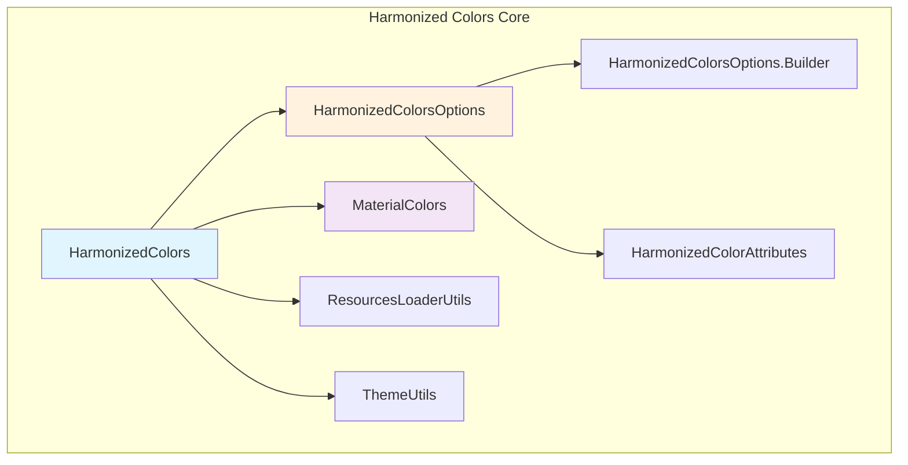
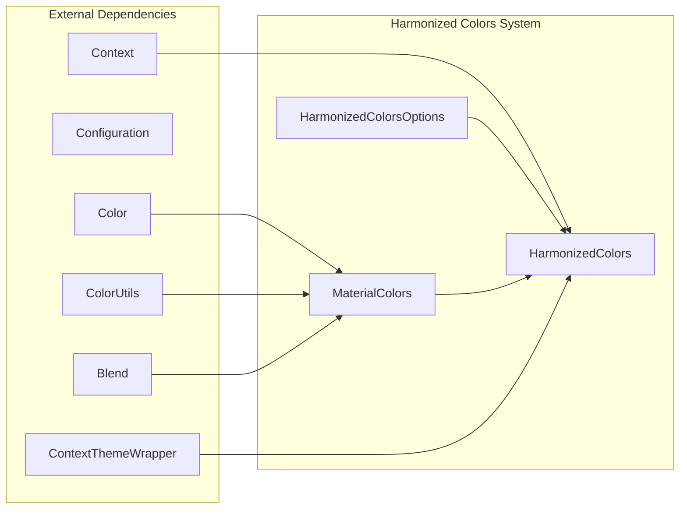
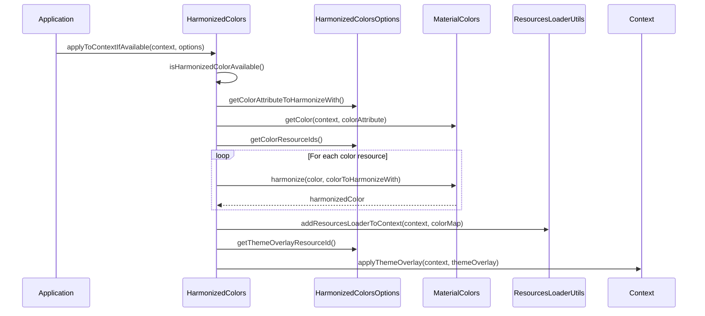
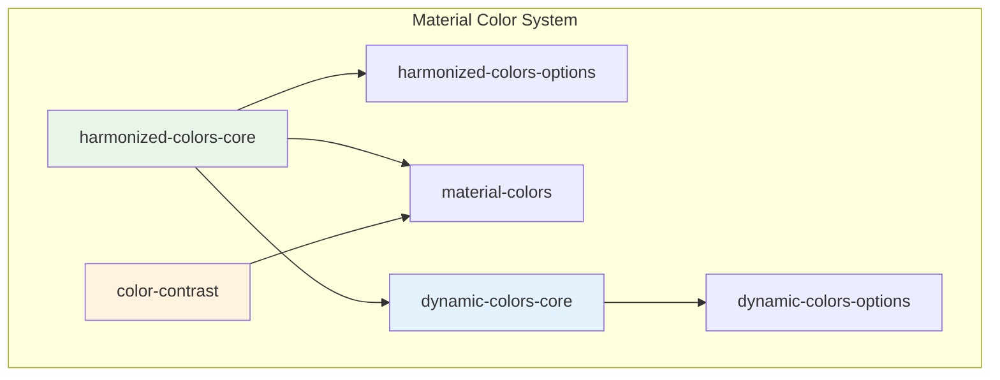
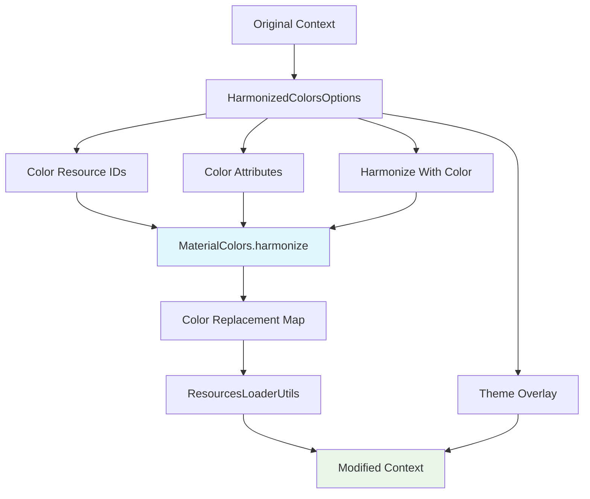

# Harmonized Colors Core Module

## Introduction

The harmonized-colors-core module provides the foundational functionality for implementing Material Design 3's color harmonization system. This module enables dynamic color harmonization across Android applications, ensuring visual consistency by automatically adjusting color palettes to work harmoniously with system accent colors or custom primary colors.

## Overview

Color harmonization is a core principle of Material Design 3 that creates visually cohesive interfaces by ensuring colors work together in a balanced way. The harmonized-colors-core module implements this concept by providing runtime color harmonization capabilities that can adapt existing color resources to complement primary accent colors, creating a more unified and polished visual experience.

## Core Architecture

### Primary Components



### Component Relationships



## Core Functionality

### HarmonizedColors Class

The `HarmonizedColors` class serves as the main entry point for color harmonization functionality. It provides static methods for applying color harmonization to Android contexts and resources.

#### Key Capabilities:

1. **Runtime Color Harmonization**: Harmonizes color resources and attributes at runtime
2. **Context Wrapping**: Creates new contexts with harmonized colors while preserving original resources
3. **Resource Replacement**: Uses Android's ResourcesLoader API to override color values
4. **Theme Integration**: Applies theme overlays alongside color harmonization

#### Core Methods:

- `applyToContextIfAvailable()`: Directly applies harmonization to an existing context
- `wrapContextIfAvailable()`: Creates a new context with harmonized colors
- `isHarmonizedColorAvailable()`: Checks device compatibility (API 30+)

### Color Harmonization Process



## Integration with Material Design System

### Relationship with Other Color Modules



### Color Harmonization Algorithm

The harmonization process uses the `MaterialColors.harmonize()` method, which implements a color blending algorithm that adjusts the hue of colors to create visual harmony while preserving their essential characteristics:

1. **Color Space Conversion**: Converts colors to HCT (Hue, Chroma, Tone) color space
2. **Hue Harmonization**: Adjusts the hue component to create visual harmony
3. **Preservation**: Maintains chroma and tone to preserve color identity
4. **Conversion**: Converts back to RGB for display

## Usage Patterns

### Basic Color Harmonization

```java
// Harmonize specific color resources with the primary color
int[] colorResources = {R.color.accent_color, R.color.secondary_color};
HarmonizedColorsOptions options = new HarmonizedColorsOptions.Builder()
    .setColorResourceIds(colorResources)
    .setColorAttributeToHarmonizeWith(R.attr.colorPrimary)
    .build();

// Apply harmonization to current context
HarmonizedColors.applyToContextIfAvailable(context, options);
```

### Context Wrapping

```java
// Create a new context with harmonized colors
Context harmonizedContext = HarmonizedColors.wrapContextIfAvailable(context, options);
// Use harmonizedContext for inflation or color retrieval
```

## Technical Requirements

### API Level Support
- **Minimum API**: 30 (Android 11)
- **Rationale**: Uses Android's ResourcesLoader API introduced in API 30

### Dependencies
- MaterialColors utility class for color operations
- ResourcesLoaderUtils for resource override functionality
- ThemeUtils for theme overlay application

## Data Flow Architecture



## Error Handling and Compatibility

### Graceful Degradation
- Automatically detects API level compatibility
- Returns original context if harmonization is unavailable
- No-op behavior on unsupported devices

### Resource Protection
- Preserves original context resources when wrapping
- Uses configuration overrides to create isolated resource sets
- Implements proper resource cleanup and recycling

## Performance Considerations

### Memory Management
- Creates minimal object instances during harmonization
- Reuses TypedArray instances where possible
- Implements proper resource recycling

### Processing Efficiency
- Batch processes color resources in single pass
- Uses efficient color space conversions
- Minimizes context creation overhead

## Testing and Validation

### Compatibility Testing
- API level compatibility verification
- Resource loading behavior validation
- Theme overlay application testing

### Visual Validation
- Color harmonization accuracy verification
- Theme consistency validation
- Cross-device compatibility testing

## Future Considerations

### Potential Enhancements
- Extended color space support
- Advanced harmonization algorithms
- Performance optimization for large color sets
- Integration with system dynamic colors

### API Evolution
- Backward compatibility maintenance
- Progressive enhancement capabilities
- Extended customization options

## Related Documentation

- [harmonized-colors-options.md](harmonized-colors-options.md) - Configuration options for color harmonization
- [material-colors.md](material-colors.md) - Core color utilities and operations
- [dynamic-colors-core.md](dynamic-colors-core.md) - System dynamic color integration
- [color-contrast.md](color-contrast.md) - Color contrast and accessibility features