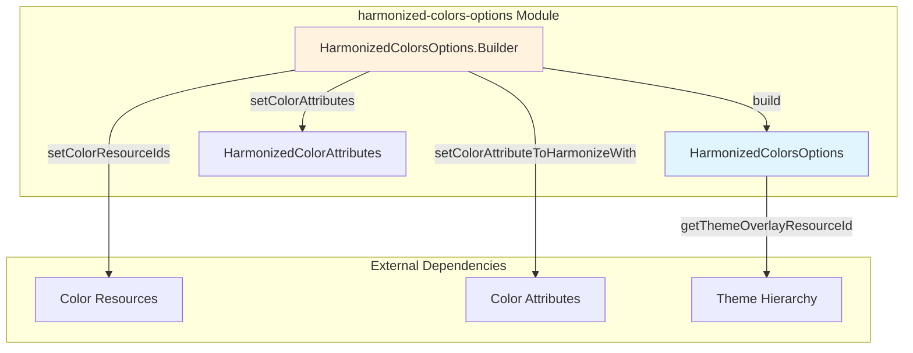
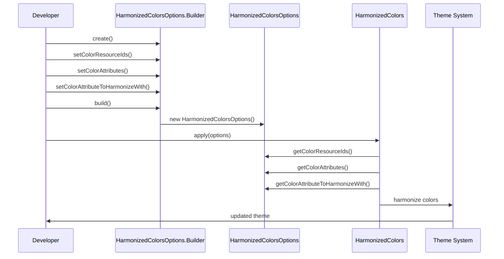
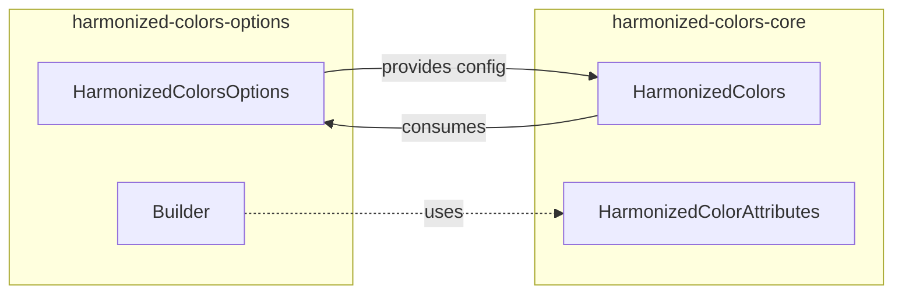
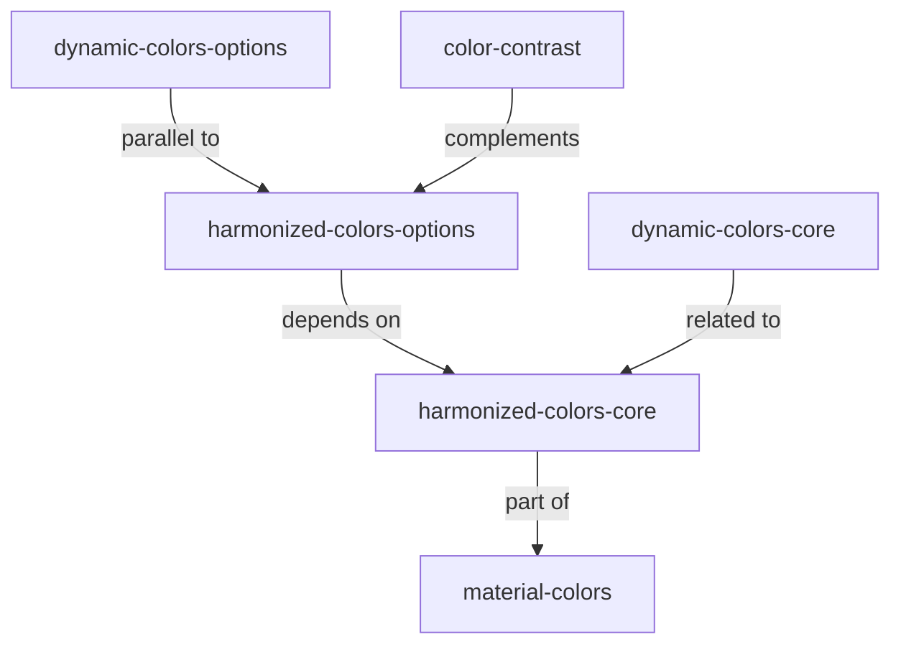
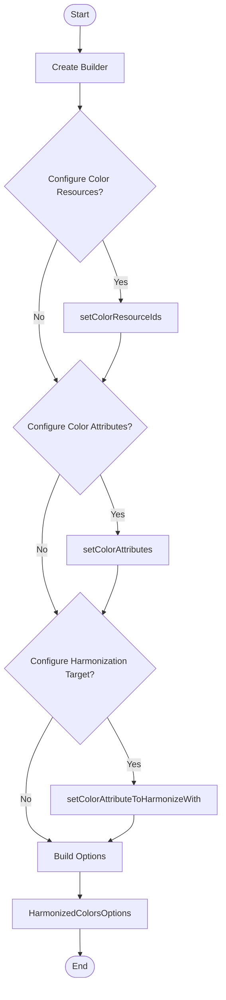
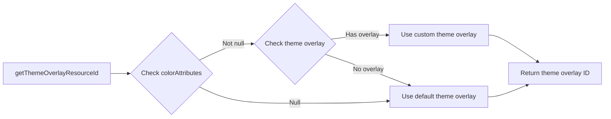

# Harmonized Colors Options Module

## Introduction

The harmonized-colors-options module provides configuration and customization capabilities for the Material Design color harmonization system. It enables developers to define how colors should be harmonized with primary theme colors, ensuring visual consistency across Android applications. This module serves as the configuration layer for the broader color harmonization functionality within the Material Design Components library.

## Module Overview

The harmonized-colors-options module is a specialized configuration module that works in conjunction with the [harmonized-colors-core](harmonized-colors-core.md) module to provide fine-grained control over color harmonization processes. It offers a builder pattern implementation for creating harmonization configurations that can be applied to color resources and color attributes throughout an application.

## Core Architecture

### Primary Components

#### HarmonizedColorsOptions.Builder
The central component of this module is the `HarmonizedColorsOptions.Builder` class, which implements the builder pattern to create immutable `HarmonizedColorsOptions` instances. This builder provides a fluent API for configuring:

- **Color Resource Arrays**: Sets of color resources to be harmonized
- **Color Attributes**: HarmonizedColorAttributes objects for advanced harmonization
- **Harmonization Target**: The primary color attribute to harmonize against (defaults to `colorPrimary`)

### Architecture Diagram

## Data Flow Architecture

## Component Relationships

### Integration with Harmonized Colors Core

The harmonized-colors-options module works closely with the [harmonized-colors-core](harmonized-colors-core.md) module:

### Module Dependencies

## Configuration Options

### Color Resource Harmonization
The module allows developers to specify arrays of color resource IDs that should be harmonized with the primary theme color. This is useful for harmonizing specific color palettes or custom color sets.

### Color Attribute Harmonization
Through integration with `HarmonizedColorAttributes`, the module supports harmonization of color attributes, which provides more granular control over which specific theme attributes should be harmonized.

### Harmonization Target
Developers can specify which color attribute should serve as the harmonization target, with `colorPrimary` as the default. This allows for different harmonization strategies based on the design requirements.

## Process Flow

### Configuration Creation Process

### Theme Overlay Resolution

## Usage Patterns

### Material Defaults
The module provides a convenience method `createMaterialDefaults()` that creates a pre-configured options instance with Material Design default harmonization settings, particularly for harmonizing error colors with primary colors.

### Custom Configuration
Developers can create custom configurations by:
1. Instantiating a new `Builder`
2. Setting color resources or attributes to harmonize
3. Optionally specifying a custom harmonization target
4. Building the final options object

## Integration Points

### Theme System Integration
The module integrates with Android's theme system through the `getThemeOverlayResourceId()` method, which determines the appropriate theme overlay resource based on the configured color attributes.

### Color Harmonization Pipeline
The options created by this module serve as input to the color harmonization pipeline implemented in the [harmonized-colors-core](harmonized-colors-core.md) module, providing the necessary configuration for the harmonization algorithms.

## Best Practices

1. **Use Material Defaults**: For standard Material Design applications, use `createMaterialDefaults()` for consistent behavior
2. **Selective Harmonization**: Only harmonize colors that need to maintain visual harmony with the primary theme
3. **Performance Consideration**: Minimize the number of color resources being harmonized in a single operation
4. **Theme Consistency**: Ensure harmonization targets align with your overall theme strategy

## Related Modules

- [harmonized-colors-core](harmonized-colors-core.md) - Core harmonization implementation
- [dynamic-colors-options](dynamic-colors-options.md) - Dynamic color configuration options
- [color-contrast](color-contrast.md) - Color contrast utilities
- [material-colors](material-colors.md) - Material color system

## API Reference

### HarmonizedColorsOptions
- `createMaterialDefaults()` - Creates default Material Design harmonization options
- `getColorResourceIds()` - Returns configured color resource IDs
- `getColorAttributes()` - Returns configured color attributes
- `getColorAttributeToHarmonizeWith()` - Returns harmonization target attribute

### HarmonizedColorsOptions.Builder
- `setColorResourceIds(int[])` - Sets color resources to harmonize
- `setColorAttributes(HarmonizedColorAttributes)` - Sets color attributes to harmonize
- `setColorAttributeToHarmonizeWith(int)` - Sets harmonization target
- `build()` - Creates HarmonizedColorsOptions instance