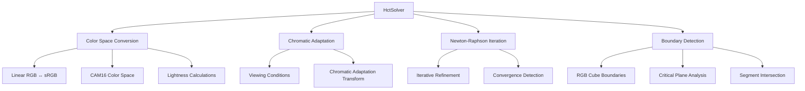
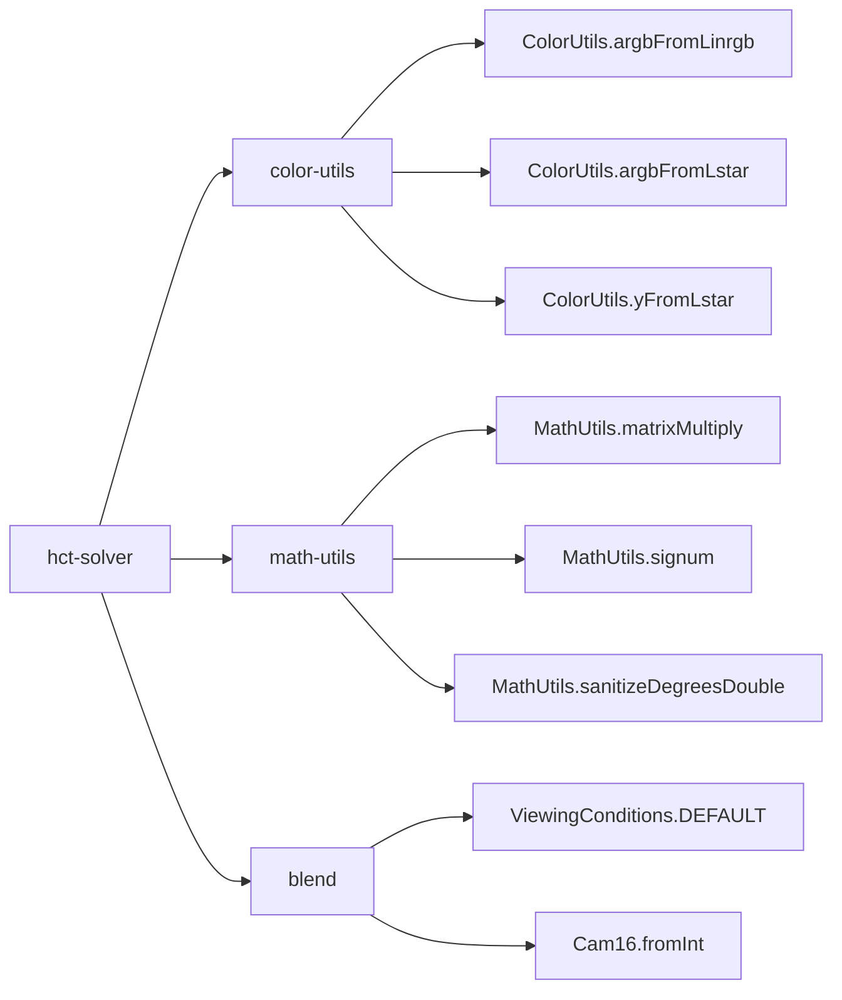
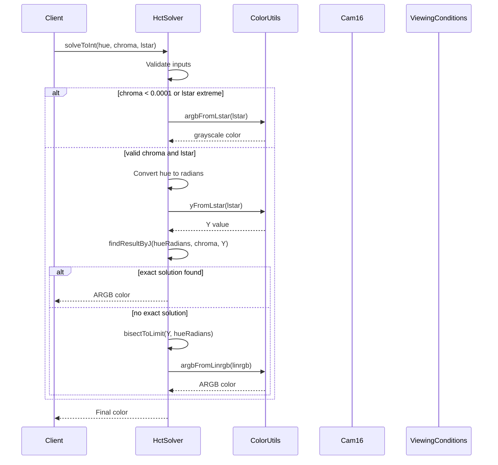
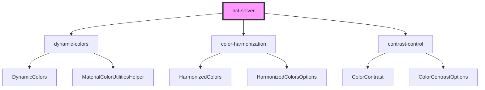

# HCT Solver Module

## Introduction

The HCT (Hue, Chroma, Tone) Solver module is a specialized color utility component within the Material Design Components library that provides advanced color space calculations. It implements a sophisticated algorithm to find optimal sRGB colors that match specified hue, chroma, and lightness (L*) values, serving as a critical component in Material Design's dynamic color system.

## Overview

The HCT Solver module is part of the larger [color-utilities](color-utilities.md) ecosystem and provides the mathematical foundation for converting between different color spaces while maintaining perceptual accuracy. It solves complex color equations to ensure that colors generated or transformed through the Material Design system remain visually consistent and accessible.

## Architecture

### Core Component Structure



### Module Dependencies



## Core Functionality

### Primary Methods

#### `solveToInt(double hueDegrees, double chroma, double lstar)`
- **Purpose**: Finds an sRGB color with specified hue, chroma, and lightness
- **Parameters**: 
  - `hueDegrees`: Desired hue in degrees (0-360)
  - `chroma`: Desired chroma value
  - `lstar`: Desired lightness (L*) value (0-100)
- **Returns**: ARGB hexadecimal color value
- **Behavior**: Returns color with exact specifications if possible; otherwise maximizes chroma while maintaining hue and lightness

#### `solveToCam(double hueDegrees, double chroma, double lstar)`
- **Purpose**: Similar to `solveToInt` but returns a CAM16 color object
- **Returns**: CAM16 object representing the solved color
- **Usage**: Provides access to additional color space information

### Internal Algorithm Components

#### 1. Color Space Transformation Matrices
```java
SCALED_DISCOUNT_FROM_LINRGB // Linear RGB to scaled discount matrix
LINRGB_FROM_SCALED_DISCOUNT // Inverse transformation matrix
Y_FROM_LINRGB              // Luminance extraction coefficients
```

#### 2. Critical Planes System
- Pre-calculated boundary values for RGB cube intersection
- 256 discrete planes for efficient boundary detection
- Enables precise color gamut mapping

#### 3. Chromatic Adaptation
- Implements CIECAM02 chromatic adaptation transform
- Handles viewing condition adjustments
- Maintains color appearance consistency across different environments

## Data Flow



## Mathematical Operations

### Newton-Raphson Iteration
The solver employs a customized Newton-Raphson method for finding optimal J (lightness) values:

```
j_new = j_old - (fnj - y) * j_old / (2 * fnj)
```

Where:
- `fnj` is the current Y value calculation
- `y` is the target Y value
- The derivative approximation is `2 * fnj / j`

### Boundary Detection Algorithm
1. **Vertex Generation**: Creates 12 potential vertices for RGB cube intersection
2. **Segment Identification**: Uses hue-based cyclic ordering to find relevant color segments
3. **Bisection Method**: Refines solutions within identified segments
4. **Critical Plane Analysis**: Maps solutions to valid RGB boundaries

## Integration with Material Design System

### Usage in Dynamic Colors
The HCT Solver is fundamental to Material Design's dynamic color extraction system:

1. **Seed Color Processing**: Converts extracted colors to HCT space
2. **Harmonization**: Ensures color relationships maintain perceptual consistency
3. **Accessibility**: Guarantees sufficient contrast ratios while preserving hue relationships
4. **Tone Mapping**: Creates cohesive color palettes across different tonal ranges

### Relationship to Other Color Modules



## Performance Considerations

### Optimization Strategies
1. **Pre-computed Matrices**: Transformation matrices are static final constants
2. **Critical Planes**: 256 pre-calculated boundary values eliminate runtime computation
3. **Iterative Limit**: Maximum 5 iterations in Newton-Raphson method
4. **Early Termination**: Convergence check with 0.002 tolerance threshold

### Memory Efficiency
- No instance variables (static utility class)
- Minimal object allocation during computation
- Reusable arrays for matrix operations

## Error Handling

### Input Validation
- Handles edge cases for zero chroma or extreme lightness values
- Sanitizes hue values to 0-360 degree range
- Returns grayscale colors for invalid chroma/lightness combinations

### Fallback Mechanisms
- When exact solutions are impossible, maximizes chroma within constraints
- Returns 0 (invalid) for colors outside RGB gamut
- Provides bounded solutions within displayable color space

## API Usage Examples

### Basic Color Generation
```java
// Generate a color with specific HCT values
int color = HctSolver.solveToInt(180.0, 50.0, 70.0);
// Returns ARGB color with hue=180°, chroma=50, L*=70
```

### Advanced Color Manipulation
```java
// Get CAM16 object for additional color information
Cam16 camColor = HctSolver.solveToCam(270.0, 30.0, 45.0);
// Access hue, chroma, and other CAM16 properties
```

## Testing and Validation

The HCT Solver module includes comprehensive validation to ensure:
- Color accuracy within perceptual tolerance
- Consistency across different viewing conditions
- Proper handling of edge cases and boundary conditions
- Performance benchmarks for real-time applications

## References

- [color-utilities](color-utilities.md) - Parent module containing HCT Solver
- [math-utils](math-utils.md) - Mathematical utility functions
- [blend](blend.md) - Color blending operations
- [dynamic-colors](dynamic-colors.md) - Dynamic color system implementation
- [color-harmonization](color-harmonization.md) - Color harmonization algorithms