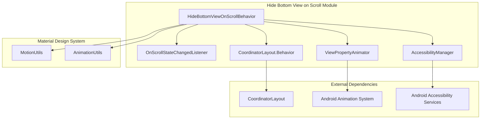
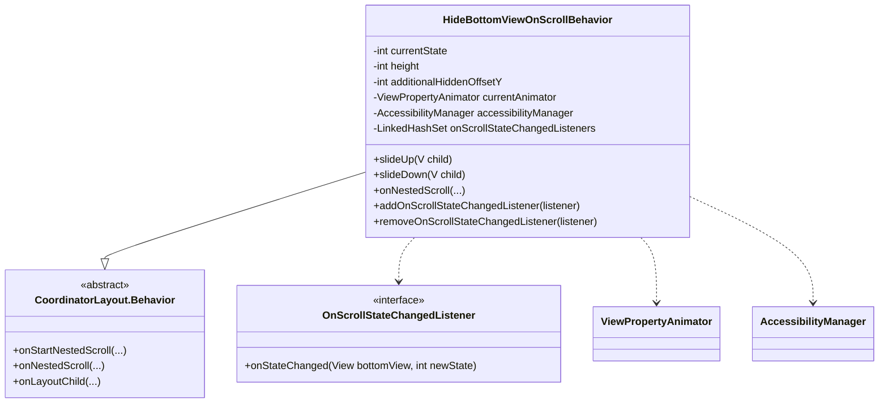
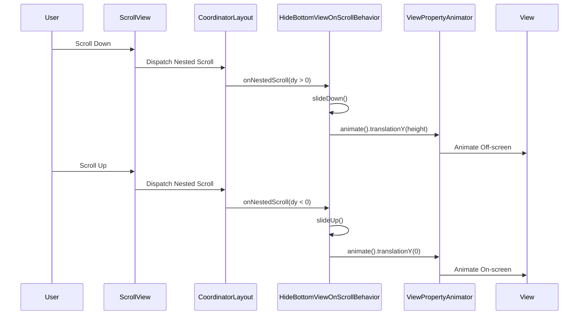
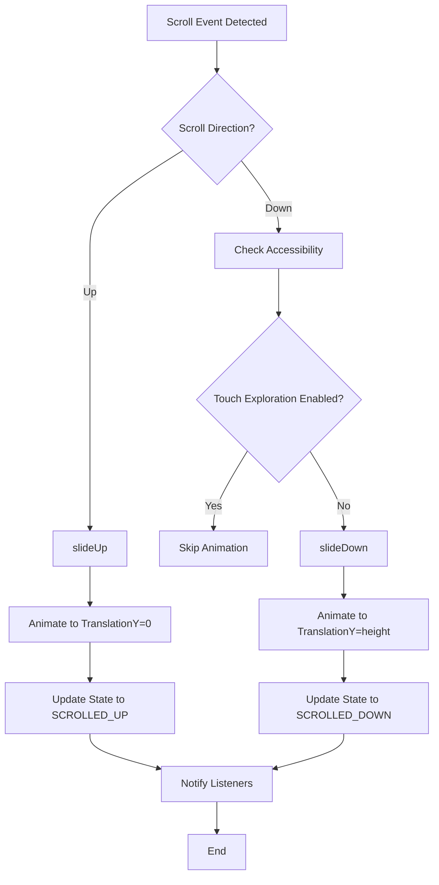

# Hide Bottom View on Scroll Module

## Introduction

The **hide-bottom-view-on-scroll** module provides a CoordinatorLayout behavior that automatically hides views when users scroll down and shows them when scrolling up. This behavior is commonly used for bottom navigation bars, floating action buttons, and other bottom-positioned UI elements to maximize content visibility during scrolling.

## Module Overview

This module is part of the Material Design Components library and implements the `HideBottomViewOnScrollBehavior` class, which extends `CoordinatorLayout.Behavior`. The behavior responds to vertical scroll events and animates the associated view off-screen (downward) when scrolling down and back on-screen when scrolling up.

**Note**: This module is deprecated in favor of the [hide-view-on-scroll](hide-view-on-scroll.md) module, which provides enhanced functionality and better accessibility support.

## Core Components

### HideBottomViewOnScrollBehavior

The main behavior class that controls the hide/show functionality of bottom views based on scroll events.

**Key Features:**
- Automatic detection of scroll direction
- Smooth slide animations with customizable duration and interpolation
- Accessibility support with touch exploration awareness
- State management with listener notifications
- Configurable additional offset for custom positioning

### OnScrollStateChangedListener

Interface for listening to scroll state changes of the bottom view.

**States:**
- `STATE_SCROLLED_UP`: View is fully visible
- `STATE_SCROLLED_DOWN`: View is hidden off-screen

## Architecture



## Component Relationships



## Data Flow



## Process Flow



## Key Features

### 1. Scroll Detection
- Monitors vertical scroll events through `onNestedScroll()`
- Responds to scroll direction changes (positive dy = scroll down, negative dy = scroll up)
- Only processes vertical scroll events (`SCROLL_AXIS_VERTICAL`)

### 2. Animation System
- Smooth slide animations with configurable duration
- Default durations: 225ms (enter), 175ms (exit)
- Theme-aware animation properties using MotionUtils
- Custom interpolators for natural motion
- Animation cancellation and cleanup

### 3. Accessibility Support
- Touch exploration awareness
- Automatic behavior disable when accessibility services are active
- Prevents content obstruction for users with disabilities
- Configurable disable behavior

### 4. State Management
- Two primary states: `STATE_SCROLLED_UP` and `STATE_SCROLLED_DOWN`
- Listener pattern for state change notifications
- Thread-safe listener management with LinkedHashSet

### 5. Customization Options
- Additional hidden offset for fine-tuned positioning
- Animation duration and interpolation customization
- Touch exploration disable configuration

## Usage Patterns

### Basic Implementation
```xml
<androidx.coordinatorlayout.widget.CoordinatorLayout>
    <com.google.android.material.bottomnavigation.BottomNavigationView
        app:layout_behavior="com.google.android.material.behavior.HideBottomViewOnScrollBehavior" />
</androidx.coordinatorlayout.widget.CoordinatorLayout>
```

### Programmatic Control
```java
HideBottomViewOnScrollBehavior<BottomNavigationView> behavior = 
    new HideBottomViewOnScrollBehavior<>();
behavior.addOnScrollStateChangedListener((view, state) -> {
    // Handle state changes
});
behavior.setAdditionalHiddenOffsetY(bottomNav, 100);
```

## Integration with Material Design System

The module integrates with several Material Design components:

- **[MotionUtils](motion-utils.md)**: Provides theme-aware animation properties
- **[AnimationUtils](animation-utils.md)**: Supplies standard interpolators and animation helpers
- **[CoordinatorLayout](coordinator-layout.md)**: Extends the base behavior system

## Migration Path

This module is deprecated in favor of [hide-view-on-scroll](hide-view-on-scroll.md), which offers:
- Enhanced accessibility features
- Better performance optimizations
- More flexible positioning options
- Improved animation system

## Best Practices

1. **Accessibility First**: Always consider users with accessibility needs when implementing hide-on-scroll behaviors
2. **Content Padding**: Ensure sufficient padding in scrollable content to prevent obstruction when behavior is disabled
3. **Animation Duration**: Use appropriate animation durations that feel responsive but not jarring
4. **State Persistence**: Consider saving and restoring scroll state across configuration changes
5. **Testing**: Test with various accessibility services enabled

## Performance Considerations

- Animation cancellation prevents unnecessary processing
- View property animations are hardware accelerated
- Listener management is optimized for frequent state changes
- Touch exploration checks are performed only when necessary

## Related Documentation

- [Hide View on Scroll](hide-view-on-scroll.md) - Recommended replacement module
- [CoordinatorLayout Behaviors](coordinator-layout-behaviors.md) - General behavior system documentation
- [Material Motion](material-motion.md) - Animation and motion guidelines
- [Accessibility Guidelines](accessibility-guidelines.md) - Accessibility best practices