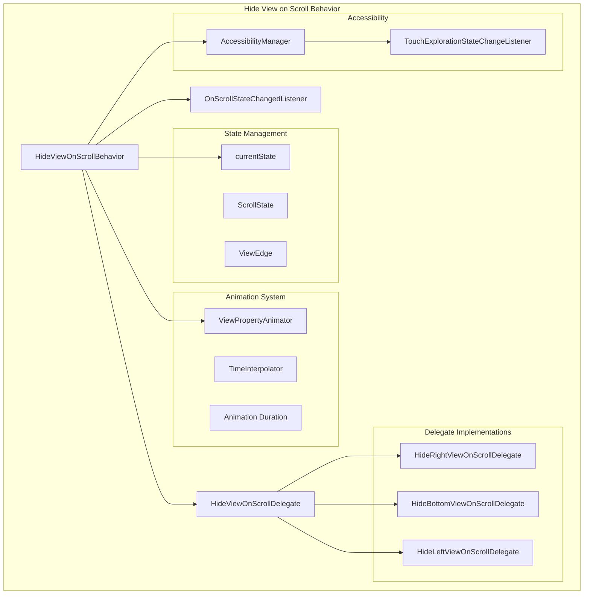
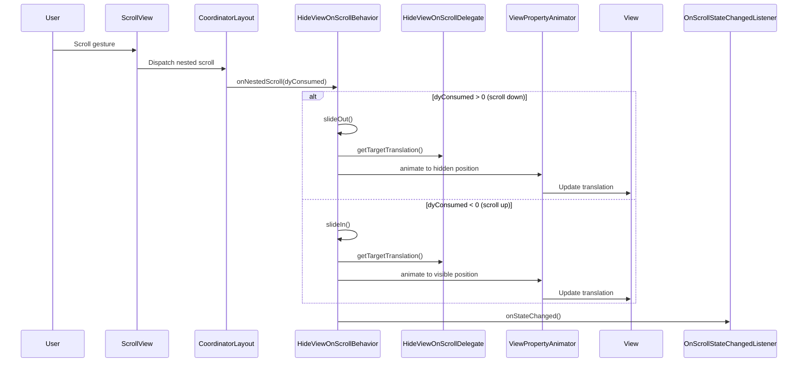
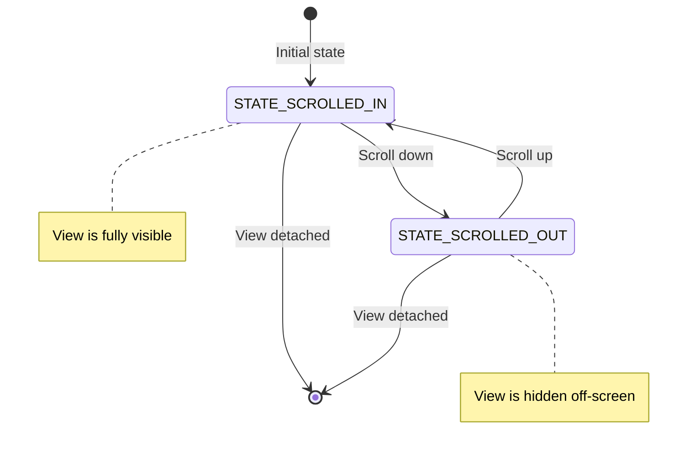
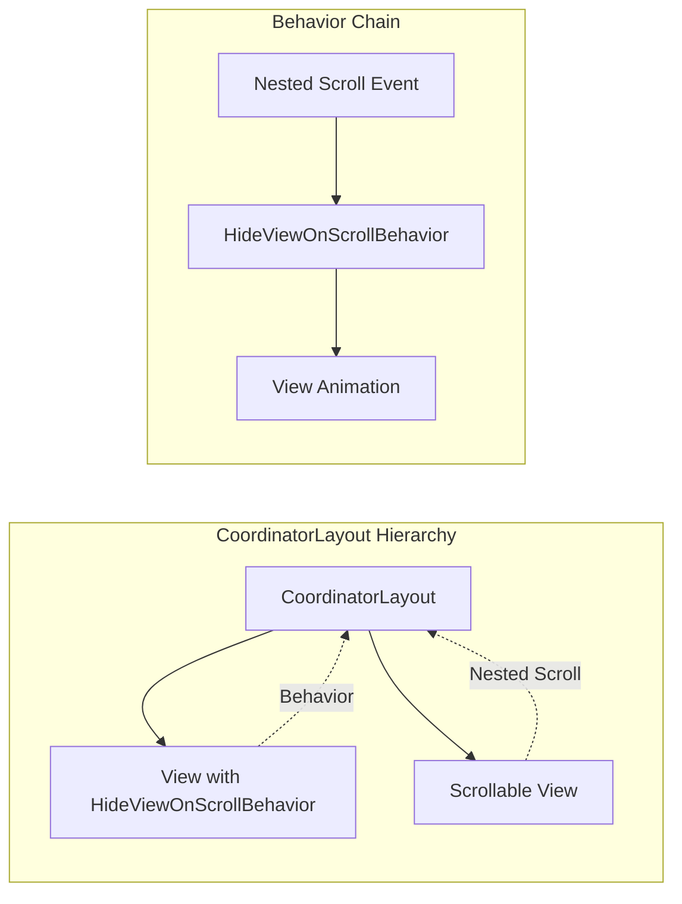

# Hide View on Scroll Behavior Module

## Introduction

The hide-view-on-scroll module provides a sophisticated behavior system for Android's Material Design components that automatically hides and shows views based on scroll gestures. This module is part of the larger Material Design behavior system and enables responsive UI patterns where views dynamically appear and disappear as users scroll through content.

## Overview

The module implements a `CoordinatorLayout.Behavior` that responds to vertical scroll events by sliding views off and on the screen edges. It supports multiple screen edges (right, bottom, left) and provides smooth animations with customizable timing and interpolation. The behavior is designed with accessibility in mind, automatically disabling hide functionality when touch exploration is enabled.

## Core Architecture

### Component Structure



### Key Components

#### HideViewOnScrollBehavior<V extends View>
The main behavior class that extends `CoordinatorLayout.Behavior<V>`. It manages the entire hide/show lifecycle and coordinates between different subsystems.

**Key Responsibilities:**
- Scroll event detection and processing
- State management (scrolled in/out)
- Animation coordination
- Accessibility compliance
- Listener notification

#### OnScrollStateChangedListener
Interface for observing state changes in the hide/show behavior. Provides callbacks when views transition between visible and hidden states.

#### HideViewOnScrollDelegate
Abstract delegate pattern for handling edge-specific behavior. Three concrete implementations handle different screen edges:
- `HideRightViewOnScrollDelegate`: Handles right-edge sliding
- `HideBottomViewOnScrollDelegate`: Handles bottom-edge sliding  
- `HideLeftViewOnScrollDelegate`: Handles left-edge sliding

## Data Flow Architecture



## State Management



## Configuration and Customization

### Supported Edges
- `EDGE_RIGHT`: View slides out from the right edge
- `EDGE_BOTTOM`: View slides out from the bottom edge  
- `EDGE_LEFT`: View slides out from the left edge

### Animation Configuration
- **Enter Animation**: 225ms duration (configurable via `motionDurationLong2`)
- **Exit Animation**: 175ms duration (configurable via `motionDurationMedium4`)
- **Easing**: Uses emphasized motion interpolators
- **Customization**: Supports custom durations and interpolators

### Accessibility Features
- Automatic detection of touch exploration mode
- Disables hide behavior when accessibility is active
- Prevents content obstruction
- Configurable disable behavior via `disableOnTouchExploration()`

## Integration with CoordinatorLayout



## Dependencies and Relationships

### Internal Dependencies
- **Material Animation Utils**: For interpolation and animation utilities
- **Motion Utils**: For theme-based duration and easing resolution
- **Accessibility Manager**: For touch exploration state monitoring

### External Dependencies
- **CoordinatorLayout**: Core dependency for behavior system
- **ViewCompat**: For scroll axis detection
- **ContextCompat**: For system service access

### Related Modules
- [behavior.md](behavior.md): Parent behavior module containing related behaviors
- [appbar.md](appbar.md): App bar behaviors that may interact with scroll behaviors
- [bottomappbar.md](bottomappbar.md): Bottom app bar with similar hide-on-scroll functionality

## Usage Patterns

### Basic Implementation
```xml
<androidx.coordinatorlayout.widget.CoordinatorLayout>
    <com.google.android.material.floatingactionbutton.FloatingActionButton
        app:layout_behavior="com.google.android.material.behavior.HideViewOnScrollBehavior" />
    
    <androidx.recyclerview.widget.RecyclerView
        android:layout_height="match_parent" />
</androidx.coordinatorlayout.widget.CoordinatorLayout>
```

### Programmatic Control
```java
HideViewOnScrollBehavior<FloatingActionButton> behavior = 
    HideViewOnScrollBehavior.from(floatingActionButton);
behavior.setViewEdge(HideViewOnScrollBehavior.EDGE_BOTTOM);
behavior.addOnScrollStateChangedListener((view, newState) -> {
    // Handle state changes
});
```

## Performance Considerations

### Animation Optimization
- Uses hardware-accelerated `ViewPropertyAnimator`
- Cancels ongoing animations before starting new ones
- Minimal object allocation during scroll events

### Memory Management
- Weak references to views and contexts
- Proper cleanup of accessibility listeners
- Animator lifecycle management

### Scroll Performance
- Efficient nested scroll handling
- Minimal computation in scroll callbacks
- Delegated edge-specific calculations

## Accessibility Compliance

The module implements comprehensive accessibility features:

1. **Touch Exploration Detection**: Automatically disables hide behavior when screen readers are active
2. **Content Obstruction Prevention**: Ensures hidden views don't block accessible content
3. **State Announcement**: Works with accessibility services to announce visibility changes
4. **Keyboard Navigation**: Maintains focusability when views are hidden/shown

## Error Handling

### Edge Case Management
- Invalid edge position validation
- Null safety for all public APIs
- Graceful handling of detached views
- Animator cancellation safety

### Exception Scenarios
- `IllegalArgumentException` for invalid edge values
- `IllegalArgumentException` for non-CoordinatorLayout children
- `IllegalArgumentException` for incorrect behavior types

## Testing Considerations

### Unit Testing Areas
- State transition logic
- Animation timing and interpolation
- Accessibility state changes
- Edge detection and gravity handling

### Integration Testing
- CoordinatorLayout interaction
- Nested scroll coordination
- Multiple behavior conflicts
- Performance under rapid scrolling

## Future Enhancements

### Potential Improvements
- Support for diagonal edge sliding
- Configurable scroll thresholds
- Velocity-based animation timing
- Spring-based animations
- Multi-view coordination

### API Evolution
The module is designed for extensibility with:
- Delegate pattern for edge-specific behavior
- Interface-based listener system
- Configurable animation parameters
- Theme-aware resource resolution