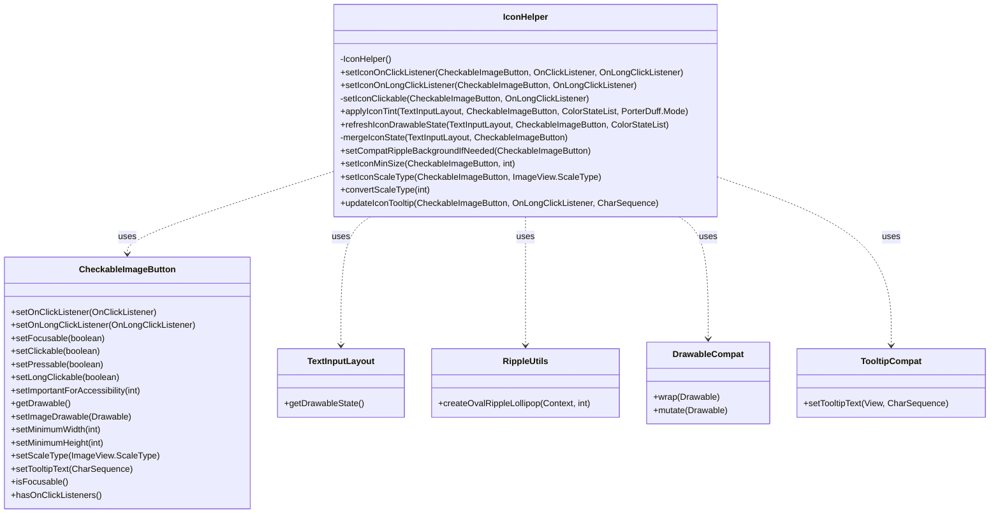
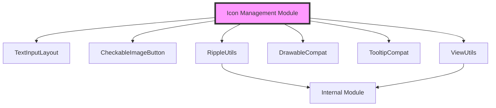
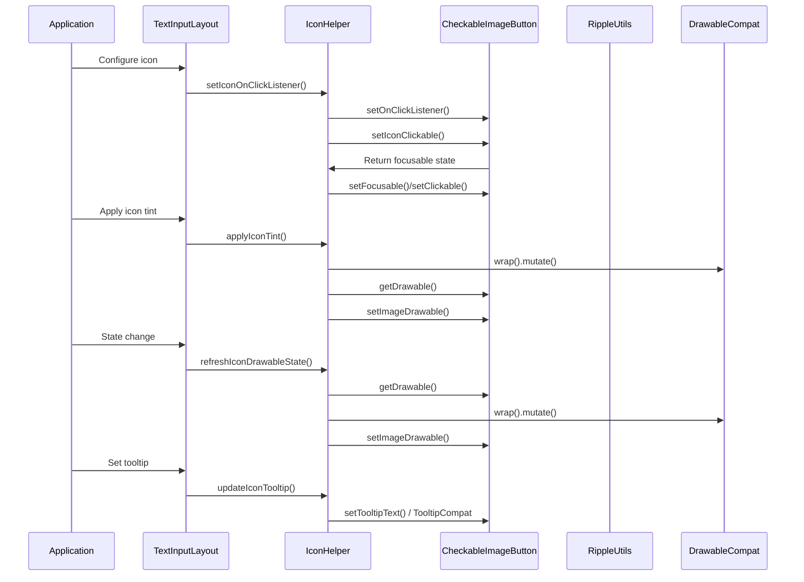

# Icon Management Module Documentation

## Introduction

The icon-management module is a specialized utility component within the Material Design Components library that provides comprehensive icon handling capabilities for text input fields. This module serves as the central orchestrator for icon-related functionality in TextInputLayout components, managing icon display, interaction, styling, and accessibility features.

## Module Overview

The icon-management module is part of the broader text-field module ecosystem and provides essential services for managing icons within text input components. It handles the complete lifecycle of icon management, from initial setup and styling to user interaction and state management.

## Core Architecture

### Component Structure

### Module Dependencies

## Core Functionality

### Icon Interaction Management

The module provides sophisticated handling of icon interactions, supporting both click and long-click events while maintaining proper accessibility standards.

#### Click Handling
- **setIconOnClickListener()**: Configures click behavior for icon buttons
- **setIconOnLongClickListener()**: Sets up long-click interactions
- **setIconClickable()**: Internal method that manages focusability, clickability, and accessibility based on interaction requirements

#### Accessibility Features
- Automatic focus management based on interaction capabilities
- Proper accessibility importance settings
- Tooltip support with API-level-specific implementations
- Long-click behavior that respects accessibility guidelines

### Icon Styling and Theming

The module provides comprehensive icon styling capabilities that integrate with the Material Design theming system.

#### Tint Management
- **applyIconTint()**: Applies color state lists and tint modes to icons
- **refreshIconDrawableState()**: Updates icon appearance based on state changes
- **mergeIconState()**: Combines TextInputLayout and icon view states for proper theming

#### Visual Properties
- **setIconMinSize()**: Ensures consistent icon sizing
- **setIconScaleType()**: Controls icon scaling behavior
- **convertScaleType()**: Converts between different scale type representations

### Platform Compatibility

The module handles platform-specific differences to ensure consistent behavior across Android versions.

#### Ripple Effects
- **setCompatRippleBackgroundIfNeeded()**: Provides ripple effects on pre-Marshmallow devices
- Custom ripple implementation aligned with Material Design specifications

#### Tooltip Implementation
- **updateIconTooltip()**: Handles tooltip display with API-level-specific behavior
- Pre-API 26 compatibility using TooltipCompat
- Maintains custom long-click listener precedence

## Data Flow Architecture

## Integration with Text Input System

The icon-management module operates as an integral part of the text input ecosystem, providing seamless integration with TextInputLayout components.

### State Synchronization
- Merges TextInputLayout states with icon view states for consistent theming
- Automatically updates icon appearance based on layout state changes
- Maintains proper visual hierarchy and accessibility

### Event Coordination
- Coordinates between icon interactions and text input behavior
- Ensures proper event propagation and handling
- Maintains focus management between icons and text fields

## Performance Considerations

### Resource Management
- Efficient drawable wrapping and mutation to prevent resource leaks
- Minimal memory footprint through static utility methods
- Proper cleanup of listeners and callbacks

### Optimization Strategies
- Lazy initialization of icon properties
- Efficient state merging algorithms
- Platform-specific optimizations for different Android versions

## Error Handling and Edge Cases

### Robustness Features
- Null-safe parameter handling throughout the API
- Graceful degradation on unsupported platform features
- Proper state validation before operations

### Edge Case Management
- Handles missing drawables gracefully
- Manages conflicting interaction requirements
- Provides fallback behavior for unsupported scale types

## Testing and Quality Assurance

### Test Coverage Areas
- Icon interaction behavior across different Android versions
- Accessibility compliance verification
- State management and theming consistency
- Performance under various load conditions

### Quality Metrics
- Memory usage optimization
- Rendering performance benchmarks
- Accessibility score validation
- Cross-platform compatibility verification

## Future Enhancements

### Potential Improvements
- Enhanced animation support for icon transitions
- Advanced gesture recognition capabilities
- Integration with emerging accessibility standards
- Performance optimizations for high-frequency updates

### Extensibility Considerations
- Modular architecture supporting custom icon behaviors
- Plugin system for specialized icon types
- Integration points for third-party icon libraries

## Related Documentation

For comprehensive understanding of the icon-management module's context and dependencies, refer to:

- [Text Input Layout Module](text-input-layout.md) - Parent module providing the TextInputLayout component
- [Internal Module](internal.md) - Contains CheckableImageButton and other internal utilities
- [Ripple Module](ripple.md) - Provides ripple effect implementations
- [Resources Module](resources.md) - Handles resource loading and management

## Conclusion

The icon-management module represents a critical component in the Material Design text input ecosystem, providing robust, accessible, and performant icon handling capabilities. Its comprehensive feature set, platform compatibility, and integration with the broader Material Design system make it an essential utility for creating consistent and user-friendly text input experiences across Android applications.