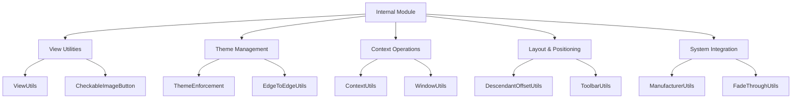

# Internal Module Documentation

## Overview

The Internal module serves as the foundational utility layer for the Material Components library, providing essential helper classes and utilities that support the functionality of higher-level components. This module contains utility classes for view manipulation, theme enforcement, context operations, and various system-level interactions that are commonly needed across the Material Design system.

## Architecture

The Internal module is organized into several key functional areas, each providing specialized utilities for different aspects of the Material Design system:



## Core Functionality

### View Utilities
The module provides comprehensive view manipulation utilities through [ViewUtils](view-utilities.md) and specialized components like CheckableImageButton. These utilities handle keyboard management, layout calculations, window insets, and accessibility features.

### Theme Management
Theme enforcement and edge-to-edge display management are handled through ThemeEnforcement and EdgeToEdgeUtils, ensuring consistent theming across components and proper system bar integration.

### Context Operations
Context and window management utilities in ContextUtils and WindowUtils provide safe access to activities and window bounds calculations across different Android API levels.

### Layout & Positioning
The DescendantOffsetUtils handles complex view hierarchy transformations and coordinate calculations, while ToolbarUtils provides specialized utilities for toolbar manipulation and content extraction.

### System Integration
Device-specific handling through ManufacturerUtils ensures compatibility across different device manufacturers, and FadeThroughUtils provides animation utilities for smooth transitions.

## Key Components

### CheckableImageButton
A specialized ImageButton that implements the Checkable interface, providing toggle functionality with proper accessibility support and state persistence.

### ViewUtils
Comprehensive utility class providing methods for keyboard management, layout calculations, window insets handling, and view hierarchy operations.

### ThemeEnforcement
Ensures that components are used with compatible themes, providing validation for Material Design themes and AppCompat themes with detailed error messages.

### EdgeToEdgeUtils
Manages edge-to-edge display mode, handling system bar colors, transparency, and light/dark mode adjustments for immersive user experiences.

## Dependencies

The Internal module serves as a foundation for many other modules in the Material Components library:

- **AppBar**: Uses DescendantOffsetUtils for layout calculations
- **BottomSheet**: Leverages ViewUtils for keyboard and window management
- **TextField**: Utilizes CheckableImageButton for toggle functionality
- **Theme**: Depends on ThemeEnforcement for theme validation
- **Transition**: Uses FadeThroughUtils for animation calculations

## Usage Patterns

### Theme Validation
```java
// Ensure proper theme inheritance
ThemeEnforcement.checkMaterialTheme(context);
```

### View State Management
```java
// Handle checkable state with accessibility
CheckableImageButton button = findViewById(R.id.toggle_button);
button.setChecked(true);
button.setCheckable(true);
```

### Edge-to-Edge Display
```java
// Apply edge-to-edge mode with proper color handling
EdgeToEdgeUtils.applyEdgeToEdge(window, true, backgroundColor, navColor);
```

### Layout Calculations
```java
// Calculate descendant view positions with transformations
Rect bounds = new Rect();
DescendantOffsetUtils.getDescendantRect(parentView, childView, bounds);
```

## Best Practices

1. **Always validate themes** when creating custom components that depend on Material Design attributes
2. **Use proper window insets handling** for components that need to adjust to system bars
3. **Consider device manufacturers** when implementing features that may behave differently across devices
4. **Maintain accessibility** by using checkable components with proper state management
5. **Handle context hierarchies safely** when extracting activities from complex view structures

## Related Documentation

- [View Utilities](view-utilities.md) - Detailed view manipulation utilities
- [Theme Management](theme-management.md) - Theme validation and enforcement
- [Context Operations](context-operations.md) - Context and window utilities
- [Layout Utilities](layout-positioning.md) - View positioning and transformation utilities
- [System Integration](system-integration.md) - Device-specific handling and compatibility