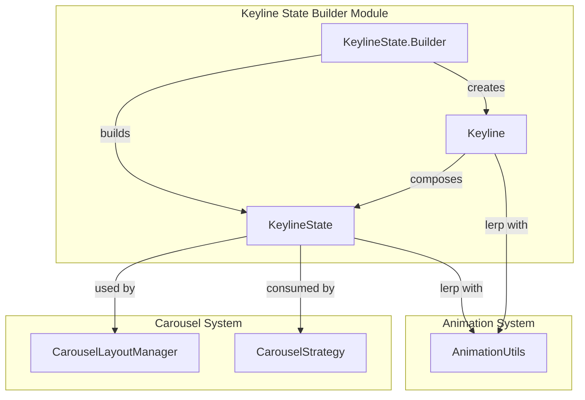
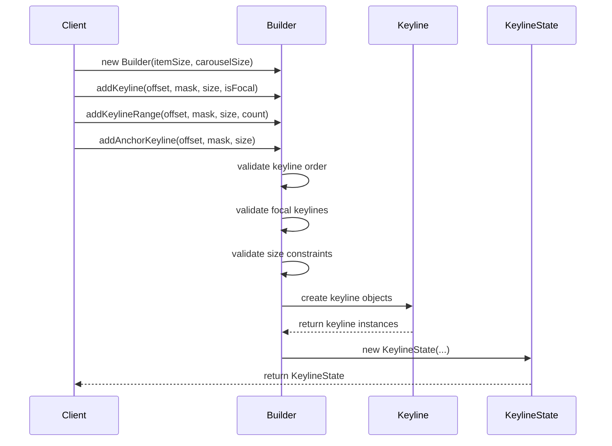
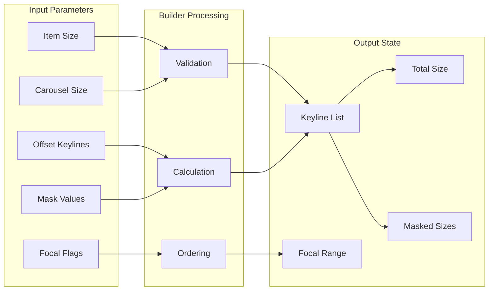
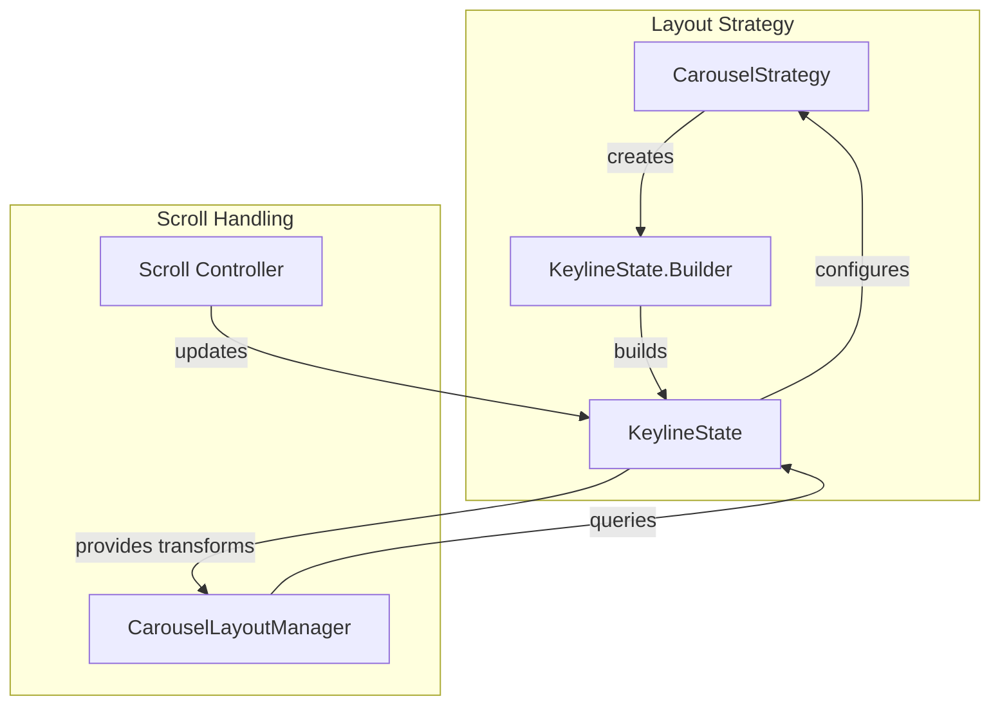

# Keyline State Builder Module

## Introduction

The keyline-state-builder module is a core component of the Material Design Carousel system, providing the foundational framework for creating fluid, interpolated animations tied to scroll position. This module implements the `KeylineState.Builder` class, which constructs keyline arrangements that define how carousel items should be masked, offset, and treated as they move along the scrolling axis.

## Module Overview

The keyline-state-builder module is responsible for creating `KeylineState` objects that model the arrangement of keylines along a scrolling axis. These keylines serve as control points that determine how carousel items should appear and behave at specific positions during scrolling, enabling smooth transitions and visual effects.

### Key Concepts

- **Keylines**: Points along the scrolling axis that define item treatment (masking, offsetting)
- **Focal Keylines**: Special keylines where items are fully unmasked and viewable
- **Anchor Keylines**: Fixed keylines at the start/end that don't shift during scrolling
- **Masking**: The process of hiding portions of items based on their scroll position
- **Interpolation**: Smooth transitions between keyline states as items scroll

## Architecture

### Component Structure



### Core Components

#### KeylineState
The immutable state object that contains the complete arrangement of keylines for a carousel layout. It provides methods to access keylines, focal ranges, and perform interpolation between states.

#### KeylineState.Builder
The builder pattern implementation that constructs KeylineState objects with validation rules ensuring proper keyline arrangement and focal keyline placement.

#### Keyline
A data class representing individual keyline states with properties for location, masking, size, and anchor status.

## Keyline State Construction Process



## Keyline Validation Rules

The builder enforces strict validation rules to ensure proper keyline arrangement:

1. **Focal Keyline Requirement**: At least one keyline must be marked as focal
2. **Focal Keyline Adjacency**: All focal keylines must be adjacent to each other
3. **Size Progression**: Keyline sizes must increase approaching focal range and decrease moving away
4. **Anchor Keyline Constraints**: Anchor keylines must be first or last, and cannot be focal

## Data Flow



## Integration with Carousel System

The keyline-state-builder module integrates with the broader carousel ecosystem:

### Dependencies
- **CarouselLayoutManager**: Uses KeylineState to position and transform items
- **CarouselStrategy**: Consumes KeylineState to implement layout strategies
- **AnimationUtils**: Provides interpolation utilities for smooth transitions

### Usage Patterns



## Key Features

### 1. Flexible Keyline Arrangement
- Support for individual keylines and keyline ranges
- Anchor keylines for boundary conditions
- Focal keyline ranges for primary content areas

### 2. Advanced Masking Support
- Percentage-based masking (0.0 to 1.0)
- Cutoff calculations for edge conditions
- Padding shift support for precise positioning

### 3. State Interpolation
- Smooth transitions between keyline states
- Support for RTL layout reversal
- Animation-friendly linear interpolation

### 4. Validation and Error Handling
- Comprehensive validation rules
- Clear error messages for invalid configurations
- Builder pattern ensures immutability

## API Reference

### KeylineState.Builder

#### Constructor
```java
public Builder(float itemSize, int carouselSize)
```

#### Key Methods
- `addKeyline(float offset, float mask, float maskedItemSize, boolean isFocal)`
- `addKeylineRange(float offset, float mask, float maskedItemSize, int count)`
- `addAnchorKeyline(float offset, float mask, float maskedItemSize)`
- `build()` - Returns the constructed KeylineState

### KeylineState

#### Key Methods
- `getKeylines()` - Returns list of all keylines
- `getFocalKeylines()` - Returns focal keyline subset
- `getItemSize()` - Returns base item size
- `lerp(KeylineState from, KeylineState to, float progress)` - Interpolates between states

## Best Practices

### 1. Keyline Ordering
Always add keylines in ascending order of offset location to ensure proper validation and layout.

### 2. Focal Keyline Placement
Place focal keylines strategically based on alignment strategy:
- Start-aligned: Place at beginning of container
- Center-aligned: Place at center of container
- End-aligned: Place at end of container

### 3. Size Progression
Ensure smooth size transitions by following the size progression rules enforced by the builder.

### 4. Anchor Keyline Usage
Use anchor keylines sparingly and only at the boundaries of the keyline arrangement.

## Related Modules

- [carousel-layout-manager](carousel-layout-manager.md) - Uses KeylineState for item positioning
- [carousel-strategy-helper](carousel-strategy-helper.md) - Consumes KeylineState for strategy implementation
- [animation-utils](animation-utils.md) - Provides interpolation support for keyline transitions

## Conclusion

The keyline-state-builder module provides the essential foundation for creating sophisticated carousel layouts with smooth, scroll-driven animations. By defining keylines that control item masking and positioning, this module enables the creation of visually appealing and interactive carousel experiences that are core to Material Design's motion principles.