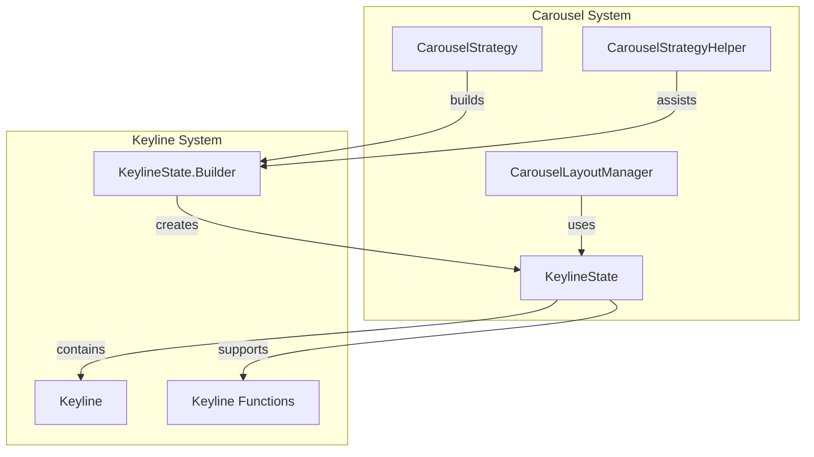
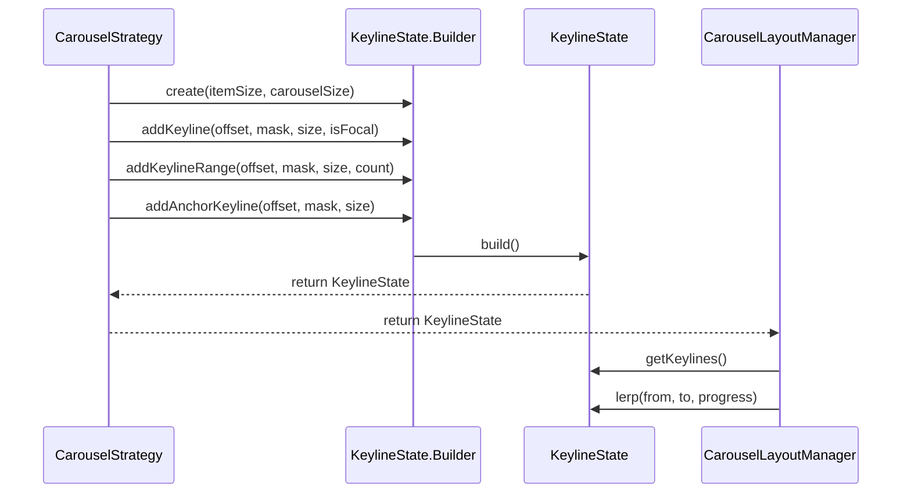
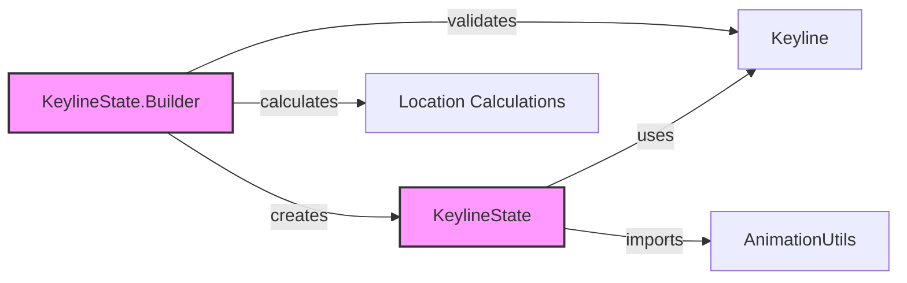
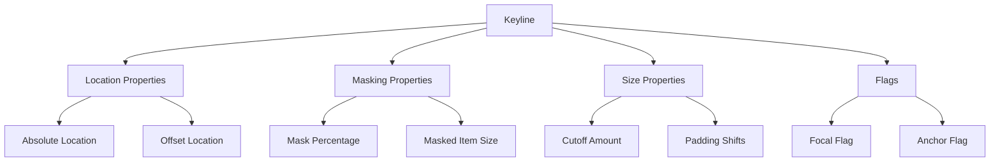

# Keyline System Module Documentation

## Introduction

The keyline-system module is a fundamental component of the Material Design carousel system that manages the positioning, masking, and visual treatment of items as they scroll through a carousel container. It provides a sophisticated framework for creating fluid, interpolated animations tied to scroll position, enabling smooth transitions between different visual states of carousel items.

The module's primary responsibility is to define and manage keylines—strategic points along the scrolling axis where items should have specific visual treatments (such as masking, scaling, or positioning). This creates the signature Material Design carousel experience where items smoothly transition between focused and peripheral states as users scroll.

## Architecture Overview

### Core Components

The keyline-system is built around two primary classes that work in tandem to create and manage the keyline arrangement:

#### KeylineState
The `KeylineState` class serves as the immutable model that encapsulates the complete arrangement of keylines for a carousel. It contains:
- A list of keylines positioned along the scrolling axis
- The size of fully unmasked items
- Indices marking the focal keyline range
- The total carousel container size

#### KeylineState.Builder
The `KeylineState.Builder` provides a fluent API for constructing keyline arrangements with built-in validation to ensure proper keyline ordering and focal range placement. It enforces keyline system rules and calculates optimal positioning for smooth scroll-based animations.

### Keyline Types

The system supports two distinct types of keylines, each serving specific purposes in the carousel experience:

#### Focal Keylines
- Represent positions where items are fully visible and interactable
- Must have at least one focal keyline in any valid keyline state
- Must be placed adjacent to each other (no non-focal keylines between focal keylines)
- All focal keylines must have the same masked item size
- Typically positioned at strategic locations like start, center, or end of the container

#### Non-Focal Keylines
- Represent positions where items are partially masked or in transition
- Can be placed before or after the focal range
- Masked item sizes must increase approaching the focal range
- Masked item sizes must decrease moving away from the focal range
- Include anchor keylines that don't shift during scrolling

## System Integration

### Relationship to Carousel System



### Data Flow Architecture



## Component Relationships

### KeylineState Dependencies



### Keyline Properties and Behaviors



## Key Features and Capabilities

### Advanced Positioning System
The keyline system implements sophisticated positioning algorithms that account for:
- **End-to-end layout simulation**: Calculates where items would be positioned if laid out sequentially
- **Focal pivot positioning**: Uses the first focal keyline as a pivot point for optimal alignment
- **Padding compensation**: Adjusts keyline positions to account for container padding
- **RTL support**: Provides built-in support for right-to-left layouts through the `reverse()` method

### Interpolation and Animation
The system provides robust interpolation capabilities:
- **Linear interpolation between states**: Smoothly transitions between different keyline arrangements
- **Scroll-based animations**: Creates fluid animations tied directly to scroll position
- **Progress-based masking**: Interpolates mask values and item sizes for smooth visual transitions
- **Location interpolation**: Smoothly transitions item positions during state changes

### Validation and Error Handling
The builder implements comprehensive validation to ensure:
- **Focal keyline requirements**: Ensures at least one focal keyline exists
- **Adjacent focal keylines**: Prevents non-focal keylines between focal ones
- **Size progression rules**: Enforces proper size ordering approaching and leaving focal ranges
- **Anchor keyline placement**: Restricts anchor keylines to start or end positions

## Usage Patterns

### Basic Keyline State Construction
```java
// Create a builder with item and carousel sizes
KeylineState.Builder builder = new KeylineState.Builder(itemSize, carouselSize);

// Add focal keylines where items are fully visible
builder.addKeyline(centerPosition, 0f, itemSize, true);

// Add non-focal keylines with progressive masking
builder.addKeyline(leftPosition, 0.3f, itemSize * 0.7f, false);
builder.addKeyline(rightPosition, 0.3f, itemSize * 0.7f, false);

// Build the final keyline state
KeylineState keylineState = builder.build();
```

### Advanced Range-based Construction
```java
// Add multiple keylines at once using ranges
builder.addKeylineRange(startOffset, mask, itemSize, count, isFocal);

// Add anchor keylines for enhanced edge behavior
builder.addAnchorKeyline(anchorOffset, mask, maskedSize);
```

### State Interpolation
```java
// Interpolate between two keyline states
KeylineState interpolated = KeylineState.lerp(fromState, toState, progress);

// Reverse for RTL layouts
KeylineState rtlState = KeylineState.reverse(ltrState, carouselSize);
```

## Integration with Material Design Principles

The keyline system embodies several Material Design principles:

### Motion and Animation
- **Meaningful motion**: Animations are tied to user scroll actions, creating direct manipulation
- **Smooth transitions**: Interpolation creates fluid visual states without jarring changes
- **Contextual awareness**: Items respond to their position within the container

### Layout and Spacing
- **Consistent spacing**: Keylines ensure predictable item positioning
- **Responsive design**: Adapts to different container sizes and orientations
- **Accessibility**: Focal keylines ensure important content remains visible and interactable

### Visual Hierarchy
- **Progressive disclosure**: Masking creates natural focus on focal items
- **Depth and elevation**: Size changes create implied depth in the carousel
- **Visual continuity**: Smooth transitions maintain context during scrolling

## Performance Considerations

### Memory Efficiency
- **Immutable keyline states**: Prevents accidental modification and enables safe sharing
- **Unmodifiable collections**: Protects internal state while allowing safe iteration
- **Lazy calculations**: Defers complex calculations until build time

### Computational Optimization
- **Efficient interpolation**: Linear interpolation provides smooth animations with minimal overhead
- **Cached calculations**: Builder caches intermediate results during construction
- **Optimized validation**: Validation rules prevent expensive runtime errors

## Error Handling and Edge Cases

### Builder Validation
The system provides detailed error messages for common issues:
- Missing focal keylines
- Invalid focal keyline placement
- Incorrect size progressions
- Improper anchor keyline usage

### Runtime Safety
- **Null safety**: Proper null checking throughout the API
- **Bounds checking**: Validates all position and size parameters
- **State consistency**: Ensures built keyline states are internally consistent

## Future Extensibility

The keyline system is designed for extensibility with:
- **Pluggable interpolation**: Support for custom interpolation functions
- **Extended keyline properties**: Room for additional keyline attributes
- **Strategy integration**: Clean integration with carousel strategy patterns
- **Animation framework**: Foundation for more complex animation sequences

## Related Documentation

For information about how keyline states are used within the broader carousel system, see:
- [Carousel Layout Manager](carousel-layout-manager.md)
- [Carousel Strategy Framework](carousel-strategy.md)
- [Material Design Motion Guidelines](material-motion.md)

For integration with other Material Design components:
- [Animation Utilities](animation-utils.md)
- [Material Theme System](material-theme.md)