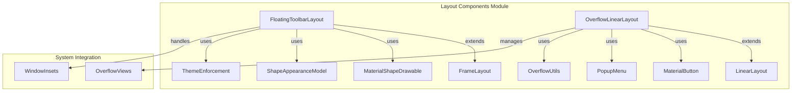
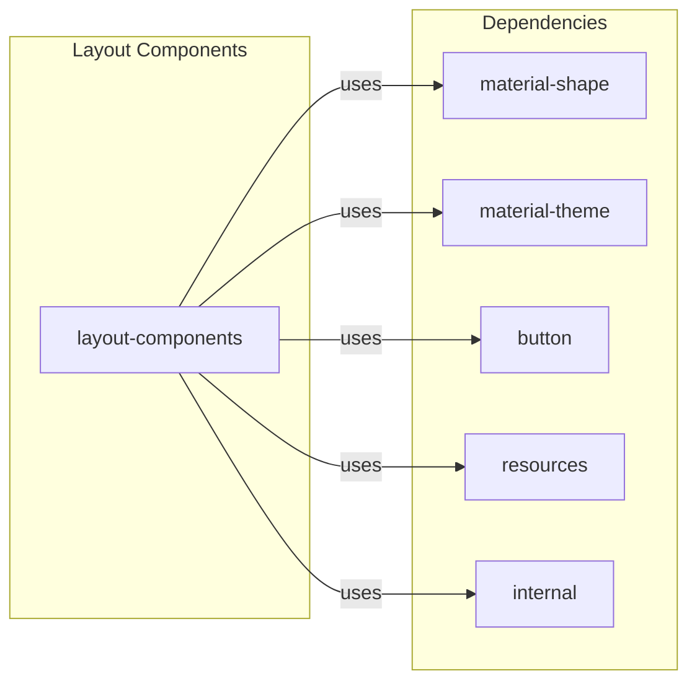
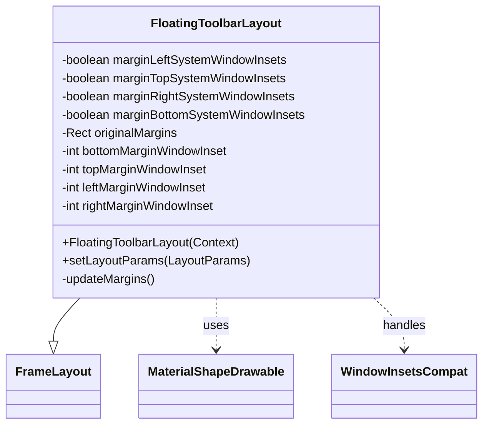
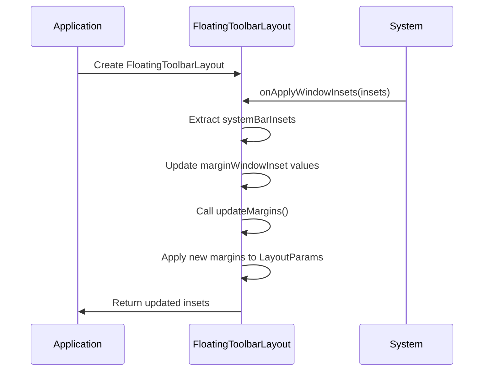
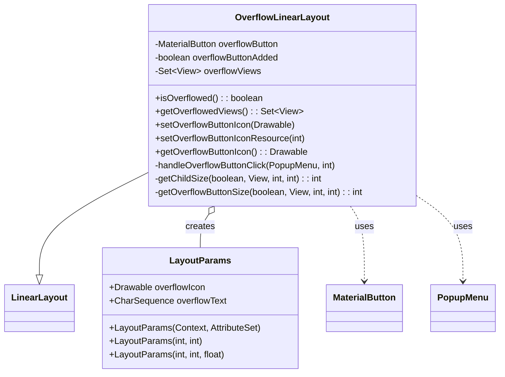
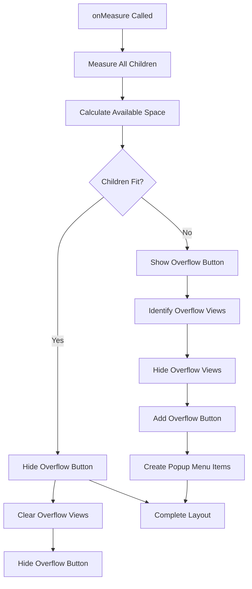
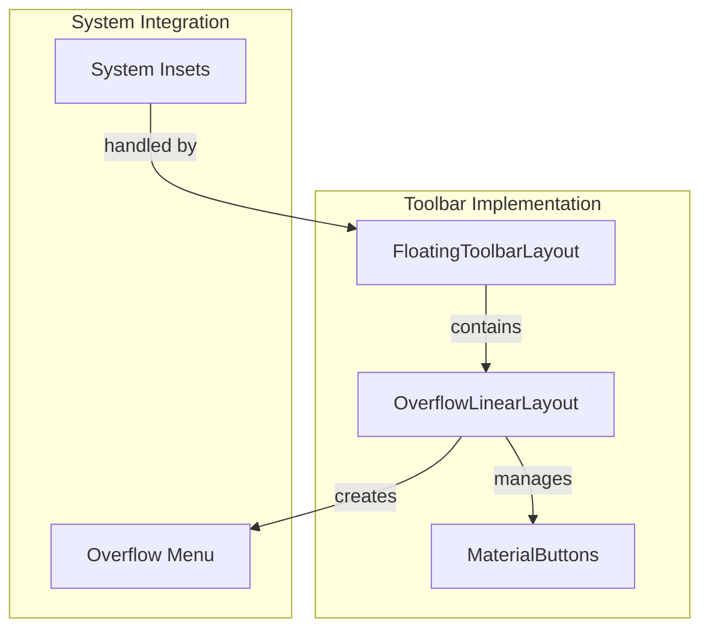
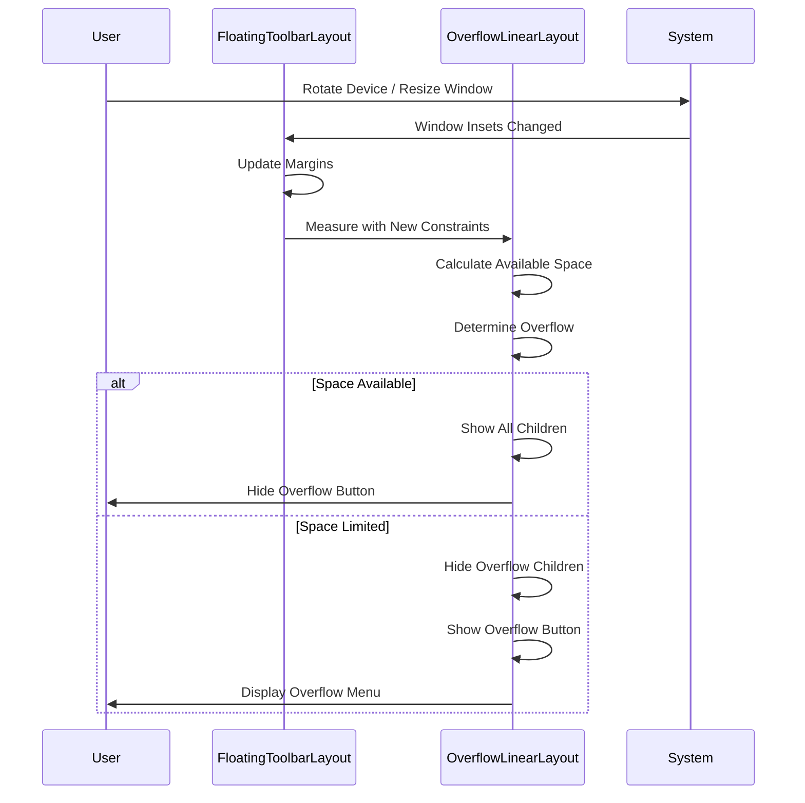

# Layout Components Module Documentation

## Introduction

The layout-components module provides specialized layout containers and positioning utilities for Material Design applications. This module focuses on dynamic layout management, overflow handling, and responsive toolbar implementations that adapt to different screen sizes and system configurations.

## Module Overview

The layout-components module contains two primary components:

1. **FloatingToolbarLayout** - A floating toolbar container that adapts to system window insets
2. **OverflowLinearLayout** - A smart LinearLayout that automatically manages child view overflow

These components work together to provide sophisticated layout solutions for modern Android applications, particularly in scenarios requiring adaptive UI elements and space-constrained environments.

## Architecture

### Component Structure

### Module Dependencies

## Core Components

### FloatingToolbarLayout

The `FloatingToolbarLayout` is a specialized FrameLayout that provides floating toolbar functionality with Material Design styling and system window inset handling.

#### Key Features

- **Material Design Styling**: Automatically applies Material Design 3 styling with customizable background tint
- **System Window Inset Handling**: Intelligent margin adjustment based on system bars, display cutouts, and IME
- **Shape Customization**: Supports MaterialShapeDrawable for consistent theming
- **Window Inset Awareness**: Configurable margin handling for different system window inset types

#### Architecture

#### System Window Inset Management

The component automatically adjusts margins based on system window insets:

#### Usage Patterns

The FloatingToolbarLayout is designed for scenarios requiring:
- Contextual action bars that float above content
- Toolbars that need to respect system UI elements (notches, status bars, navigation bars)
- Consistent Material Design styling across different Android versions

### OverflowLinearLayout

The `OverflowLinearLayout` is an intelligent LinearLayout that automatically manages child view visibility based on available space, moving overflow items to a popup menu.

#### Key Features

- **Automatic Overflow Management**: Dynamically shows/hides children based on available space
- **Smart Space Calculation**: Measures available space and child sizes during layout
- **Popup Menu Integration**: Automatically creates overflow menu for hidden items
- **Material Button Integration**: Seamless integration with MaterialButton components
- **Customizable Overflow Behavior**: Configurable overflow icons and text

#### Architecture

#### Overflow Management Process

#### Layout Measurement Strategy

The component uses a sophisticated measurement approach:

1. **Initial Measurement**: Measures all children without the overflow button
2. **Space Calculation**: Determines available space based on orientation and measure specs
3. **Overflow Detection**: Identifies which children won't fit in available space
4. **Dynamic Adjustment**: Shows/hides overflow button and adjusts child visibility
5. **Menu Population**: Creates popup menu items for overflowed views

## Integration Patterns

### Floating Toolbar with Overflow

These components work together to create sophisticated toolbar layouts:

### Responsive Layout Flow

## System Integration

### Window Inset Handling

The FloatingToolbarLayout integrates with Android's window inset system:

- **System Bars**: Handles status bar and navigation bar insets
- **Display Cutouts**: Supports devices with notches and cutouts
- **IME**: Adjusts for keyboard visibility
- **Configurable Margins**: Each inset type can be individually enabled/disabled

### Theme Integration

Both components integrate with Material Design theming:

- **MaterialThemeOverlay**: Automatic theme wrapping for consistent styling
- **ShapeAppearanceModel**: Material shape support for backgrounds
- **ColorStateList**: Dynamic color handling based on theme
- **Style Resources**: Pre-defined Material Design 3 styles

## Performance Considerations

### Layout Optimization

- **Efficient Measurement**: Single-pass measurement for most scenarios
- **Smart Caching**: Caches original margins and calculated values
- **Conditional Updates**: Only updates when necessary
- **Memory Management**: Proper cleanup of resources and listeners

### Overflow Performance

- **Lazy Initialization**: Overflow button created only when needed
- **Menu Caching**: Reuses popup menu instances
- **View Recycling**: Efficient view visibility management
- **Measure Optimization**: Minimizes redundant measurements

## Best Practices

### FloatingToolbarLayout Usage

1. **Window Inset Configuration**: Carefully configure which insets to handle based on your layout
2. **Margin Management**: Set appropriate original margins before system inset adjustments
3. **Theme Consistency**: Use Material theme attributes for consistent styling
4. **Shape Customization**: Leverage ShapeAppearanceModel for Material Design compliance

### OverflowLinearLayout Usage

1. **Child Sizing**: Ensure children have appropriate minimum sizes
2. **Overflow Configuration**: Set meaningful overflow text and icons
3. **Orientation Handling**: Consider different behaviors for horizontal vs vertical orientation
4. **Performance**: Monitor performance with large numbers of children

## Related Modules

The layout-components module integrates with several other Material Design modules:

- **[material-shape](shape.md)**: Shape appearance and MaterialShapeDrawable integration
- **[material-theme](theme.md)**: Theme overlay and styling support
- **[button](button.md)**: MaterialButton integration in overflow scenarios
- **[resources](resources.md)**: Material attribute resolution and resource handling
- **[internal](internal.md)**: Theme enforcement and utility functions

## Conclusion

The layout-components module provides essential layout containers that solve common UI challenges in modern Android applications. By combining intelligent overflow management with system-aware positioning, these components enable developers to create responsive, adaptive interfaces that work seamlessly across different devices and configurations while maintaining Material Design consistency.