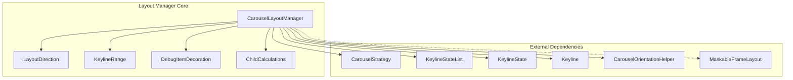
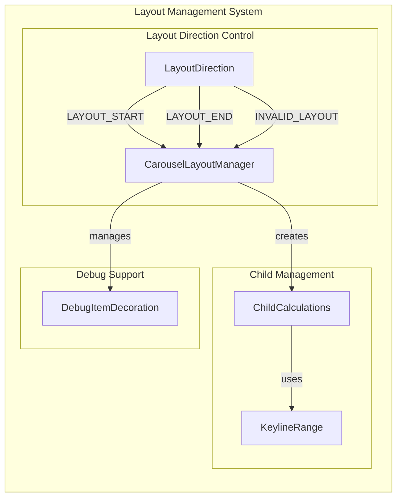
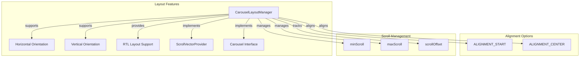
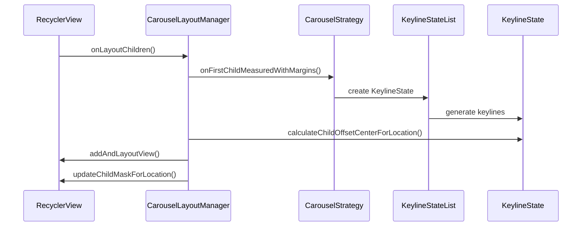
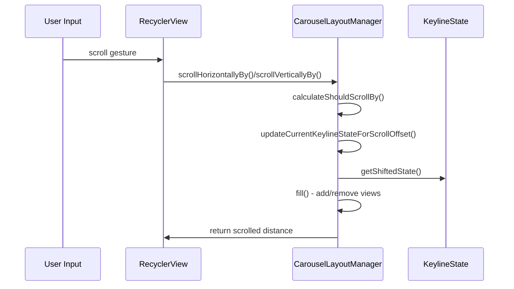
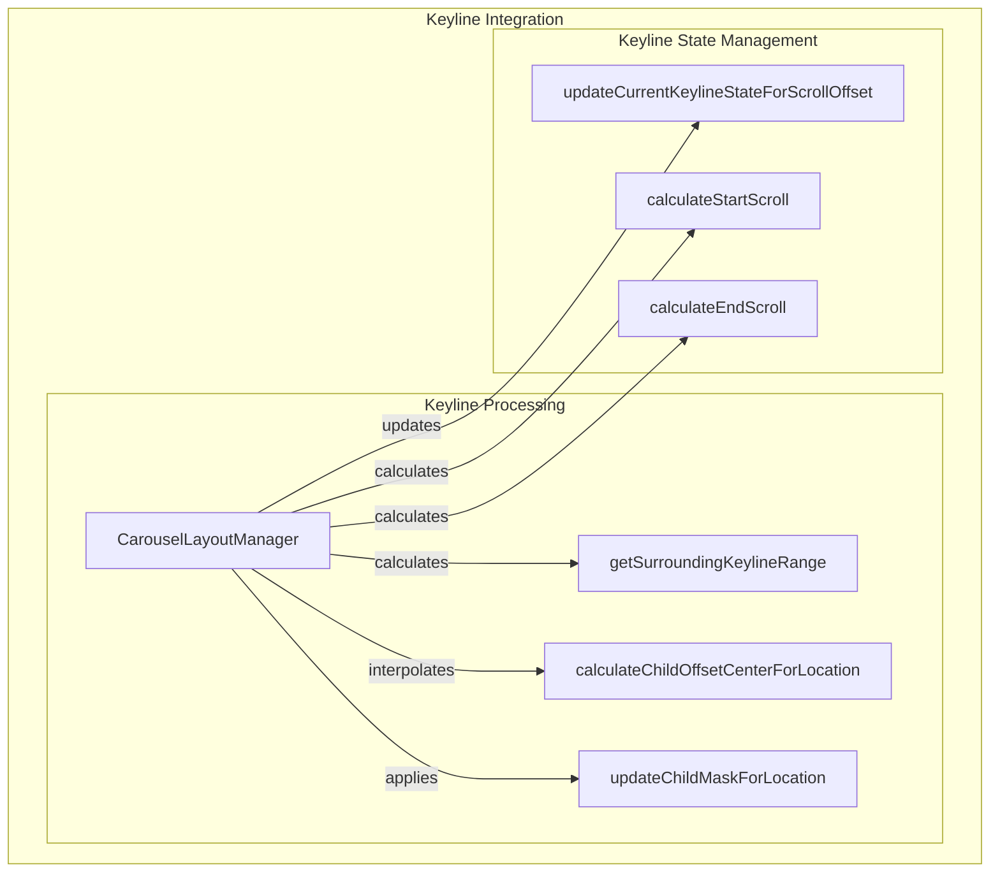
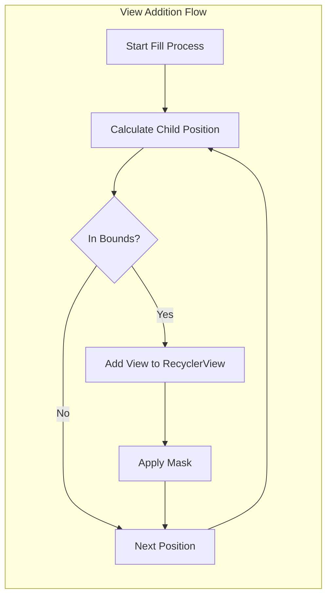
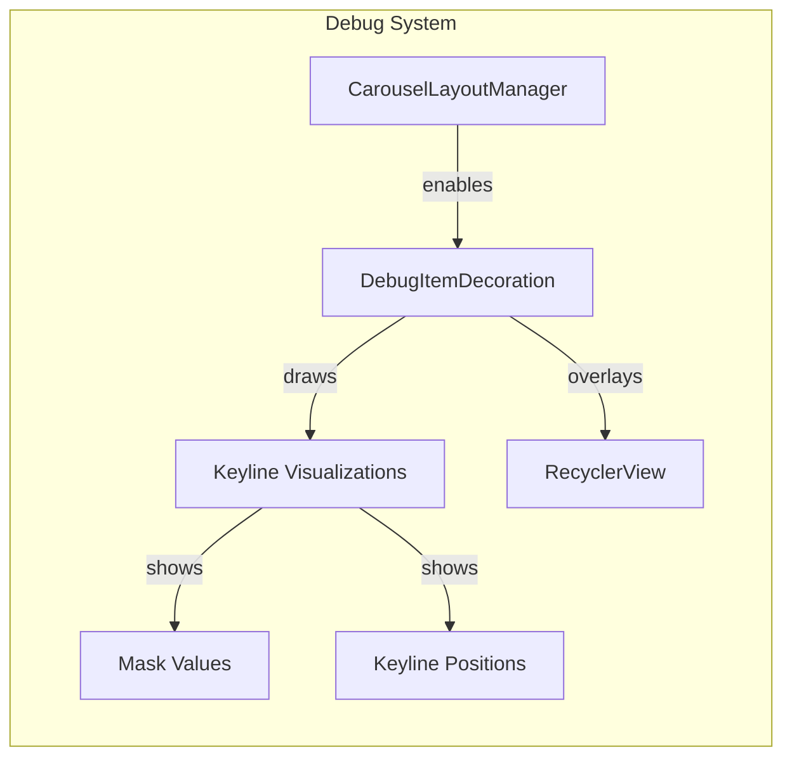
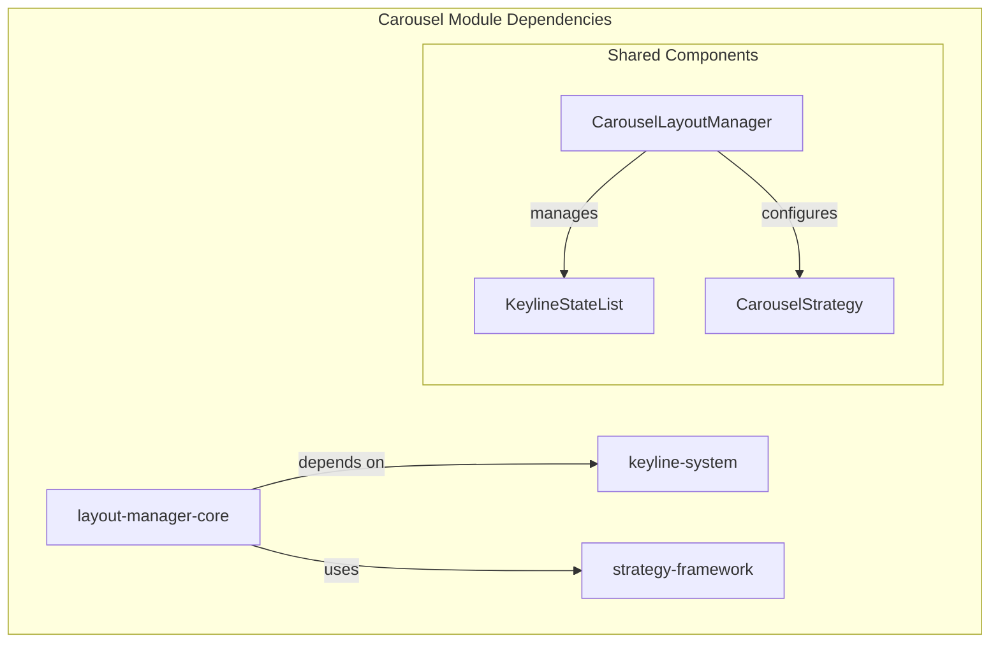
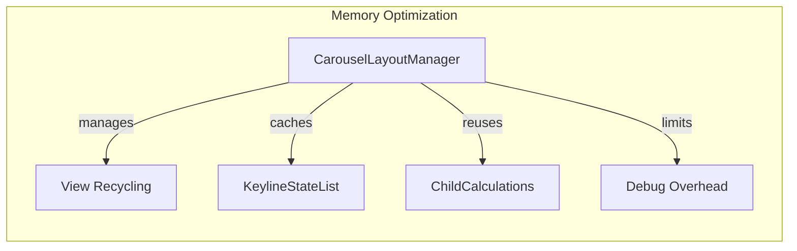

# Layout Manager Core Module

## Introduction

The layout-manager-core module is a fundamental component of the Material Design Carousel system, providing the core layout management functionality for creating sophisticated carousel interfaces. This module implements the `CarouselLayoutManager` class, which extends Android's `RecyclerView.LayoutManager` to create a unique list optimized for stylized viewing experiences with advanced masking, offsetting, and scrolling behaviors.

The module specializes in managing the positioning, sizing, and visual transformation of carousel items as they move along the scrolling axis, creating dynamic visual effects through a keyline-based layout system.

## Architecture Overview

### Core Components



### Component Relationships



## Core Functionality

### CarouselLayoutManager

The `CarouselLayoutManager` is the central component that orchestrates the entire carousel layout system. It extends `RecyclerView.LayoutManager` to provide specialized layout behavior for carousel interfaces.

#### Key Responsibilities:
- **Item Positioning**: Calculates and applies precise positioning for carousel items
- **Masking System**: Applies dynamic masking to items based on their position along keylines
- **Scroll Management**: Handles horizontal and vertical scrolling with keyline-based constraints
- **Layout Direction Support**: Supports both LTR and RTL layouts
- **Item Recycling**: Efficiently manages view recycling for performance

#### Core Features:



### LayoutDirection Helper Class

The `LayoutDirection` class provides constants for managing layout direction in focus navigation:

- `LAYOUT_START (-1)`: Indicates movement toward the start of the container
- `LAYOUT_END (1)`: Indicates movement toward the end of the container  
- `INVALID_LAYOUT (Integer.MIN_VALUE)`: Indicates invalid or unsupported layout direction

This class is crucial for proper focus navigation and accessibility support within the carousel.

## Data Flow Architecture

### Layout Process Flow



### Scroll Event Processing



## Keyline System Integration

The layout manager works closely with the keyline system to create sophisticated visual effects:



## Child View Management

### View Addition Process



### ChildCalculations Class

The `ChildCalculations` class encapsulates all necessary information for positioning and transforming a child view:

- **child**: The actual View to be laid out
- **center**: Location in the end-to-end model
- **offsetCenter**: Actual layout position after keyline interpolation
- **range**: Keyline range that surrounds the child's position

## Orientation Support

### Horizontal Layout
- Primary orientation for most carousel implementations
- Supports both LTR and RTL layouts
- Keylines are positioned along the X-axis
- Masking affects width dimensions

### Vertical Layout
- Alternative orientation for vertical carousels
- Keylines are positioned along the Y-axis
- Masking affects height dimensions
- Same keyline principles apply

## Debug Support

### DebugItemDecoration

The module includes a sophisticated debugging system through `DebugItemDecoration`:



Features:
- Visual keyline overlay with color-coded mask values
- Configurable debug line width and colors
- Real-time keyline position updates during scrolling
- Integration with RecyclerView's item decoration system

## Integration with Carousel System

### Module Dependencies



### Related Modules

- **[keyline-system](keyline-system.md)**: Provides the keyline state management and keyline calculation logic
- **[strategy-framework](strategy-framework.md)**: Supplies carousel strategies that define layout behavior
- **[carousel-overview](carousel.md)**: Parent module documentation for the complete carousel system

## Performance Considerations

### Optimization Strategies

1. **View Recycling**: Efficient view recycling minimizes memory allocation
2. **Keyline Caching**: Keyline states are cached and reused when possible
3. **Lazy Calculations**: Complex calculations are performed only when necessary
4. **Bounds Checking**: Early exit conditions prevent unnecessary processing

### Memory Management



## Usage Examples

### Basic Implementation

```java
// Create a carousel with default multi-browse strategy
CarouselLayoutManager layoutManager = new CarouselLayoutManager();

// Set custom strategy
layoutManager.setCarouselStrategy(new HeroCarouselStrategy());

// Configure alignment
layoutManager.setCarouselAlignment(CarouselLayoutManager.ALIGNMENT_CENTER);

// Apply to RecyclerView
recyclerView.setLayoutManager(layoutManager);
```

### Advanced Configuration

```java
// Create with specific orientation and strategy
CarouselLayoutManager layoutManager = new CarouselLayoutManager(
    new MultiBrowseCarouselStrategy(), 
    CarouselLayoutManager.HORIZONTAL
);

// Enable debugging for development
layoutManager.setDebuggingEnabled(recyclerView, true);
```

## Accessibility Support

The layout manager provides comprehensive accessibility features:

- **Focus Navigation**: Proper focus traversal through convertFocusDirectionToLayoutDirection()
- **Screen Reader Support**: Enhanced accessibility events with position information
- **Keyboard Navigation**: Support for directional navigation
- **RTL Support**: Full right-to-left layout support

## Error Handling

### Validation

The module includes extensive validation:

- **Child Order Validation**: Ensures proper adapter position ordering
- **View Type Validation**: Verifies all children use MaskableFrameLayout
- **Keyline State Validation**: Validates keyline calculations and ranges
- **Scroll Boundary Validation**: Enforces min/max scroll constraints

### Exception Handling

- `IllegalStateException`: Thrown for invalid child configurations
- `IllegalArgumentException`: Thrown for invalid orientation values
- Debug assertions for development-time validation

This comprehensive error handling ensures robust operation and early detection of configuration issues.