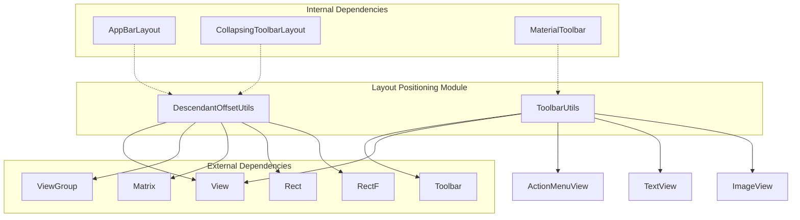
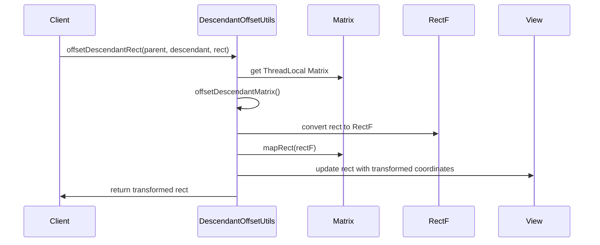
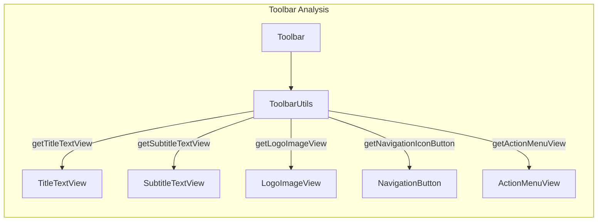
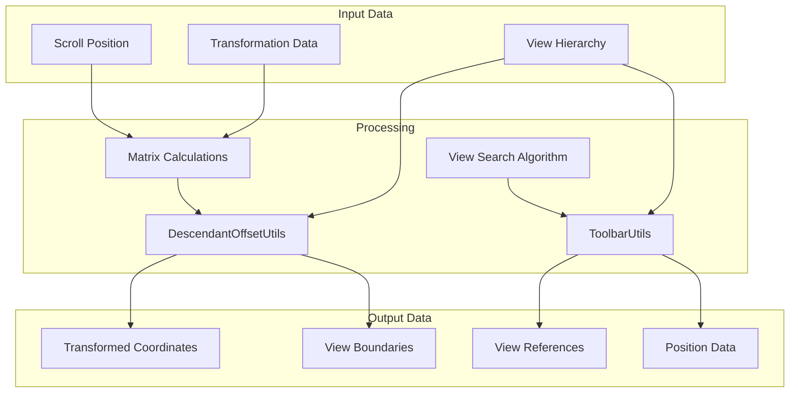
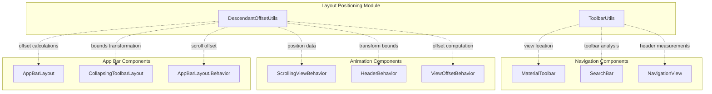
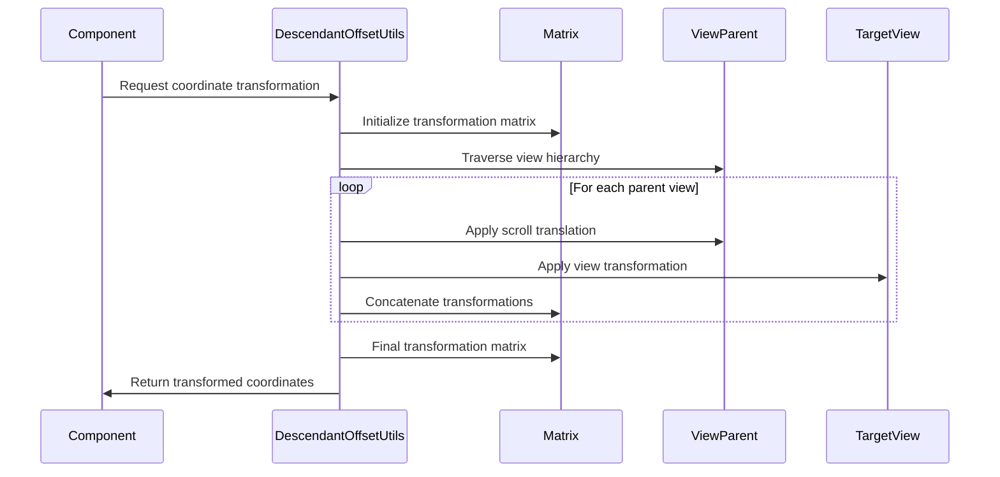
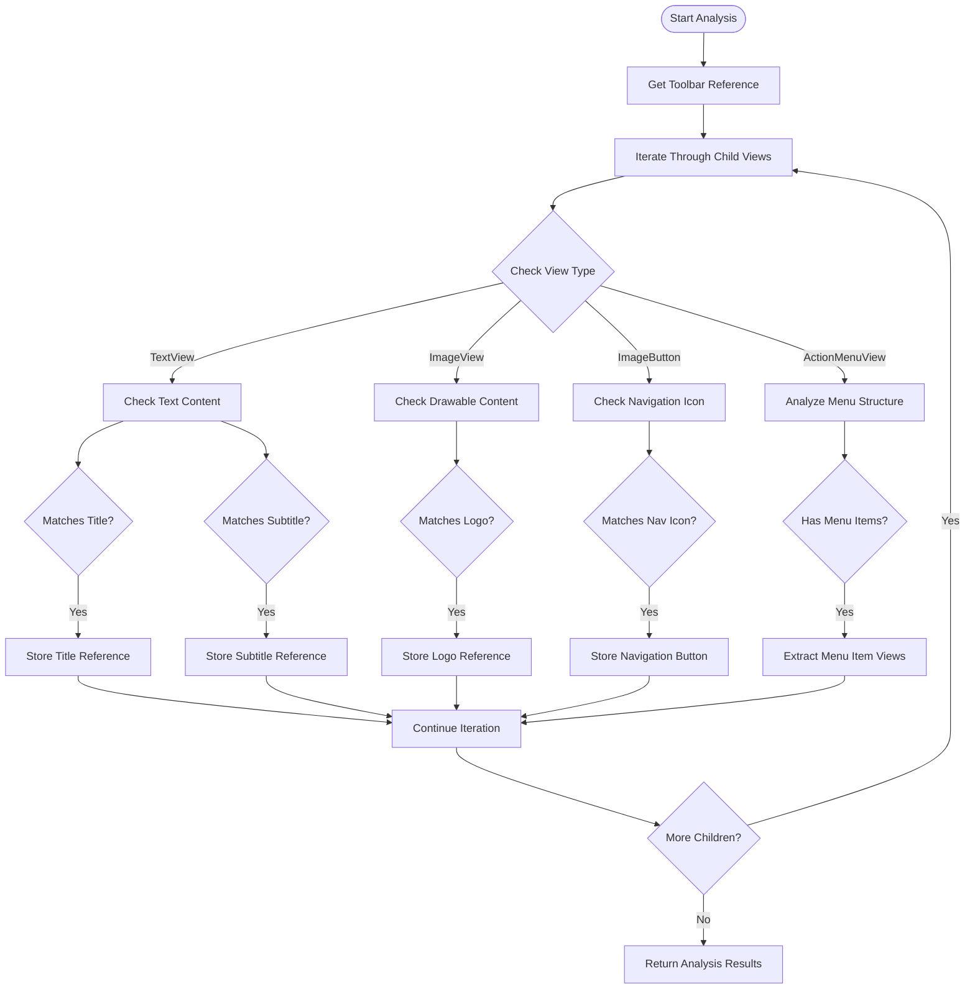

# Layout Positioning Module

The layout-positioning module provides essential utility functions for calculating view positions, offsets, and transformations within the Material Design Components library. This module serves as the foundation for accurate layout calculations and coordinate transformations across various Material Design components.

## Overview

The layout-positioning module is part of the internal utilities system and provides two primary utilities:

- **DescendantOffsetUtils**: Handles coordinate transformations and bounding rect calculations for descendant views
- **ToolbarUtils**: Provides specialized utilities for analyzing and manipulating Toolbar components

These utilities are crucial for components that need to understand spatial relationships between views, handle complex view hierarchies, and perform accurate positioning calculations.

## Architecture

## Core Components

### DescendantOffsetUtils

The `DescendantOffsetUtils` class provides essential functionality for calculating the position and bounds of descendant views within complex view hierarchies. It handles coordinate transformations that account for scroll positions, transformations, and nested view relationships.

#### Key Features:

- **Coordinate Transformation**: Converts coordinates between different view coordinate systems
- **Bounding Rectangle Calculation**: Computes the actual bounds of transformed views
- **Matrix-based Calculations**: Uses transformation matrices for accurate positioning
- **Thread-safe Operations**: Utilizes ThreadLocal storage for performance optimization

#### Core Methods:

#### Usage Pattern:

The utility is particularly useful for components that need to understand the visual position of elements within scrolling containers or transformed views, such as:

- [AppBarLayout](appbar.md) for calculating scroll offsets
- [CollapsingToolbarLayout](appbar.md) for coordinating collapse animations
- FloatingActionButton positioning relative to other components

### ToolbarUtils

The `ToolbarUtils` class provides specialized utilities for analyzing and manipulating Toolbar components. It offers methods to locate specific views within a Toolbar's view hierarchy and extract positioning information.

#### Key Features:

- **View Location**: Finds specific views (title, subtitle, logo, navigation icon) within Toolbar
- **Menu Item Access**: Provides access to ActionMenuItemView instances
- **Position Analysis**: Uses view comparison algorithms for accurate view identification
- **Type-safe Operations**: Returns properly typed view references

#### Core Methods:

#### Usage Pattern:

ToolbarUtils is essential for:

- [MaterialToolbar](appbar.md) customization and behavior implementation
- Top app bar animations and transitions
- Navigation drawer integration
- Search bar implementations

## Data Flow

## Component Interactions

The layout-positioning module interacts with various Material Design components:

## Process Flow

### Coordinate Transformation Process

### Toolbar Analysis Process

## Integration with Other Modules

The layout-positioning module serves as a foundation for several other Material Design modules:

### App Bar Integration
- Provides coordinate calculations for [AppBarLayout](appbar.md) scroll behaviors
- Enables accurate positioning for [CollapsingToolbarLayout](appbar.md) animations
- Supports header behavior implementations in the appbar-behaviors submodule

### Navigation Integration
- Facilitates [MaterialToolbar](appbar.md) analysis for navigation components
- Enables precise positioning calculations for [SearchBar](search.md) implementations
- Supports [NavigationView](navigation.md) header measurements

### Animation Integration
- Provides transformation data for [transition](transition.md) animations
- Enables accurate position calculations for [transformation](transformation.md) behaviors
- Supports coordinate mapping for [motion](common-utils.md) animations

## Best Practices

### Performance Considerations

1. **ThreadLocal Usage**: The module uses ThreadLocal for matrix and rectangle objects to avoid repeated allocations
2. **Matrix Reuse**: Transformation matrices are reset and reused to minimize garbage collection
3. **View Hierarchy Traversal**: Efficient algorithms minimize the number of view hierarchy traversals

### Usage Guidelines

1. **Coordinate System Awareness**: Always understand which coordinate system you're working with
2. **Transformation Handling**: Account for view transformations when calculating positions
3. **Scroll Position**: Include scroll positions in offset calculations
4. **View State**: Consider view visibility and state when analyzing toolbars

## Error Handling

The module implements defensive programming practices:

- **Null Safety**: All public methods include null checks
- **Type Safety**: Proper type checking before casting views
- **Bounds Checking**: Rectangle operations include bounds validation
- **Matrix Validation**: Transformation matrices are validated before use

## Thread Safety

- **ThreadLocal Storage**: Matrix and RectF objects are stored per-thread
- **Immutable Operations**: View analysis operations don't modify view state
- **Stateless Utilities**: Utility classes maintain no instance state

## Dependencies

### Internal Dependencies
- [Internal Utilities](internal.md) - Part of the internal utilities system
- [App Bar Components](appbar.md) - Primary consumer of positioning data
- [Navigation Components](navigation.md) - Uses toolbar analysis utilities

### External Dependencies
- Android View System - Core view hierarchy and transformation support
- Android Graphics - Matrix and rectangle operations
- AppCompat - Toolbar and action menu support

This module provides the essential foundation for accurate layout calculations and view positioning throughout the Material Design Components library, enabling complex animations, behaviors, and interactions to work correctly across different device configurations and view hierarchies.