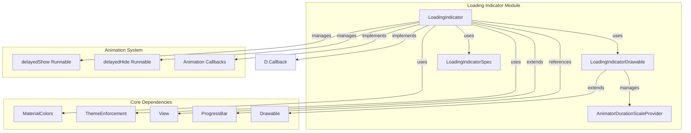
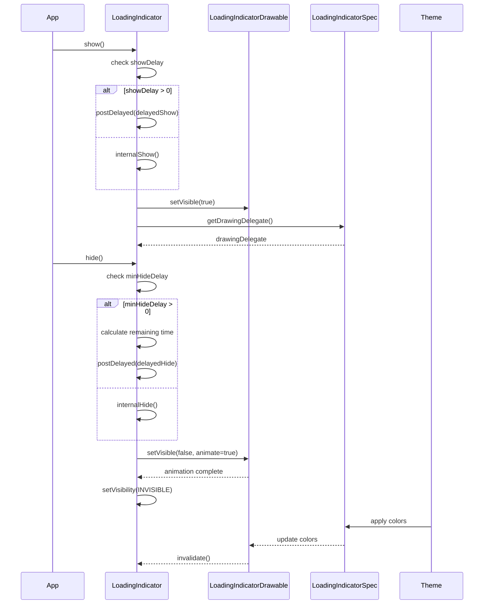
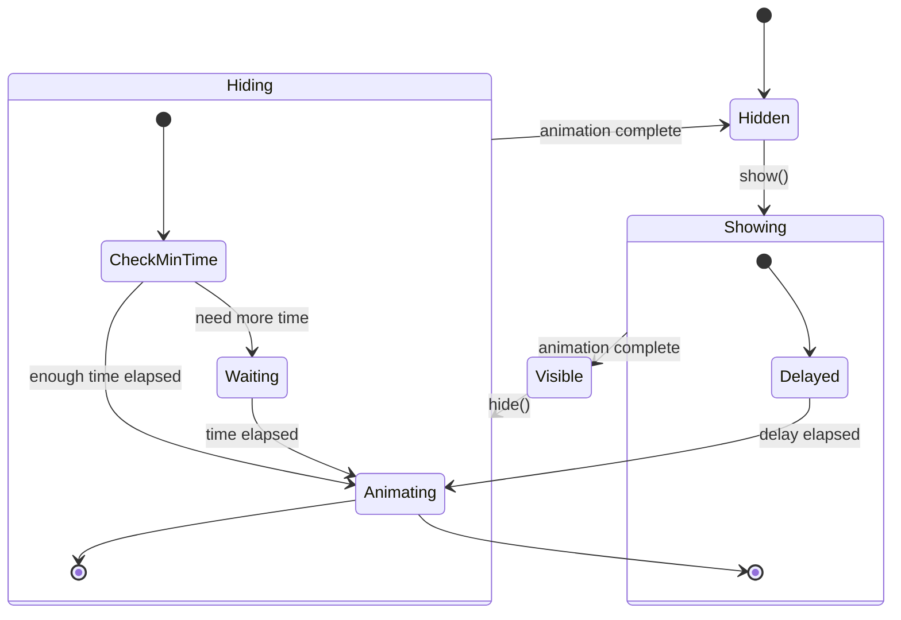

# Loading Indicator Module

## Introduction

The loading-indicator module provides a modern, Material Design-compliant loading indicator component for Android applications. It offers a flexible and customizable solution for displaying loading states with smooth animations and theming support. The module is part of the Material Design Components library and follows Material Design guidelines for loading indicators.

## Core Functionality

The loading indicator module implements a sophisticated loading animation system that provides:

- **Customizable visual appearance** with support for different indicator sizes, colors, and container dimensions
- **Smooth show/hide animations** with configurable delays and timing behaviors
- **Material Design theming integration** with automatic color scheme adaptation
- **Accessibility support** with proper content descriptions and screen reader compatibility
- **Performance optimization** with efficient drawing and animation management
- **Flexible visibility control** with delayed show/hide operations and minimum display time constraints

## Architecture Overview



## Component Architecture

### LoadingIndicator Class

The `LoadingIndicator` class is the main component that extends Android's `View` class and implements `Drawable.Callback`. It serves as the primary interface for displaying loading indicators with the following key responsibilities:

- **Visibility Management**: Controls when and how the indicator appears/disappears with support for delayed operations
- **Animation Coordination**: Manages smooth transitions between visible and hidden states
- **Drawing Operations**: Handles custom drawing of the loading indicator on canvas
- **Measurement**: Calculates optimal dimensions based on content and container constraints
- **Theme Integration**: Applies Material Design themes and color schemes automatically

### LoadingIndicatorDrawable

The `LoadingIndicatorDrawable` component handles the actual visual rendering and animation of the loading indicator. It manages:

- **Custom drawing operations** with optimized canvas rendering
- **Animation state management** with smooth transitions
- **Color and style application** based on the current theme
- **Performance optimization** through efficient redraw management

### LoadingIndicatorSpec

The `LoadingIndicatorSpec` class encapsulates all visual and behavioral specifications:

- **Dimension specifications** (indicator size, container width/height)
- **Color configurations** (indicator colors, container color)
- **Animation parameters** (timing, delays, behaviors)
- **Style attributes** derived from XML attributes and theme values

## Data Flow Architecture



## Key Features and Behaviors

### Visibility Control System

The loading indicator implements a sophisticated visibility control mechanism:

- **Show Delay**: Configurable delay before showing the indicator to prevent flashing for quick operations
- **Minimum Hide Delay**: Ensures the indicator is displayed for a minimum duration to avoid jarring user experience
- **Animation Coordination**: Smooth transitions with proper timing and easing
- **State Management**: Proper handling of visibility changes during animations

### Animation Management



### Theming and Styling

The module integrates seamlessly with Material Design theming:

- **Automatic Color Extraction**: Uses theme primary color as default indicator color
- **Customizable Color Schemes**: Support for multiple indicator colors and container colors
- **Theme Attribute Resolution**: Proper handling of theme attributes and style inheritance
- **Dynamic Color Support**: Compatibility with Material You dynamic color system

## Integration with Other Modules

### Theme Module Integration

The loading indicator module works closely with the [theme module](theme.md) for:

- **Material Theme Overlay**: Applies proper theme context wrapping
- **Color Resolution**: Uses MaterialColors for theme-aware color extraction
- **Style Inheritance**: Respects Material Design style hierarchies

### Internal Utilities Integration

Leverages [internal utilities](internal.md) for:

- **Theme Enforcement**: Ensures proper theme context application
- **View Utilities**: Handles visibility calculations and parent relationships

### Progress Indicator Module Relationship

The loading indicator is part of the broader progress indicator ecosystem:

- **Complementary Functionality**: Provides indeterminate loading animations while [base-progress-indicator](base-progress-indicator.md) handles determinate progress
- **Shared Animation Patterns**: Uses similar animation timing and visibility control mechanisms
- **Consistent API Design**: Maintains API consistency across different indicator types

## Usage Patterns

### Basic Implementation

```xml
<com.google.android.material.loadingindicator.LoadingIndicator
    android:layout_width="wrap_content"
    android:layout_height="wrap_content"
    app:indicatorSize="32dp"
    app:indicatorColor="@color/primary"
    app:showDelay="300"
    app:minHideDelay="500" />
```

### Programmatic Control

```java
LoadingIndicator indicator = findViewById(R.id.loading_indicator);

// Show with configured delay
indicator.show();

// Hide with minimum time enforcement
indicator.hide();

// Customize appearance
indicator.setIndicatorSize(48);
indicator.setIndicatorColor(Color.BLUE, Color.GREEN);
indicator.setContainerColor(Color.LTGRAY);
```

## Performance Considerations

### Optimization Strategies

- **Efficient Drawing**: Custom canvas operations with minimal overhead
- **Animation Management**: Smart animation lifecycle management to prevent resource leaks
- **Visibility Optimization**: Efficient visibility calculations to avoid unnecessary redraws
- **Memory Management**: Proper cleanup of resources and callbacks

### Best Practices

- **Appropriate Show Delays**: Use show delays to prevent flashing for quick operations
- **Minimum Hide Times**: Configure appropriate minimum hide times for better user experience
- **Color Optimization**: Use theme colors for consistency and performance
- **Size Considerations**: Choose appropriate indicator sizes for different contexts

## Accessibility Features

### Screen Reader Support

- **Proper Content Description**: Reports as ProgressBar for accessibility services
- **Visibility State Communication**: Properly communicates visibility changes
- **Animation State Handling**: Manages accessibility announcements during animations

### Visual Accessibility

- **Color Contrast**: Supports high contrast color schemes
- **Size Customization**: Allows for larger sizes for better visibility
- **Animation Control**: Respects system animation preferences

## Error Handling and Edge Cases

### Robustness Features

- **Graceful Degradation**: Handles missing resources and invalid configurations
- **State Consistency**: Maintains consistent state during rapid show/hide operations
- **Memory Safety**: Proper cleanup and resource management
- **Thread Safety**: Safe operation across different threads

### Edge Case Management

- **Rapid Visibility Changes**: Handles quick successive show/hide calls
- **Parent Visibility Changes**: Responds to parent container visibility changes
- **Window Attachment**: Manages visibility during window attachment/detachment
- **Configuration Changes**: Maintains state during configuration changes

## Future Enhancements

### Potential Improvements

- **Additional Animation Types**: Support for more animation styles and transitions
- **Enhanced Customization**: More granular control over visual appearance
- **Performance Monitoring**: Built-in performance metrics and optimization suggestions
- **Accessibility Enhancements**: Improved support for accessibility services

### Integration Opportunities

- **Motion System Integration**: Enhanced integration with Material motion system
- **Dynamic Color Support**: Expanded support for Material You dynamic colors
- **Component Library Expansion**: Additional loading indicator variants and styles