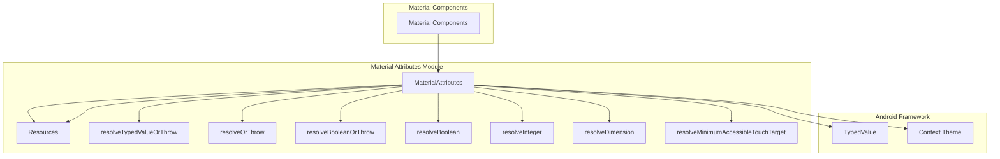
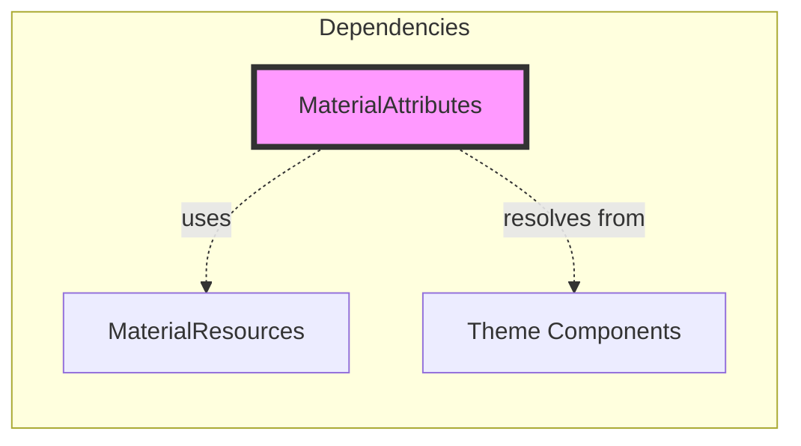
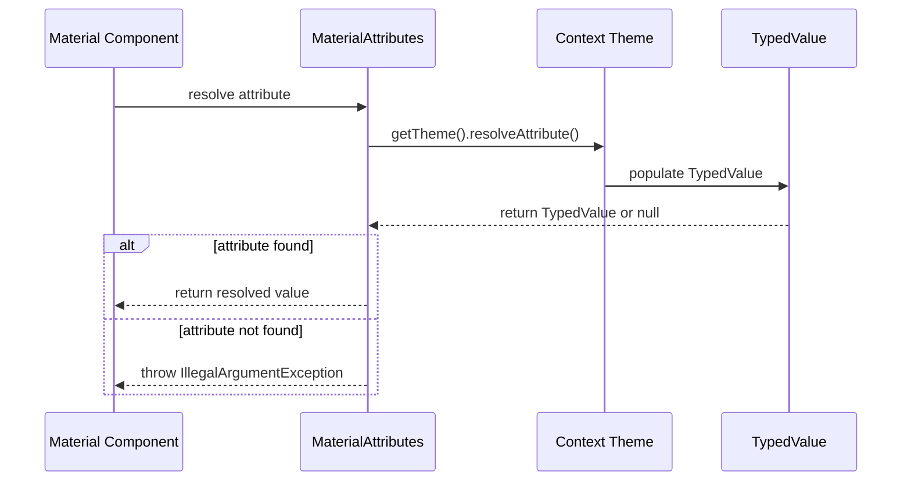
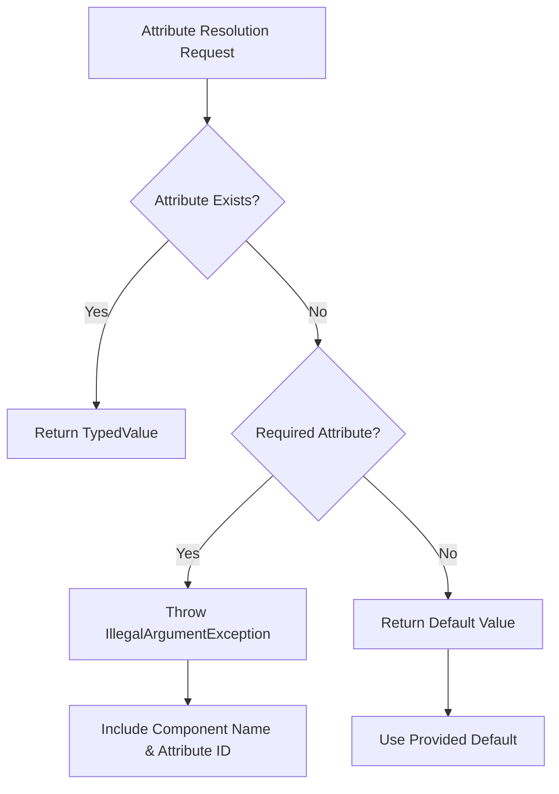
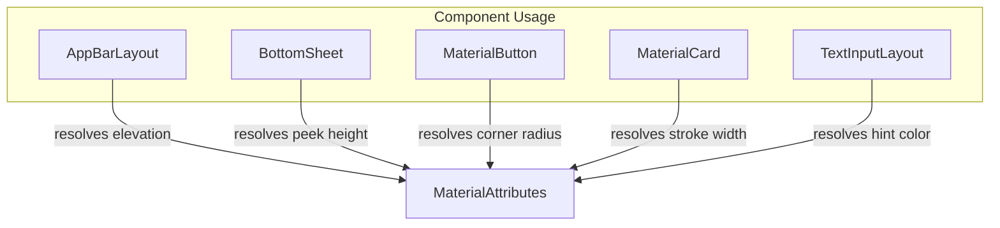
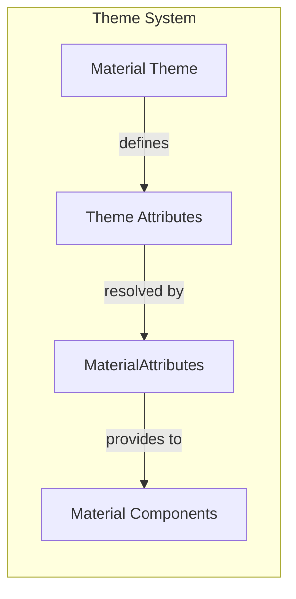

# Material Attributes Module

## Introduction

The Material Attributes module provides a centralized utility system for resolving and managing Material Design theme attributes within Android applications. This module serves as the foundation for consistent theme attribute resolution across all Material Design components, ensuring that components can reliably access theme-defined values such as colors, dimensions, and boolean flags.

## Overview

The Material Attributes module is a critical infrastructure component that enables Material Design components to dynamically resolve theme attributes at runtime. It provides a robust set of utility methods that handle attribute resolution with proper error handling, default value fallbacks, and type-specific conversions. This module ensures that Material Design components maintain visual consistency and accessibility standards across different themes and configurations.

## Architecture

### Core Architecture



### Component Dependencies



## Core Components

### MaterialAttributes Class

The `MaterialAttributes` class is the primary utility class that provides static methods for resolving theme attributes. It serves as a comprehensive toolkit for attribute resolution with built-in error handling and type safety.

#### Key Features:
- **Type-safe attribute resolution**: Provides methods for different data types (boolean, integer, dimension)
- **Error handling**: Throws descriptive exceptions when required attributes are missing
- **Default value support**: Returns default values when attributes are not present
- **Accessibility compliance**: Includes methods for resolving accessibility-related dimensions

#### Core Methods:

##### Attribute Resolution
- `resolve()`: Basic attribute resolution returning TypedValue
- `resolveTypedValueOrThrow()`: Resolution with mandatory attribute validation
- `resolveOrThrow()`: Direct integer value resolution with error handling

##### Type-specific Resolution
- `resolveBooleanOrThrow()`: Boolean attribute resolution with validation
- `resolveBoolean()`: Boolean resolution with default fallback
- `resolveInteger()`: Integer resolution with default fallback
- `resolveDimension()`: Dimension resolution with unit conversion

##### Accessibility Support
- `resolveMinimumAccessibleTouchTarget()`: Resolves minimum touch target size for accessibility compliance

## Data Flow

### Attribute Resolution Flow



### Error Handling Flow



## Component Interactions

### Integration with Material Components

The Material Attributes module is extensively used across all Material Design components to ensure consistent theme attribute resolution:



### Theme Integration



## Key Features

### 1. Type Safety
The module provides type-specific resolution methods that ensure correct data type conversion and validation, preventing runtime type errors.

### 2. Error Handling
Comprehensive error messages that include the component name and attribute ID help developers quickly identify and fix missing theme attributes.

### 3. Accessibility Support
Built-in method for resolving minimum accessible touch target sizes ensures compliance with accessibility guidelines.

### 4. Default Value Handling
Flexible default value support allows components to function gracefully when optional attributes are not defined in the theme.

### 5. Performance Optimization
Efficient attribute resolution with minimal object creation and direct access to Android's theme resolution system.

## Usage Patterns

### Basic Attribute Resolution
```java
// Resolve a required attribute
int colorPrimary = MaterialAttributes.resolveOrThrow(context, R.attr.colorPrimary, "MyComponent");

// Resolve with default value
boolean isElevated = MaterialAttributes.resolveBoolean(context, R.attr.elevated, true);

// Resolve dimension with default
int cornerRadius = MaterialAttributes.resolveDimension(context, R.attr.cornerRadius, R.dimen.default_corner_radius);
```

### Accessibility Compliance
```java
// Ensure minimum touch target size
int minTouchTarget = MaterialAttributes.resolveMinimumAccessibleTouchTarget(context);
```

## Error Handling

The module implements comprehensive error handling with descriptive messages:

- **Missing Required Attributes**: Throws `IllegalArgumentException` with component name and attribute ID
- **Type Mismatches**: Handles type validation and provides appropriate fallbacks
- **Theme Context Issues**: Validates context and theme availability

## Performance Considerations

- **Object Reuse**: Minimizes object creation by reusing `TypedValue` instances
- **Direct Theme Access**: Uses Android's native theme resolution for optimal performance
- **Lazy Resolution**: Attributes are resolved only when needed

## Integration with Other Modules

The Material Attributes module serves as a foundation for other resource-related modules:

- **[Material Resources](material-resources.md)**: Uses MaterialAttributes for theme attribute resolution
- **[Theme Management](theme.md)**: Depends on MaterialAttributes for theme validation
- **[Color System](color.md)**: Utilizes MaterialAttributes for color attribute resolution

## Best Practices

### 1. Use Type-Specific Methods
Always use the appropriate type-specific method (e.g., `resolveBoolean()` for boolean attributes) to ensure type safety.

### 2. Provide Meaningful Error Context
Include the component name when using `resolveOrThrow()` methods to help with debugging.

### 3. Handle Optional Attributes Gracefully
Use methods with default value parameters for optional attributes to prevent crashes.

### 4. Consider Accessibility
Always use `resolveMinimumAccessibleTouchTarget()` when defining touch targets to ensure accessibility compliance.

## Summary

The Material Attributes module is a fundamental infrastructure component that enables consistent and reliable theme attribute resolution across the entire Material Design system. It provides a robust foundation for theme integration, accessibility compliance, and component consistency, making it an essential part of the Material Design component ecosystem.