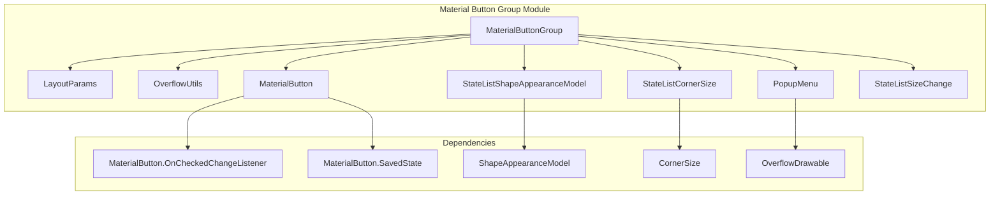
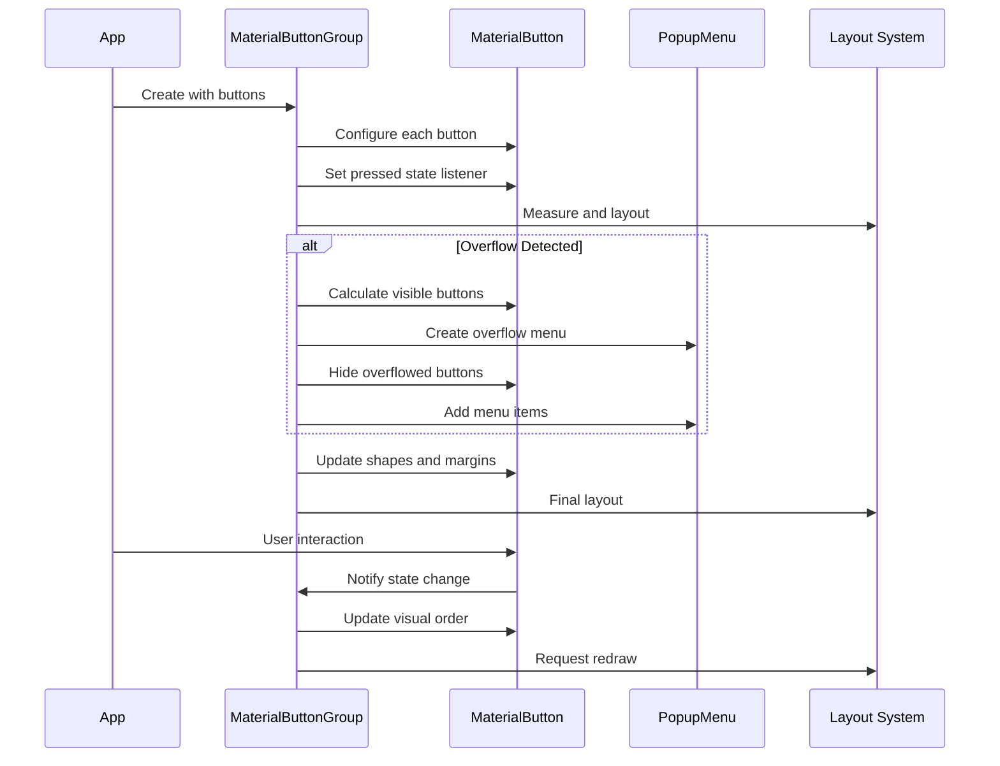
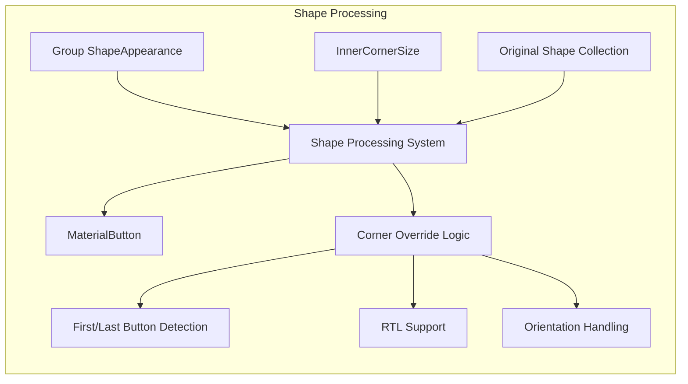
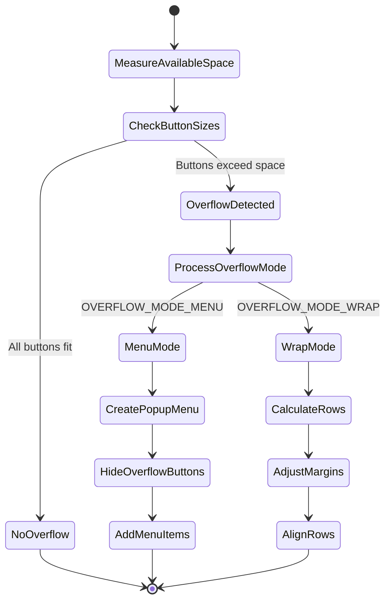
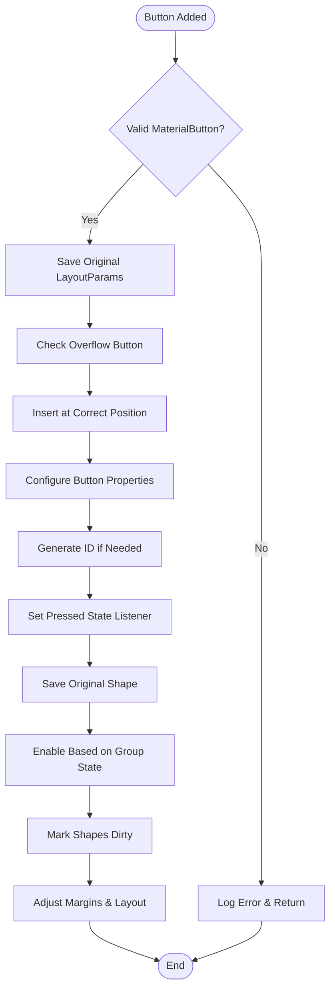
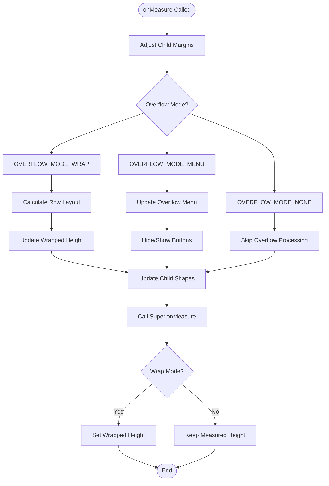

# Material Button Group Module

## Introduction

The Material Button Group module provides a container component for managing multiple MaterialButton instances as a cohesive group. It extends LinearLayout to create visually connected button groups with advanced features like overflow handling, shape morphing, and dynamic sizing. This module is part of the Material Design Components library for Android and enables developers to create sophisticated button layouts that adapt to different screen sizes and content requirements.

## Architecture Overview

The MaterialButtonGroup serves as the central component that orchestrates multiple MaterialButton children, providing intelligent layout management, visual cohesion, and overflow handling capabilities.



## Core Components

### MaterialButtonGroup

The main container class that extends LinearLayout to manage a group of MaterialButton instances. It provides sophisticated layout management, overflow handling, and visual cohesion between buttons.

**Key Features:**
- **Overflow Management**: Three modes (NONE, MENU, WRAP) for handling buttons that don't fit
- **Shape Morphing**: Automatically adjusts corner radii to create visually connected buttons
- **Dynamic Sizing**: Supports width changes and size morphing on state changes
- **Spacing Control**: Intelligent stroke overlap prevention and spacing management
- **State Management**: Tracks pressed and checked states for proper visual ordering

**Overflow Modes:**
- `OVERFLOW_MODE_NONE`: No special handling for overflow
- `OVERFLOW_MODE_MENU`: Excess buttons moved to popup menu
- `OVERFLOW_MODE_WRAP`: Buttons wrap to additional rows

### LayoutParams

Custom layout parameters that extend LinearLayout.LayoutParams to provide button-group-specific properties.

**Properties:**
- `overflowIcon`: Custom icon for overflow menu items
- `overflowText`: Custom text for overflow menu items
- Standard LinearLayout parameters (width, height, weight, margins)

### OverflowUtils

Utility class providing common functionality for overflow features across MaterialButtonGroup and OverflowLinearLayout.

**Key Method:**
- `getMenuItemText()`: Determines appropriate text for overflow menu items based on button properties

## Data Flow Architecture



## Component Interactions

### Shape Management System



### Overflow Handling System



## Process Flows

### Button Addition Process



### Layout and Measurement Process



## Key Dependencies

### Internal Dependencies

- **[MaterialButton](material-button.md)**: The core button component that this group manages
- **[StateListShapeAppearanceModel](shape.md)**: Handles shape appearance changes based on states
- **[StateListCornerSize](shape.md)**: Manages corner size variations across different states
- **[StateListSizeChange](shape.md)**: Controls size changes for morphing effects

### External Dependencies

- **LinearLayout**: Base class providing linear arrangement capabilities
- **PopupMenu**: Used for overflow menu functionality
- **ThemeEnforcement**: Ensures proper theming and attribute resolution
- **ViewUtils**: Provides utility functions for layout calculations

## Configuration and Usage

### XML Configuration

```xml
<com.google.android.material.button.MaterialButtonGroup
    android:id="@+id/button_group"
    android:layout_width="match_parent"
    android:layout_height="wrap_content"
    android:orientation="horizontal"
    app:spacing="4dp"
    app:innerCornerSize="8dp"
    app:overflowMode="menu"
    app:overflowButtonIcon="@drawable/ic_more_vert">
    
    <com.google.android.material.button.MaterialButton
        android:layout_width="wrap_content"
        android:layout_height="wrap_content"
        android:text="Button 1" />
    
    <com.google.android.material.button.MaterialButton
        android:layout_width="wrap_content"
        android:layout_height="wrap_content"
        android:text="Button 2" />
        
</com.google.android.material.button.MaterialButtonGroup>
```

### Programmatic Usage

```java
MaterialButtonGroup buttonGroup = findViewById(R.id.button_group);

// Configure overflow mode
buttonGroup.setOverflowMode(MaterialButtonGroup.OVERFLOW_MODE_MENU);

// Set spacing between buttons
buttonGroup.setSpacing(8);

// Configure inner corner size for connected appearance
buttonGroup.setInnerCornerSize(new AbsoluteCornerSize(12));

// Add buttons programmatically
MaterialButton newButton = new MaterialButton(context);
newButton.setText("New Button");
buttonGroup.addView(newButton);
```

## Advanced Features

### Shape Morphing

The group automatically adjusts corner radii to create visually connected buttons:
- First and last buttons keep their outer corners
- Inner buttons have their adjacent corners overridden with inner corner size
- Supports both horizontal and vertical orientations
- Handles RTL layouts automatically

### Dynamic Sizing

Supports width morphing animations:
- Buttons can expand/contract based on state changes
- Neighboring buttons automatically adjust to accommodate size changes
- Prevents text truncation through intelligent size calculations
- Supports per-edge expansion (start, end, or both)

### Overflow Management

Three strategies for handling buttons that don't fit:
1. **Menu Mode**: Excess buttons moved to popup menu with custom icons/text
2. **Wrap Mode**: Buttons flow to additional rows with proper alignment
3. **None Mode**: Standard LinearLayout behavior

## Best Practices

### Performance Considerations

- Shape updates are batched and only applied when necessary
- Child order is cached and updated only on state changes
- Overflow calculations are optimized to avoid unnecessary work
- Margin adjustments are minimized through intelligent caching

### Accessibility

- Maintains proper content descriptions for overflow buttons
- Preserves button states in overflow menu items
- Supports screen readers and navigation
- Maintains touch target sizes

### Theming

- Inherits Material Design theming attributes
- Supports custom shape appearance models
- Integrates with MaterialThemeOverlay
- Provides consistent styling with other Material components

## Integration with Other Modules

The MaterialButtonGroup integrates with several other modules in the Material Design system:

- **[Shape Module](shape.md)**: For advanced shape customization and state-based appearance changes
- **[Material Button Module](material-button.md)**: For individual button configuration and behavior
- **[Theme Module](theme.md)**: For consistent theming and styling across the application
- **[Internal Utilities](internal.md)**: For layout calculations and theme enforcement

This integration ensures that MaterialButtonGroup provides a cohesive experience that aligns with Material Design principles while offering the flexibility needed for complex button group scenarios.