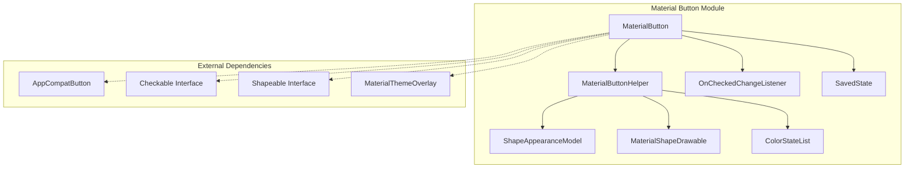
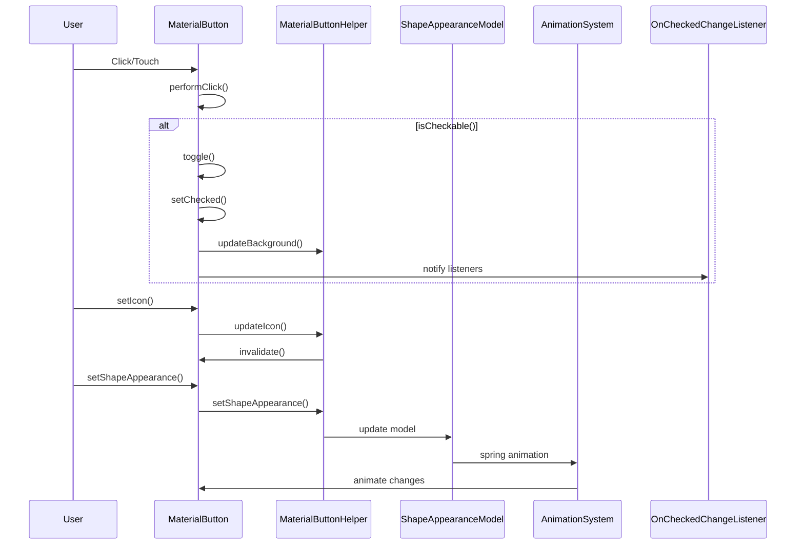
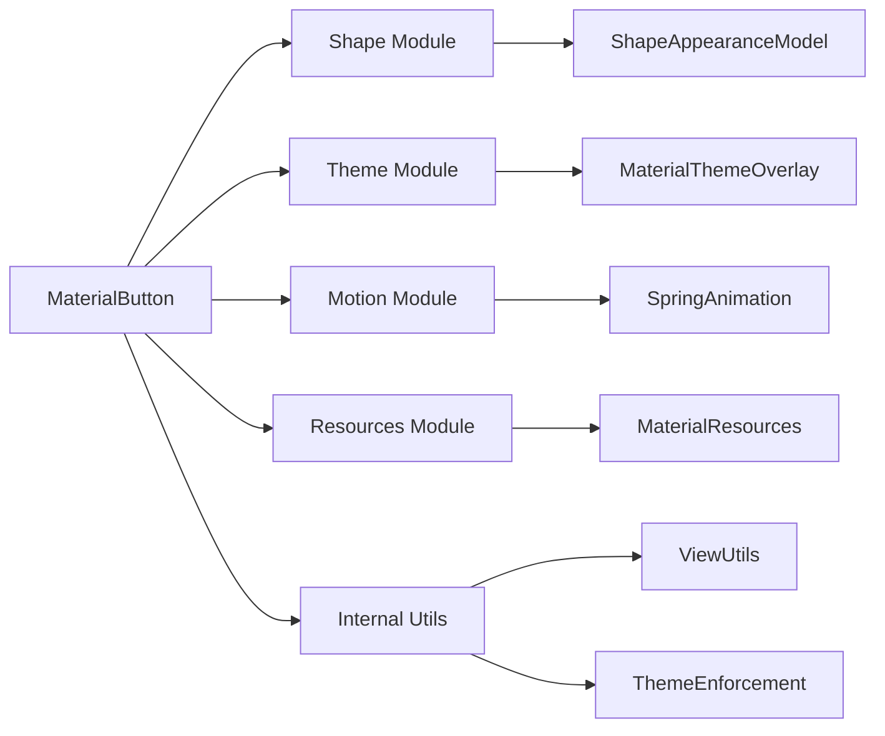
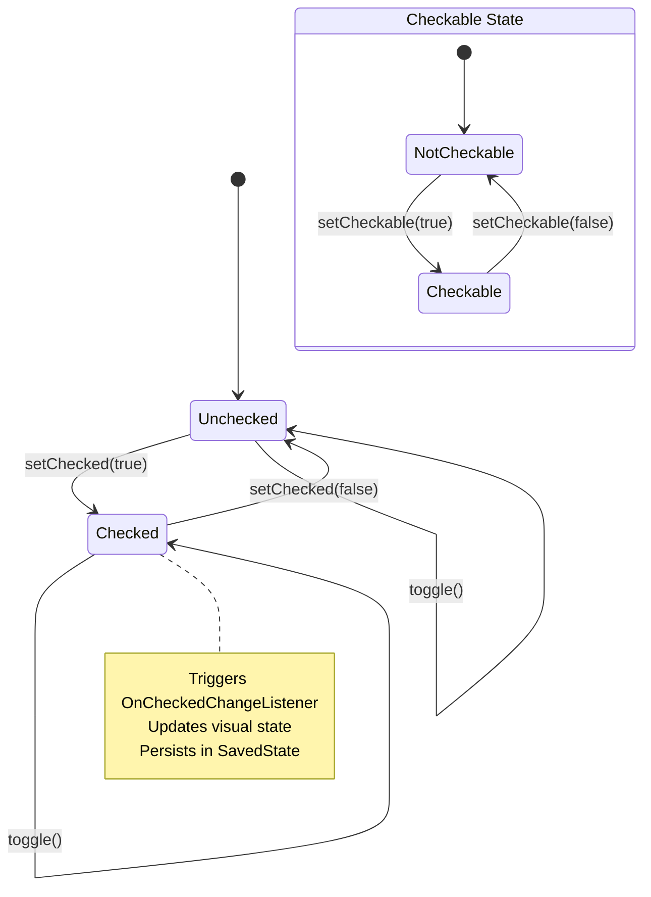

# Material Button Module Documentation

## Introduction

The Material Button module provides a comprehensive implementation of Material Design buttons for Android applications. It extends the standard AppCompatButton with Material Design principles, offering enhanced styling, theming, and interaction capabilities while maintaining backward compatibility and accessibility support.

## Core Functionality

The MaterialButton class serves as the primary component, implementing a feature-rich button that supports:

- **Material Design Styling**: Automatic application of Material Design themes and colors
- **Icon Support**: Flexible icon positioning with multiple gravity options
- **Shape Customization**: Dynamic corner radius and shape appearance modeling
- **State Management**: Checkable functionality with state persistence
- **Animation Support**: Spring-based animations for size and shape changes
- **Accessibility**: Full accessibility support with proper state announcements

## Architecture Overview

### Component Structure



### Key Components

#### MaterialButton
The main class that extends AppCompatButton and implements Checkable and Shapeable interfaces. It manages:
- Icon positioning and styling
- Background drawable management
- State handling (checked/unchecked)
- Animation coordination
- Accessibility features

#### OnCheckedChangeListener
Interface for monitoring checked state changes:
```java
public interface OnCheckedChangeListener {
    void onCheckedChanged(MaterialButton button, boolean isChecked);
}
```

#### SavedState
Handles state persistence across configuration changes:
```java
static class SavedState extends AbsSavedState {
    boolean checked;
    // Parcelable implementation
}
```

## Data Flow Architecture



## Feature Capabilities

### Icon Management
- **Multiple Icon Positions**: START, END, TEXT_START, TEXT_END, TOP, TEXT_TOP
- **Dynamic Sizing**: Custom icon size or intrinsic drawable size
- **Tint Support**: ColorStateList for different states
- **Padding Control**: Configurable icon-to-text spacing

### Shape and Appearance
- **Corner Radius**: Individual corner control or uniform radius
- **Stroke Support**: Configurable width and color
- **Background Tint**: ColorStateList for background colors
- **Ripple Effects**: Material Design ripple animations
- **Elevation**: Material elevation with shadow rendering

### State Management
- **Checkable Mode**: Toggle button functionality
- **State Persistence**: SavedState for configuration changes
- **Accessibility**: Proper state announcements
- **Visual Feedback**: State-based appearance changes

### Animation System
- **Spring Animations**: Physics-based animations for size changes
- **State Transitions**: Smooth transitions between states
- **Optical Centering**: Visual balance adjustments
- **Width Morphing**: Dynamic width changes in button groups

## Integration Patterns

### Basic Usage
```xml
<com.google.android.material.button.MaterialButton
    android:layout_width="wrap_content"
    android:layout_height="wrap_content"
    android:text="Material Button"
    app:icon="@drawable/ic_icon"
    app:iconGravity="textStart"
    app:cornerRadius="8dp" />
```

### Programmatic Configuration
```java
MaterialButton button = findViewById(R.id.button);
button.setIcon(iconDrawable);
button.setIconTint(iconTint);
button.setCornerRadius(16);
button.setCheckable(true);
button.addOnCheckedChangeListener((buttonView, isChecked) -> {
    // Handle state change
});
```

## Dependencies and Relationships

### Internal Dependencies
- **MaterialButtonHelper**: Manages background drawable and styling
- **ShapeAppearanceModel**: Handles shape definitions and animations
- **MaterialShapeDrawable**: Provides Material Design drawable implementation
- **ThemeEnforcement**: Ensures proper theming
- **MotionUtils**: Spring animation utilities

### External Module Dependencies
- **[shape.md](shape.md)**: Shape appearance and modeling
- **[theme.md](theme.md)**: Material theme overlay system
- **[motion.md](motion.md)**: Animation and motion utilities
- **[resources.md](resources.md)**: Material resource handling



## State Management Flow



## Performance Considerations

### Optimization Strategies
- **Background Caching**: MaterialButtonHelper caches background drawables
- **State List Optimization**: Efficient ColorStateList handling
- **Animation Batching**: Coordinated animation updates
- **Layout Optimization**: Smart icon positioning calculations

### Memory Management
- **Drawable Recycling**: Proper drawable lifecycle management
- **State Cleanup**: Clear listener references when appropriate
- **Animation Cleanup**: Proper spring animation disposal

## Accessibility Features

### Comprehensive Support
- **Screen Reader**: Proper content descriptions and hints
- **State Announcements**: Checked/unchecked state changes
- **Navigation**: Proper focus handling and traversal
- **Touch Targets**: Minimum 48dp touch target compliance
- **High Contrast**: Support for high contrast modes

### Accessibility Implementation
```java
@Override
public void onInitializeAccessibilityNodeInfo(@NonNull AccessibilityNodeInfo info) {
    super.onInitializeAccessibilityNodeInfo(info);
    info.setClassName(getA11yClassName());
    info.setCheckable(isCheckable());
    info.setChecked(isChecked());
    info.setClickable(isClickable());
}
```

## Error Handling and Edge Cases

### Background Management
- **Custom Background Warning**: Logs warning when custom background overrides Material styling
- **State Fallback**: Graceful degradation when background is overwritten
- **Compatibility**: Maintains functionality with custom backgrounds

### Icon Handling
- **Null Safety**: Proper null checks for icon drawables
- **Size Validation**: Ensures icon size is non-negative
- **Position Fallback**: Default positioning when calculations fail

### Animation Safety
- **Spring Force Validation**: Ensures valid spring configuration
- **Animation Cancellation**: Proper cleanup of ongoing animations
- **State Consistency**: Maintains visual consistency during animations

## Testing Considerations

### Unit Testing Areas
- **State Management**: Checked/unchecked state transitions
- **Icon Positioning**: Various gravity and layout combinations
- **Accessibility**: Screen reader compatibility
- **Animation**: Spring animation behavior
- **Persistence**: SavedState restoration

### Integration Testing
- **Theme Application**: Proper Material theme integration
- **Parent Container**: Behavior within MaterialButtonGroup
- **Configuration Changes**: State preservation across rotations
- **Performance**: Animation smoothness and memory usage

## Future Enhancements

### Potential Improvements
- **Enhanced Animation**: More sophisticated transition animations
- **Icon Animation**: Support for animated icons
- **Gesture Support**: Advanced touch gesture handling
- **Performance**: Further optimization for large button groups
- **Customization**: Additional styling options

### API Evolution
- **Backward Compatibility**: Maintaining existing API contracts
- **Deprecation Strategy**: Gradual migration for outdated features
- **New Features**: Integration with emerging Material Design patterns

This documentation provides a comprehensive understanding of the Material Button module's architecture, capabilities, and integration patterns, enabling developers to effectively utilize and extend the component within their applications.