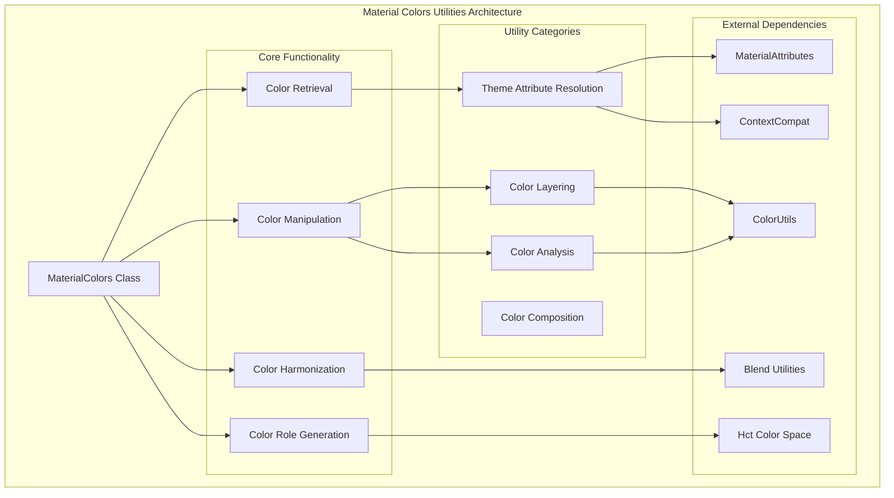
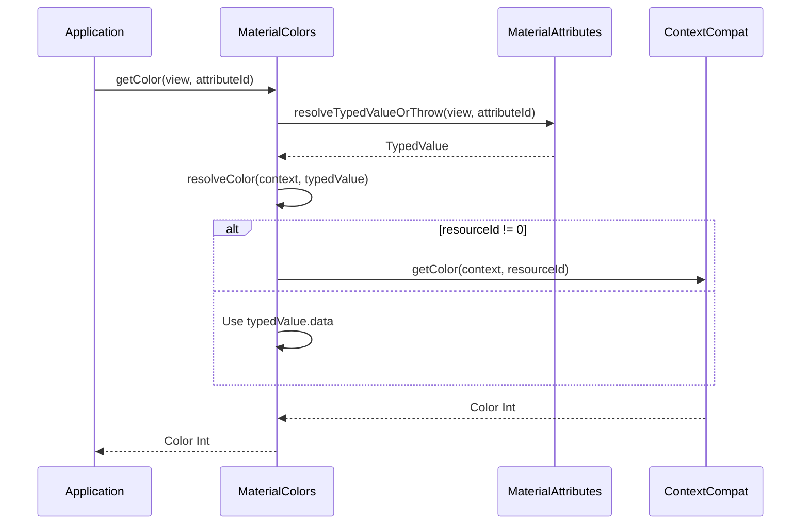
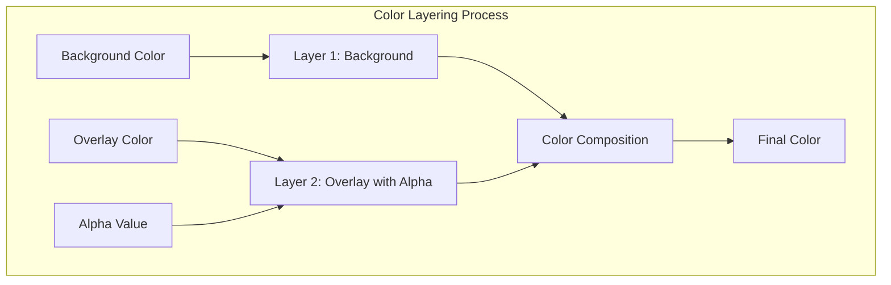
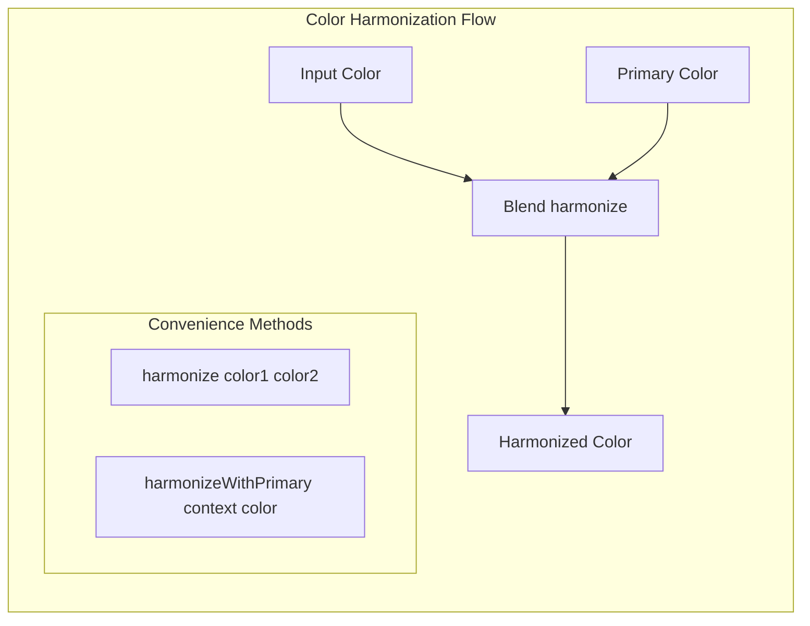
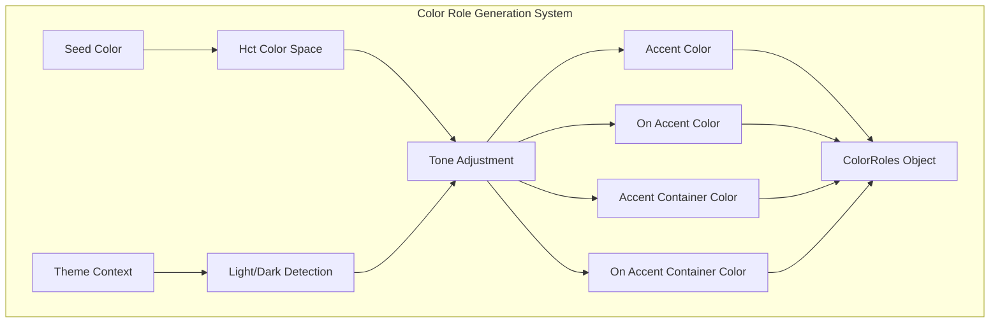
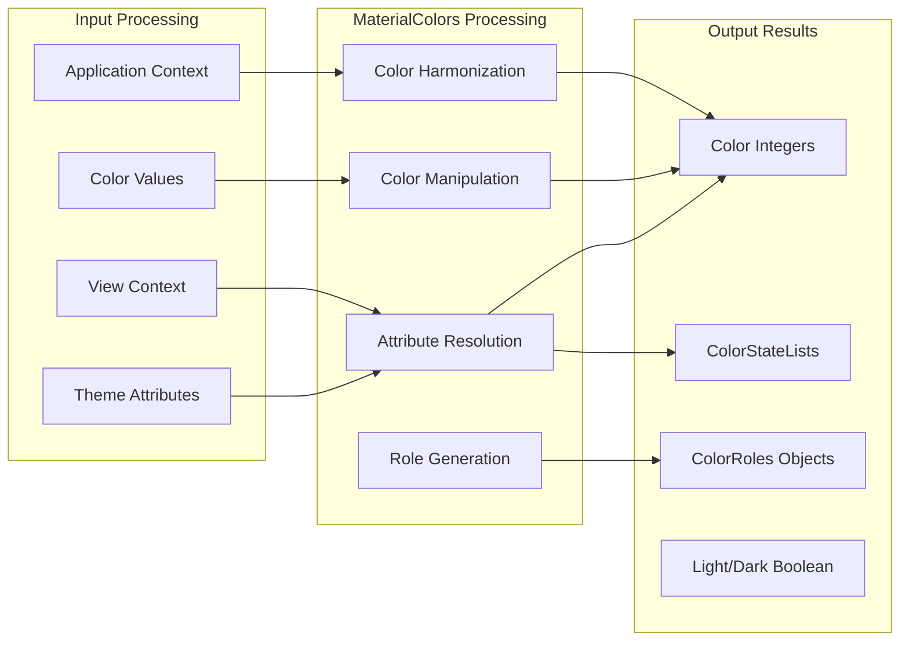
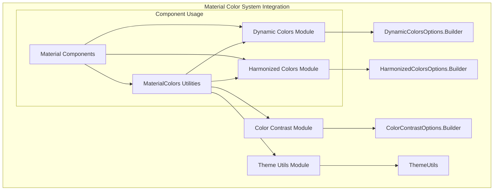
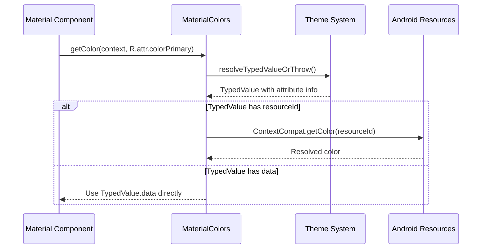
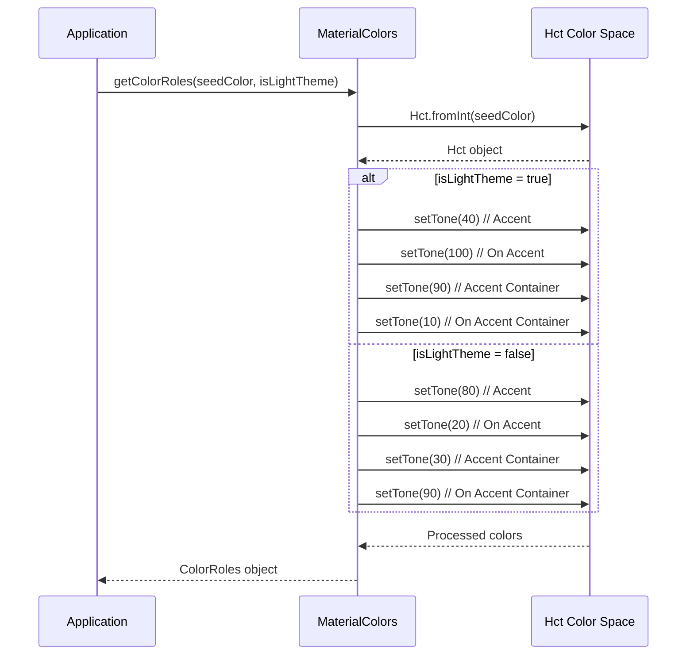

# Material Colors Utilities Module

## Introduction

The Material Colors Utilities module provides essential color manipulation and utility functions for the Material Design color system. It serves as the core computational engine for color operations, offering a comprehensive set of static utility methods for color retrieval, manipulation, harmonization, and role-based color generation. This module is fundamental to implementing consistent and accessible color schemes across Material Design components.

## Architecture Overview

## Component Structure

### Core Components

#### MaterialColors Class
The `MaterialColors` class is a static utility class that provides comprehensive color manipulation capabilities. It cannot be instantiated (private constructor) and serves as a collection of color-related utility methods.

**Key Characteristics:**
- Static utility class with private constructor
- Defines standard alpha values for Material Design
- Implements tone-based color role generation
- Provides harmonization with primary colors
- Supports both light and dark theme contexts

### Color Constants and Standards

```mermaid
graph LR
    subgraph "Material Color Standards"
        ALPHA[Alpha Constants]
        TONE[Tone Constants]
        CHROMA[Chroma Constants]
        
        ALPHA --> AF[ALPHA_FULL: 1.00]
        ALPHA --> AM[ALPHA_MEDIUM: 0.54]
        ALPHA --> AD[ALPHA_DISABLED: 0.38]
        ALPHA --> AL[ALPHA_LOW: 0.32]
        ALPHA --> ADL[ALPHA_DISABLED_LOW: 0.12]
        
        TONE --> LIGHT[Light Theme Tones]
        TONE --> DARK[Dark Theme Tones]
        
        LIGHT --> TAL[TONE_ACCENT_LIGHT: 40]
        LIGHT --> TOAL[TONE_ON_ACCENT_LIGHT: 100]
        LIGHT --> TACL[TONE_ACCENT_CONTAINER_LIGHT: 90]
        LIGHT --> TOACL[TONE_ON_ACCENT_CONTAINER_LIGHT: 10]
        LIGHT --> TSCL[TONE_SURFACE_CONTAINER_LIGHT: 94]
        LIGHT --> TSCHL[TONE_SURFACE_CONTAINER_HIGH_LIGHT: 92]
        
        DARK --> TAD[TONE_ACCENT_DARK: 80]
        DARK --> TOAD[TONE_ON_ACCENT_DARK: 20]
        DARK --> TACD[TONE_ACCENT_CONTAINER_DARK: 30]
        DARK --> TOACD[TONE_ON_ACCENT_CONTAINER_DARK: 90]
        DARK --> TSCD[TONE_SURFACE_CONTAINER_DARK: 12]
        DARK --> TSCHD[TONE_SURFACE_CONTAINER_HIGH_DARK: 17]
        
        CHROMA --> CN[CHROMA_NEUTRAL: 6]
    end
```

## Functionality Categories

### 1. Color Retrieval Methods

**Key Methods:**
- `getColor(View, int)` - Get color from view's context
- `getColor(Context, int, String)` - Get color with error message
- `getColor(View, int, int)` - Get color with default value
- `getColor(Context, int, int)` - Get color with default value
- `getColorOrNull(Context, int)` - Get color or null
- `getColorStateList()` - Get ColorStateList variants

### 2. Color Manipulation Methods

#### Color Layering

**Methods:**
- `layer(int, int)` - Composite two colors
- `layer(int, int, float)` - Composite with alpha
- `layer(View, int, int)` - Layer theme attributes
- `layer(View, int, int, float)` - Layer theme attributes with alpha
- `compositeARGBWithAlpha(int, int)` - Apply additional alpha

#### Color Analysis
- `isColorLight(int)` - Determine if color is light/dark
- Uses luminance calculation with 0.5 threshold
- Handles transparent colors appropriately

### 3. Color Harmonization

**Harmonization Methods:**
- `harmonize(int, int)` - Harmonize two colors using Blend utilities
- `harmonizeWithPrimary(Context, int)` - Harmonize with theme's primary color

### 4. Color Role Generation

**Color Role Methods:**
- `getColorRoles(Context, int)` - Generate color roles from seed color
- `getColorRoles(int, boolean)` - Generate roles with explicit theme
- `getSurfaceContainerFromSeed(Context, int)` - Generate surface container color
- `getSurfaceContainerHighFromSeed(Context, int)` - Generate surface container high color

## Data Flow Architecture

## Integration with Material Design System

### Relationship to Other Color Modules

### Usage Patterns

1. **Theme Attribute Resolution**: Components use MaterialColors to resolve theme attributes to actual color values
2. **Color Harmonization**: Ensures visual consistency by harmonizing colors with the primary theme color
3. **Accessibility**: Provides proper color contrast through role-based color generation
4. **Dynamic Theming**: Supports dynamic color extraction and application

## Process Flow Examples

### Color Retrieval Process

### Color Role Generation Process

## Key Dependencies

### Internal Dependencies
- **MaterialAttributes**: For theme attribute resolution
- **ColorRoles**: Data class for color role collections
- **Hct**: HCT color space manipulation
- **Blend**: Color harmonization algorithms

### External Dependencies
- **AndroidX Core**: ContextCompat for resource resolution
- **AndroidX Annotation**: Type safety annotations
- **Android Graphics**: Color utilities and ColorStateList
- **Android Util**: TypedValue for attribute resolution

## Best Practices

1. **Error Handling**: Always provide default values when using color retrieval methods
2. **Theme Awareness**: Use context-aware methods for theme-dependent operations
3. **Performance**: Cache color values when used repeatedly
4. **Accessibility**: Leverage color role generation for consistent accessibility
5. **Harmonization**: Use color harmonization to maintain visual consistency

## Related Documentation

- [dynamic-colors-core.md](dynamic-colors-core.md) - Dynamic color system implementation
- [harmonized-colors-core.md](harmonized-colors-core.md) - Color harmonization system
- [color-contrast-core.md](color-contrast-core.md) - Color contrast utilities
- [theme-utils.md](theme-utils.md) - Theme utility functions

## Summary

The Material Colors Utilities module is the computational foundation of the Material Design color system. It provides a comprehensive set of utility methods for color manipulation, ensuring consistent and accessible color usage across all Material components. Through its integration with the HCT color space and adherence to Material Design color principles, it enables developers to create visually cohesive and accessible user interfaces that adapt to different themes and contexts.