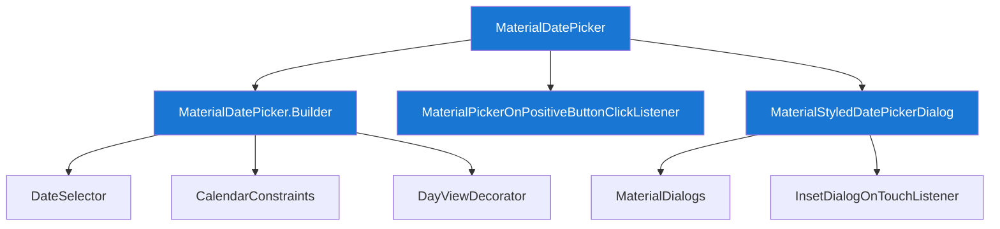
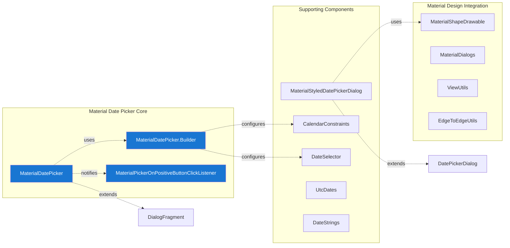
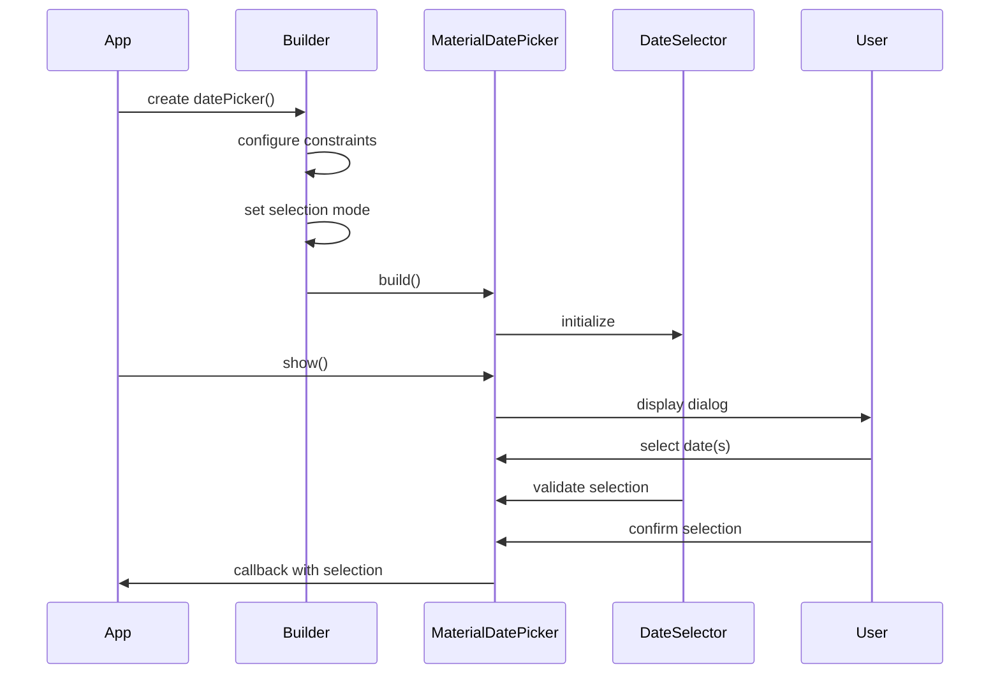
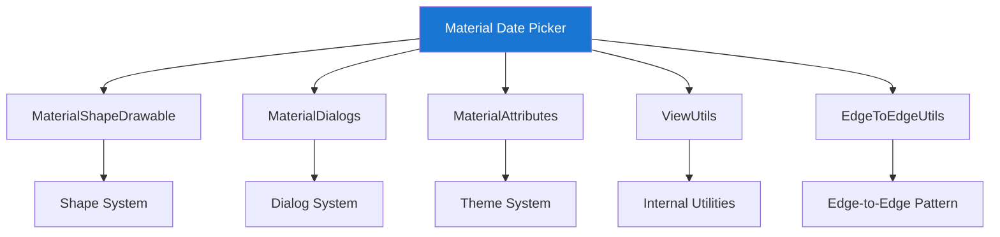

# Material Date Picker Module

The Material Date Picker module provides a comprehensive date selection interface following Material Design guidelines. It offers both calendar and text input modes for selecting single dates or date ranges, with extensive customization options and accessibility support.

## Overview

The Material Date Picker module is a sophisticated dialog-based component that enables users to select dates through an intuitive interface. It supports both single date and date range selection modes, with the ability to switch between calendar view and text input view. The module integrates seamlessly with the broader Material Design ecosystem and provides extensive theming and customization capabilities.

## Architecture

### Core Components

The module consists of several key components that work together to provide a complete date picking experience:



### Component Relationships



## Key Features

### 1. Dual Input Modes
The date picker supports two distinct input modes:
- **Calendar Mode** (`INPUT_MODE_CALENDAR`): Visual calendar interface for date selection
- **Text Input Mode** (`INPUT_MODE_TEXT`): Text-based date input with validation

### 2. Selection Types
- **Single Date Selection**: Choose individual dates
- **Date Range Selection**: Select start and end dates for ranges

### 3. Customization Options
- Theme customization with Material Design support
- Custom titles, button text, and content descriptions
- Calendar constraints for date range limitations
- Day view decorators for custom date styling

### 4. Accessibility Features
- Comprehensive content descriptions
- Screen reader support
- Keyboard navigation compatibility
- Touch target optimization

## Data Flow



## Component Details

### MaterialDatePicker<S>
The main dialog fragment that presents the date picker interface. It manages the overall state, handles user interactions, and coordinates between different components.

**Key Responsibilities:**
- Dialog lifecycle management
- Input mode switching (calendar ↔ text)
- Selection validation and confirmation
- Event listener management
- Theme and styling application

### MaterialDatePicker.Builder<S>
A fluent builder pattern implementation for creating configured MaterialDatePicker instances. Provides extensive customization options while maintaining type safety.

**Configuration Options:**
- Date selection type (single/range)
- Calendar constraints and valid date ranges
- Custom titles and button text
- Input mode preferences
- Theme overrides
- Day view decorators

### MaterialPickerOnPositiveButtonClickListener<S>
A functional interface that defines the callback mechanism for date selection confirmation. Ensures type-safe communication of selected dates back to the application.

### MaterialStyledDatePickerDialog
A Material Design styled wrapper around the standard Android DatePickerDialog, providing consistent theming and styling with other Material components.

## Integration with Material Design System

The date picker module integrates with several other Material Design components:



## Usage Patterns

### Basic Single Date Selection
```java
MaterialDatePicker<Long> picker = MaterialDatePicker.Builder.datePicker()
    .setTitleText("Select Date")
    .setSelection(MaterialDatePicker.todayInUtcMilliseconds())
    .build();
```

### Date Range Selection
```java
MaterialDatePicker<Pair<Long, Long>> picker = MaterialDatePicker.Builder.dateRangePicker()
    .setTitleText("Select Date Range")
    .setCalendarConstraints(constraints)
    .build();
```

### Custom Constraints
```java
CalendarConstraints constraints = new CalendarConstraints.Builder()
    .setStart(minDate)
    .setEnd(maxDate)
    .setValidator(DateValidatorPointForward.now())
    .build();
```

## Accessibility and Internationalization

The module provides comprehensive support for accessibility and internationalization:

- **Content Descriptions**: All interactive elements have appropriate content descriptions
- **Screen Reader Support**: Full compatibility with TalkBack and other screen readers
- **RTL Support**: Proper layout mirroring for right-to-left languages
- **Date Formatting**: Locale-aware date formatting and validation
- **Keyboard Navigation**: Complete keyboard accessibility support

## Performance Considerations

### Memory Management
- Efficient view recycling in calendar adapters
- Lazy loading of calendar months
- Proper cleanup of listeners and resources

### Rendering Optimization
- Hardware acceleration support
- Efficient drawable caching
- Optimized touch event handling

## Error Handling

The module implements robust error handling for various scenarios:

- **Invalid Date Ranges**: Graceful handling of constraint violations
- **Input Validation**: Real-time validation of text input
- **Resource Failures**: Fallback mechanisms for missing resources
- **Configuration Changes**: Proper state preservation across configuration changes

## Dependencies

The Material Date Picker module relies on several other modules within the Material Design system:

- **[Material Dialogs](dialog.md)**: For dialog styling and behavior
- **[Material Shape System](shape.md)**: For background drawable styling
- **[Material Resources](resources.md)**: For theme attribute resolution
- **[Internal Utilities](internal.md)**: For edge-to-edge and view utilities
- **[Calendar Constraints](calendar-constraints.md)**: For date range validation
- **[Date Formatting](date-formatting.md)**: For locale-aware date handling

## Extension Points

The module provides several extension points for customization:

### Custom Date Selectors
Implement `DateSelector<S>` interface for custom selection logic

### Day View Decorators
Implement `DayViewDecorator` interface for custom date styling

### Calendar Constraints
Extend `CalendarConstraints.Validator` for custom validation rules

## Best Practices

1. **Always set appropriate constraints** to prevent invalid date selections
2. **Provide clear titles** that explain what dates users should select
3. **Use appropriate selection modes** (single vs. range) based on use case
4. **Handle configuration changes** properly to preserve user selections
5. **Test with accessibility services** to ensure inclusive design
6. **Consider internationalization** when setting custom date formats

## Migration Guide

When migrating from standard Android date pickers:

1. Replace `DatePickerDialog` with `MaterialDatePicker`
2. Update theme attributes to use Material Design themes
3. Implement proper listener patterns for selection callbacks
4. Consider adding calendar constraints for better user experience
5. Test thoroughly across different device configurations and orientations