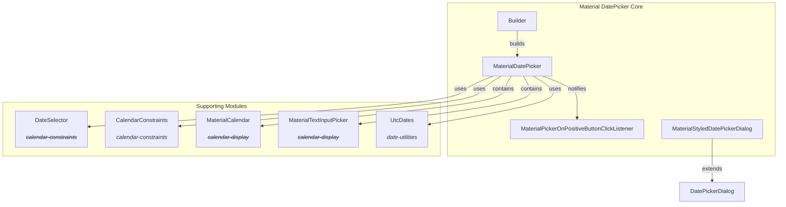
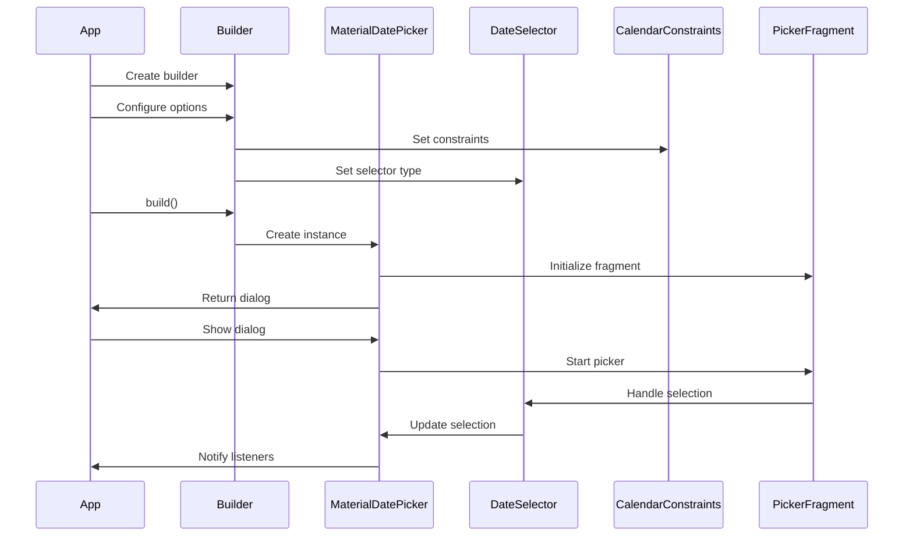
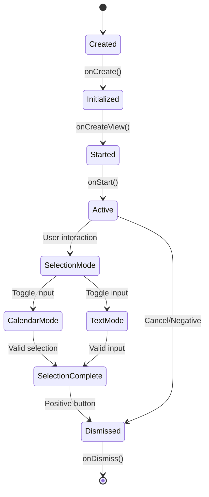

# Material DatePicker Core Module

## Introduction

The Material DatePicker Core module provides the foundational components for implementing Material Design date picker dialogs in Android applications. This module offers a comprehensive date selection interface with support for both single date and date range selection, multiple input modes (calendar and text), and extensive customization options while maintaining Material Design principles.

## Core Components

### MaterialDatePicker<S>

The main dialog fragment class that serves as the primary entry point for date picker functionality. It extends `DialogFragment` and provides a complete date selection interface with header, calendar view, and action buttons.

**Key Features:**
- Generic type support for different selection types (single date, date range)
- Dual input modes: calendar view and text input
- Fullscreen and dialog display modes
- Extensive customization options for theming, text, and behavior
- Built-in state management and configuration persistence

**Core Functionality:**
- Manages the complete date picker lifecycle from creation to dismissal
- Handles user interactions including date selection, mode switching, and button clicks
- Provides real-time validation and selection feedback
- Supports accessibility features and internationalization

### MaterialDatePicker.Builder<S>

A comprehensive builder class that implements the Builder pattern for creating MaterialDatePicker instances with customized configurations.

**Builder Capabilities:**
- Date selector configuration (single date, date range, custom selectors)
- Calendar constraints for limiting selectable date ranges
- Custom theming and styling options
- Input mode selection (calendar vs text input)
- Custom button text and content descriptions
- Day view decoration for custom date styling

**Factory Methods:**
- `datePicker()`: Creates a single date selector builder
- `dateRangePicker()`: Creates a date range selector builder
- `customDatePicker(DateSelector<S>)`: Creates a builder with custom date selector

### MaterialPickerOnPositiveButtonClickListener<S>

A functional interface that defines the callback mechanism for handling positive button clicks in the date picker dialog.

**Purpose:**
- Provides a type-safe way to handle date selection confirmations
- Supports generic type parameter to match the selection type
- Enables multiple listeners to be registered simultaneously

### MaterialStyledDatePickerDialog

A Material Design styled wrapper around the standard Android DatePickerDialog, providing consistent theming and styling with other Material components.

**Features:**
- Material Design consistent styling
- Custom background drawable with proper insets
- Touch handling for dialog interactions
- Automatic theme resolution and application

## Architecture

### Component Relationships



### Data Flow Architecture



### State Management



## Integration Patterns

### Basic Usage Pattern

```java
// Single date picker
MaterialDatePicker<Long> datePicker = MaterialDatePicker.Builder.datePicker()
    .setTitleText("Select Date")
    .setSelection(MaterialDatePicker.todayInUtcMilliseconds())
    .build();

datePicker.addOnPositiveButtonClickListener(selection -> {
    // Handle selected date
    Long selectedDate = selection;
});

datePicker.show(getSupportFragmentManager(), "DATE_PICKER");
```

### Date Range Selection Pattern

```java
// Date range picker
MaterialDatePicker<Pair<Long, Long>> rangePicker = 
    MaterialDatePicker.Builder.dateRangePicker()
        .setTitleText("Select Date Range")
        .setCalendarConstraints(constraints)
        .build();

rangePicker.addOnPositiveButtonClickListener(selection -> {
    Pair<Long, Long> dateRange = selection;
    Long startDate = dateRange.first;
    Long endDate = dateRange.second;
});
```

### Custom Configuration Pattern

```java
MaterialDatePicker<Long> customPicker = MaterialDatePicker.Builder.datePicker()
    .setTheme(R.style.CustomDatePickerTheme)
    .setCalendarConstraints(constraints)
    .setDayViewDecorator(decorator)
    .setInputMode(MaterialDatePicker.INPUT_MODE_TEXT)
    .setPositiveButtonText("Confirm")
    .setNegativeButtonText("Cancel")
    .build();
```

## Dependencies

### Internal Dependencies

- **[calendar-constraints](calendar-constraints.md)**: Provides date range validation and constraints
- **[calendar-display](calendar-display.md)**: Contains calendar view components and adapters
- **[date-utilities](date-utilities.md)**: Offers date manipulation and timezone utilities

### External Dependencies

- **Material Components Core**: Base theming and styling system
- **AndroidX Fragment**: Dialog fragment lifecycle management
- **AndroidX AppCompat**: Resource compatibility and theming
- **Material Shape Drawable**: Background styling and elevation

## Key Features

### Input Mode Support

The module supports two distinct input modes that users can toggle between:

1. **Calendar Mode (`INPUT_MODE_CALENDAR`)**: Visual calendar grid interface
2. **Text Mode (`INPUT_MODE_TEXT`)**: Text input field with date format validation

### Selection Types

Through generic type parameter `S`, the module supports various selection types:

- **Single Date**: `MaterialDatePicker<Long>`
- **Date Range**: `MaterialDatePicker<Pair<Long, Long>>`
- **Custom Selection**: Any type implementing `DateSelector<S>`

### Theming and Customization

- **Theme Override**: Custom theme resource ID support
- **Button Customization**: Custom text and content descriptions
- **Title Customization**: Custom title text and formatting
- **Day Decoration**: Custom styling for individual calendar days

### Accessibility

- **Screen Reader Support**: Proper content descriptions and live regions
- **Keyboard Navigation**: Full keyboard accessibility support
- **Touch Targets**: Appropriate touch target sizes
- **High Contrast**: Support for high contrast themes

## Configuration Management

### Calendar Constraints

The module integrates with [CalendarConstraints](calendar-constraints.md) to provide:
- Date range validation
- Minimum/maximum date limits
- Starting month configuration
- Disabled date ranges

### State Persistence

Complete state management across configuration changes:
- Selection state preservation
- Input mode retention
- Calendar position maintenance
- Custom configuration persistence

## Performance Considerations

### Memory Management
- Efficient view recycling in calendar grids
- Lazy loading of calendar months
- Proper cleanup of listeners and resources

### Rendering Optimization
- MaterialShapeDrawable for efficient background rendering
- View recycling in month and year adapters
- Optimized layout calculations for different screen sizes

## Error Handling

### Validation
- Date format validation in text input mode
- Range validation against calendar constraints
- Selection completeness validation

### User Feedback
- Real-time validation feedback
- Error message display in text input mode
- Disabled state management for invalid selections

## Extension Points

### Custom Date Selectors
Implement `DateSelector<S>` interface to create custom selection behaviors:
- Multi-date selection
- Recurring date selection
- Custom validation logic

### Day View Decorators
Implement `DayViewDecorator` interface to customize day appearance:
- Custom backgrounds for special dates
- Event indicators
- Holiday styling

### Event Listeners
Multiple listener interfaces for handling user interactions:
- Positive button click listeners
- Negative button click listeners
- Cancel and dismiss listeners

## Best Practices

### Usage Guidelines

1. **Selection Defaults**: Always provide reasonable default selections
2. **Calendar Constraints**: Set appropriate date ranges for better UX
3. **Input Mode**: Choose appropriate default input mode based on use case
4. **Theming**: Maintain consistency with app theme while following Material guidelines

### Performance Optimization

1. **Builder Reuse**: Reuse builder instances when creating multiple pickers
2. **Listener Management**: Properly manage listener lifecycle to prevent memory leaks
3. **State Restoration**: Handle configuration changes gracefully
4. **Resource Cleanup**: Clear listeners when components are destroyed

This comprehensive module provides a robust foundation for date selection functionality while maintaining flexibility for customization and extension based on specific application requirements.