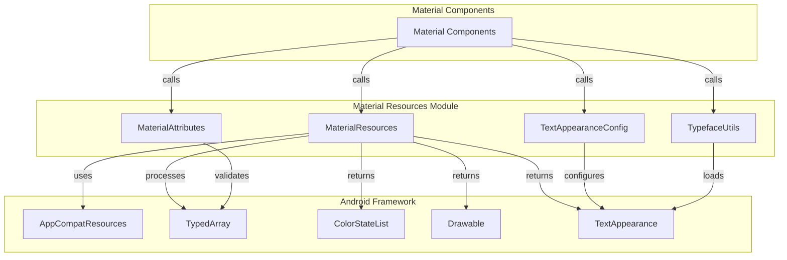
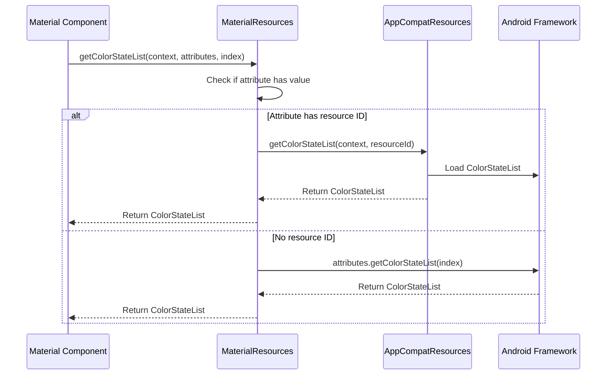

# Material Resources Module

The Material Resources module provides essential utility functions for resolving and managing Android resources within the Material Design Components library. It serves as a foundational layer that handles resource loading, scaling, and theme-aware resource resolution across different Android API levels.

## Overview

The Material Resources module acts as a compatibility layer and resource management utility that ensures consistent resource handling across different Android versions. It provides specialized methods for loading color state lists, drawables, text appearances, and handling font scaling considerations that are crucial for Material Design components.

## Core Components

### MaterialResources

The primary utility class that provides static methods for resource resolution and management. Key functionalities include:

- **Resource Loading**: Safe loading of ColorStateList, Drawable, and TextAppearance resources with fallback mechanisms
- **Font Scale Detection**: Utilities to detect and handle different font scale sizes (1.3x, 2.0x)
- **Dimension Handling**: Specialized dimension pixel size resolution with theme attribute support
- **Unscaled Text Metrics**: Methods to retrieve text size and line height without font scaling for space-constrained components

## Architecture



## Dependencies and Relationships

### Internal Dependencies

The Material Resources module works closely with other resource-related modules:

- **[Material Attributes](material-attributes.md)**: Provides attribute validation and theme enforcement
- **[Text Appearance Config](text-appearance-config.md)**: Handles text appearance configuration and styling
- **[Typeface Utils](typeface-utils.md)**: Manages typeface loading and caching

### External Dependencies

- **AppCompatResources**: For backward-compatible resource loading
- **Android Framework**: TypedArray, ColorStateList, Drawable, and theme resolution
- **Material Theme System**: Integration with Material theming and styling

## Data Flow



## Key Features

### 1. Resource Resolution with Fallback

The module provides robust resource loading with multiple fallback mechanisms:

- Attempts to load resources via AppCompat for backward compatibility
- Falls back to direct attribute access if resource loading fails
- Handles themeable attributes across different API levels

### 2. Font Scale Awareness

Special handling for accessibility and font scaling:

- Detects system font scale levels (1.3x, 2.0x thresholds)
- Provides unscaled text metrics for space-constrained components
- Maintains visual consistency across different accessibility settings

### 3. Dimension Processing

Advanced dimension handling capabilities:

- Resolves theme attributes in dimensions
- Handles complex unit types (sp, dp, px)
- Provides density-scaled values without font scaling when needed

## Usage Patterns

### Basic Resource Loading

```java
// Load ColorStateList with theme support
ColorStateList colors = MaterialResources.getColorStateList(
    context, attributes, R.styleable.MyComponent_android_tint);

// Load Drawable with vector support
Drawable icon = MaterialResources.getDrawable(
    context, attributes, R.styleable.MyComponent_android_src);

// Load TextAppearance
TextAppearance textAppearance = MaterialResources.getTextAppearance(
    context, attributes, R.styleable.MyComponent_android_textAppearance);
```

### Font Scale Handling

```java
// Check font scale for accessibility-aware layouts
if (MaterialResources.isFontScaleAtLeast1_3(context)) {
    // Adjust layout for larger text
}

// Get unscaled text size for fixed-size components
int textSize = MaterialResources.getUnscaledTextSize(
    context, textAppearanceResId, defaultSize);
```

### Dimension Resolution

```java
// Resolve dimension with theme attribute support
int size = MaterialResources.getDimensionPixelSize(
    context, attributes, index, defaultValue);
```

## Integration with Material Components

The Material Resources module is extensively used throughout the Material Design Components library:

- **[Button Components](button.md)**: For loading button styles and colors
- **[Text Field Components](text-field.md)**: For text appearance and hint styling
- **[Card Components](card.md)**: For elevation and background resources
- **[Theme System](theme.md)**: For theme-aware resource resolution

## Best Practices

### 1. Resource Loading

- Always use MaterialResources methods for loading resources in Material components
- Provide appropriate default values for fallback scenarios
- Consider theme attributes when resolving dimensions

### 2. Font Scale Handling

- Use font scale detection for accessibility-aware layouts
- Consider unscaled text metrics for space-constrained components
- Test with different font scale settings (1.0x, 1.3x, 2.0x)

### 3. Performance Considerations

- Cache resolved resources when appropriate
- Use the provided fallback mechanisms to avoid crashes
- Consider the overhead of theme attribute resolution

## Error Handling

The module implements several error handling strategies:

- **Null Safety**: All methods handle null contexts and attributes gracefully
- **Resource Validation**: Checks for resource existence before loading
- **Fallback Mechanisms**: Provides default values when resources cannot be loaded
- **API Level Compatibility**: Handles API level differences transparently

## Testing Considerations

When testing components that use Material Resources:

- Test with different font scale settings
- Verify resource loading with missing resources
- Test theme attribute resolution across different themes
- Validate behavior on different Android API levels

## Future Considerations

The Material Resources module continues to evolve with:

- Enhanced support for dynamic colors and theming
- Improved performance for resource caching
- Extended support for new Android resource types
- Better integration with Material You design system