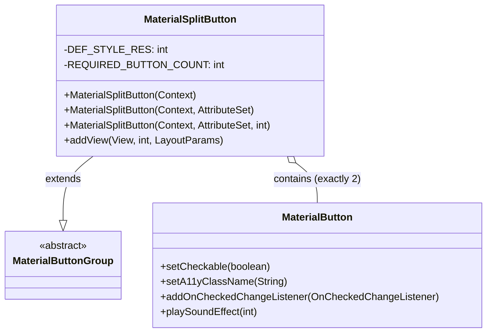
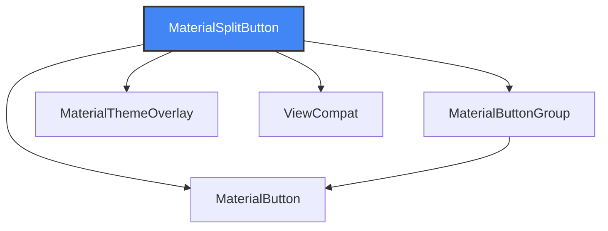
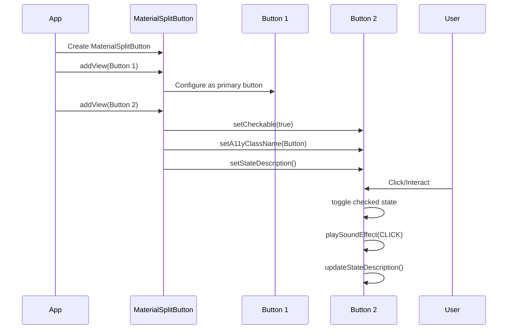

# Material Split Button Module Documentation

## Introduction

The Material Split Button module provides a specialized button component that combines two MaterialButtons into a single, cohesive UI element. This module is part of the Material Design Components library for Android and offers a split button pattern where one button serves as the primary action and the second button provides additional options or a dropdown menu.

## Core Functionality

The module's primary component, `MaterialSplitButton`, extends `MaterialButtonGroup` to create a container that specifically manages exactly two MaterialButton instances. The split button pattern is commonly used when you need to provide both a primary action and secondary options in a compact, space-efficient manner.

## Architecture

### Component Structure



### Module Dependencies



## Component Details

### MaterialSplitButton Class

The `MaterialSplitButton` class serves as the main implementation of the split button pattern. Key characteristics include:

- **Fixed Button Count**: Enforces exactly two MaterialButton children
- **Type Safety**: Only accepts MaterialButton instances as children
- **Accessibility Support**: Provides proper accessibility features including state descriptions
- **Sound Feedback**: Implements audio feedback for state changes
- **Theming Support**: Integrates with Material Design theming system

### Key Features

1. **Strict Validation**: Validates that only MaterialButton instances are added and limits the count to exactly two buttons
2. **Accessibility Enhancement**: The second button is made checkable with appropriate accessibility class names and state descriptions
3. **Interactive Feedback**: Provides sound effects and state-based content descriptions
4. **Theming Integration**: Uses MaterialThemeOverlay for consistent styling

## Data Flow



## Usage Patterns

### XML Declaration

```xml
<com.google.android.material.button.MaterialSplitButton
    xmlns:android="http://schemas.android.com/apk/res/android"
    android:id="@+id/split_button"
    android:layout_width="wrap_content"
    android:layout_height="wrap_content">

    <Button
        android:layout_width="wrap_content"
        android:layout_height="wrap_content"
        android:text="@string/split_button_label"
        app:icon="@drawable/ic_edit_vd_theme_24dp"
        app:iconGravity="start"/>
    
    <Button
        style="?attr/materialSplitButtonIconFilledStyle"
        android:layout_width="wrap_content"
        android:layout_height="wrap_content"
        android:contentDescription="@string/split_button_label_chevron"
        app:icon="@drawable/m3_split_button_chevron_avd"/>

</com.google.android.material.button.MaterialSplitButton>
```

### Programmatic Usage

```java
MaterialSplitButton splitButton = new MaterialSplitButton(context);

// Create primary button
MaterialButton primaryButton = new MaterialButton(context);
primaryButton.setText("Save");
primaryButton.setIcon(saveIcon);

// Create secondary/dropdown button
MaterialButton secondaryButton = new MaterialButton(context);
secondaryButton.setIcon(chevronIcon);

splitButton.addView(primaryButton);
splitButton.addView(secondaryButton);
```

## Integration with Other Modules

### Parent Module: Button

The MaterialSplitButton module is part of the broader [button](button.md) module ecosystem, which includes:

- **[material-button](material-button.md)**: Core MaterialButton implementation
- **[material-button-group](material-button-group.md)**: Base class for button grouping
- **material-split-button**: Specialized two-button container (current module)

### Related Components

- **[MaterialButtonGroup](material-button-group.md)**: Provides the base functionality for managing multiple buttons
- **[MaterialButton](material-button.md)**: Individual button components that compose the split button
- **[MaterialThemeOverlay](theme.md)**: Ensures consistent theming across the component

## Design Considerations

### Accessibility

The module implements several accessibility features:

- **State Descriptions**: Dynamic content descriptions based on button state (expanded/collapsed)
- **Proper ARIA Labels**: Uses Button class name for accessibility services
- **Sound Feedback**: Audio confirmation for state changes
- **Keyboard Navigation**: Integrates with Android's accessibility framework

### Performance

- **Minimal Overhead**: Lightweight validation logic
- **Efficient State Management**: Uses listener pattern for state updates
- **Resource Optimization**: Reuses existing MaterialButton infrastructure

### Extensibility

While the component is designed for a specific use case (exactly two buttons), it provides:

- **Custom Styling**: Supports Material Design styling attributes
- **Event Handling**: Exposes standard MaterialButton event mechanisms
- **Theming Integration**: Works with Material Design theme system

## Best Practices

1. **Button Order**: Always add the primary action button first, followed by the secondary/options button
2. **Icon Usage**: Use appropriate icons for the secondary button (typically a chevron or menu indicator)
3. **Content Description**: Provide meaningful content descriptions for accessibility
4. **Styling Consistency**: Use Material Design style attributes for consistent appearance
5. **State Management**: Handle checked state changes appropriately for the secondary button

## Common Use Cases

- **Save with Options**: Primary button for save action, secondary for save options (Save As, Save All, etc.)
- **Export Functions**: Primary for quick export, secondary for export format selection
- **Share Actions**: Primary for common share action, secondary for additional share options
- **Dropdown Menus**: Primary for default action, secondary for action menu

This implementation provides a robust, accessible, and Material Design-compliant solution for split button patterns in Android applications.