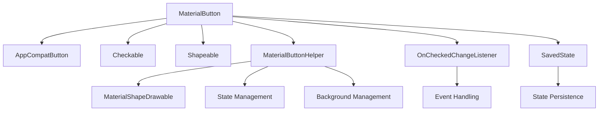
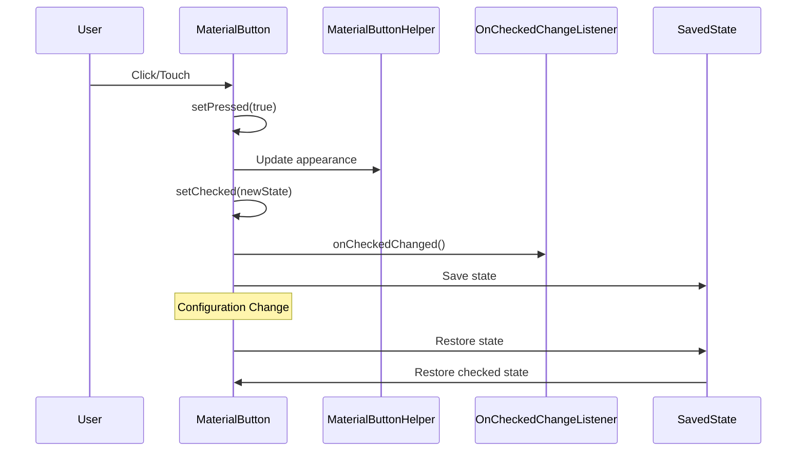
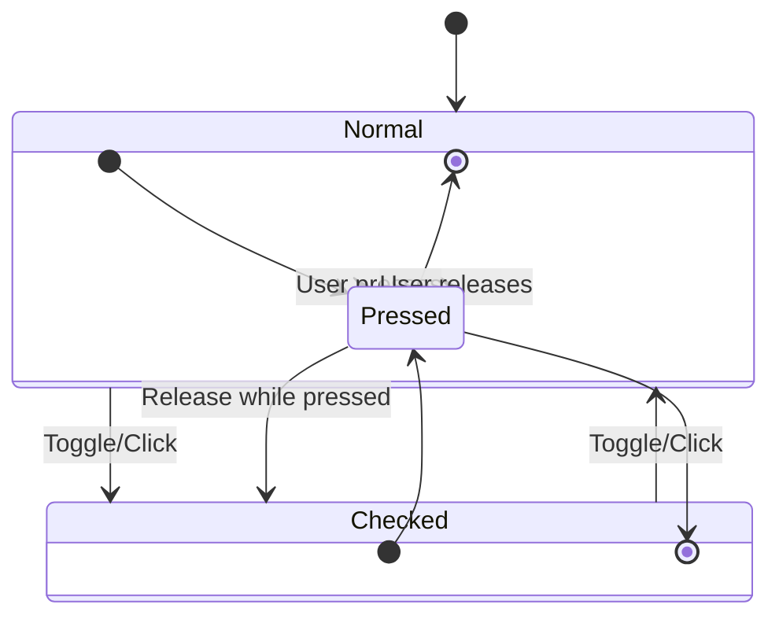

# MaterialButton Core Module

## Introduction

The materialbutton-core module provides the foundational components for Material Design buttons in Android applications. It contains the core `MaterialButton` class and its essential supporting components, offering a modern, customizable button implementation that follows Material Design guidelines while providing extensive theming and interaction capabilities.

## Module Overview

The materialbutton-core module is part of the larger Material Design Components library and serves as the foundation for all button-related functionality. It provides the core `MaterialButton` widget that extends `AppCompatButton` to deliver Material Design styling, theming, and enhanced interaction features.

## Core Components

### MaterialButton

The `MaterialButton` class is the primary component that provides a Material Design-compliant button implementation. It extends `AppCompatButton` and implements both `Checkable` and `Shapeable` interfaces, offering extensive customization options while maintaining Material Design principles.

#### Key Features:
- **Material Design Styling**: Automatic application of Material Design themes and styles
- **Icon Support**: Built-in support for icons with multiple positioning options
- **Checkable State**: Support for toggle button functionality
- **Shape Customization**: Dynamic shape appearance with corner radius control
- **State Management**: Comprehensive state handling including pressed, checked, and disabled states
- **Accessibility**: Full accessibility support with proper screen reader integration

#### Icon Positioning:
The button supports six different icon gravity positions:
- `ICON_GRAVITY_START`: Icon at the start of the view
- `ICON_GRAVITY_TEXT_START`: Icon at the start of the text
- `ICON_GRAVITY_END`: Icon at the end of the view
- `ICON_GRAVITY_TEXT_END`: Icon at the end of the text
- `ICON_GRAVITY_TOP`: Icon at the top of the view
- `ICON_GRAVITY_TEXT_TOP`: Icon at the top of the text

### OnCheckedChangeListener

An interface for monitoring changes to the button's checked state. This listener is essential for implementing toggle button functionality and managing button groups.

```java
public interface OnCheckedChangeListener {
    void onCheckedChanged(MaterialButton button, boolean isChecked);
}
```

### SavedState

A custom `Parcelable` implementation that preserves the button's checked state across configuration changes and activity lifecycle events. This ensures that the button's state is maintained during device rotation, theme changes, and other configuration updates.

```java
static class SavedState extends AbsSavedState {
    boolean checked;
    // Implementation details...
}
```

## Architecture

### Component Structure



### Data Flow



### State Management



## Key Features

### Theming and Styling

The MaterialButton automatically applies Material Design themes and supports extensive customization through XML attributes:

- **Background Tint**: `app:backgroundTint` and `app:backgroundTintMode`
- **Ripple Color**: `app:rippleColor` for press feedback
- **Stroke**: `app:strokeColor` and `app:strokeWidth` for outlined buttons
- **Corner Radius**: `app:cornerRadius` for shape customization
- **Icon Properties**: `app:icon`, `app:iconTint`, `app:iconPadding`, `app:iconSize`

### Shape System Integration

The button integrates with the Material Design shape system through the `Shapeable` interface, allowing dynamic shape changes based on state and theming requirements.

### Accessibility

Comprehensive accessibility support includes:
- Proper screen reader announcements
- Touch target sizing
- State information exposure
- Custom accessibility class name support

### Performance Optimizations

- Efficient icon positioning calculations
- Optimized state change handling
- Memory-efficient drawable management
- Spring animation integration for smooth transitions

## Dependencies

The materialbutton-core module has dependencies on several other Material Design components:

- **[shape](../shape.md)**: For shape appearance and customization
- **[theme](../theme.md)**: For Material Design theming integration
- **[motion](../motion.md)**: For animation and transition support
- **[resources](../resources.md)**: For resource handling and color state lists

## Usage Examples

### Basic Implementation

```xml
<com.google.android.material.button.MaterialButton
    android:layout_width="wrap_content"
    android:layout_height="wrap_content"
    android:text="Click Me"
    app:icon="@drawable/ic_icon"
    app:iconGravity="textStart" />
```

### Toggle Button

```xml
<com.google.android.material.button.MaterialButton
    android:layout_width="wrap_content"
    android:layout_height="wrap_content"
    android:text="Toggle"
    android:checkable="true"
    app:checked="true" />
```

### Programmatic Usage

```java
MaterialButton button = findViewById(R.id.button);
button.setOnCheckedChangeListener((buttonView, isChecked) -> {
    // Handle checked state change
});

button.setIcon(AppCompatResources.getDrawable(context, R.drawable.ic_icon));
button.setIconTint(ColorStateList.valueOf(Color.RED));
```

## Best Practices

1. **Avoid Custom Backgrounds**: MaterialButton manages its own background drawable. Using custom backgrounds may break Material Design features.

2. **Use Theme Attributes**: Leverage theme attributes like `?attr/colorPrimary` and `?attr/colorOnPrimary` for consistent theming.

3. **Icon Positioning**: Use appropriate icon gravity based on your layout requirements and text direction.

4. **State Management**: Implement proper state handling for checkable buttons and button groups.

5. **Accessibility**: Ensure proper accessibility labels and descriptions for screen reader users.

## Integration with Other Modules

The materialbutton-core module serves as the foundation for other button-related modules:

- **[materialbutton-group](../materialbutton-group.md)**: Provides button group functionality
- **[materialsplit-button](../materialsplit-button.md)**: Implements split button patterns

## Migration Guide

When migrating from standard Android buttons to MaterialButton:

1. Replace `Button` or `AppCompatButton` with `MaterialButton`
2. Remove custom background drawables
3. Use Material Design attributes for styling
4. Implement proper state management for checkable functionality
5. Test accessibility features

## Troubleshooting

### Common Issues

1. **Background Not Appearing**: Ensure you're not setting a custom background that overrides MaterialButton's managed background.

2. **Icon Not Visible**: Check icon tint colors and ensure the icon drawable is properly set.

3. **State Not Persisting**: Verify that the parent activity/fragment properly handles configuration changes.

4. **Theming Issues**: Ensure your app theme extends from a Material Design theme.

## Performance Considerations

- Icon positioning calculations are optimized for performance
- State changes are batched to minimize redraws
- Background drawable management is handled efficiently
- Spring animations use hardware acceleration when available

## Future Enhancements

The materialbutton-core module continues to evolve with Material Design guidelines, incorporating new interaction patterns, animation improvements, and accessibility enhancements while maintaining backward compatibility.