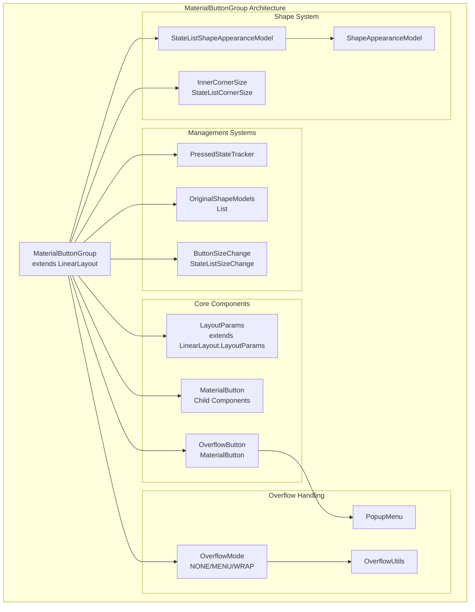
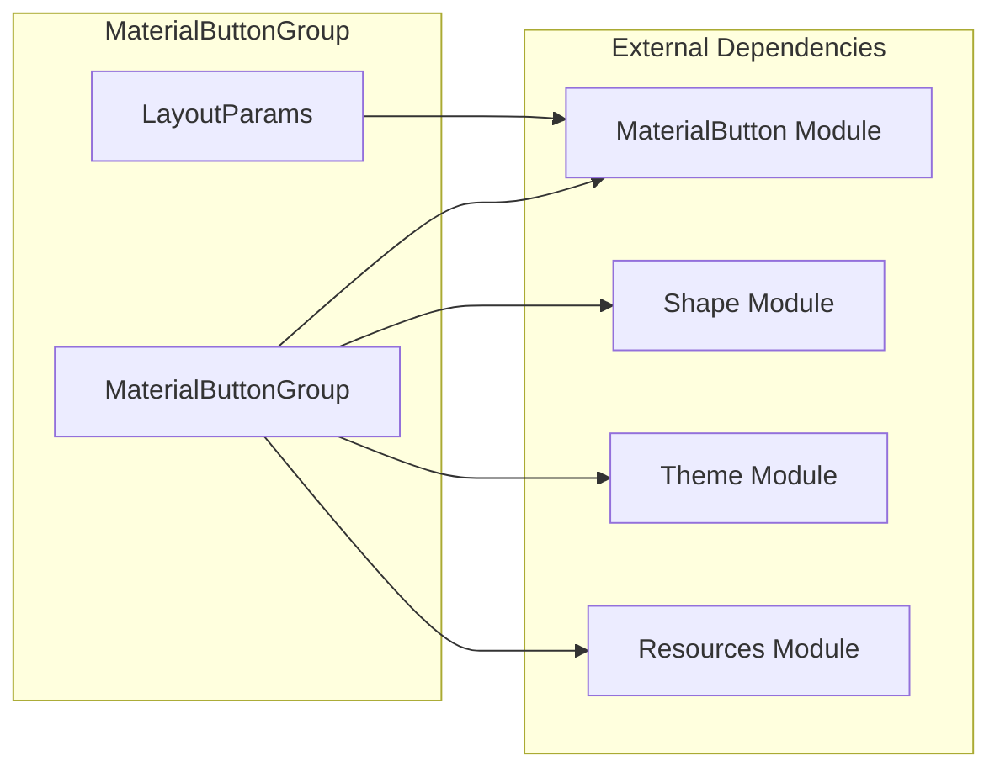
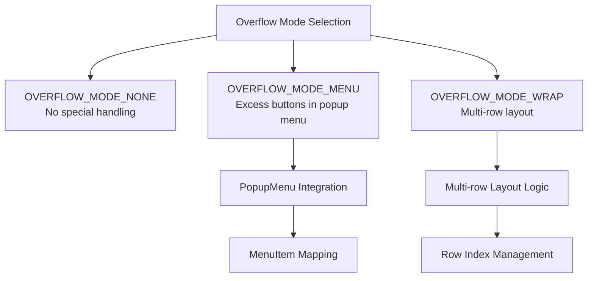
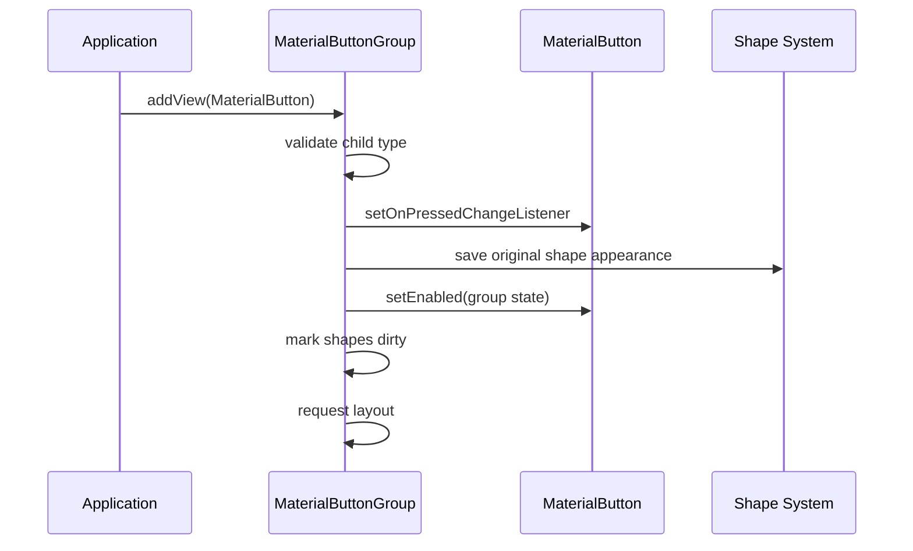
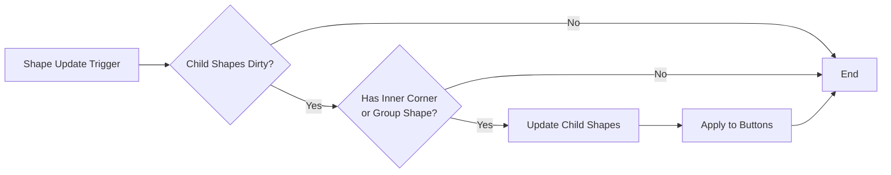
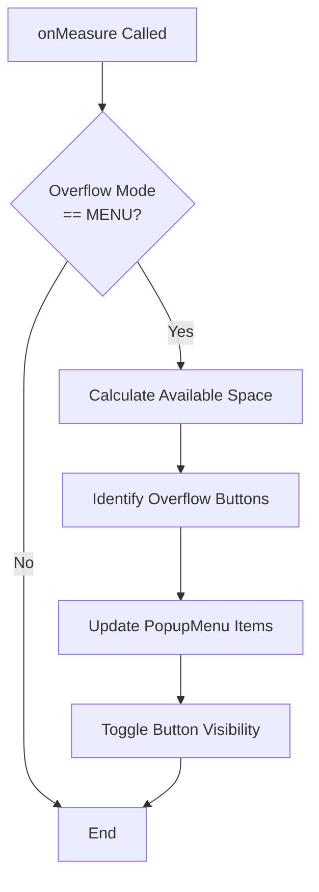
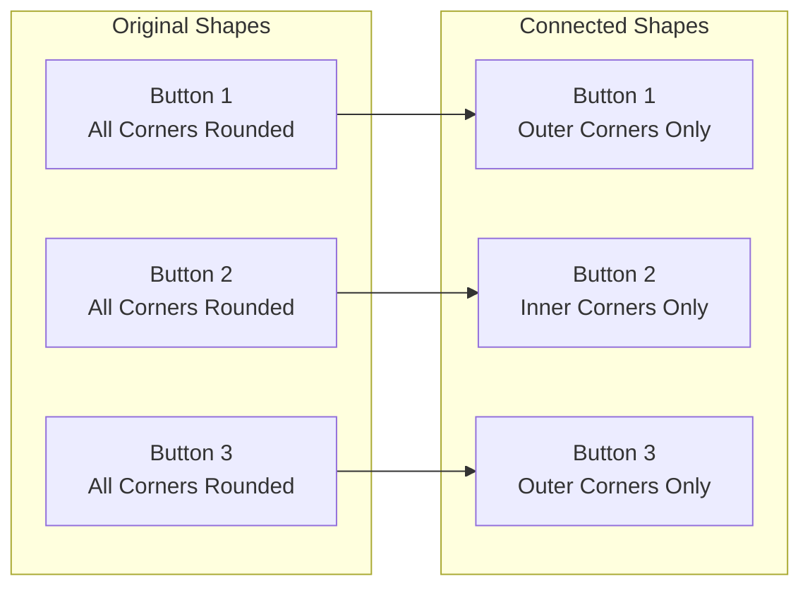
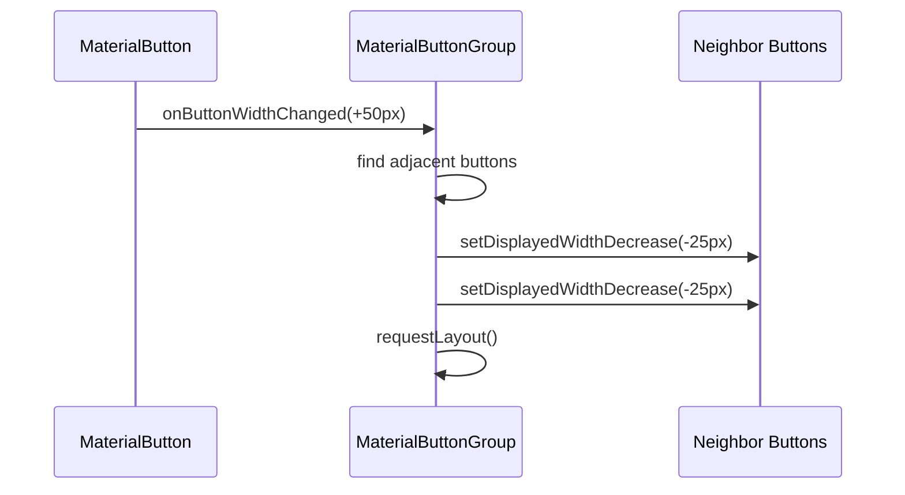

# MaterialButtonGroup Module Documentation

## Introduction

The `materialbutton-group` module is a core component of the Material Design Components library for Android, providing a specialized container for managing multiple `MaterialButton` instances as a cohesive group. This module extends `LinearLayout` to create visually connected button groups with advanced features like overflow handling, shape morphing, and dynamic sizing capabilities.

## Module Overview

The MaterialButtonGroup serves as a sophisticated button management system that:
- Groups related MaterialButton components into a single, visually cohesive unit
- Handles button overflow scenarios (menu, wrap, or none)
- Manages connected shape appearance for seamless visual integration
- Provides dynamic spacing and sizing adjustments
- Supports both horizontal and vertical orientations

## Core Architecture

### Component Structure



### Key Dependencies

The MaterialButtonGroup module integrates with several other Material Design components:



## Core Components

### MaterialButtonGroup Class

The main class extends `LinearLayout` and provides comprehensive button group management functionality:

#### Key Features:
- **Child Management**: Enforces MaterialButton-only children with proper lifecycle handling
- **Shape Morphing**: Dynamically adjusts corner radii for connected appearance
- **Overflow Handling**: Three modes (NONE, MENU, WRAP) for managing excess buttons
- **Spacing Control**: Configurable spacing between buttons with stroke overlap handling
- **Size Changes**: Dynamic width adjustments with neighbor compensation

#### Overflow Modes:



### LayoutParams Class

Extends `LinearLayout.LayoutParams` with MaterialButtonGroup-specific properties:

```java
public static class LayoutParams extends LinearLayout.LayoutParams {
    @Nullable public Drawable overflowIcon = null;
    @Nullable public CharSequence overflowText = null;
    
    // Constructors and utility methods...
}
```

#### Properties:
- **overflowIcon**: Custom icon for overflow menu representation
- **overflowText**: Custom text for overflow menu (falls back to button text)

## Data Flow Architecture

### Button Addition and Management



### Shape Update Process



### Overflow Menu Management



## Configuration and Customization

### XML Configuration

```xml
<com.google.android.material.button.MaterialButtonGroup
    android:id="@+id/button_group"
    android:layout_width="wrap_content"
    android:layout_height="wrap_content"
    android:spacing="8dp"
    app:innerCornerSize="8dp"
    app:overflowMode="menu"
    app:overflowButtonIcon="@drawable/ic_more_vert">
    
    <com.google.android.material.button.MaterialButton
        android:text="Button 1"
        app:layout_overflowText="Option 1"
        app:layout_overflowIcon="@drawable/ic_option_1" />
        
    <com.google.android.material.button.MaterialButton
        android:text="Button 2"
        app:layout_overflowText="Option 2" />
        
</com.google.android.material.button.MaterialButtonGroup>
```

### Programmatic Configuration

```java
MaterialButtonGroup buttonGroup = findViewById(R.id.button_group);

// Set spacing between buttons
buttonGroup.setSpacing(16);

// Configure inner corner size for connected appearance
buttonGroup.setInnerCornerSize(new AbsoluteCornerSize(8));

// Set overflow mode
buttonGroup.setOverflowMode(MaterialButtonGroup.OVERFLOW_MODE_MENU);

// Set custom overflow button icon
buttonGroup.setOverflowButtonIconResource(R.drawable.ic_custom_overflow);
```

## Integration with Other Modules

### MaterialButton Module Integration

The MaterialButtonGroup works closely with the [MaterialButton module](materialbutton-core.md):

- **Child Validation**: Only accepts MaterialButton instances as children
- **State Synchronization**: Manages enabled/disabled states across all buttons
- **Shape Coordination**: Preserves original button shapes while applying group-level modifications
- **Size Management**: Coordinates width changes between adjacent buttons

### Shape Module Integration

Leverages the [Shape module](shape.md) for advanced appearance customization:

- **StateListShapeAppearanceModel**: Manages shape appearance across different states
- **StateListCornerSize**: Handles dynamic corner sizing
- **ShapeAppearanceModel**: Defines base shape characteristics

### Theme Module Integration

Integrates with the theme system for consistent styling:

- **MaterialThemeOverlay**: Applies theme-aware styling
- **ThemeEnforcement**: Ensures proper theme attributes are applied
- **Resource Resolution**: Handles theme-dependent resource loading

## Advanced Features

### Connected Shape Morphing

The group automatically adjusts button corners to create a connected appearance:



### Dynamic Width Management

When buttons expand, the system compensates by reducing neighbor widths:



### Overflow Text Resolution

The OverflowUtils class implements a fallback hierarchy for menu item text:

1. Custom overflow text (if specified)
2. Button text (if MaterialButton and text not empty)
3. Content description (as last resort)

## Best Practices

### Layout Configuration

- Use `wrap_content` for width when possible
- Consider `MATCH_PARENT` with vertical orientation
- Remove `insetBottom` and `insetTop` for vertical layouts
- Set appropriate spacing for visual clarity

### Overflow Handling

- **NONE**: Use when button count is predictable and space is adequate
- **MENU**: Best for many buttons with limited horizontal space
- **WRAP**: Suitable for responsive layouts with variable content

### Performance Considerations

- Shape updates are batched and only applied when necessary
- Child order is cached and updated only on state changes
- Overflow calculations are optimized to avoid unnecessary work

## Common Use Cases

### Toggle Button Group

```xml
<com.google.android.material.button.MaterialButtonGroup
    android:layout_width="wrap_content"
    android:layout_height="wrap_content"
    app:singleSelection="true">
    
    <com.google.android.material.button.MaterialButton
        style="?attr/materialButtonOutlinedStyle"
        android:text="Option 1" />
        
    <com.google.android.material.button.MaterialButton
        style="?attr/materialButtonOutlinedStyle"
        android:text="Option 2" />
        
</com.google.android.material.button.MaterialButtonGroup>
```

### Action Button Group

```xml
<com.google.android.material.button.MaterialButtonGroup
    android:layout_width="match_parent"
    android:layout_height="wrap_content"
    android:orientation="horizontal"
    app:overflowMode="menu">
    
    <!-- Multiple action buttons -->
    
</com.google.android.material.button.MaterialButtonGroup>
```

## Troubleshooting

### Common Issues

1. **Buttons not appearing connected**: Ensure `innerCornerSize` is set appropriately
2. **Overflow menu not working**: Verify `overflowMode` is set to `MENU`
3. **Layout measurement issues**: Check orientation compatibility with overflow modes
4. **Shape appearance not updating**: Call `updateChildShapes()` after dynamic changes

### Debug Information

Enable logging to track button group behavior:
- Monitor `LOG_TAG = "MButtonGroup"` for warnings and errors
- Check child order updates with `getChildDrawingOrder()`
- Verify overflow calculations in `maybeUpdateOverflowMenu()`

## API Reference

For detailed API information, refer to the [MaterialButtonGroup API documentation](https://developer.android.com/reference/com/google/android/material/button/MaterialButtonGroup) and related module documentation:

- [MaterialButton Core](materialbutton-core.md)
- [Shape System](shape.md)
- [Theme Integration](color.md)

## Migration Guide

When migrating from standard LinearLayout:

1. Replace `LinearLayout` with `MaterialButtonGroup`
2. Ensure all children are `MaterialButton` instances
3. Configure `innerCornerSize` for connected appearance
4. Set appropriate `overflowMode` based on content
5. Test overflow behavior with different screen sizes

This module provides a robust foundation for creating sophisticated button groups that adhere to Material Design principles while offering extensive customization options and advanced features for complex layouts.