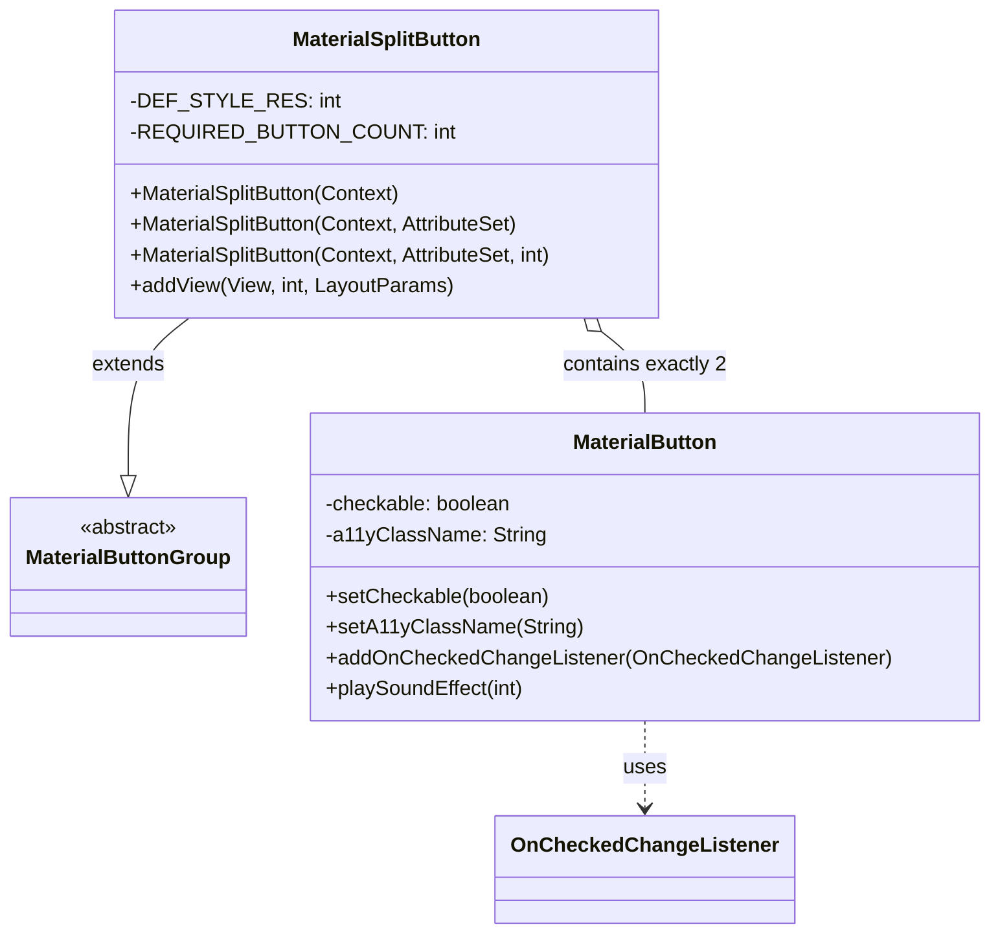
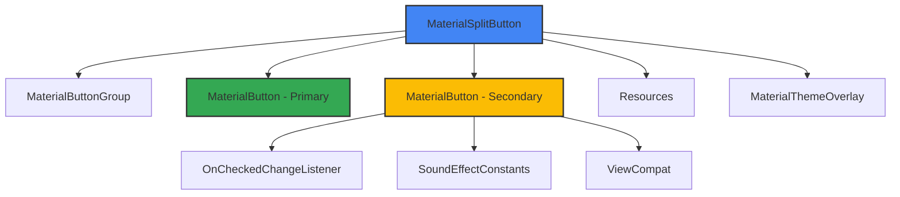
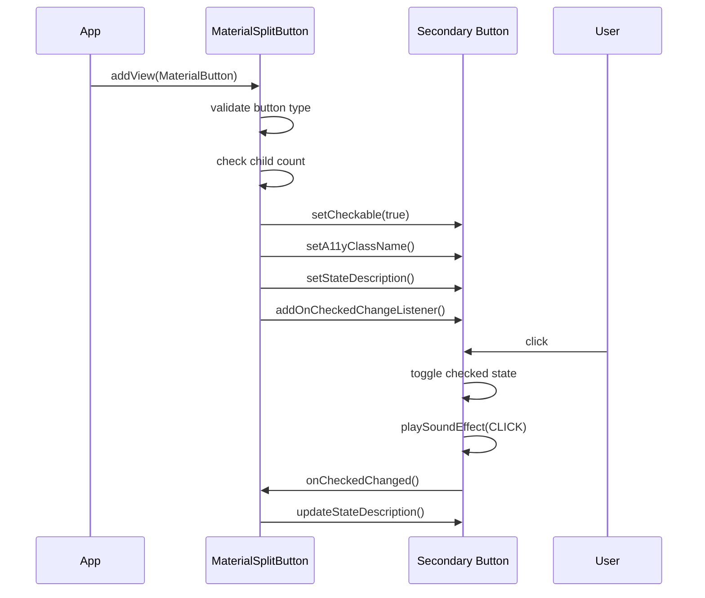

# Material Split Button Module

## Introduction

The `materialsplit-button` module provides a specialized button component that combines two Material buttons into a single, cohesive UI element. This module implements the Material Design split button pattern, which presents users with a primary action button and a secondary dropdown or overflow button in a unified interface.

## Module Overview

The MaterialSplitButton is a container component that manages exactly two MaterialButton instances, creating a visually connected split button interface. This design pattern is commonly used when you need to provide both a primary action and additional options or variations of that action.

## Core Architecture

### Component Structure



### Component Relationships



## Core Component Details

### MaterialSplitButton

The `MaterialSplitButton` class is the main component of this module, extending `MaterialButtonGroup` to provide split button functionality.

#### Key Features:
- **Fixed Button Count**: Enforces exactly two MaterialButton children
- **Type Safety**: Only accepts MaterialButton instances as children
- **Accessibility Support**: Provides proper accessibility descriptions for the secondary button
- **Sound Feedback**: Plays sound effects on state changes
- **Theme Integration**: Uses Material Design 3 styling by default

#### Constructor Chain:
```java
MaterialSplitButton(Context) → MaterialSplitButton(Context, AttributeSet) → MaterialSplitButton(Context, AttributeSet, int)
```

#### Styling:
- Default style: `R.style.Widget_Material3_MaterialSplitButton`
- Theme attribute: `R.attr.materialSplitButtonStyle`
- Uses `MaterialThemeOverlay.wrap()` for proper theming

### Button Configuration

The component automatically configures the second button (index 1) with:
- **Checkable State**: Enabled to support expand/collapse behavior
- **Accessibility Class**: Set to `Button.class.getName()`
- **Dynamic Descriptions**: Updates content description based on checked state
- **Sound Effects**: Plays click sounds on state changes

## Data Flow



## Usage Patterns

### XML Declaration
```xml
<com.google.android.material.button.MaterialSplitButton
    android:id="@+id/split_button"
    android:layout_width="wrap_content"
    android:layout_height="wrap_content">
    
    <!-- Primary button with text and icon -->
    <Button
        android:layout_width="wrap_content"
        android:layout_height="wrap_content"
        android:text="@string/split_button_label"
        app:icon="@drawable/ic_edit_vd_theme_24dp"
        app:iconGravity="start"/>
    
    <!-- Secondary button with chevron icon -->
    <Button
        style="?attr/materialSplitButtonIconFilledStyle"
        android:layout_width="wrap_content"
        android:layout_height="wrap_content"
        android:contentDescription="@string/split_button_label_chevron"
        app:icon="@drawable/m3_split_button_chevron_avd"/>
    
</com.google.android.material.button.MaterialSplitButton>
```

### Programmatic Usage
```java
MaterialSplitButton splitButton = new MaterialSplitButton(context);

// Create primary button
MaterialButton primaryButton = new MaterialButton(context);
primaryButton.setText("Save");
primaryButton.setIcon(saveIcon);

// Create secondary button  
MaterialButton secondaryButton = new MaterialButton(context);
secondaryButton.setIcon(chevronIcon);
secondaryButton.setContentDescription("More options");

// Add buttons to split button
splitButton.addView(primaryButton);
splitButton.addView(secondaryButton);
```

## Integration with Other Modules

### Dependencies
- **[materialbutton-core](materialbutton-core.md)**: Provides base MaterialButton functionality and state management
- **[materialbutton-group](materialbutton-group.md)**: Supplies the container infrastructure and layout parameters
- **[color](color.md)**: Handles color theming and dynamic color support
- **[shape](shape.md)**: Manages button shape appearance and styling

### Related Components
- **MaterialButton**: The individual button components within the split button
- **MaterialButtonGroup**: Parent class providing group behavior
- **MaterialButton.OnCheckedChangeListener**: Interface for handling button state changes

## Accessibility

The MaterialSplitButton provides comprehensive accessibility features:

- **Screen Reader Support**: Proper content descriptions for both buttons
- **State Announcements**: Dynamic content description updates based on checked state
- **Sound Feedback**: Audio confirmation of user interactions
- **Keyboard Navigation**: Standard button focus and activation behavior

### Content Descriptions
- Collapsed state: `R.string.mtrl_button_collapsed_content_description`
- Expanded state: `R.string.mtrl_button_expanded_content_description`

## Error Handling

The component implements strict validation:
- **Type Validation**: Throws `IllegalArgumentException` for non-MaterialButton children
- **Count Validation**: Throws `IllegalArgumentException` if more than 2 buttons are added

## Best Practices

1. **Button Order**: Always add the primary action button first, followed by the secondary/options button
2. **Icon Usage**: Use appropriate icons (e.g., chevron for dropdown, overflow menu icon for options)
3. **Content Descriptions**: Provide meaningful content descriptions for accessibility
4. **Styling**: Use Material Design 3 split button styles for consistency
5. **State Management**: Handle the secondary button's checked state appropriately in your application logic

## Design Guidelines

The split button pattern is ideal for:
- **Primary Actions with Variants**: Save, Save As, Save All
- **Commands with Options**: Print, Print Preview, Print Settings
- **Tools with Modes**: Draw, Draw with Options
- **Actions with History**: Recent Files, Open Other

The visual design maintains Material Design principles with proper spacing, elevation, and color theming to create a cohesive button group that appears as a single interactive element while providing distinct interaction areas.