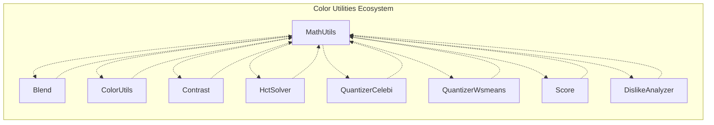
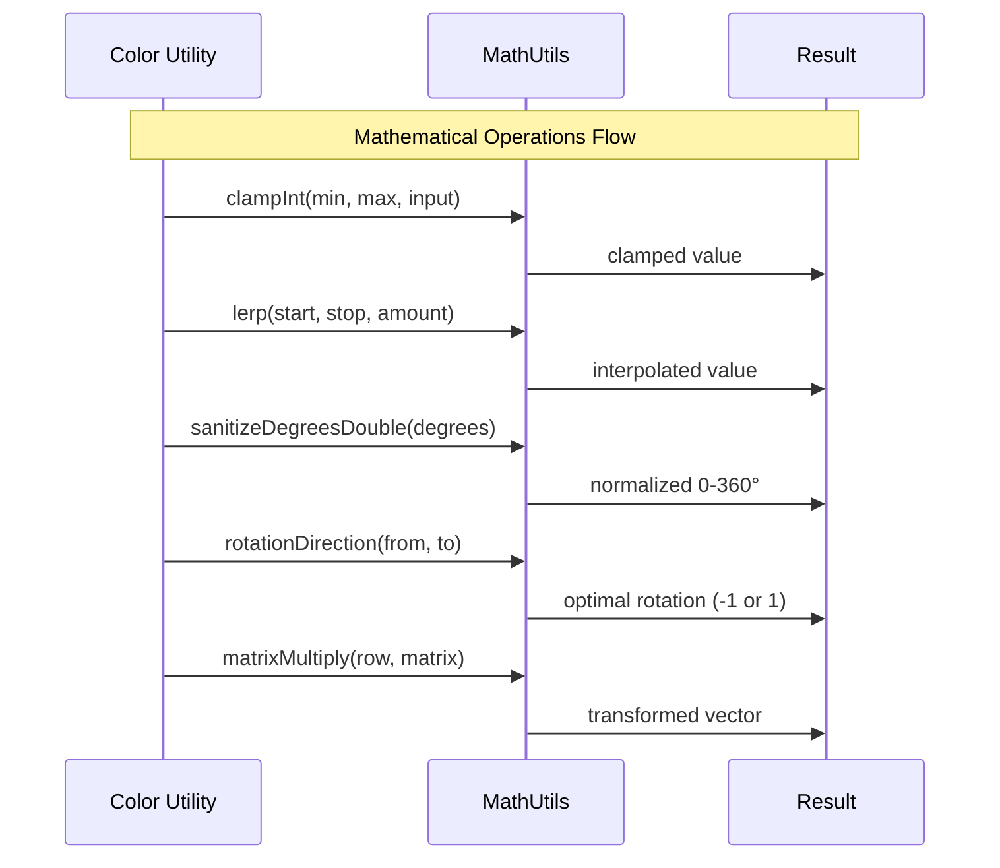
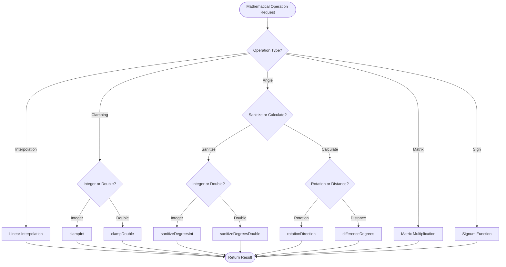
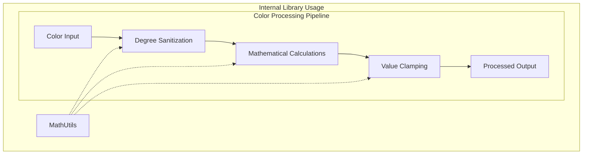

# Math Utils Module

The math-utils module provides essential mathematical utility functions for the Material Design Components library. This module is part of the color utilities ecosystem and offers fundamental mathematical operations used throughout the Material Design system for color calculations, transformations, and geometric computations.

## Overview

The MathUtils class serves as a centralized utility providing mathematical helper functions that are commonly needed in color processing, animation calculations, and geometric transformations. All methods are static and the class is marked with `@RestrictTo(LIBRARY_GROUP)`, indicating it's intended for internal library use only.

## Core Components

### MathUtils Class

The `MathUtils` class provides the following mathematical utility functions:

- **Signum Function**: Determines the sign of a number
- **Linear Interpolation**: Smooth transitions between values
- **Value Clamping**: Constrains values within specified ranges
- **Degree Sanitization**: Normalizes angle measurements
- **Rotation Calculations**: Determines optimal rotation directions
- **Matrix Operations**: Vector-matrix multiplication for 3D transformations

## Architecture

```mermaid
graph TB
    subgraph "Math Utils Module"
        MU[MathUtils Class]
        
        MU --> SIG[signum]
        MU --> LERP[lerp]
        MU --> CLAMP_I[clampInt]
        MU --> CLAMP_D[clampDouble]
        MU --> SANITIZE_I[sanitizeDegreesInt]
        MU --> SANITIZE_D[sanitizeDegreesDouble]
        MU --> ROT_DIR[rotationDirection]
        MU --> DIFF_DEG[differenceDegrees]
        MU --> MAT_MUL[matrixMultiply]
    end
    
    subgraph "Dependent Modules"
        BLEND[Blend Module]
        COLOR_UTILS[ColorUtils Module]
        CONTRAST[Contrast Module]
        HCT[HCT Solver Module]
        QUANTIZER_C[QuantizerCelebi Module]
        QUANTIZER_W[QuantizerWsmeans Module]
        SCORE[Score Module]
        DISLIKE[DislikeAnalyzer Module]
    end
    
    MU -.-> BLEND
    MU -.-> COLOR_UTILS
    MU -.-> CONTRAST
    MU -.-> HCT
    MU -.-> QUANTIZER_C
    MU -.-> QUANTIZER_W
    MU -.-> SCORE
    MU -.-> DISLIKE
```



## Component Relationships



## Data Flow



## Process Flow



## Key Functions

### Linear Interpolation (lerp)
Performs smooth transitions between two values based on an interpolation factor.

```java
double result = MathUtils.lerp(start, stop, amount);
```

### Value Clamping
Constrains values within specified minimum and maximum bounds.

```java
int clampedInt = MathUtils.clampInt(min, max, input);
double clampedDouble = MathUtils.clampDouble(min, max, input);
```

### Degree Sanitization
Normalizes angle measurements to the range [0, 360) degrees.

```java
int normalizedInt = MathUtils.sanitizeDegreesInt(degrees);
double normalizedDouble = MathUtils.sanitizeDegreesDouble(degrees);
```

### Rotation Calculations
Determines optimal rotation direction and angular distance between angles.

```java
double direction = MathUtils.rotationDirection(fromAngle, toAngle);
double distance = MathUtils.differenceDegrees(angleA, angleB);
```

### Matrix Operations
Performs vector-matrix multiplication for 3D transformations.

```java
double[] result = MathUtils.matrixMultiply(rowVector, matrix);
```

## Usage Patterns

The MathUtils module is designed to be used internally by other color utility modules:

- **[Blend](blend.md)**: Uses interpolation and clamping functions for color blending operations
- **[ColorUtils](color-utils.md)**: Utilizes degree sanitization for hue calculations
- **[Contrast](contrast.md)**: Applies clamping functions for contrast ratio calculations
- **[HCT Solver](hct-solver.md)**: Uses rotation calculations for hue adjustments
- **[Quantizer Modules](quantizer-celebi.md)**: Employs mathematical operations for color clustering
- **[Score](score.md)**: Uses various mathematical utilities for color scoring algorithms
- **[DislikeAnalyzer](dislike-analyzer.md)**: Applies mathematical operations for color preference analysis

## Integration



## Performance Considerations

- All methods are static for efficient access
- No object instantiation required
- Minimal memory allocation (except for matrix operations)
- Optimized for repeated calculations in color processing pipelines

## Thread Safety

All methods in MathUtils are thread-safe as they:
- Use only method parameters and local variables
- Maintain no state between method calls
- Perform pure mathematical computations

## Error Handling

The MathUtils class implements defensive programming:
- Clamping functions handle edge cases gracefully
- Degree sanitization ensures valid angle ranges
- Matrix multiplication assumes valid input dimensions
- No exceptions are thrown; invalid inputs are handled through clamping and normalization

## Dependencies

This module has no external dependencies beyond the Android SDK and is designed to be a lightweight utility that other modules can depend upon without introducing circular dependencies.