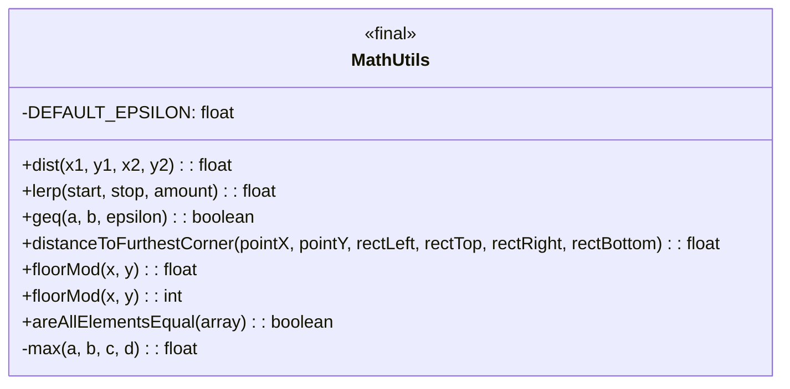
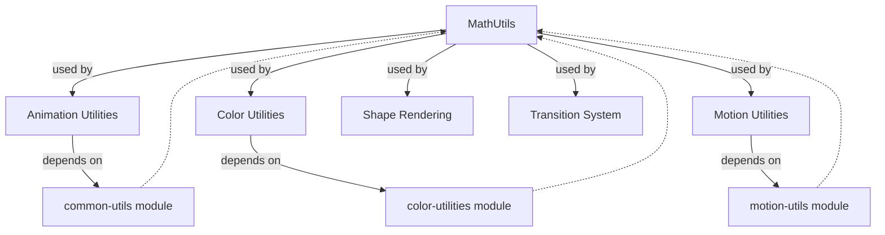
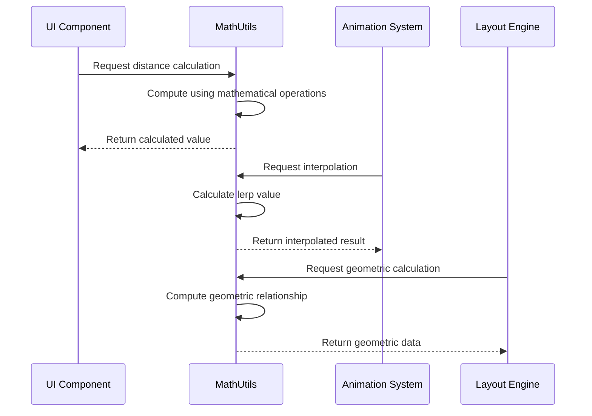

# Mathematical Operations Module

## Introduction

The Mathematical Operations module provides essential mathematical utility functions for the Material Design Components library. This module serves as a foundational component that supplies mathematical operations commonly needed in UI calculations, animations, and geometric computations throughout the Material Design system.

## Overview

The module is built around the `MathUtils` class, which offers a collection of static mathematical utility methods. These methods handle common mathematical operations such as distance calculations, linear interpolation, fuzzy comparisons, and geometric computations that are frequently required in UI development, particularly for animations, layout calculations, and touch interactions.

## Architecture

### Core Component Structure



### Module Dependencies



## Core Components

### MathUtils Class

The `MathUtils` class is a final utility class that provides static mathematical operations. It cannot be instantiated and serves as a collection of mathematical helper methods.

#### Key Features:
- **Distance Calculations**: Compute distances between points and to rectangle corners
- **Linear Interpolation**: Smooth transitions between values
- **Fuzzy Comparisons**: Handle floating-point precision issues
- **Modulo Operations**: Floor division operations for both float and integer types
- **Array Analysis**: Check for element equality in arrays

#### Constants:
- `DEFAULT_EPSILON` (0.0001f): Default tolerance value for fuzzy float comparisons

## Component Details

### Distance and Geometry Operations

#### Distance Between Points
```java
public static float dist(float x1, float y1, float x2, float y2)
```
Calculates the Euclidean distance between two points using the Pythagorean theorem.

#### Distance to Furthest Corner
```java
public static float distanceToFurthestCorner(float pointX, float pointY, 
                                           float rectLeft, float rectTop, 
                                           float rectRight, float rectBottom)
```
Computes the maximum distance from a point to any corner of a rectangle, useful for animation bounds and collision detection.

### Interpolation and Animation Support

#### Linear Interpolation
```java
public static float lerp(float start, float stop, float amount)
```
Performs linear interpolation between two values, essential for smooth animations and transitions. The `amount` parameter (0.0 to 1.0) controls the interpolation position.

### Precision Handling

#### Fuzzy Greater Than or Equal
```java
public static boolean geq(float a, float b, float epsilon)
```
Provides fuzzy comparison for floating-point numbers, accounting for precision limitations. This is crucial for reliable floating-point comparisons in UI calculations.

### Modulo Operations

#### Floor Modulo (Float and Integer)
```java
public static float floorMod(float x, int y)
public static int floorMod(int x, int y)
```
Implements floor modulo operations that are backward-compatible with API levels below 24, ensuring consistent behavior across Android versions.

### Array Operations

#### Element Equality Check
```java
public static boolean areAllElementsEqual(@NonNull float[] array)
```
Efficiently checks if all elements in a float array are equal, useful for validation and optimization scenarios.

## Data Flow



## Usage Patterns

### Animation Calculations
The module is extensively used for calculating smooth transitions, determining animation progress, and computing intermediate values during property animations.

### Layout Computations
Geometric calculations for positioning elements, determining touch targets, and calculating distances for responsive layouts.

### Color Interpolation
Supporting color transitions and blending operations by providing the mathematical foundation for color space calculations.

### Touch and Gesture Handling
Calculating distances, determining swipe directions, and handling precision issues in gesture recognition.

## Integration with Other Modules

### Common Utilities Module
The mathematical-operations module is part of the broader `common-utils` module ecosystem, providing foundational mathematical capabilities to other utility components.

### Color System Integration
Works closely with the [color-utilities](color-utilities.md) module to support color space transformations, contrast calculations, and color harmonization algorithms.

### Animation System Support
Integrates with animation utilities to provide smooth interpolation, timing calculations, and motion curve computations.

### Shape and Geometry
Supports the [shape-definition-and-modeling](shape-definition-and-modeling.md) module with geometric calculations for custom shapes and path operations.

## Performance Considerations

### Optimization Strategies
- All methods are static to avoid object instantiation overhead
- Mathematical operations are optimized for common UI use cases
- Fuzzy comparisons prevent unnecessary recalculations due to floating-point precision issues

### Memory Efficiency
- No object creation in mathematical operations
- Primitive type usage to minimize memory allocation
- Array operations designed for minimal memory footprint

## Error Handling

### Precision Management
- Uses epsilon-based comparisons to handle floating-point precision limitations
- Provides default epsilon value for consistent behavior across the system
- Handles edge cases in geometric calculations

### Input Validation
- Null checking for array parameters
- Coordinate space validation for geometric operations
- Range checking for interpolation parameters

## Best Practices

### When to Use Mathematical Operations
- Distance calculations for touch handling and animations
- Interpolation for smooth transitions and progress indicators
- Geometric calculations for custom layouts and positioning
- Precision-sensitive floating-point comparisons

### Integration Guidelines
- Use the provided epsilon constant for consistent fuzzy comparisons
- Leverage built-in distance functions for geometric calculations
- Utilize interpolation methods for smooth value transitions
- Apply floor modulo operations for cyclic calculations

## Future Considerations

### Potential Enhancements
- Additional geometric utility functions (circle intersections, polygon calculations)
- Advanced interpolation methods (cubic, bezier curves)
- Vector mathematics support for 2D/3D operations
- Statistical utility functions for data analysis

### Compatibility Considerations
- Maintains backward compatibility with older Android API levels
- Consistent behavior across different device architectures
- Platform-specific optimizations while maintaining API consistency

## Conclusion

The Mathematical Operations module serves as a critical foundation for the Material Design Components library, providing essential mathematical utilities that enable sophisticated UI calculations, smooth animations, and precise geometric operations. Its well-designed API and comprehensive functionality make it an indispensable tool for developers working with Material Design components, ensuring consistent and reliable mathematical operations throughout the system.