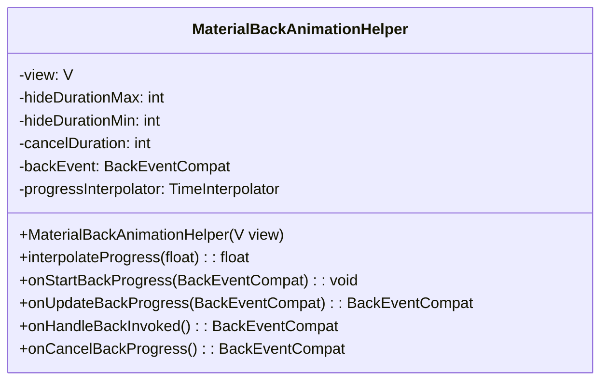
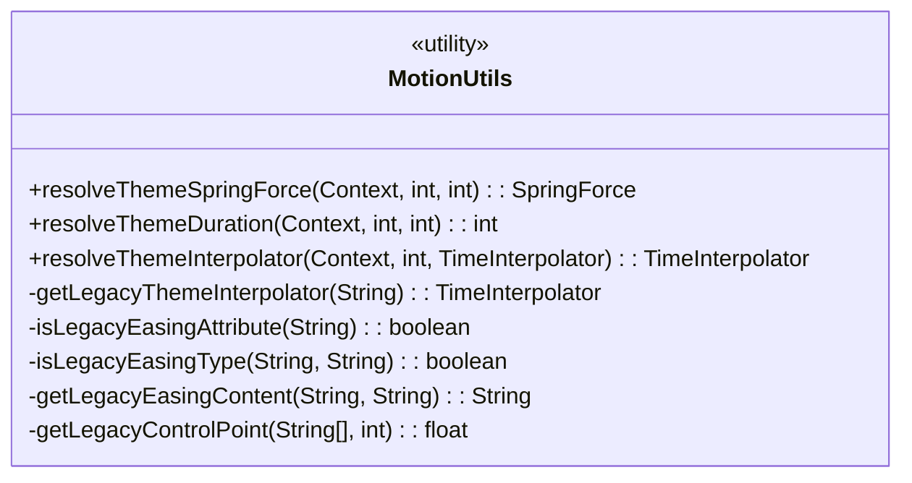
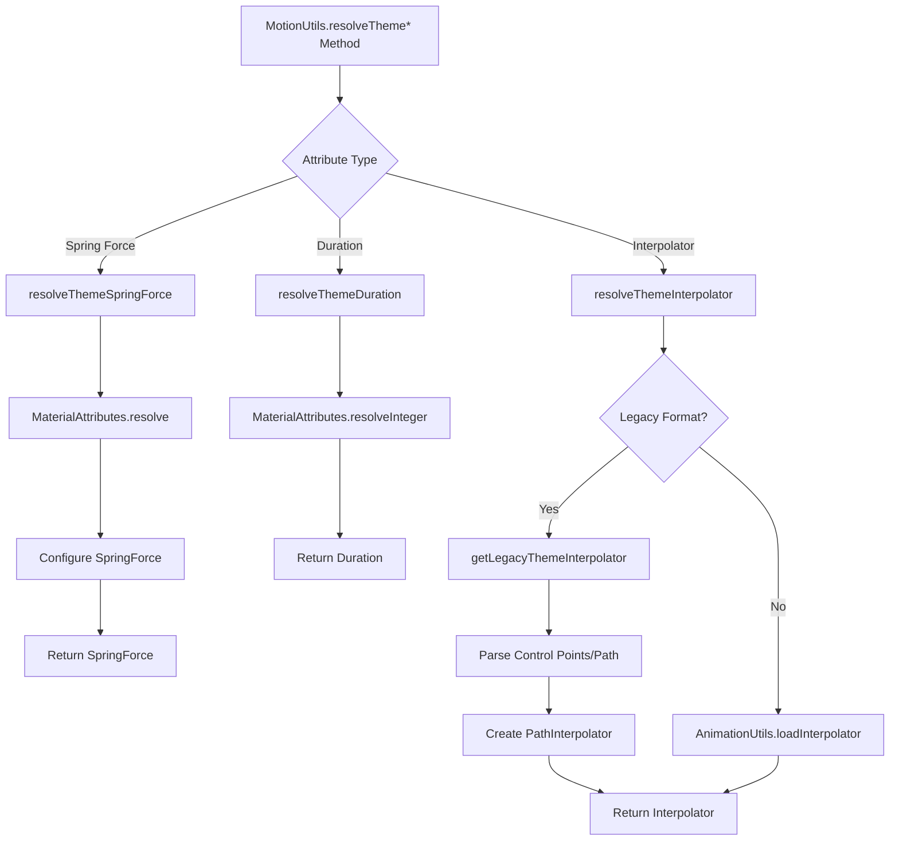
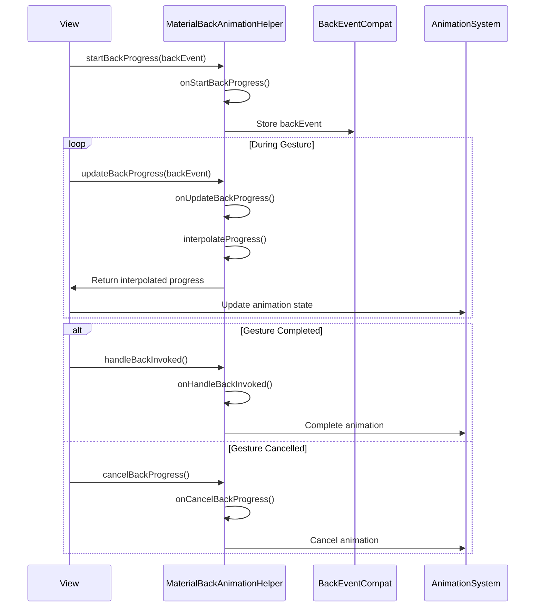
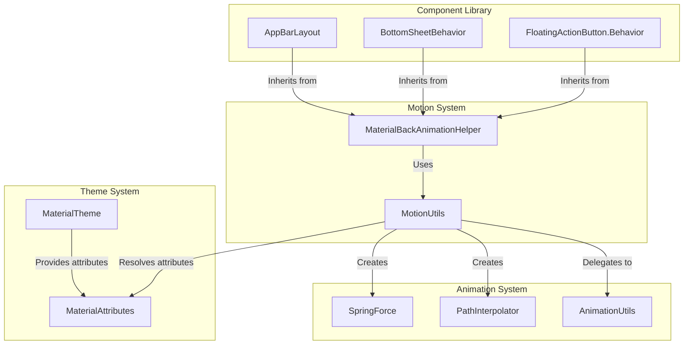
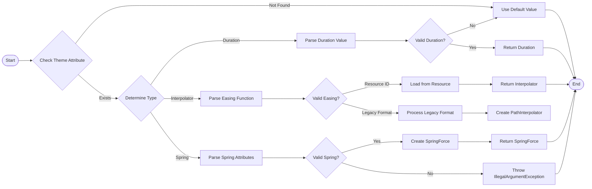
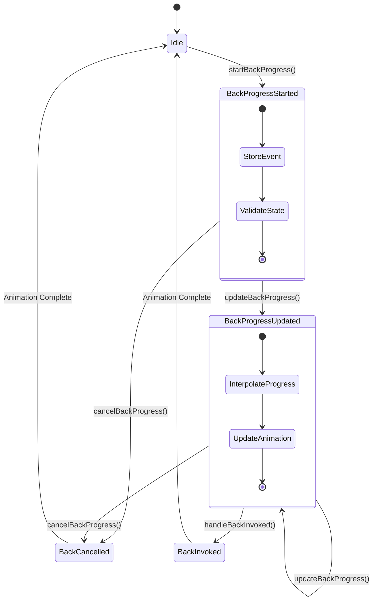

# Motion System Module Documentation

## Introduction

The Motion System module is a core component of the Material Design Components library that provides essential utilities and helpers for implementing Material Design motion patterns. This module serves as the foundation for creating smooth, consistent animations and transitions across Android applications, ensuring they adhere to Material Design motion guidelines.

The module specializes in two primary areas: back gesture animation support and motion utility functions. It provides a standardized approach to handling predictive back gestures introduced in Android 13+ and offers comprehensive utilities for resolving motion attributes from Material Design themes.

## Architecture Overview

The motion system module is architected around two core components that work together to provide comprehensive motion support:

### Core Components

1. **MaterialBackAnimationHelper** - A base helper class for views that support back handling
2. **MotionUtils** - A utility class for motion system functions including theme attribute resolution

### Module Structure

```
motion-system/
├── MaterialBackAnimationHelper - Back gesture animation support
└── MotionUtils - Motion utility functions and theme resolution
```

## Component Architecture

### MaterialBackAnimationHelper Architecture

The MaterialBackAnimationHelper serves as an abstract base class that provides common functionality for views that need to handle back gestures with animations. It manages the animation lifecycle and provides standardized duration values based on Material Design motion specifications.



### MotionUtils Architecture

MotionUtils provides static utility methods for resolving motion-related attributes from Material Design themes, including spring forces, durations, and interpolators.



## Data Flow and Dependencies

### Theme Attribute Resolution Flow



### Back Gesture Animation Flow



## Component Interactions

### Integration with Material Design System

The motion system module integrates with several other Material Design components:



## Process Flows

### Motion Attribute Resolution Process



### Back Gesture Handling Process



## Key Features and Capabilities

### MaterialBackAnimationHelper Features

1. **Progress Interpolation**: Provides smooth progress interpolation using Material Design easing curves
2. **Duration Management**: Automatically resolves appropriate animation durations from theme attributes
3. **Back Event Handling**: Manages the complete lifecycle of back gesture events
4. **State Validation**: Ensures proper sequencing of back gesture method calls
5. **Generic View Support**: Works with any View type through generics

### MotionUtils Features

1. **Spring Force Resolution**: Creates SpringForce objects from Material Design theme attributes
2. **Duration Resolution**: Resolves animation durations with fallback values
3. **Interpolator Resolution**: Supports both legacy and modern interpolator formats
4. **Legacy Compatibility**: Maintains backward compatibility with older theme formats
5. **Validation**: Comprehensive validation of resolved values

## Usage Patterns

### Implementing Back Gesture Support

```java
public class CustomView extends View {
    private final MaterialBackAnimationHelper<CustomView> backHelper;
    
    public CustomView(Context context) {
        super(context);
        backHelper = new MaterialBackAnimationHelper<>(this);
    }
    
    public void startBackProgress(BackEventCompat event) {
        backHelper.onStartBackProgress(event);
        // Custom animation setup
    }
    
    public void updateBackProgress(BackEventCompat event) {
        BackEventCompat previousEvent = backHelper.onUpdateBackProgress(event);
        float progress = backHelper.interpolateProgress(event.getProgress());
        // Update animation based on progress
    }
}
```

### Resolving Motion Attributes

```java
// Resolve spring force from theme
SpringForce springForce = MotionUtils.resolveThemeSpringForce(
    context, 
    R.attr.motionSpringMedium, 
    R.style.MaterialSpring_Medium
);

// Resolve duration from theme
int duration = MotionUtils.resolveThemeDuration(
    context,
    R.attr.motionDurationMedium2,
    300 // default duration
);

// Resolve interpolator from theme
TimeInterpolator interpolator = MotionUtils.resolveThemeInterpolator(
    context,
    R.attr.motionEasingStandardInterpolator,
    new AccelerateDecelerateInterpolator() // default
);
```

## Integration with Other Modules

The motion system module serves as a foundational component that other Material Design modules depend on for consistent motion behavior:

- **[AppBarLayout](appbar.md)**: Uses MaterialBackAnimationHelper for back gesture handling in collapsing toolbars
- **[BottomSheetBehavior](bottom-sheet.md)**: Leverages motion utilities for animation configuration
- **[FloatingActionButton](fab.md)**: Utilizes motion helpers for transformation animations
- **[Transition System](transition.md)**: Builds upon motion utilities for complex transition animations

## Best Practices

1. **Theme Consistency**: Always use theme attributes for motion values to ensure consistency across the application
2. **Error Handling**: Handle potential IllegalArgumentException when resolving motion attributes
3. **State Management**: Ensure proper sequencing of back gesture method calls
4. **Performance**: Reuse resolved motion values when possible to avoid repeated theme lookups
5. **Testing**: Test motion behavior with different theme configurations and system settings

## Future Considerations

The motion system module is designed to evolve with Material Design specifications and Android platform capabilities. Future enhancements may include:

- Additional animation helpers for new gesture types
- Enhanced spring physics configurations
- Support for new interpolator types
- Integration with emerging animation APIs
- Performance optimizations for complex motion scenarios