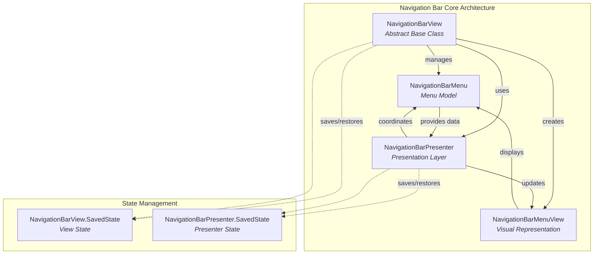
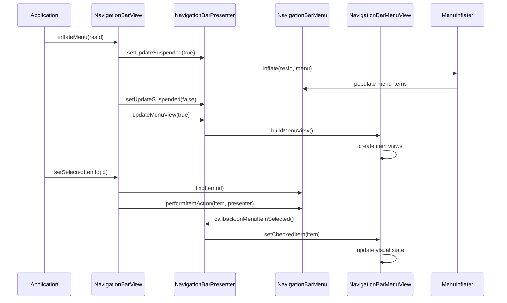
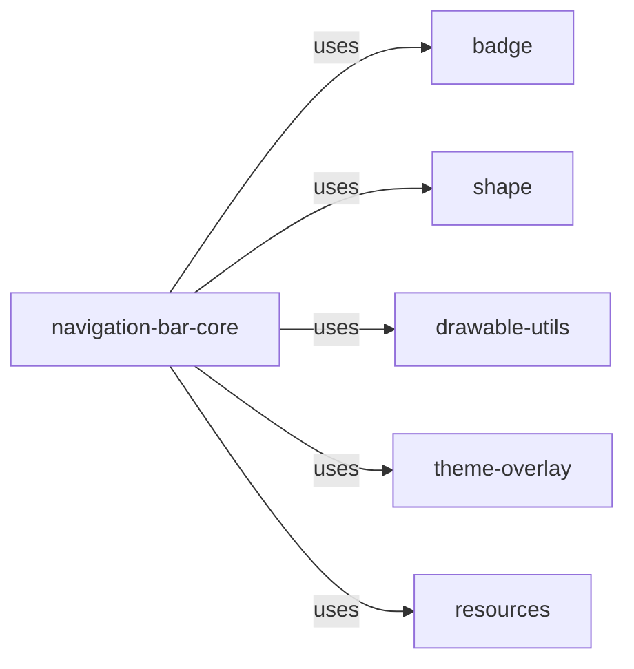
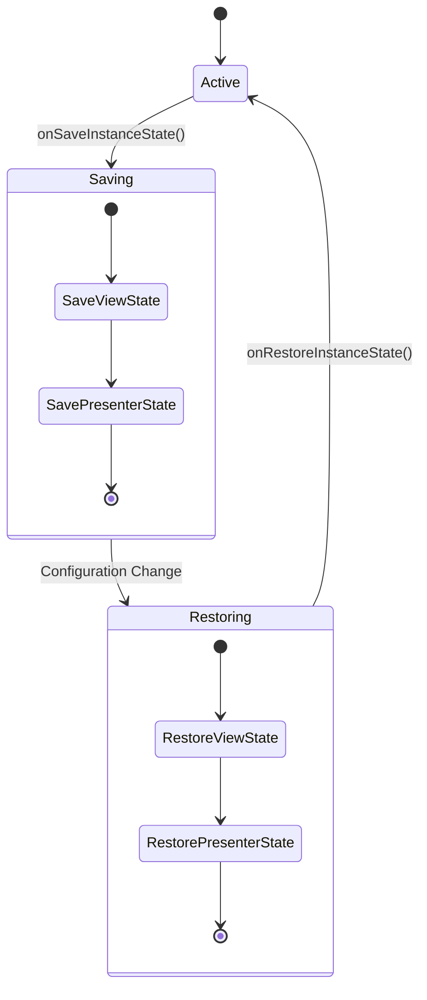
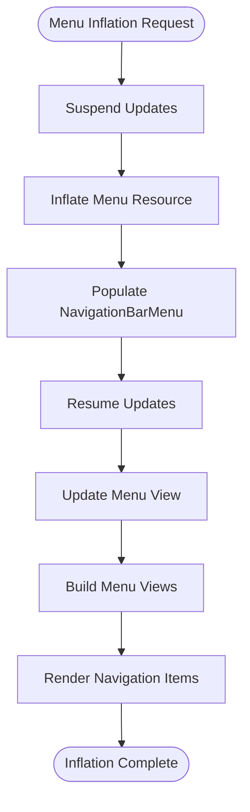
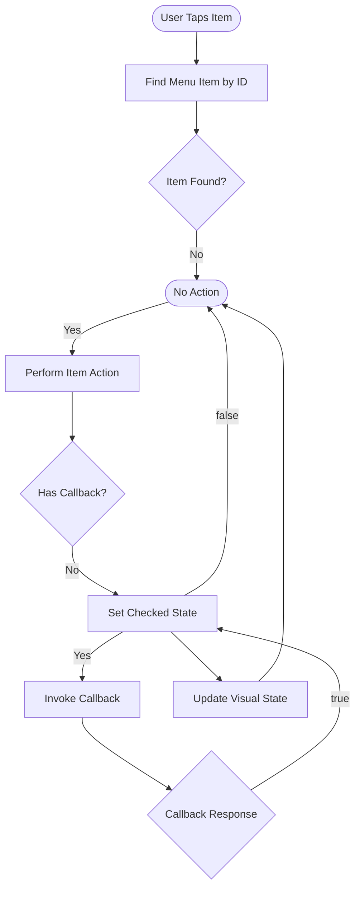

# Navigation Bar Core Module

## Overview

The navigation-bar-core module provides the foundational components for implementing Material Design navigation bars in Android applications. This module serves as the abstract base for both Bottom Navigation and Navigation Rail components, offering a unified API for navigation patterns that enable users to explore and switch between top-level views with a single tap.

## Purpose and Core Functionality

The navigation-bar-core module delivers essential functionality for:

- **State Management**: Preserving navigation state across configuration changes and application lifecycle events
- **Menu Integration**: Seamless integration with Android's menu system for dynamic content population
- **Visual Customization**: Comprehensive theming and styling capabilities for navigation items
- **Interaction Handling**: Event-driven architecture for item selection and reselection
- **Badge Support**: Built-in notification badge system for navigation items
- **Accessibility**: Full accessibility support with proper state management

## Architecture

### Core Components

The module is built around two primary components that work in tandem to provide navigation functionality:

#### NavigationBarView
The abstract base class that serves as the foundation for all navigation bar implementations. It provides:
- Menu integration and management
- Item selection and state handling
- Visual customization APIs
- Event listener management
- State persistence through SavedState

#### NavigationBarPresenter
The presentation layer that bridges the menu data model with the visual representation:
- Menu-to-view coordination
- State synchronization
- Badge management integration
- Update suspension for batch operations

### Component Relationships



### Data Flow Architecture



## Key Features

### State Persistence
The module implements comprehensive state management through two SavedState classes:

- **NavigationBarView.SavedState**: Preserves the overall view state including menu presenter states
- **NavigationBarPresenter.SavedState**: Maintains selection state and badge information

### Visual Customization
Extensive customization options include:

- **Label Visibility Modes**: AUTO, SELECTED, LABELED, UNLABELED
- **Icon Gravity**: TOP (vertical) and START (horizontal) configurations
- **Item Gravity**: TOP_CENTER, CENTER, START_CENTER positioning
- **Active Indicators**: Customizable shape, color, size, and padding
- **Theming Support**: Text appearance, colors, ripples, and backgrounds

### Badge System Integration
Seamless integration with the badge module provides:
- Badge creation and management per menu item
- State persistence for badge data
- Visual coordination with navigation items

## Integration with Material Design System

### Dependencies
The navigation-bar-core module integrates with several Material Design components:



### Related Modules
- **[bottomnavigation](bottomnavigation.md)**: Bottom navigation implementation
- **[navigation-view-core](navigation-view-core.md)**: Navigation drawer implementation
- **[badge](badge.md)**: Badge system for notifications

## Usage Patterns

### Basic Implementation
Navigation bar implementations extend NavigationBarView and provide concrete behavior:

```java
public class BottomNavigationView extends NavigationBarView {
    @Override
    protected NavigationBarMenuView createNavigationBarMenuView(Context context) {
        return new BottomNavigationMenuView(context);
    }
    
    @Override
    public int getMaxItemCount() {
        return 5; // Material Design recommends max 5 items
    }
}
```

### State Management
The SavedState pattern ensures consistent state across configuration changes:



## Process Flows

### Menu Inflation Process


### Item Selection Process


## Best Practices

### Performance Considerations
- Use `setUpdateSuspended(true)` during batch operations
- Leverage state restoration for configuration changes
- Implement proper view recycling in custom menu views

### Accessibility
- Ensure proper content descriptions for navigation items
- Maintain focus management during item selection
- Support screen reader navigation patterns

### Theming
- Use Material theme attributes for consistent styling
- Leverage color state lists for dynamic theming
- Consider contrast ratios for accessibility compliance

## API Reference

### Key Classes
- `NavigationBarView`: Abstract base for navigation implementations
- `NavigationBarPresenter`: Presentation layer coordination
- `NavigationBarView.SavedState`: View state management
- `NavigationBarPresenter.SavedState`: Presenter state management

### Important Constants
- `LABEL_VISIBILITY_AUTO`: Automatic label visibility based on item count
- `LABEL_VISIBILITY_SELECTED`: Show labels only for selected items
- `LABEL_VISIBILITY_LABELED`: Always show labels
- `LABEL_VISIBILITY_UNLABELED`: Never show labels
- `ITEM_ICON_GRAVITY_TOP`: Vertical icon placement
- `ITEM_ICON_GRAVITY_START`: Horizontal icon placement

This documentation provides a comprehensive understanding of the navigation-bar-core module's architecture, functionality, and integration patterns within the Material Design system.